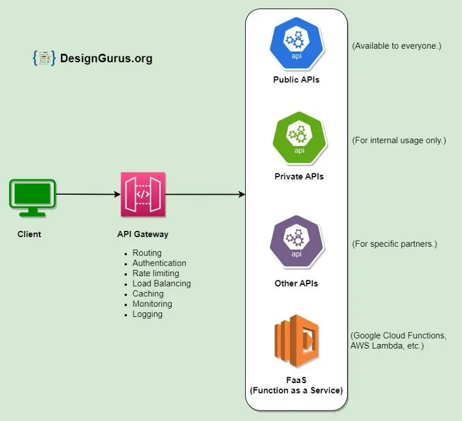
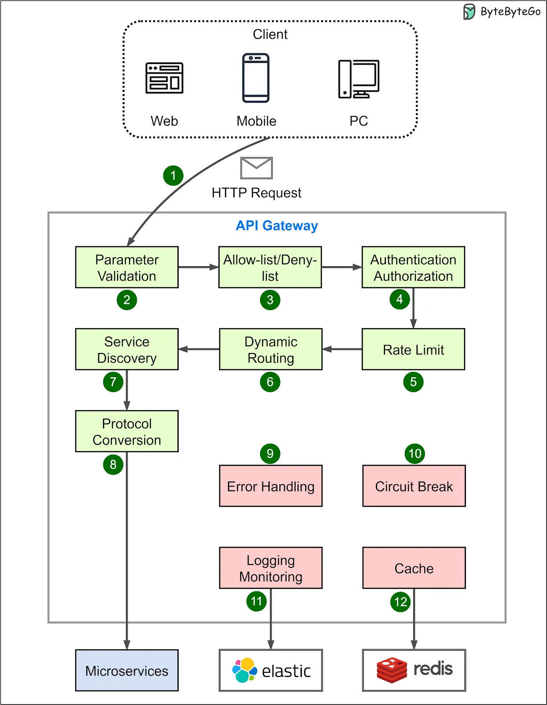
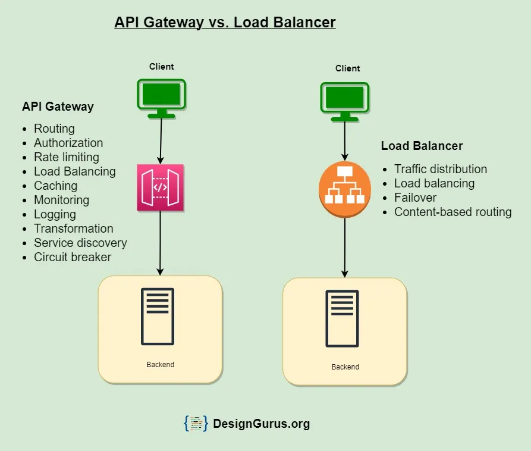
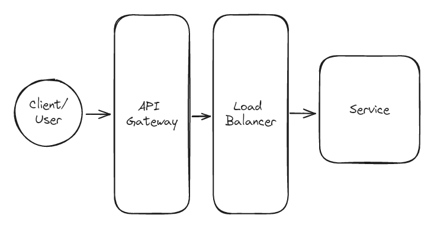

# API Gateway
An API gateway acts as a single entry point for all API requests, regardless of their destination backend services. It sits in front of your microservices, providing a unified facade and centralized control point for managing APIs. Imagine it as a bouncer in a nightclub, checking credentials and directing patrons to the appropriate rooms.

## Key Features of API Gateway
- **Routing**: Directs client requests to the appropriate microservice.
- **Authentication and Authorization**: Authenticates clients and enforces access control policies.
- **Service Discovery**: Discovers available microservices and their locations.
- **Reverse Proxy**
- **Caching**: Caches responses to reduce load and improve performance.
- **Security**: Enhances security through various features.
- **Retry and Circuit Breaking**: Implements circuit breaker patterns to prevent failures.
- **Load Balancing**: Distributes incoming requests among multiple instances.
- **Logging and Tracing**: Collects metrics and data for monitoring.
- **Transformation**: Transforms data formats (e.g., XML to JSON).
- **Rate Limiting and Throttling**: Prevents denial of service attacks and limits client access.
- **Versioning**: Manages multiple API versions.
- **Request and Response Validation**: Validates requests and responses.
- **IP Whitelisting/Blacklisting**: Controls access based on IP addresses.

## Advantages of using API Gateway
- **Improved Performance**: Handles tasks such as routing and load balancing, enabling the system to handle more requests and respond more quickly.
- **Simplified System Design**: Provides a single entry point for clients, simplifying access to various microservices.
- **Enhanced Security**: Enforces authentication and access control policies to prevent unauthorized access.
- **Improved Scalability**: Distributes incoming requests among multiple instances of a microservice.
- **Better Monitoring and Visibility**: Collects metrics and data about requests and responses, providing insights into system performance.

## Disadvantages of using API Gateway
* Possible single point of failure.
* Might impact performance.
* Can become a bottleneck if not scaled properly.
* Configuration can be challenging.

## Examples of API Gateways

1. **Kong**: An open-source API gateway that offers features like load balancing, caching, security, and analytics.
1. **Amazon API Gateway**: A fully managed service provided by AWS that makes it easy for developers to create, publish, maintain, monitor, and secure APIs.
1. **Apigee**: A full lifecycle API management platform by Google Cloud, providing advanced security, traffic management, and analytics.
1. **Nginx**: While primarily a web server, Nginx can also function as an API gateway, offering reverse proxy capabilities, load balancing, and caching.
1. **Microsoft Azure API Management**: A fully managed API gateway provided by Microsoft Azure, supporting hybrid and multi-cloud environments.
1. **Tyk**: An open-source API gateway that provides features such as authentication, rate limiting, and analytics.

## Difference between an API gateway and a load balancer?

1. **Purpose**: API gateway provides a unified API for microservices, while a load balancer distributes traffic evenly across servers.
2. **Functionality**: API gateway handles routing, security, load balancing, and API management; load balancer only handles traffic distribution.
3. **Routing**: API gateway routes requests based on rules; load balancer routes based on algorithms like round-robin or least connections.
4. **Protocol Support**: API gateway supports multiple protocols (HTTP, WebSocket, MQTT); load balancer supports transport layer protocols (TCP, UDP).
5. **Security**: API gateway offers authentication, authorization, and SSL termination; load balancer provides basic security features.
6. **Caching**: API gateway can cache responses; load balancer does not offer caching.
7. **Transformation**: API gateway can transform data formats; load balancer does not.
8. **Service Discovery**: API gateway integrates with service discovery mechanisms; load balancer relies on static configuration.
9. **Granularity**: API gateway controls API endpoints; load balancer controls traffic at the server level.
10. **Scalability**: API gateway handles API requests and microservice scaling; load balancer provides horizontal scaling.

## When to use load balancer
- Multiple instances of the same backend service are running.
- High availability and responsiveness are required.
- Application needs horizontal scaling by adding/removing servers.
- Server failures need to be handled gracefully.

## When to use API Gateway
- Multiple APIs are exposed to the public or external consumers.
- Centralized security and access control for APIs are needed.
- Data transformation or aggregation from various services is required.
- Multiple API versions need to be managed and deprecated.
- Monitoring and analyzing API performance and usage patterns are necessary.

## Can you use both together?
Absolutely! Combining API gateways and load balancers is ideal. The API gateway serves as the front door, managing security, routing, and transformations, while the load balancer distributes traffic across backend servers. This creates a robust and scalable architecture for a seamless user experience.

### Example of Using Both Together

1. **API Gateway**: Handles authentication, authorization, request routing, and API composition.
2. **Load Balancer**: Distributes traffic across multiple instances of backend microservices.
3. **Setup**: Client requests are first processed by the API gateway for security and routing, then forwarded to the load balancer, which distributes the load across backend services.

# References
* Videos
    
    
* https://blog.bytebytego.com/p/6-more-microservices-interview-question
* https://levelup.gitconnected.com/system-design-interview-basics-difference-between-api-gateway-and-load-balancer-60260b568121
* https://www.linkedin.com/pulse/api-gateway-vs-load-balancer-understanding-differences-manas-rath-c3dlc/