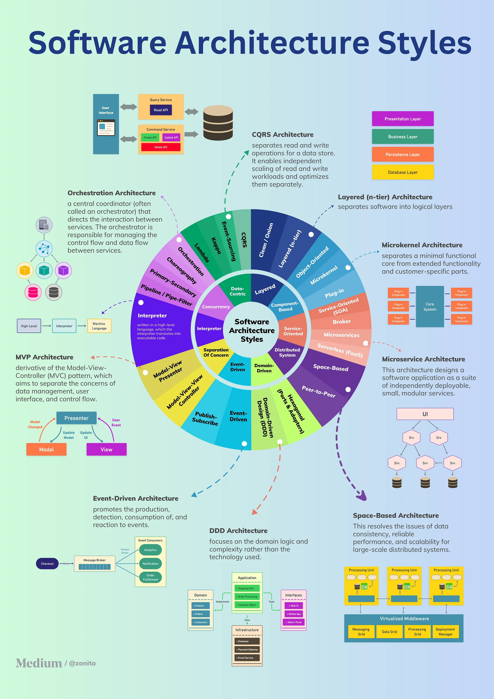

# Architecture Patterns

## Differences Between SOA and Microservices?
# References
* Videos
    
    
* https://blog.bytebytego.com/p/7-microservices-interview-questions
* https://blog.bytebytego.com/p/ep107-top-9-architectural-patterns