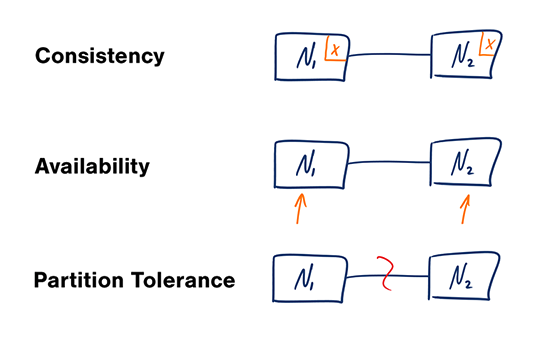
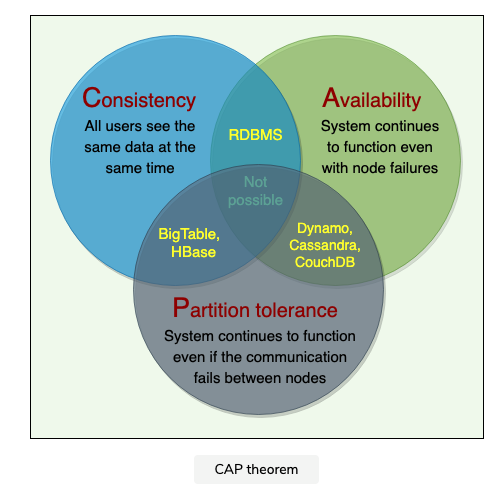
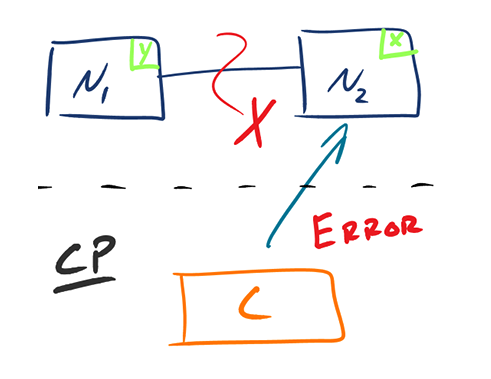
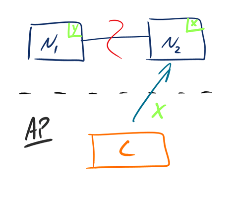

# Table of contents

- [CAP Theorem](#cap-theorem)
  - [CP - Consistency/Partition Tolerance](#cp---consistencypartition-tolerance)
  - [AP - Availability/Partition Tolerance](#ap---availabilitypartition-tolerance)
- [Consistency patterns](#consistency-patterns)
  - [Weak consistency](#weak-consistency)
  - [Eventual consistency](#eventual-consistency)
  - [Strong consistency](#strong-consistency)
- [Availability patterns](#availability-patterns)
- [References](#references)

# CAP Theorem

* [CAP theorem](https://en.wikipedia.org/wiki/CAP_theorem)(also called brewer’s theorem) states that it is impossible for a distributed system to simultaneously 
  provide all three of the following desirable properties:
  * **Consistency (C)**: every read receives the most recent write or an error.
  * **Availability (A)**: A non-failing node will return a reasonable response within a reasonable amount of time (no error or timeout).
  * **Partition tolerance (P)**: A **partition** is a communication break (or a network failure) between any two nodes 
    in the system, i.e., both nodes are up but cannot communicate with each other. A partition-tolerant system 
    continues to operate even if there are partitions in the system. Such a system can sustain any  network failure 
    that does not result in the failure of the entire network. Data is sufficiently replicated across combinations 
    of nodes and networks to keep the system up through intermittent outages.
* According to the CAP theorem, any distributed system needs to pick two out of the three properties.  The three 
  options are **CA, CP, and AP.**
* Networks aren't reliable, so you'll need to support partition tolerance. You'll need to  make a software tradeoff 
  between consistency and availability.
* **In the presence of a network partition, a distributed system must choose either Consistency or Availability.**
* [ACID](https://en.wikipedia.org/wiki/ACID) databases choose consistency over availability.
* [BASE](https://en.wikipedia.org/wiki/Eventual_consistency) systems choose availability over consistency.
  

## CP - Consistency/Partition Tolerance
* Wait for a response from the partitioned node which could result in a timeout error. 
* The system can also choose to return an error, depending on the scenario you desire. 
* CP is a good choice if your business needs require atomic reads and writes.

## AP - Availability/Partition Tolerance
* Responses return the most readily available version of the data available on any node, which might not be the 
latest.   
* Writes might take some time to propagate when the partition is resolved.
* This system state will also accept writes that can be processed later when the partition is resolved.
* AP is a good choice if the business needs to allow for eventual consistency or when the system needs to continue 
  working despite external errors.

  

# Consistency patterns
With multiple copies of the same data, we are faced with options on how to synchronize them so clients have a 
consistent view of the data. Recall the definition of consistency from the CAP theorem -  Every read receives the 
most recent write or an error.
Three types of Consistency:
* Eventual
* Strong
* Weak

## Weak consistency
* After a write, reads may or may not see it. A best effort approach is taken.
* Unlike Eventual and Strict Consistency, which have well-defined rules for updating the data on nodes,  Weak 
  Consistency has no such rules. Different nodes can return different values
* Use Cases:
  * This approach is seen in systems such as memcached. 
  *  VoIP, video chat, and realtime  multiplayer games. For example, if you are on a phone call and lose reception  
     for a  few seconds, when you regain connection you do not hear what was spoken during connection loss.

## Eventual consistency
* After a write, reads will eventually see it (typically within milliseconds). Data is replicated asynchronously.
* Use Cases:
  * DNS and Email. **Eventual consistency works well in highly available systems**.

## Strong consistency
* After a write, reads will see it. Data is replicated synchronously.
* Use Cases:
  * This approach is seen in file systems and RDBMSes. Strong consistency works well in systems that need transactions.

# Availability patterns

# References
* [CAP theorem revisited](https://robertgreiner.com/cap-theorem-revisited/)
* [grokking-the-system-design-interview](https://www.educative.io/courses/grokking-the-system-design-interview/RMkqx1Egxqz)
* [CAP theorem video](https://www.youtube.com/watch?v=k-Yaq8AHlFA)
* https://medium.com/must-know-computer-science/system-design-cap-problem-13997ed7524c
* https://iq.opengenus.org/consistency-patterns-in-system-design/
* https://www.bmc.com/blogs/cap-theorem/