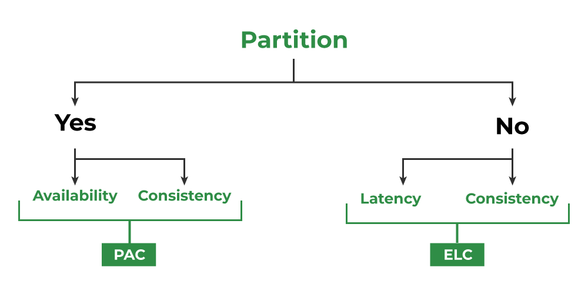

# CAP Theorem

* The [CAP theorem](https://en.wikipedia.org/wiki/CAP_theorem) (also called Brewer’s theorem) states that it is impossible for a distributed system to simultaneously provide all three of the following desirable properties:
  * **Consistency (C)**: Every read receives the most recent write or an error.
  * **Availability (A)**: A non-failing node returns a reasonable response within a reasonable amount of time (no error or timeout).
  * **Partition Tolerance (P)**: A partition is a communication break (or network failure) between any two nodes in the system, i.e., both nodes are up but cannot communicate with each other. A partition-tolerant system continues to operate even if there are partitions in the system. Such a system can sustain any network failure that does not result in the failure of the entire network. Data is sufficiently replicated across combinations of nodes and networks to keep the system up through intermittent outages.
* According to the CAP theorem, any distributed system needs to pick two out of the three properties. The three options are **CA, CP, and AP.**
* Networks aren't reliable, so you'll need to support partition tolerance. You'll need to make a software tradeoff between consistency and availability.
* **In the presence of a network partition, a distributed system must choose either Consistency or Availability.**
* [ACID](https://en.wikipedia.org/wiki/ACID) databases choose consistency over availability.
* [BASE](https://en.wikipedia.org/wiki/Eventual_consistency) systems choose availability over consistency.

  

## CP - Consistency/Partition Tolerance
* Wait for a response from the partitioned node which could result in a timeout error. 
* The system can also choose to return an error, depending on the scenario you desire. 
* CP is a good choice if your business needs require atomic reads and writes.

### Example:
* **Google Bigtable**: Google Bigtable is a distributed storage system that provides strong consistency and partition tolerance. During network partitions, Bigtable may sacrifice availability to ensure that data remains consistent.

## AP - Availability/Partition Tolerance
* Responses return the most readily available version of the data available on any node, which might not be the latest.
* Writes might take some time to propagate when the partition is resolved.
* This system state will also accept writes that can be processed later when the partition is resolved.
* AP is a good choice if the business needs to allow for eventual consistency or when the system needs to continue working despite external errors.

### Example:
* **Amazon DynamoDB**: DynamoDB is designed for high availability and partition tolerance. It provides eventual consistency by default, allowing the system to remain available even during network partitions.

# Consistency patterns
With multiple copies of the same data, we are faced with options on how to synchronize them so clients have a consistent view of the data. Recall the definition of consistency from the CAP theorem - every read receives the most recent write or an error.

Three types of consistency:

* Weak Consistency
* Eventual Consistency
* Strong Consistency

## Weak Consistency

* After a write, reads may or may not see it. A best-effort approach is taken.
* Unlike Eventual and Strong Consistency, which have well-defined rules for updating the data on nodes, Weak Consistency has no such rules. Different nodes can return different values.

### Use Cases:

* This approach is seen in systems such as memcached.
* VoIP, video chat, and real-time multiplayer games. For example, if you are on a phone call and lose reception for a few seconds, when you regain connection you do not hear what was spoken during the connection loss.

## Eventual Consistency

* After a write, reads will eventually see it (typically within milliseconds). Data is replicated asynchronously.

### Use Cases:

* DNS and Email. Eventual consistency works well in highly available systems.

## Strong Consistency

* After a write, reads will see it. Data is replicated synchronously.

### Use Cases:

* This approach is seen in file systems and RDBMSes. Strong consistency works well in systems that need transactions.

# Availability patterns
Availability patterns focus on ensuring that the system remains operational and responsive even in the presence of failures. Some common patterns include:

## Failover
* Switching to a redundant or standby system upon the failure of the primary system.
* Ensures high availability but requires careful setup and monitoring.

## Replication
* Data is copied and maintained across multiple systems or locations.
* Enhances data availability and fault tolerance.

## Load Balancing
* Distributes incoming network traffic across multiple servers to ensure no single server becomes overwhelmed.
* Enhances availability and performance by balancing the load.

## Sharding
* Distributes data across multiple databases to balance the load.
* Enhances performance and availability by dividing data into smaller, more manageable pieces.

## Caching
* Stores frequently accessed data in a fast, in-memory store to reduce latency and load on the primary database.
* Enhances performance and availability by serving data faster.

# PACELC Theorem
* The PACELC theorem is an extension of the CAP theorem. The CAP theorem states that in the case of network partitioning (P) in a distributed system, one has to choose between Availability (A) and Consistency (C).
* PACELC theorem states that in the case of Network Partition ‘P’ a distributed system can have tradeoffs between Availability ‘A’ and Consistency ‘C’ Else ‘E’ if there is no Network Partition then a distributed system can have tradeoffs between Latency ‘L’ and Consistency ‘C’.

* As we can clearly see from the diagram the  ‘Yes ‘ part is the CAP Theorem and the ‘No’ part is the extension to the CAP Theorem which is PACELC Theorem

## Examples

1. **Amazon DynamoDB**:
   * DynamoDB is an example of an AP system during a partition (Availability and Partition Tolerance). When there is no partition, it trades latency for consistency (EL). This means it allows for eventual consistency in normal operations to reduce latency, but it ensures availability during partitions.

2. **Google Spanner**:
   * Google Spanner is an example of a CP system during a partition (Consistency and Partition Tolerance). When there is no partition, it trades latency for consistency (EC). This means it maintains strong consistency even at the cost of higher latency, both during partitions and normal operations.

# References
* Videos
  
  

* [CAP theorem revisited](https://robertgreiner.com/cap-theorem-revisited/)
* [grokking-the-system-design-interview](https://www.educative.io/courses/grokking-the-system-design-interview/RMkqx1Egxqz)
* https://medium.com/must-know-computer-science/system-design-cap-problem-13997ed7524c
* https://iq.opengenus.org/consistency-patterns-in-system-design/
* https://www.bmc.com/blogs/cap-theorem/
* https://www.geeksforgeeks.org/pacelc-theorem/
* https://github.com/karanpratapsingh/system-design/blob/main/README.md#pacelc-theorem