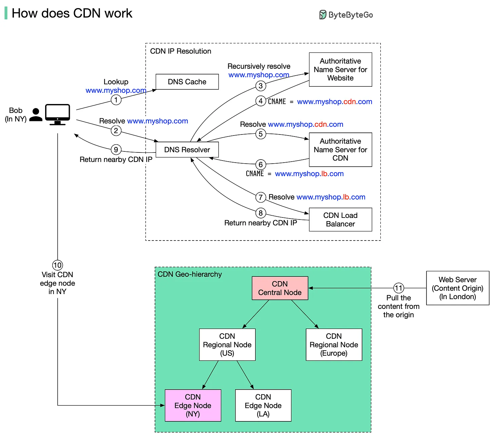
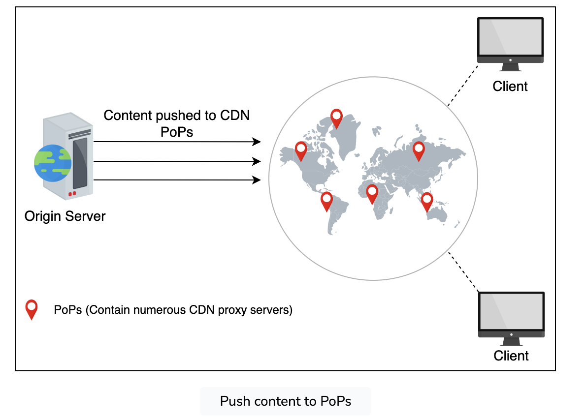
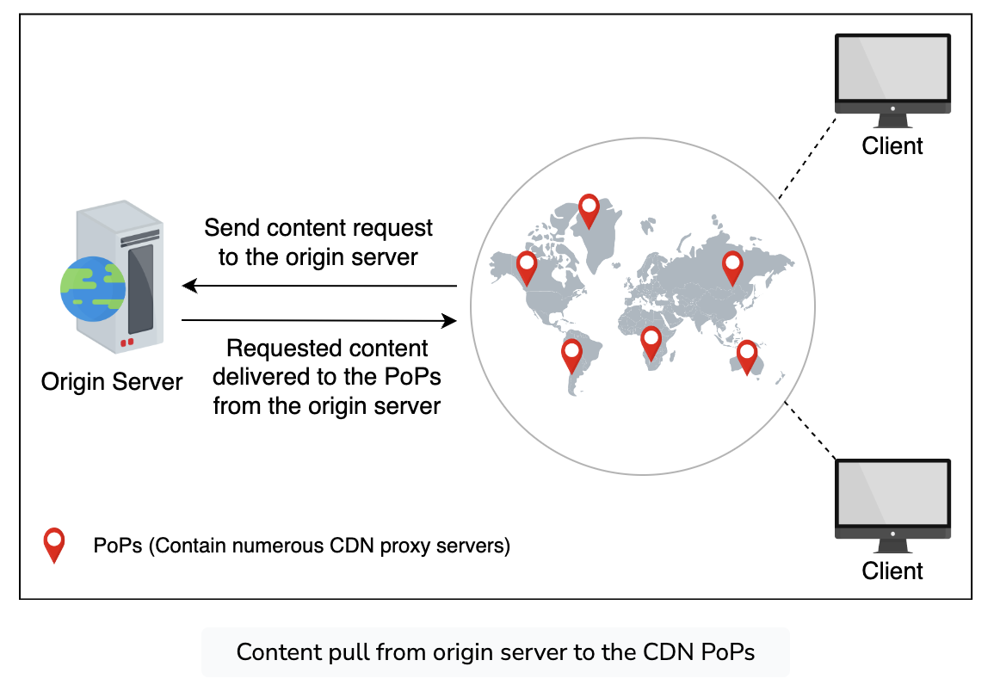

# Content Delivery Network (CDN)
A content delivery network (CDN) refers to geographically distributed servers (also called edge servers) that provide fast delivery of static and dynamic content
## Benefits of CDN?
CDNs play a crucial role in enhancing the performance, reliability, and security of modern web applications. By serving content from geographically distributed edge servers, CDNs can provide users with a fast and seamless experience while reducing load on origin servers and protecting against security threats. Here are the top benefits of using CDNs:

* **Reduced Latency**: By serving content from geographically distributed edge servers, CDNs reduce the time it takes for content to travel from the server to the user, resulting in faster page load times and improved user experience.
* **Improved Performance**: CDNs can offload static content delivery from the origin server, freeing up resources for dynamic content generation and reducing server load. This can lead to improved overall performance for web applications.
* **Enhanced Reliability and Availability**: With multiple edge servers in different locations, CDNs can provide built-in redundancy and fault tolerance. If one server becomes unavailable, requests can be automatically rerouted to another server, ensuring continuous content delivery.
* **Scalability**: CDNs can handle sudden traffic spikes and large volumes of concurrent requests, making it easier to scale web applications to handle growing traffic demands.
* **Security**: Many CDNs offer additional security features, such as DDoS protection, Web Application Firewalls (WAF), and SSL/TLS termination at the edge, helping to safeguard web applications from various security threats.

## How does a CDN work?
Suppose Bob who lives in New York wants to visit an eCommerce website that is deployed in London. If the request goes to servers located in London, the response will be quite slow. So we deploy CDN servers close to where Bob lives, and the content will be loaded from the nearby CDN server. 
The diagram below illustrates the process: 

1. Bob types in www.myshop.com in the browser. The browser looks up the domain name in the local DNS cache.
2. If the domain name does not exist in the local DNS cache, the browser goes to the DNS resolver to resolve the name. The DNS resolver usually sits in the Internet Service Provider (ISP).
3. The DNS resolver recursively resolves the domain name. Finally, it asks the authoritative name server to resolve the domain name.
4. If we don’t use CDN, the authoritative name server returns the IP address for www.myshop.com. But with CDN, the authoritative name server has an alias pointing to www.myshop.cdn.com (the domain name of the CDN server).
5. The DNS resolver asks the authoritative name server to resolve www.myshop.cdn.com.
6. The authoritative name server returns the domain name for the load balancer of CDN www.myshop.lb.com.
7. The DNS resolver asks the CDN load balancer to resolve www.myshop.lb.com. The load balancer chooses an optimal CDN edge server based on the user’s IP address, user’s ISP, the content requested, and the server load.
8. The CDN load balancer returns the CDN edge server’s IP address for www.myshop.lb.com.
9. The DNS resolver returns the IP address to the browser.
10. The browser visits the CDN edge server to load the content. There are two types of contents cached on the CDN servers: static contents and dynamic contents. The former contains static pages, pictures, and videos; the latter one includes results of edge computing.
11. If the edge CDN server cache doesn't contain the content, it goes upward to the regional CDN server. If the content is still not found, it will go upward to the central CDN server, or even go to the origin - the London web server. This is called the CDN distribution network, where the servers are deployed geographically.

## CDN Architecture
### Points of Presence (PoPs) and Edge Servers
* **Points of Presence (PoPs)**: Physical locations containing a group of edge servers within the CDN’s distributed network. PoPs are strategically situated across various geographical regions to minimize the latency experienced by users when requesting content. Each PoP typically consists of multiple edge servers to provide redundancy, fault tolerance, and load balancing.
* **Edge Servers**: Servers within a PoP that store cached content and serve it to users. When a user makes a request for content, the request is directed to the nearest edge server, which either serves the content from its cache or fetches it from the origin server and then caches it for future requests. By serving content from the geographically nearest server, CDNs can significantly reduce latency and improve the overall user experience.
### CDN Routing and Request Handling
CDN routing is the process of directing user requests to the most suitable edge server. Routing decisions are typically based on factors such as network latency, server load, and the user’s geographical location. Various techniques can be employed to determine the optimal edge server for handling a request, including:

* **Anycast Routing**: Multiple edge servers share a single IP address. When a user sends a request to that IP address, the network’s routing system directs the request to the nearest edge server based on network latency or the number of hops. This approach helps ensure that requests are automatically routed to the most appropriate server.
* **DNS-based Routing**: When a user requests content, the CDN’s DNS server responds with the IP address of the most suitable edge server. This approach can take into account factors such as geographical proximity and server load to select the best edge server for handling the request.
* **GeoIP-based Routing**: The user’s geographical location is determined based on their IP address. The request is then directed to the nearest edge server in terms of geographical distance, which often corresponds to lower network latency.

### Caching Mechanisms
Caching is a crucial component of CDN architecture. Edge servers cache content to reduce latency and offload traffic from the origin server. Various caching mechanisms can be employed to determine what content is stored, when it is updated, and when it should be removed from the cache. Some common caching mechanisms include:

* **Time-to-Live (TTL)**: TTL is a value set by the origin server that determines how long a piece of content should be stored in the cache before it is considered stale and needs to be fetched again from the origin server.
* **Cache Invalidation**: Cache invalidation is the process of removing content from the cache before its TTL expires. This is typically done when content is updated or deleted on the origin server and needs to be reflected immediately in the CDN.
* **Cache Control Headers**: Cache control headers are used by the origin server to provide instructions to the CDN regarding caching behavior. These headers can dictate the cacheability of content, its TTL, and other caching-related settings.

### Content caching strategies in CDN
#### Push CDN
* **Push Model**: Content gets sent automatically to the CDN proxy servers from the origin server. The content delivery to the CDN proxy servers is the content provider’s responsibility.
* **Use Case**: Suitable for static content delivery, where the origin server decides which content to deliver to users using the CDN. The content is pushed to proxy servers in various locations according to the content’s popularity.

#### Pull CDN
* **Pull Model**: A CDN pulls the unavailable data from origin servers when requested by a user. The proxy servers keep the files for a specified amount of time and then remove them from the cache if they’re no longer requested to balance capacity and cost.
* **Use Case**: More suited for serving dynamic content, where the CDN itself is responsible for pulling the requested content from the origin server and serving it to the users.

### Dynamic content caching optimization
Since dynamic content often changes, it’s a good idea to cache it optimally. This section deals with the optimization of frequently changing content.

Certain dynamic content creation requires the execution of scripts that can be executed at proxy servers instead of running on the origin server. Dynamic data can be generated using various parameters, which can be beneficial if executed at the proxy servers. For example, we can generate dynamic content based on user location, time of day at a location, third-party APIs specific to a location (for instance, weather API), and so on. So, it’s optimal to run the scripts at proxy servers instead of the origin servers.

To reduce the communication between the origin server and proxy servers and storage requirements at proxy servers, it’s useful to employ compression techniques as well. For example, Cloudflare uses Railgun to compress dynamic content.

Another popular approach for dynamic data compression is Edge Side Includes (ESI) markup language. Usually, a small portion of the web pages changes in a certain time. It means fetching a full web page on each small change contains a lot of redundant data. To resolve this performance penalty, ESI specifies where content was changed so that the rest of the web page content can be cached. It assembles dynamic content at the CDN edge server or client browser. ESI isn’t standardized yet by the World Wide Web Consortium (W3C), but many CDN providers use it.

Note: Dynamic Adaptive Streaming over HTTP (DASH) uses a manifest file with URIs of the video with different resolutions so that the client can fetch whatever is appropriate as per prevailing network and end node conditions. Netflix uses a proprietary DASH version with a Byte-range in the URL for further content request and delivery optimization.

#### CDN Network Topologies
CDN network topologies describe the structure and organization of the CDN’s distributed network. Different topologies can be employed to optimize content delivery based on factors such as performance, reliability, and cost. Some common CDN network topologies include:

* **Flat Topology**: In a flat topology, all edge servers in the CDN are directly connected to the origin server. This approach can be effective for smaller CDNs, but may not scale well as the network grows.
* **Hierarchical Topology**: In a hierarchical topology, edge servers are organized into multiple tiers, with each tier being responsible for serving content to the tier below it. This approach can improve scalability by distributing the load among multiple levels of servers and reducing the number of direct connections to the origin server.
* **Mesh Topology**: In a mesh topology, edge servers are interconnected, allowing them to share content and load with each other. This approach can enhance the redundancy and fault tolerance of the CDN, as well as improve content delivery performance by reducing the need to fetch content from the origin server.
* **Hybrid Topology**: A hybrid topology combines elements from various topologies to create an optimized CDN architecture tailored to specific needs. For example, a CDN could use a hierarchical structure for serving static content while employing a mesh topology for dynamic content delivery.

## Examples of CDNs
1. **Akamai**:
   * One of the largest and most established CDNs, known for its extensive global network and high reliability.
   * Used by major companies like Adobe, Microsoft, and IBM.
2. **Cloudflare**:
   * Provides CDN services along with security features like DDoS protection and Web Application Firewall (WAF).
   * Popular among small to medium-sized businesses for its easy integration and robust performance.
3. **Amazon CloudFront**:
   * Integrated with Amazon Web Services (AWS), offering seamless integration with other AWS services.
   * Used by companies like Slack, Spotify, and PBS.
4. **Google Cloud CDN**:
   * Part of Google Cloud Platform (GCP), providing low-latency content delivery and integration with other Google Cloud services.
   * Used by companies like The New York Times and King (makers of Candy Crush).
5. **Fastly**:
   * Known for its real-time content delivery and edge cloud platform, which allows for fast and secure content delivery.
   * Used by companies like GitHub, Reddit, and Spotify.
## References
* Videos
  
  
* https://github.com/karanpratapsingh/system-design/blob/main/README.md#content-delivery-network-cdn
* https://blog.bytebytego.com/p/how-does-cdn-work
* https://www.educative.io/courses/grokking-modern-system-design-interview-for-engineers-managers/system-design-the-content-delivery-network-cdn
* https://www.designgurus.io/blog/content-delivery-network-cdn-system-design-basics?gad_source=1&gclid=CjwKCAjwmYCzBhA6EiwAxFwfgD0tLsnXE8wMSRhm58hOodfgIyqFk97CE5hAH1tLjrEm0sjwKQn6VBoClYQQAvD_BwE