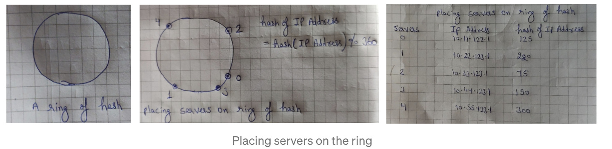
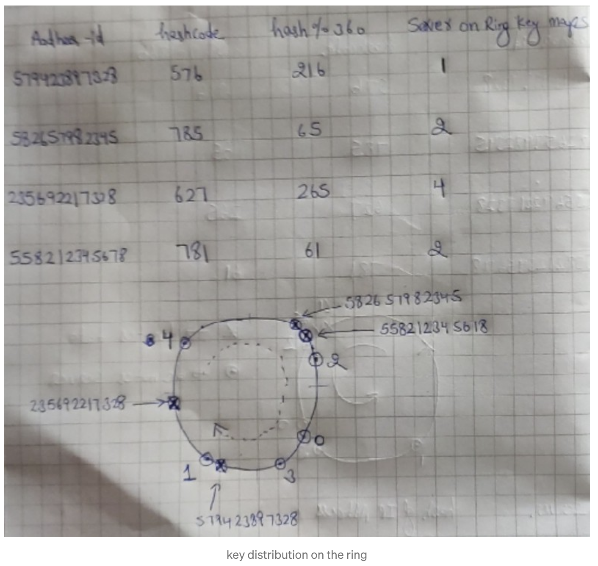
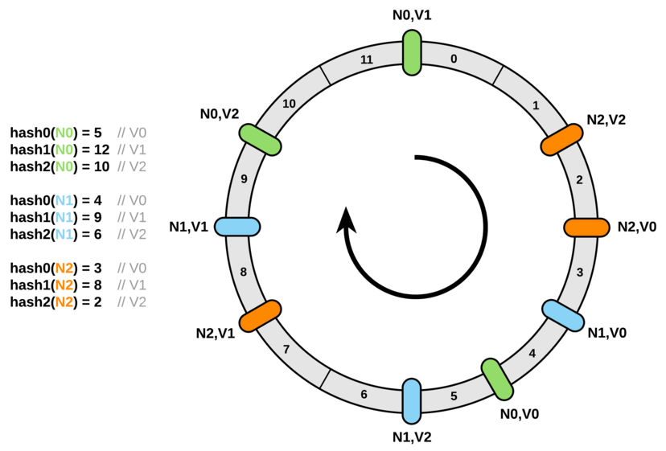

# Simple Hashing in Distributed Systems
Hashing is a technique to map data of arbitrary size to fixed-size values using a hash function. A common approach in distributed systems is to use `key % n` (where `n` is the number of servers) to determine which server should store the data.


## Challenges
- **Rehashing Problem**: Adding or removing servers from the cluster requires rehashing a massive amount of data, which can be resource-intensive and time-consuming.
- **Hotspots**: Non-uniformly distributed data can lead to some servers becoming hotspots, causing load imbalance.

# Consistent Hashing
* Consistent Hashing is a distributed hashing scheme that operates independently of the number of servers or objects in a distributed hash table by assigning them a position on an abstract circle, or hash ring. This allows servers and objects to scale without affecting the overall system.
* It maps data to physical nodes and ensures that only a small set of keys move when servers are 
  added or removed.


## Configuration to Map Data to a Node
* **Placement of servers on the ring**: Servers are placed in a circle (or in-ring of hash). Hash of servers is calculated
  (in this example)  on their IP addresses and according to their hash value(which is between 0–360) are placed on the ring.


* **Placement of data on the ring**: Hash of data is calculated on it’s key (Aadhar-id) and they are also placed on 
  this ring(Hash lies between 0–360)


* **Determining the placement of data on Servers**: To map we travel in a **clockwise** direction on the ring from the 
  point key is located till the point we find a server. This is the server where this key belongs

* When the hash table is resized (a server is added or deleted), only ``k/n`` keys need to be remapped (``k`` is the 
  total number of keys, and ``n`` is the total number of servers).

## Potential Issues
- **Adding or Removing Tokens**: Adding or removing nodes will result in recomputing the tokens, causing significant administrative overhead for a large cluster.
- **Hotspots**: Relatively large ranges assigned to each node can cause hotspots if data is not evenly distributed.
- **Node Rebuilding**: In the case of a node rebuild, only a few nodes can participate in bootstrapping the replacement, leading to service disruption.
- **Heterogeneous Clusters**: Since each node is assigned a single token, all nodes are expected to hold the same amount of data. Subdividing ranges to handle nodes of varying sizes is difficult and error-prone.


## Virtual Nodes(VNodes)
To efficiently handle adding or removing nodes from a cluster, Consistent hashing makes use of virtual nodes.

### Advantages of VNodes
* As VNodes help spread the load more evenly across the physical nodes on the cluster by dividing the hash ranges 
  into  smaller subranges, this speeds up the rebalancing process after adding or removing nodes.
* VNodes make it easier to maintain a cluster containing heterogeneous machines. This means, with Vnodes,  we can 
  assign a high number of sub-ranges to a powerful server and a lower number of sub-ranges to a less powerful server.
* In contrast to one big range, since Vnodes  help assign smaller ranges to each physical node, this decreases the 
  probability of hotspots.
## Implementation
Below java code uniformly distributes data on the ring:
```
import java.util.Collection;  
import java.util.SortedMap;  
import java.util.TreeMap;  
 
public class ConsistentHash<T> {  
 
 private final HashFunction hashFunction;  
 private final int numberOfReplicas;  
 private final SortedMap<Integer, T> circle = new TreeMap<Integer, T>();  
 
 public ConsistentHash(HashFunction hashFunction, int numberOfReplicas,  
     Collection<T> nodes) {  
   this.hashFunction = hashFunction;  
   this.numberOfReplicas = numberOfReplicas;  
 
   for (T node : nodes) {  
     add(node);  
   }  
 }  
 
 public void add(T node) {  
   for (int i = 0; i <numberOfReplicas; i++) {  
     circle.put(hashFunction.hash(node.toString() + i), node);  
   }  
 }  
 
 public void remove(T node) {  
   for (int i = 0; i <numberOfReplicas; i++) {  
     circle.remove(hashFunction.hash(node.toString() + i));  
   }  
 }  
 
 public T get(Object key) {  
   if (circle.isEmpty()) {  
     return null;  
   }  
   int hash = hashFunction.hash(key);  
   if (!circle.containsKey(hash)) {  
     SortedMap<Integer, T> tailMap = circle.tailMap(hash);  
     hash = tailMap.isEmpty() ? circle.firstKey() : tailMap.firstKey();  
   }  
   return circle.get(hash);  
 }  
 
}
```
# Applications
* Couchbase automated data partitioning
* Openstack’s Object Storage Service Swift
* Partitioning component of Amazon’s storage system Dynamo
* Data partitioning in Apache Cassandra
* Data Partitioning in Voldemort
* Akka’s consistent hashing router
* Riak, a distributed key-value database
* GlusterFS, a network-attached storage file system

# Benefits of using consistent hashing 
* Clusters of databases/caches can be scaled elastically with consistent hashing
* It facilitates data partitioning and data replication
* Helps in high availability of clusters

# References
* [Gaurav Sen - Consistent Hashing](https://www.youtube.com/watch?v=zaRkONvyGr8&t=70s)
* [ByteByteGo Consistent Hashing YouTube Video](https://www.youtube.com/watch?v=UF9Iqmg94tk)
* **Alex Xu - Vol1 -(Chapter 5)**
* [grokking-the-system-design-interview](https://www.educative.io/courses/grokking-the-system-design-interview/B81vnyp0GpY)
* [grokking-adv-system-design-intvw](https://www.educative.io/courses/grokking-adv-system-design-intvw/3Yw5qVDnq9R)
* https://medium.com/interviewnoodle/how-to-use-consistent-hashing-in-a-system-design-interview-b738be3a1ae3
* https://itnext.io/introducing-consistent-hashing-9a289769052e
* https://medium.com/@sandeep4.verma/consistent-hashing-8eea3fb4a598
* https://www.toptal.com/big-data/consistent-hashing
* https://highscalability.com/consistent-hashing-algorithm/