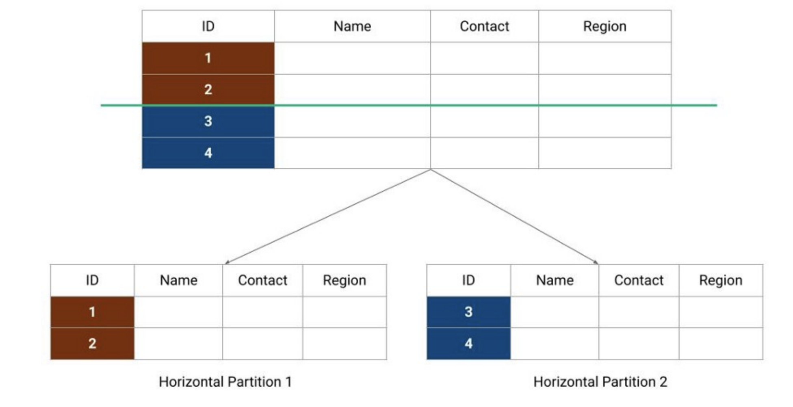
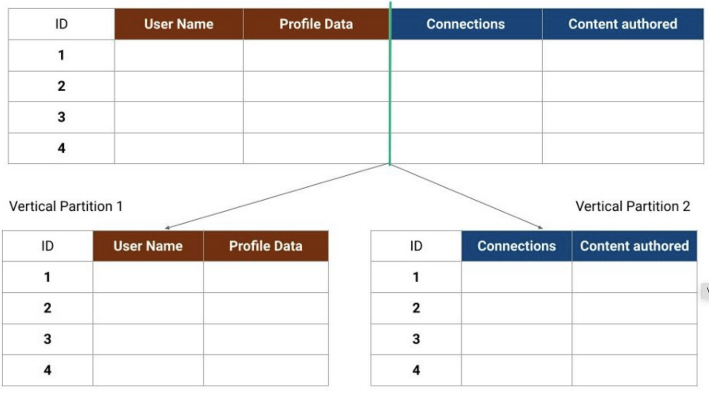
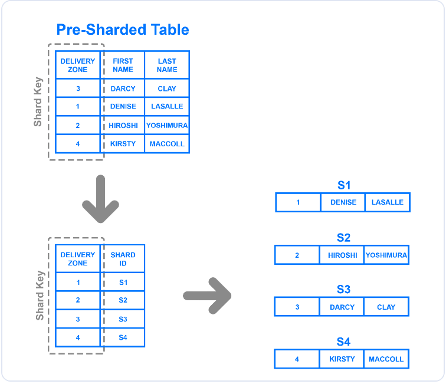
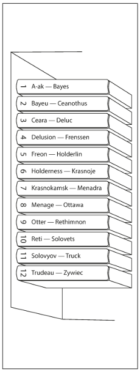
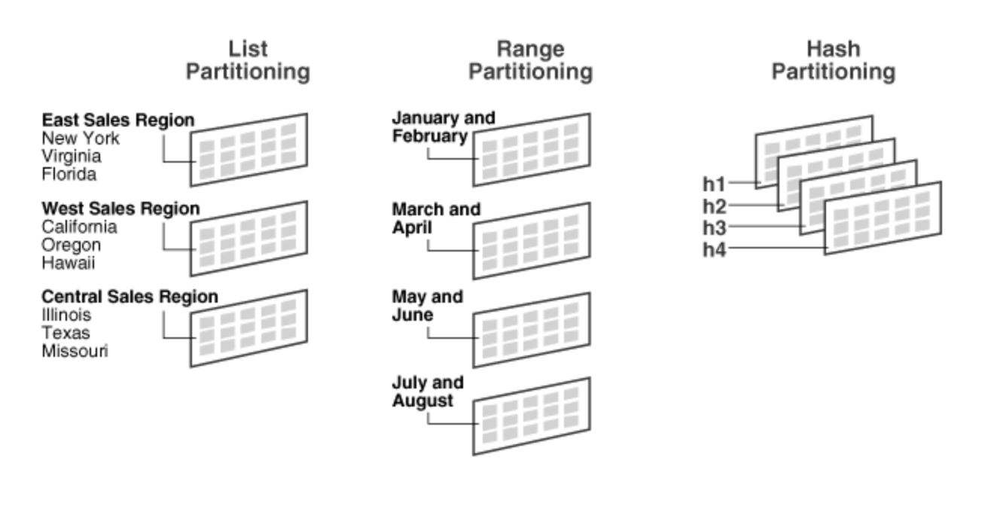
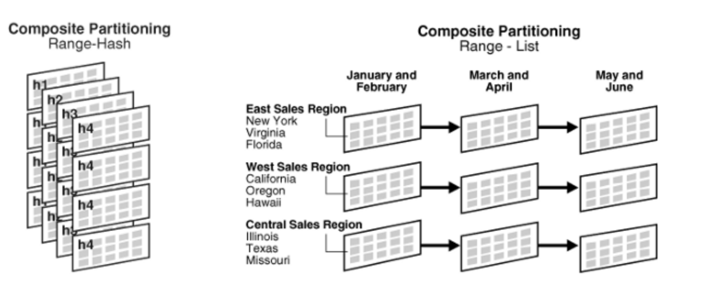
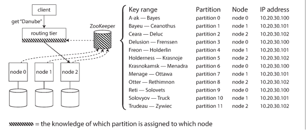

# Data Partitioning
**Data partitioning** in simple terms is a method of distributing data across multiple tables,
systems or sites to improve query processing performance and make the data more manageable.

# Partitioning methods
## Horizontal partitioning — also known as sharding
* In this strategy, we split the table data horizontally based on the range of values defined by the **partition key**. It is also referred to as database sharding. Smaller partitions are called **shards**.
- **Pros**:
  - Spreads the load over more computers and ensures minimal query time.
  - Each partition has the same schema as the original database, eliminating the need to combine data from multiple partitions for queries.

- **Cons**:
  - If the value chosen for sharding isn’t chosen carefully, it can lead to unbalanced servers.

- **Examples**:
  - MongoDB uses sharding for horizontal partitioning.




## Vertical partitioning
* Divides the table vertically (by columns), meaning that the structure of the main table changes in the new ones. Divides data for a specific feature to their own server.
* Divide data for a specific feature to their own server.
- **Pros**:
  - Straightforward to implement.
  - Low impact on the application.

- **Cons**:
  - The system might need to combine data from multiple partitions to answer a query, increasing overall complexity.
  - To support growth, a database may need further partitioning.

- **Examples**:
  - Amazon Aurora uses vertical partitioning for certain applications.



## Directory-based partitioning
* A lookup service that knows the partitioning scheme and abstracts it away from the database access code. Allow the addition of DB servers or change of partitioning schema without impacting the application.
- **Cons**:
  - Can be a single point of failure.

- **Examples**:
  - Facebook uses a directory-based partitioning system for its user database.


## Range Based Partitioning

- **Description**: Assigns rows to partitions based on column values falling within a given range.
- **Example**: 
  ```sql
  PARTITION BY RANGE (store_id) (
      PARTITION p0 VALUES LESS THAN (6),
      PARTITION p1 VALUES LESS THAN (11),
      PARTITION p2 VALUES LESS THAN (16),
      PARTITION p3 VALUES LESS THAN (21)
  );
  ```

- **Pros**:
  - Simple to implement and understand.
  - Efficient for range queries.

- **Cons**:
  - Can lead to unbalanced partitions if data is not uniformly distributed.
  - Have to actually determine the ranges to make sure they are relatively even in data and load (can be done manually or by database)
  - Can easily lead to hotspots (if for example partitioning by range of timestamps)

- **Examples**:
  - MySQL supports range partitioning.

## Key or Hash-based Partitioning

- **Description**: Applies a hash function to some key attribute of the entry to get the partition number.
- **Example**: 
  ```sql
  CREATE TABLE employees (
      id INT NOT NULL,
      fname VARCHAR(30),
      lname VARCHAR(30),
      hired DATE NOT NULL DEFAULT '1970-01-01',
      separated DATE NOT NULL DEFAULT '9999-12-31',
      job_code INT,
      store_id INT
  )
  PARTITION BY HASH(YEAR(hired))
  PARTITIONS 4;
  ```

- **Pros**:
  - Distributes data evenly across partitions.
  - Reduces the chance of hotspots.

- **Cons**:
  - Adding new servers may require changing the hash function, which would need redistribution of data and downtime.
  - No more range queries on the partition key, have to check every partition
  - If a key has a lot of activity will still lead to hot spots Celebrity Problem

- **Examples**:
  - Cassandra uses hash-based partitioning with consistent hashing to distribute data.

## List-Based Partitioning

- **Description**: Similar to range partitioning but selects the partition based on columns matching one of a set of discrete values.
- **Example**: 
  ```sql
  PARTITION BY LIST(store_id) (
      PARTITION pNorth VALUES IN (3, 5, 6, 9, 17),
      PARTITION pEast VALUES IN (1, 2, 10, 11, 19, 20),
      PARTITION pWest VALUES IN (4, 12, 13, 14, 18),
      PARTITION pCentral VALUES IN (7, 8, 15, 16)
  );
  ```

- **Pros**:
  - Flexible for categorically partitioned data.
  - Easier to manage specific groups of values.

- **Cons**:
  - Can lead to unbalanced partitions if the distribution of values is not uniform.

- **Examples**:
  - Oracle supports list partitioning.



## Round-robin Partitioning

- **Description**: Distributes rows evenly across partitions in a round-robin fashion.
- **Example**:
  - With `n` partitions, the `i`th tuple is assigned to partition `i % n`.

- **Pros**:
  - Simple to implement.
  - Ensures even distribution of data.

- **Cons**:
  - Not suitable for queries that need range scans.

- **Examples**:
  - Some implementations in distributed systems use round-robin partitioning.

## Composite Partitioning

- **Description**: Combines multiple partitioning schemes to devise a new scheme.
- **Consistent Hashing**: Combines hash and list partitioning.
  - **Key** -> **Reduced key space through hash** -> **List** -> **Partition**.
- **Types of Composite Partitioning**:
  - Composite Range–Range Partitioning
  - Composite Range–Hash Partitioning
  - Composite Range–List Partitioning
  - Composite List–Range Partitioning
  - Composite List–Hash Partitioning
  - Composite List–List Partitioning

- **Pros**:
  - Can optimize for various query types.
  - Balances load more effectively.

- **Cons**:
  - Complexity in implementation and management.



# Secondary Index Partitioning Options
Secondary indexes need to be partitioned similarly to the primary data to ensure query efficiency and data locality. Various strategies include:

## Partitioning Secondary Index by Document (Local Index)
### Pros
- Fast on write because all data that is being kept track of is being stored locally on the partition.

### Cons
- Slow on read because if using a secondary index, you have to query every partition to accumulate the index results.


## Partitioning Secondary Index by Term (Global Index)
### Pros
- Fast on read because all data for that index is being kept on one partition node.

### Cons
- Slow on write because you need to write to multiple partitions to update all of the various secondary indexes.
- May require a distributed transaction (imagine the case where one write succeeds and the other fails).


# Common Problems of Sharding
## Joins and Denormalization
- **Problem**: Joins are not performance-efficient since data has to be compiled from multiple servers.
- **Workaround**: Denormalize the database so that queries can be performed from a single table. This can lead to data inconsistency.

## Referential Integrity
- **Problem**: Difficult to enforce data integrity constraints (e.g., foreign keys).
- **Workaround**:
  - Referential integrity enforced by application code.
  - Applications run SQL jobs to clean up dangling references.

## Rebalancing Partitions
- **Problem**: Necessity of rebalancing due to unbalanced data distribution or high load on one shard.
- **Solution**: Create more database shards or rebalance existing shards, which changes the partitioning scheme and requires data movement.

### Various Strategies for Rebalancing
#### Fixed Number of Partitions
- Predefine a fixed number of partitions to ensure easier management but may need to over-provision.

#### Dynamic Partitioning
- Adjust the number of partitions based on current load and size, providing flexibility but requiring complex management.

#### Fixed Number of Partitions per Node
- Allocate a fixed number of partitions per node, balancing between fixed and dynamic approaches.


# Request Routing Strategies

## Random Assignment to Any Node
- Requests are randomly assigned to any available node, ensuring even load distribution then can use gossip protocol to route to specific node.

## Client-based Routing
- The client has the logic to determine the correct partition for a request, reducing the need for additional routing infrastructure.

## Proxy-based Routing
- Requests are routed through a proxy server that directs them to the correct partition, centralizing routing logic and management.


# Sharding Summary
## Partitioning Methodology
- Key ranges are better when we need to perform range queries.
- Key hash ranges are better when we want to more evenly distribute data.

## Index Choices
- Local indexes optimize for write speed.
- Global indexes optimize for read speed.

## Rebalancing Choices
- Fixed number of partitions is simpler to reason about but requires choosing a good number.
- A changing number of partitions may scale better, but doing so automatically may lead to unnecessary rebalancing and putting extra stress on our databases.

# References
* DDIA-Chapter6
* [grokking-the-system-design-interview](https://www.educative.io/courses/grokking-the-system-design-interview/mEN8lJXV1LA)
* https://medium.com/must-know-computer-science/system-design-sharding-data-partitioning-b7201596aafa
* https://dev.mysql.com/doc/mysql-partitioning-excerpt/5.7/en/partitioning.html
* https://docs.google.com/presentation/d/1ZNVDn4Uwcje1yYPz40C5mkJWBazkQ5W1XhSyhZTbRE0/edit