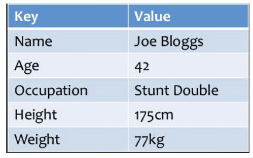
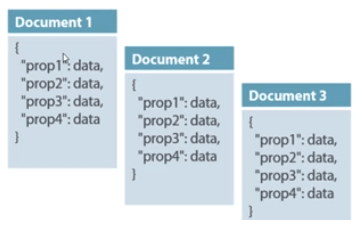
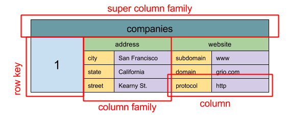
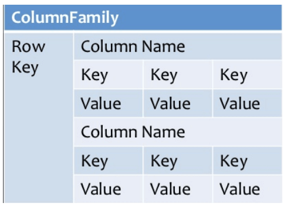
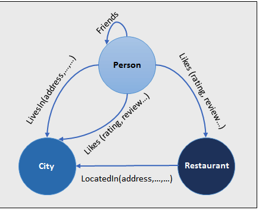
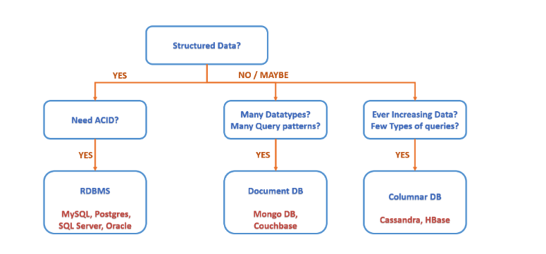
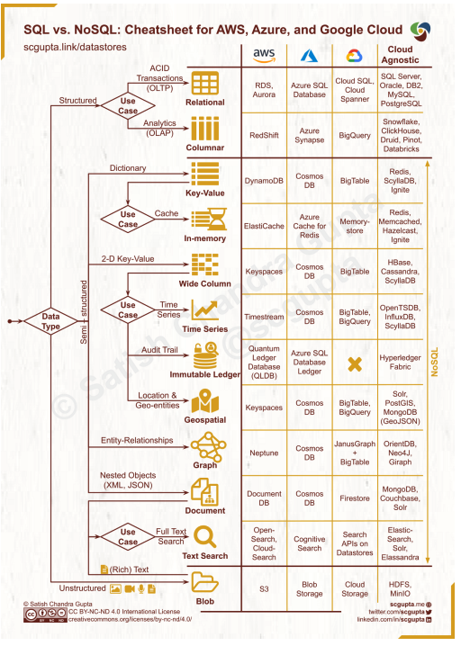

# Table of contents

- [SQL Databases and NoSQL Databases](#sql-databases-and-nosql-databases)
  - [SQL Databases(Relational Databases)](#sql-databasesrelational-databases)
  - [No-SQL Databases(Non-relational Databases)](#no-sql-databasesnon-relational-databases)
- [Differences between SQL and NoSQL](#differences-between-sql-and-nosql)
- [Pros and Cons of SQL and NoSQL](#pros-and-cons-of-sql-and-nosql)
  - [Pros of SQL](#pros-of-sql)
  - [Cons of SQL](#cons-of-sql)
  - [Pros of NoSQL](#pros-of-nosql)
  - [Cons of NoSQL](#cons-of-nosql)
- [Which one to use?](#which-one-to-use)
  - [When to use SQL](#when-to-use-sql)
  - [Use cases of SQL (with Examples)](#use-cases-of-sql-with-examples)
  - [When to use NoSQL](#when-to-use-nosql)
  - [Use cases of NoSQL (with Examples)](#use-cases-of-nosql-with-examples)
- [Data Replication](#data-replication)
- [Data Partitioning/Sharding](#data-partitioningsharding)
- [References](#references)

# SQL Databases and NoSQL Databases
## SQL Databases(Relational Databases)
* Data is organized in tables, where columns represent attributes and rows represent records.
* Relational databases are structured and have predefined schemas
* **Examples**: MySQL, PostgreSQL, Oracle Database, MS SQL Server, SQLite, and MariaDB.
* **ACID** is a set of properties of relational database transactions.
  * **Atomicity** - Each transaction is all or nothing
  * **Consistency** - Any transaction will bring the database from one valid state to another
  * **Isolation** - Executing transactions concurrently has the same results as if the transactions were executed serially
  * **Durability** - Once a transaction has been committed, it will remain so
* In comparison with the CAP Theorem, ACID choose consistency over availability.

## No-SQL Databases(Non-relational Databases)
* Manages data in a non-relational structure.
* Schemaless (no fixed schema) and avoids joins
* **BASE** is often used to describe the properties of NoSQL databases. In comparison with the CAP Theorem, BASE chooses 
  availability over consistency.
  * **Basically available - the system guarantees availability.
  * **Soft state** - the state of the system may change over time, even without input.
  * **Eventual consistency** - the system will become consistent over a period of time, given that the system doesn't 
      receive input during that period.
### Common types of NoSQL
#### Key-value stores
>Abstraction: hash table
* Data is stored in an array of key-value pairs
* 'key' is an attribute name which is linked to a 'value'
* Value can be anything from number, string to JSON and BLOB (Binary Large Objects)
* Thus, they are highly scalable and can handle high volumes of traffic
* Ideal for session management e.g. localStorage in the browser, shopping cart.
* Eg: Amazon DynamoDB, Redis, , Aerospike, Memcached, Riak, Couchbase, Oracle Berkeley DB

#### Document databases
>Abstraction: key-value store with documents stored as values
* Data is stored in documents (instead of rows and columns in a table)
* Data stored in JSON
* Documents are grouped together in collections.
* Each document can have an entirely different structure.
* Ideal for storing any type of data, including images, videos and even geospatial data
* Eg: MongoDB, ElasticSearch, CouchDB, CosmosDB, Amazon SimpleDB

#### Wide-column / columnar databases / column-based
>Abstraction: nested map ColumnFamily<RowKey, Columns<ColKey, Value, Timestamp>>
* Column families - containers for rows.
* Keys stored in columns rather than rows
* No need to know all the columns up front.
* Each row can have different number of columns.
* Ideal for Data Warehouses and Business Intelligence (B.I.)
* Eg: Cassandra, Bigtable, Hadoop, HBase, Hypertable, Druid, Azure SQL Data Warehouse

#### Graph database
* Data is stored in graph structures
  * Nodes: entities
  * Properties: information about the entities
  * Lines: connections between the entities
* Ideal for fraud detection, recommendation engineers, network mapping, social networks etc.
* Eg: Neo4j, Virtuoso, ArangoDB, OrientDB, GraphDB, Amazon Neptune, Fauna, FlockDB
  

# Differences between SQL and NoSQL
| Attributes                                 | SQL                                                                                                                                                                                      | NoSQL                                                                                                                                  |
|--------------------------------------------|------------------------------------------------------------------------------------------------------------------------------------------------------------------------------------------|----------------------------------------------------------------------------------------------------------------------------------------|
| Storage                                    | 1. Normalized structured data (rows and columns) 2. data stored in tables.                                                                                                               | have different data storage models.                                                                                                    |
| Schema                                     | 1. Pre-defined and rigid 2. Each record conforms to a fixed schema. 3. Schema can be altered, but it requires modifying the whole database.                                              | Dynamic and Flexible (Schemaless)                                                                                                      |
| Querying                                   | Use SQL (structured query language) for defining  and manipulating the data.                                                                                                             | 1.Queries are focused on a collection of documents. 2.UnQL (unstructured query language) 3. Different databases have different syntax. |
| Scalability                                | 1. Vertically scalable (by increasing the horsepower: memory, CPU, etc) and expensive. 2. Horizontally scalable (across multiple servers); but it can be challenging and time-consuming. | 1. Horizontally scalable (by adding more servers) and cheap                                                                            |
| Transaction Guarantees or  ACID Compliancy | 1. All support ACID (Atomicity, Consistency, Isolation, Durability) 2. Data reliability 3. Guarantee of transactions                                                                     | 1. Most support BASE (Basically Available, Soft state, Eventually consistent)                                                          |
| CAP Theorem (Trade-offs)                   | Strong Consistency                                                                                                                                                                       | Eventual consistency and prioritize Availability and Partition tolerance                                                               |
|                                            |                                                                                                                                                                                          |                                                                                                                                        |

# Pros and Cons of SQL and NoSQL
## Pros of SQL
* **Reduced data storage** - Normalization removed data redundancy and duplication
* **ACID-complian**t - Strong data integrity, security and consistency
* **Normalization** - Database engines are better at optimizing queries to fit on-disk representations
* **Great for complex queries** - SQL is efficient at processing queries and joining data across tables
* **Predefined schema** - Validations are done on the database layer and not the application layer
* Standardized language across different RDBMS
## Cons of SQL
**Vertical scaling** - Relatively more expensive than horizontal scaling
**Rigid data model** - Require up-front design, and harder to make changes (require data migrations and possibly downtime)
**Single point of failure** - Mitigated by replication and failover techniques

## Pros of NoSQL
* **Schemaless** - Easy to make changes to databases as requirements change
* **Flexible data model** - Each entity can have its unique structure
* **Horizontal scaling** - Relatively cheaper and easier, especially for Big Data
* **Highly available** - Designed to support seamless scaling without a significant single point of failure
* **High performance** - Data that is accessed together typically stored together
## Cons of NoSQL
* **Less secure** - Difficult to verify data integrity and consistency (only eventual consistency achieved)
* **Schemaless** - Lacks standardization of data types
* **No normalization** - Database engines are not as good at optimizing queries
* **Larger data storage footprint** - More data duplication due to lack of normalization. But a relatively small drawback as storage is relatively cheap
* **Different types of NoSQL databases** - each have their use cases. E.g. Graph databases are good for analyzing relationships but not range queries

# Which one to use?
## When to use SQL
* **ACID compliance is important**. 
  * Reduce anomalies. 
  * Protect database integrity. 
* **Data is highly structured and does not change frequently**: Predefined schemas allow for easy navigation
* **Working with complex queries** - NoSQL is less robust and has limited query functionality
## Use cases of SQL (with Examples)
* Banking account’s transaction history
* Text Messaging System
* Ecommerce transactions
* [Stack Overflow scale pretty well with SQL to handle 800M SQL queries daily (8500 RPS at their peak)](https://www.slideshare.net/InfoQ/scaling-stack-overflow-keeping-it-vertical-by-obsessing-over-performance)
* Shopify keep up with the traffic for Black Friday and Cyber Monday at 11 Million QPS using MySQL
* [Uber transitioned from NoSQL to MySQL based storage for their Fulfilment Platform](https://eng.uber.com/fulfillment-platform-rearchitecture/)

## When to use NoSQL
* **Unstructured data** - different data entities can have different structure
* **Faster development speed** - No need to design database schema
* **Priority is easy scalability and availability** - Vertical scaling is expected to be too expensive
* **Priority is not data consistency and integrity** - **NoSQL is not ACID compliant**

## Use cases of NoSQL (with Examples)
* Social media posts don’t have to appear in the same order for every user
* Storing product views of millions of shoppers
* Storing items in users’ shopping cart
* Fraud detection - Detection algorithm rules require a huge amount of data from various sources
* Personalization and recommendation engine - Huge amount of unstructured data
* Market Basket Analysis e.g. study of purchases done by a customer in a supermarket
* [Worknik migrated from MySQL to MongoDB to handle 10 Million API Requests A Day](http://highscalability.com/blog/2011/2/15/wordnik-10-million-api-requests-a-day-on-mongodb-and-scala.html)
* [Netflix built fast, fault-tolerant systems with NoSQL](https://netflixtechblog.com/nosql-at-netflix-e937b660b4c)
* [Gojek migrated from PostgreSQL to Cassandra to handle 100 Million transactions per month](https://www.gojek.io/blog/database-optimisation-on-cassandra)

# Data Replication
# Data Partitioning/Sharding

# References
* [grokking-the-system-design-interview](https://www.educative.io/courses/grokking-the-system-design-interview/YQlK1mDPgpK)
* [system-design-primer](https://github.com/donnemartin/system-design-primer#database)
* [NodeFlair Blog Post](https://www.nodeflair.com/blog/sql-vs-nosql-databases-system-design-interview#:~:text=NoSQL%20stores%20commonly%20accessed%20data,do%20not%20violate%20predefined%20schemas.)
* https://medium.com/must-know-computer-science/system-design-sql-vs-nosql-4cdfb9f53d69
* https://www.guru99.com/nosql-tutorial.html
* https://www.codekarle.com/system-design/Database-system-design.html
* https://blog.bytebytego.com/p/understanding-database-types