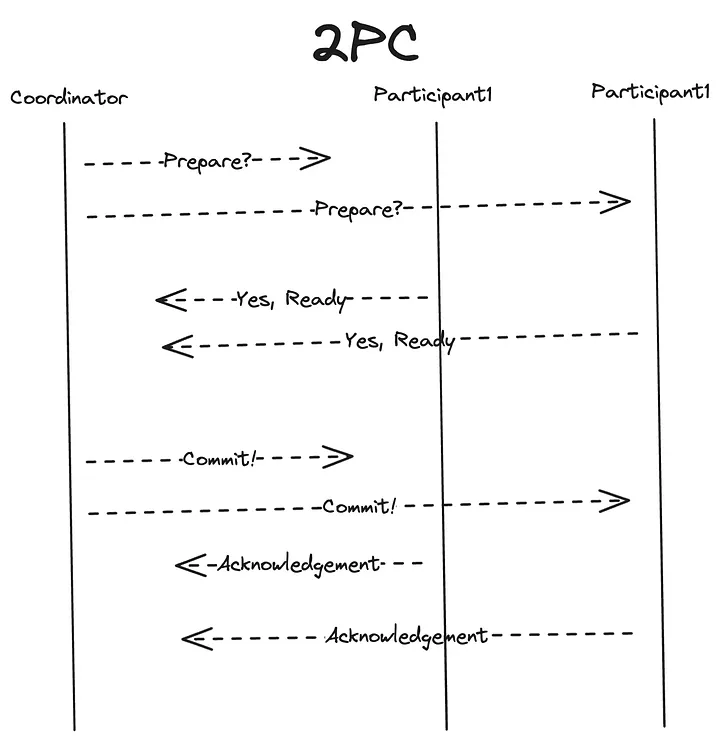
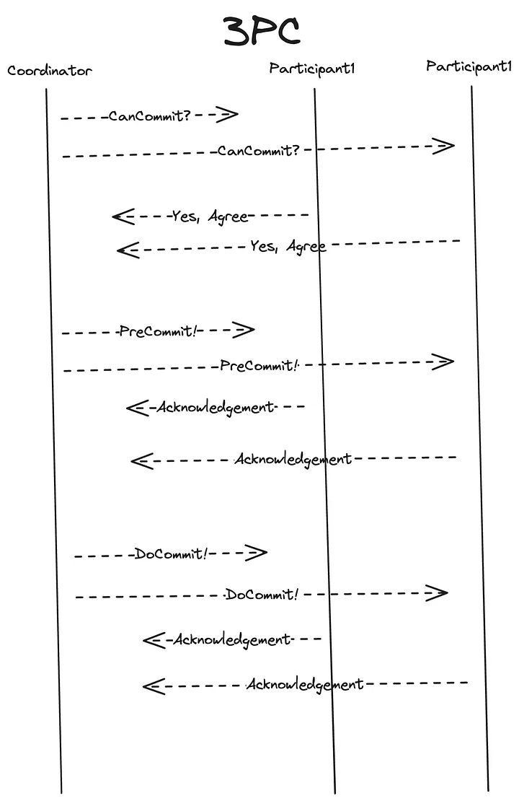
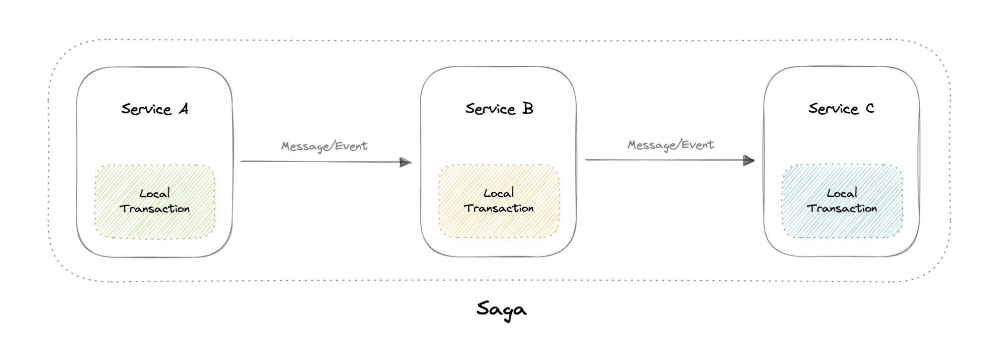

# Distributed Transactions

Distributed transactions are essential when a single transaction spans multiple networked resources or databases. They ensure that all participants in the transaction either commit or roll back their changes, maintaining consistency across the distributed system. This is crucial in systems where multiple services or databases must maintain a consistent state to ensure data integrity and consistency.

## Why do we need distributed transactions?

Unlike an ACID transaction on a single database, a distributed transaction involves altering data on multiple databases. Consequently, distributed transaction processing is more complicated, because the database must coordinate the committing or rollback of the changes in a transaction as a self-contained unit. In other words, all the nodes must commit, or all must abort, and the entire transaction rolls back. This is why we need distributed transactions.

### Key Concepts

- **Atomicity**: Ensures that all parts of the transaction are completed successfully or none are.
- **Consistency**: Ensures that the transaction leaves the system in a consistent state.
- **Isolation**: Ensures that intermediate states of the transaction are invisible to other operations.
- **Durability**: Ensures that once a transaction is committed, it remains so even in the event of a system failure.

---

## Two-Phase Commit

The Two-Phase Commit (2PC) protocol is a type of atomic commitment protocol used to ensure all participants in a distributed transaction either commit or roll back their changes. This protocol requires a coordinator node, which coordinates and oversees the transaction across different nodes. The coordinator tries to establish the consensus among a set of processes in two phases, hence the name. It involves two phases: the Prepare phase and the Commit phase.

### Phases

1. **Prepare Phase**:
    - The coordinator sends a `prepare` request to all participants.
    - Participants execute the transaction up to the point of committing and write the changes to a log.
    - Participants reply with a `vote` (commit or abort).

2. **Commit Phase**:
    - If all participants vote to commit, the coordinator sends a `commit` message to all participants.
    - If any participant votes to abort, the coordinator sends an `abort` message to all participants.
    - Participants either commit or roll back their changes based on the coordinator's decision.

### Pros

- **Simplicity**: Easier to implement compared to more complex protocols.
- **Consistency**: Ensures consistency across all participating nodes.

### Cons

- **Blocking**: If the coordinator crashes during the commit phase, participants may be left waiting indefinitely, resulting in a blocking state.
- **Single Point of Failure**: The coordinator is a single point of failure. If it fails, the entire transaction may be disrupted.
- **Network Partitions**: In case of network partitions, participants might not be able to communicate with the coordinator, leading to uncertainties.

---

## Three-Phase Commit

The Three-Phase Commit (3PC) protocol is an extension of the Two-Phase Commit protocol, designed to reduce the likelihood of blocking. It introduces an additional phase called the Pre-Commit phase.

### Phases

1. **CanCommit (Prepare) Phase**:
    - The coordinator sends a `canCommit?` request to all participants.
    - Participants check if they can commit and respond with `yes` or `no`.

2. **PreCommit Phase**:
    - If all participants respond with `yes`, the coordinator sends a `preCommit` message.
    - Participants acknowledge the `preCommit` and prepare to commit but do not yet commit.

3. **DoCommit Phase**:
    - The coordinator sends a `doCommit` message to all participants.
    - Participants commit the transaction.
    - If the coordinator sends an `abort` message at any phase, participants abort the transaction.

### Pros

- **Non-Blocking**: Reduces the chance of participants being left in a blocking state due to coordinator failure.
- **Improved Failure Handling**: Participants can safely decide on their own in case of coordinator failure, reducing uncertainty.

### Cons

- **Communication Overhead**: The additional phase increases the number of messages exchanged, resulting in higher communication overhead.
- **Still Not Completely Non-Blocking**: Although less likely, 3PC can still encounter blocking situations if there are network partitions or multiple simultaneous failures.
- **Complexity**: More complex to implement compared to 2PC due to the additional phase and handling of more states.

### Why is the Pre-Commit Phase Helpful?

The Pre-Commit phase accomplishes the following:
- If the participant nodes are found in this phase, it means that every participant has completed the first phase. The completion of the prepare phase is guaranteed.
- Every phase can now time out and avoid indefinite waits.

### How 3PC Solves Coordinator Crashes

- **During CanCommit Phase**: If the coordinator crashes, participants who have not received any message will do nothing. Those who have received the `canCommit?` request but not yet responded can safely abort.
- **During PreCommit Phase**: If the coordinator crashes, participants who have received the `preCommit` message will wait for the `doCommit` or `abort` message. If they do not receive any message within a certain timeout, they can coordinate with each other to decide on a course of action, typically aborting the transaction to ensure safety.
- **During DoCommit Phase**: If the coordinator crashes, participants will continue waiting for the `doCommit` or `abort` message. Since participants are in a "prepared" state, they know the transaction is in a safe state to eventually commit. If no further messages are received within a timeout period, participants can coordinate with each other to reach a consensus, potentially committing if they all agree the transaction can be committed safely.

---

## SAGA

The SAGA pattern is an alternative to using two-phase and three-phase commits in distributed transactions. It breaks down a transaction into a series of smaller sub-transactions, each with its own compensating transaction to undo the changes if necessary. This approach is particularly useful in microservices architectures.

### How SAGA Works

1. **Chain of Transactions**: A SAGA is a sequence of transactions (T1, T2, ..., Tn) that can be interleaved with other transactions. Each transaction updates data within a single service and publishes an event or message to trigger the next transaction in the sequence.
2. **Compensating Transactions**: If a transaction fails, compensating transactions are executed to undo the changes made by the previous transactions.

### Example of SAGA

1. **Order Service**: Creates an order (T1).
2. **Payment Service**: Charges the customer's account (T2).
3. **Inventory Service**: Reserves the items (T3).

If the Inventory Service fails to reserve items, a compensating transaction will refund the payment and cancel the order.

### Pros

- **Asynchronous Execution**: Transactions are handled asynchronously, reducing the chances of blocking.
- **Failure Handling**: Compensating transactions provide a way to handle failures gracefully.

### Cons

- **Complexity**: Managing compensating transactions and ensuring data consistency can be complex.
- **Eventual Consistency**: SAGA provides eventual consistency, which may not be suitable for all applications.

---

## Conclusion

2PC ensures transaction atomicity in a distributed environment through two stages of operation, but it has performance overhead, single point of failure, and blocking problems. 3PC adds a pre-commit stage and a timeout mechanism to 2PC, better solving the single point of failure and blocking problems, improving the execution efficiency of the transaction, but bringing higher message overhead and complexity. The SAGA pattern offers an alternative by breaking down transactions into smaller units with compensating transactions, providing asynchronous execution and failure handling at the cost of added complexity and eventual consistency.

---
# References
* Videos
    
* https://medium.com/@ys.meng/understanding-two-phase-and-three-phase-commit-protocols-in-distributed-systems-33a39bca7688