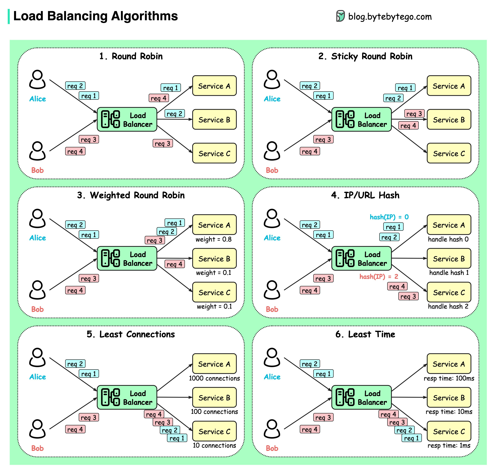

## Introduction
Load balancing is a technique used to distribute network traffic across multiple servers or resources to optimize resource utilization, 
maximize throughput, minimize response time, and avoid overloading any single resource. Here's a brief summary and notes on load balancing:

## Types of Load Balancers
1. **Software Load Balancers:**
   - Examples: NGINX, HAProxy.
   - Run as software on general-purpose hardware or virtual machines.
   - Offers flexibility and customization options.
   - Suited for cloud-native and containerized environments.

2. **Hardware Load Balancers:**
   - Examples: F5 BIG-IP, Citrix NetScaler.
   - Dedicated hardware appliances optimized for high-performance load balancing.
   - Provides advanced features such as SSL acceleration and DDoS protection.
   - Ideal for high-traffic enterprise applications and data centers.

3. **Cloud Load Balancers:**
   - Examples: AWS ALB, AWS NLB, Azure Load Balancer.
   - Provided by cloud service providers to distribute traffic across cloud resources.
   - Offers scalability, elasticity, and seamless integration with cloud environments.
   - Supports auto-scaling and geographic load balancing for global deployments.

## Layer 4 vs. Layer 7 Load Balancers

### Layer 4 Load Balancer (Network Load Balancing-NLB) 
* Operates at the transport layer (Layer 4), directing traffic based on IP addresses and port numbers.
* Use Cases: Suitable for TCP/UDP-based protocols such as DNS, FTP, and SMTP.
* Pros: Offers high throughput and low latency, ideal for high-speed data transmission.
* Cons: Lacks visibility into application-layer data, limiting advanced routing capabilities.

### Layer 7 Load Balancer
* Operates at the application layer (Layer 7), capable of inspecting HTTP/HTTPS headers, URLs, cookies, etc.
* Use Cases: Ideal for HTTP/HTTPS-based applications requiring content-based routing and SSL termination.
* Pros: Advanced routing capabilities, content-based routing, SSL offloading.
* Cons: Higher processing overhead, increased latency.

## Common Load-balancing Algorithms

### Static Load Balancing Algorithms

- **Round Robin:**
  - Rotates requests sequentially across servers.
  - Simple and fair distribution of traffic but does not account for server load or capacity variations.
  - The services are usually required to be **stateless**.

- **Weighted Round Robin:**
  - Assigns weights to servers based on capacity.
  - Allows for more precise load distribution by considering server capabilities.

- **Stickly Round Robin:**
  - This serves as a better alternative to the Round Robin Algorithm. Different requests from the same user go to the same instance.

- **IP/URL Hash:**
  - Selects a server based on a hash of the client IP address or URL
  - The requests are routed to relevant instances based on the hash function result.
  - Ensures session persistence by maintaining client-server affinity.

### Dynamic Load Balancing Algorithms 

- **Least Connections:**
  - Routes requests to the server with the fewest active connections.
  - Prevents overloading of busy servers and ensures even distribution of load.

- **Least Response Time:**
  - Selects the server with the lowest average response time.
  - Optimizes for performance by directing traffic to the fastest server.

- **Resource-Based (Adaptive):**
  - Makes routing decisions based on real-time server health and load metrics.
  - Highly adaptive and responsive to changing traffic patterns and server conditions.

## Active-Active vs Active-Passive
### Active-Active
* Multiple load balancers distribute traffic simultaneously for high availability and scalability.
* Offers scalability and fault tolerance, suitable for high-traffic environments.

### Active-Passive
* One load balancer is active, and others are on standby. If the active one fails, a passive one takes over.
* Provides failover capabilities for critical applications with minimal downtime.

## Other Important Considerations
* **Health Checks:** Load balancers monitor the health of backend servers and route traffic away from unhealthy ones.
* **Session Persistence:** Ensuring that subsequent requests from the same client are routed to the same server for stateful applications.
* **SSL Termination:**  Load balancers decrypt SSL/TLS-encrypted traffic using their private key before routing it to backend servers. This offloads encryption/decryption tasks from backend servers, improving performance and simplifying certificate management.
* **DNS Resolution:** Load balancers resolve domain names to IP addresses using DNS (Domain Name System) to direct client requests to the appropriate backend servers. DNS records may include multiple IP addresses to support load balancing across server clusters.

## References
* https://blog.bytebytego.com/p/ep47-common-load-balancing-algorithms 
* https://medium.com/@maheshsaini.sec/system-design-load-balancing-algorithms-in-nutshell-9363547141d8
* https://docs.google.com/presentation/d/1Q227M-Bnk5spHr8VUG5Atq7AROiMd6oVCnvk1fc1RfY/edit#slide=id.g12837422678_0_61
* Understand Load-balancing Algorithms

