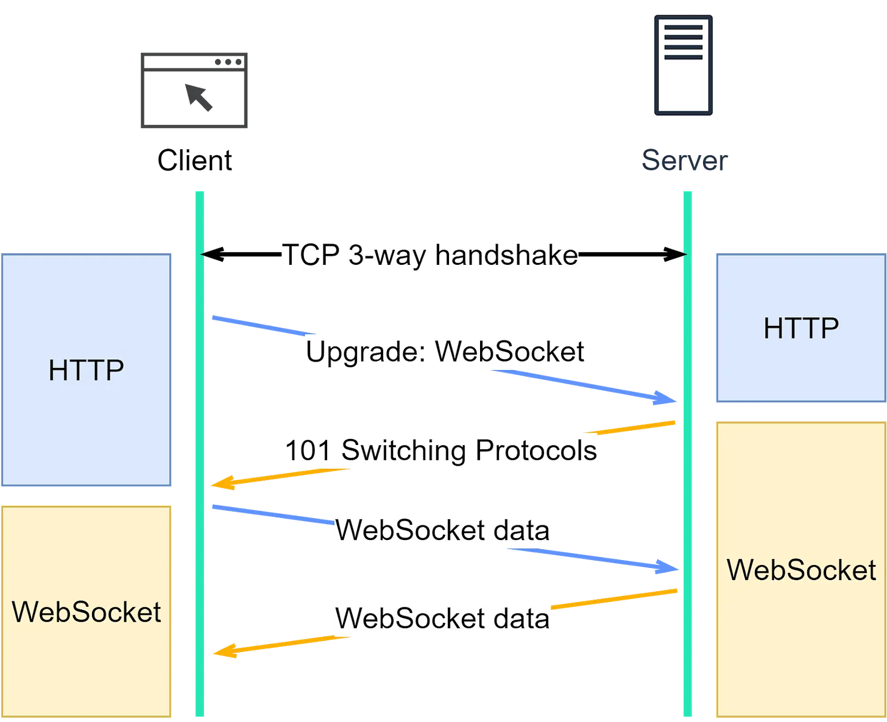
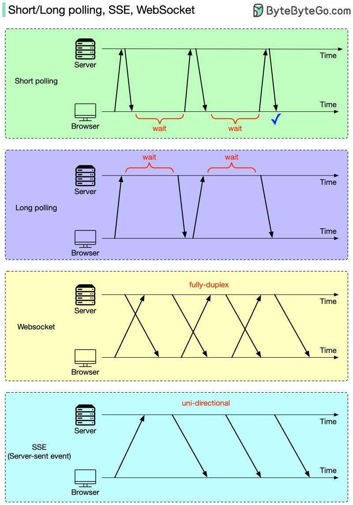

# Short Polling
**Short polling** is a technique where the client periodically sends HTTP requests to the server at regular intervals to check for new data or updates.

## Working
1. The client sends an HTTP request to the server.
2. The server processes the request and responds immediately with the current state or data.
3. The client processes the response.
4. After a fixed interval, the client sends another HTTP request to the server.
5. This cycle repeats at regular intervals.

## Advantages
- Simple to implement and understand.
- Works with any web server that supports HTTP.
- No special server configuration needed.

## Disadvantages
- Can lead to high server load due to frequent requests, even if no new data is available.
- Increased network traffic, resulting in higher latency and potential delays.
- Not real-time, as there is a delay between polls.

## Applications
- Basic data update checks (e.g., checking for new emails or messages).
- Use cases where real-time updates are not critical.

---

# Long Polling
**Long polling** is an optimization of short polling where the client sends a request to the server and the server holds the request open until new data is available.

## Working 
1. The client sends an HTTP request to the server.
2. The server holds the request open until new data is available or a timeout occurs.
3. Once new data is available, the server responds with the data.
4. The client processes the response.
5. The client immediately sends another HTTP request to the server.
6. This cycle repeats, creating a continuous loop.

## Advantages
- More efficient than short polling, reducing the number of requests.
- Provides near real-time updates.
- Works with existing HTTP infrastructure.

## Disadvantages
- Can still lead to high server load if many clients are connected.
- Increased complexity compared to short polling.
- Requires careful handling of timeouts and network issues.

## Applications
- Chat applications.
- Notification systems.
- Situations where real-time data updates are needed but WebSockets are not feasible.

---

# WebSockets
**WebSockets** provide a full-duplex communication channel over a single, long-lived connection between the client and server, allowing real-time, low-latency communication.

## Working 
1. The client initiates a WebSocket handshake process by sending an HTTP request with an `Upgrade` header to the server.
2. The server responds with an HTTP 101 status code, switching protocols to WebSocket.
3. A WebSocket connection is established once the client receives a successful handshake response.
4. Both the client and server can now send and receive data in real-time through this persistent connection.
5. The connection remains open until either the client or the server decides to close it.

## Establishing a WebSocket Connection
1. **Client sends request:**
   ```http
   GET /chat HTTP/1.1
   Host: server.example.com
   Upgrade: websocket
   Connection: Upgrade
   Sec-WebSocket-Key: x3JJHMbDL1EzLkh9GBhXDw==
   Sec-WebSocket-Protocol: chat, superchat
   Sec-WebSocket-Version: 13
   Origin: http://example.com
   ```

2. **Server responds:**
   ```http
   HTTP/1.1 101 Switching Protocols
   Upgrade: websocket
   Connection: Upgrade
   Sec-WebSocket-Accept: HSmrc0sMlYUkAGmm5OPpG2HaGWk=
   Sec-WebSocket-Protocol: chat
   ```



## Load Balancing WebSocket Traffic
- WebSockets require sticky sessions, where all requests from a particular client are sent to the same server.
- Load balancers can be configured to maintain these sticky sessions using techniques such as IP hash or cookies.
- Examples include using NGINX or HAProxy for WebSocket load balancing.

## Advantages
- Real-time, low-latency communication.
- Efficient use of network resources with reduced overhead.
- Supports bidirectional communication.
- Lightweight for both client and server.

## Disadvantages
- More complex to implement and manage.
- Older browsers don't support WebSockets (becoming less relevant).

## Applications
- Real-time chat applications.
- Online gaming.
- Live sports scores and updates.
- Financial tickers.

---

# Server-Sent Events (SSE)
**Server-Sent Events (SSE)** is a server push technology that allows the server to send updates to the client over a single, long-lived HTTP connection. It is **unidirectional**, meaning once the client sends the request it can only receive the responses without the ability to send new requests over the same connection.

## Working 
1. The client initiates an HTTP request to the server, typically an HTTP GET request.
2. The server keeps the connection open and sends updates as text/event-stream messages whenever new data is available.
3. The client receives updates automatically without needing to poll.
4. The connection remains open, and the server continues to send updates as needed.
5. If the connection is closed, the client can automatically reconnect to the server.

## Advantages
- Simpler to implement than WebSockets for one-way data updates.
- Uses standard HTTP, which works well with existing infrastructure.
- Built-in reconnection and event ID tracking.

## Disadvantages
- Unidirectional nature can be limiting.
- Less efficient than WebSockets for high-frequency updates.
- Limitation for the maximum number of open connections.
- Does not support binary data.

## Applications
- News feed updates.
- Live score updates.
- Stock price updates.
- Social media updates.



---

# Server Side Web Hooks
**Server-side webhooks** allow one server to send real-time data to another server via HTTP POST requests when an event occurs.

## Working
1. The receiving server registers a webhook URL with the originating server.
2. When a specified event occurs, the originating server sends an HTTP POST request to the webhook URL.
3. The POST request contains data related to the event.
4. The receiving server processes the POST request and responds with an HTTP status code (usually 200 OK).
5. The connection is closed after the response is sent.

## Advantages
- Enables real-time updates between servers.
- Decouples the sender and receiver, allowing for modular architecture.
- Simple to implement using standard HTTP.

## Disadvantages
- Relies on both servers being reachable over the network.
- Security concerns with exposing endpoints for incoming requests.
- Requires handling of retries and failures.

## Applications
- GitHub sending push event notifications.
- Payment gateways sending payment status updates.
- CRM systems updating customer information.
- Continuous integration services triggering builds.


# References
* https://blog.bytebytego.com/p/network-protocols-behind-server-push
* https://github.com/karanpratapsingh/system-design?tab=readme-ov-file#long-polling-websockets-server-sent-events-sse
* https://github.com/ByteByteGoHq/system-design-101?tab=readme-ov-file#what-is-a-webhook
