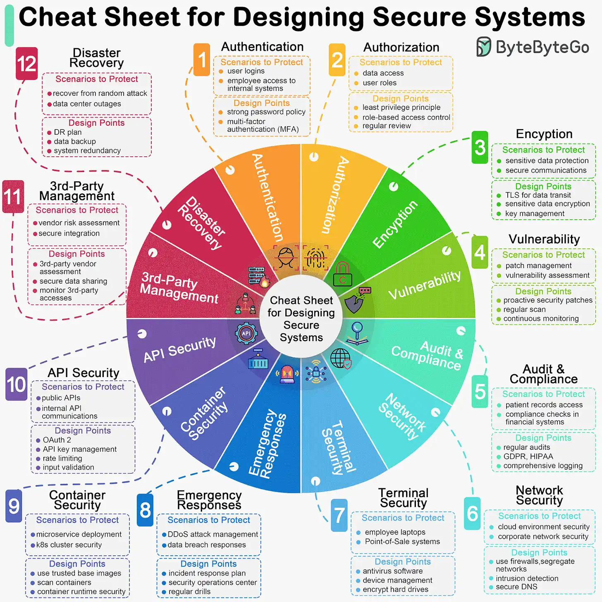

# Security
Designing secure systems is important for a multitude of reasons, spanning from protecting sensitive information to ensuring the stability and reliability of the infrastructure. As developers, we should design and implement these security guidelines by default.

The diagram below is a pragmatic cheat sheet with the use cases and key design points.

## Authentication / Authorization
**Authentication** is the process of verifying the identity of a user, while **Authorization** determines what an authenticated user is allowed to do.

### Key Design Points
- **Strong Password Policies**: Implement strong password requirements, such as minimum length, complexity, and expiration.
- **Multi-Factor Authentication (MFA)**: Use MFA to add an additional layer of security.
- **OAuth and OpenID Connect**: Use standard protocols for secure authentication and authorization.
- **Role-Based Access Control (RBAC)**: Implement RBAC to manage user permissions based on roles.
- **Session Management**: Secure session handling with appropriate timeouts and regeneration of session IDs.

``often it's sufficient to say "My API Gateway will handle authentication and authorization".``

## Encryption
Encryption protects data by converting it into an unreadable format that can only be decrypted by those with the correct key.

### Key Design Points
- **Data Encryption at Rest**: Encrypt sensitive data stored in databases, files, and backups.
- **Data Encryption in Transit**: Use TLS/SSL to encrypt data transmitted over networks.
- **Key Management**: Use secure methods to generate, store, and manage encryption keys.
- **Hashing**: Use strong hashing algorithms (e.g., SHA-256) for storing passwords and sensitive data.

## Audit & Compilance
Auditing and compliance ensure that systems adhere to security policies and regulations.

### Key Design Points
- **Logging and Monitoring**: Implement comprehensive logging and real-time monitoring to detect suspicious activities.
- **Audit Trails**: Maintain detailed audit trails of user activities and system changes.
- **Compliance Standards**: Adhere to industry standards and regulations (e.g., GDPR, HIPAA, PCI-DSS).

## Network Security
Network security protects the integrity and usability of network and data.

### Key Design Points
- **Firewalls**: Use firewalls to block unauthorized access to internal networks.
- **Intrusion Detection Systems (IDS)**: Deploy IDS to detect and respond to network threats.
- **Network Segmentation**: Isolate sensitive systems and data by segmenting the network.

## API Security
API security involves protecting APIs from attacks and ensuring that they function as intended.

### Key Design Points
- **Authentication and Authorization**: Secure APIs with robust authentication and authorization mechanisms.
- **Rate Limiting**: Implement rate limiting to prevent abuse and denial of service attacks.
- **Input Validation**: Validate all input data to prevent injection attacks.
- **API Gateway**: Use an API gateway to enforce security policies and manage API traffic.

## Emergency Responses
Emergency response plans ensure quick and effective action in the event of a security breach or other critical incidents.

### Key Design Points
- **Incident Response Plan**: Develop and regularly update an incident response plan.
- **Team Training**: Train staff on emergency response procedures.
- **Communication Plan**: Establish clear communication protocols for reporting and managing incidents.
- **Backup and Recovery**: Ensure regular backups and a tested disaster recovery plan.

## Container Security
Container security involves securing containerized applications and the underlying infrastructure.

### Key Design Points
- **Image Scanning**: Regularly scan container images for vulnerabilities.
- **Runtime Security**: Monitor container activity for suspicious behavior during runtime.
- **Least Privilege**: Run containers with the minimum necessary privileges.
- **Network Policies**: Apply network policies to control traffic between containers.

## 3rd Party Management
Managing third-party services and integrations to ensure they do not introduce vulnerabilities.

### Key Design Points
- **Vendor Assessment**: Conduct security assessments of third-party vendors.
- **Access Controls**: Limit third-party access to only what is necessary.
- **Contractual Security Requirements**: Include security requirements in vendor contracts.
- **Regular Reviews**: Periodically review third-party integrations and access.

## Disaster Recovery
Disaster recovery plans ensure the continuity of operations and quick recovery from catastrophic events.

### Key Design Points
- **Data Backups**: Regularly backup critical data and systems.
- **Recovery Testing**: Test disaster recovery plans regularly to ensure effectiveness.
- **Geographic Redundancy**: Use geographically distributed data centers for redundancy.
- **Failover Procedures**: Establish clear failover procedures for critical systems.

# Conclusion
Definitely talk about AuthN/AuthZ, Encryption, Compilance(GDPR/ISO), API Validation, Container Security, Network Security

# References
* Videos
  
* https://blog.bytebytego.com/p/ep108-how-do-we-design-a-secure-system
* https://www.hellointerview.com/learn/system-design/in-a-hurry/core-concepts#security
* https://blog.bytebytego.com/p/api-security-best-practices