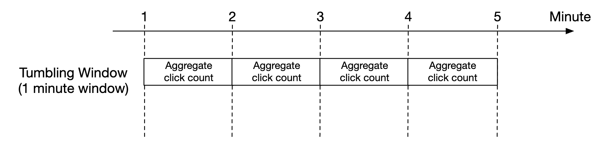
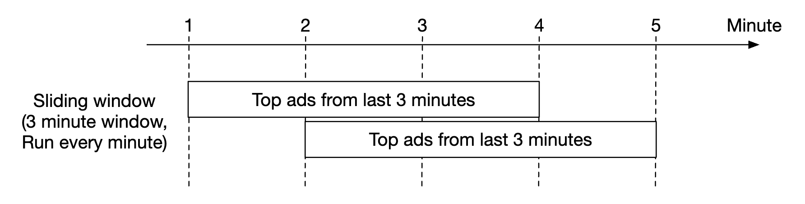
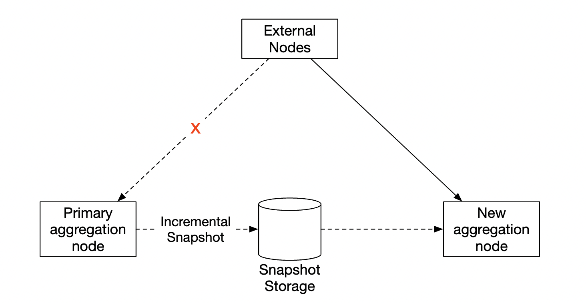

## Problem Statement
Design an Ad Click Aggregator that aggregates and provides real-time analytics on ad clicks, including the number of clicks for each ad_id within the last Y minutes and the top 100 most clicked ad_ids every minute. The system should support additional filtering by different attributes.

## Requirements
### Functional Requirements
* Aggregate the number of clicks of ad_id in the last Y minutes
* Return top 100 most clicked ad_id every minute
* Support aggregation filtering by different attributes
#### Below the line (out of scope):
* Ad targeting
* Ad serving
* Cross device tracking
* Integration with offline marketing channels

### Non-Functional Requirements
* **Scalability**: Support a peak of 10,000 clicks per second.
* **Low Latency**: Provide low-latency analytics queries for advertisers (sub-second response time).
* **Fault Tolerance**: Ensure fault-tolerant and accurate data collection without losing any click data.
* **Real-time Processing**: Provide as real-time data as possible for advertisers to query soon after the click.
* **Idempotent Click Tracking**: Ensure the same click is not counted multiple times.
#### Below the line (out of scope):
* Fraud or spam detection
* Demographic and geo profiling of users
* Conversion tracking

## Back of Envelope Estimations/Capacity Estimation & Constraints
1. **Clicks per second**: 10,000
2. **Clicks per minute**: 600,000
3. **Storage**: Assuming each click record is 100 bytes, we would need approximately 60 MB per minute.
4. **Daily Storage**: Approximately 86.4 GB per day.
5. **Query Frequency**: Queries for the top 100 most clicked ads every minute.
## High-level API design 
- **Aggregate number of clicks of `ad_id` in the last M minutes:**
  ```http
  GET /v1/ads/{ad_id}/aggregated_count
  ```
  **Query parameters:**
  - `from` - start minute. Default is now - 1 min.
  - `to` - end minute. Default is now.
  - `filter` - identifier for different filtering strategies. E.g., 001 means "non-US clicks".

  **Response:**
  ```json
  {
    "ad_id": "string",
    "count": "integer"
  }
  ```
## Data Model
## Data Model

### AdClickEvent
| Field            | Type     |
|------------------|----------|
| `ad_id`          | String   |
| `click_timestamp`| Timestamp|
| `user_id`        | String   |
| `other_attributes`| JSON     |

### AdClickAggregated
| Field            | Type     |
|------------------|----------|
| `ad_id`          | String   |
| `click_minute`   | Timestamp|
| `window_start`   | Timestamp|
| `window_end`     | Timestamp|
| `click_count`    | Integer  |
| `filter_id` (optional) | String  |

### OLAP Schema

#### Minute-level Aggregates
| Field       | Type     |
|-------------|----------|
| `ad_id`     | String   |
| `date`      | Date     |
| `hour`      | Integer  |
| `minute`    | Integer  |
| `click_count` | Integer  |

#### Hour-level Aggregates
| Field       | Type     |
|-------------|----------|
| `ad_id`     | String   |
| `date`      | Date     |
| `hour`      | Integer  |
| `click_count` | Integer |

#### Day-level Aggregates
| Field       | Type     |
|-------------|----------|
| `ad_id`     | String   |
| `date`      | Date     |
| `click_count` | Integer |

### Data Example in OLAP for Querying

#### Minute-level Aggregates
| ad_id   | date       | hour | minute | click_count |
|---------|------------|------|--------|-------------|
| ad123   | 2024-07-15 | 14   | 30     | 150         |
| ad456   | 2024-07-15 | 14   | 30     | 120         |

#### Hour-level Aggregates
| ad_id   | date       | hour | click_count |
|---------|------------|------|-------------|
| ad123   | 2024-07-15 | 14   | 900         |
| ad456   | 2024-07-15 | 14   | 720         |

#### Day-level Aggregates
| ad_id   | date       | click_count |
|---------|------------|-------------|
| ad123   | 2024-07-15 | 14400       |
| ad456   | 2024-07-15 | 11520       |


## System Interface and Data Flow
### System Interface
- **Input**: Ad click data from users.
- **Output**: Aggregated ad click metrics for advertisers.

### Data Flow
1. **Click Tracking**:
   - User clicks on an ad.
   - Click data is sent to the click tracking service via `/trackClick`.
   - The click is stored in the click table.
   - The user is redirected to the advertiser's website.
2. **Aggregation**:
   - A background process aggregates clicks for each ad_id within the last Y minutes.
   - Aggregated data is stored in the aggregated clicks table.
3. **Querying**:
   - Advertisers query the system via `/getTopAds`.
   - The query service fetches and returns the top 100 most clicked ad_ids from the aggregated clicks table.

## High Level System Design and Algorithm

### Users can click on ads and be redirected to the target
- **Client-side Redirect**:
  - When a user clicks on an ad, the click event is captured on the client-side and sent to the server.
  - The server logs the click and immediately responds with a redirect URL to the target site.
  - The user's browser follows the redirect to the advertiser's website.
  - This method ensures low latency and minimal disruption to the user experience.

- **Server-side Redirect**:
  - When a user clicks on an ad, the click event is sent to the server.
  - The server logs the click, then performs the redirect internally.
  - The server sends an HTTP redirect response to the user's browser, directing them to the advertiser's website.
  - This method provides more accurate tracking and control over the redirect process.

### Advertisers can query ad click metrics over time at 1 minute intervals
- **Batch Processing**: Store, then process data in intervals.
  - **Pros**: Easier to implement.
  - **Cons**: Higher latency.
- **Stream Processing**: Real-time aggregation with tools like Flink.
  - **Pros**: Real-time data.
  - **Cons**: More complex to implement.

|                         | Services (Online system)      | Batch system (offline system)                          | Streaming system (near real-time system)     |
|-------------------------|-------------------------------|--------------------------------------------------------|----------------------------------------------|
| Responsiveness          | Respond to the client quickly | No response to the client needed                       | No response to the client needed             |
| Input                   | User requests                 | Bounded input with finite size. A large amount of data | Input has no boundary (infinite streams)     |
| Output                  | Responses to clients          | Materialized views, aggregated metrics, etc.           | Materialized views, aggregated metrics, etc. |
| Performance measurement | Availability, latency         | Throughput                                             | Throughput, latency                          |
| Example                 | Online shopping               | MapReduce                                              | Flink [13]                                   |

## Deep Dive 
### Time
We need a timestamp to perform aggregation. It can be generated in two places:
 * event time - when ad click occurs
 * Processing time - system time when the server processes the event

Due to the usage of async processing (message queues) and network delays, there can be significant difference between event time and processing time.
 * If we use processing time, aggregation results can be inaccurate
 * If we use event time, we have to deal with delayed events

There is no perfect solution, we need to consider trade-offs:
|                 | Pros                                  | Cons                                                                                 |
|-----------------|---------------------------------------|--------------------------------------------------------------------------------------|
| Event time      | Aggregation results are more accurate | Clients might have the wrong time or timestamp might be generated by malicious users |
| Processing time | Server timestamp is more reliable     | The timestamp is not accurate if event is late                                       |

Since data accuracy is important, we'll use both the client side event time and server side event time for proce

To mitigate the issue of delayed events, a technique called "watermark" can be leveraged.

In the example below, event 2 misses the window where it needs to be aggregated:


However, if we purposefully extend the aggregation window, we can reduce the likelihood of missed events.
The extended part of a window is called a "watermark":

 * Short watermark increases likelihood of missed events, but reduces latency
 * Longer watermark reduces likelihood of missed events, but increases latency

There is always likelihood of missed events, regardless of the watermark's size. But there is no use in optimizing for such low-probability events.

We can instead resolve such inconsistencies by doing end-of-day reconciliation.

### Aggregation window
There are four types of window functions:
 * Tumbling (fixed) window
 * Hopping window
 * Sliding window
 * Session window

In our design, we leverage a tumbling window for ad click aggregations:


As well as a sliding window for the top N clicked ads in M minutes aggregation:


### Scale the system to support 10k clicks per second
**Click Processor Service**: 
- Scale horizontally by adding more instances.
- Use a load balancer to distribute the incoming clicks evenly across instances.
**Stream (Kafka/Kinesis)**:
- Use Kafka or Kinesis to handle high-volume data ingestion.
- Partition the data stream by `AdId` to ensure load distribution.
**Stream Processor (Flink)**:
- Configure Flink to scale tasks and jobs to handle the distributed data.
- Ensure each partition's data (e.g., `AdId`) is processed by the same task for consistent aggregation.
**OLAP Database**:
- Scale the OLAP database nodes horizontally.
- Consider sharding the data by `AdvertiserId` for more efficient queries, grouping all of an advertiser's ads together.

### Hot Shards Handling

When high traffic is directed towards a specific ad (e.g., a popular ad campaign), it can lead to "hot shards," where one shard receives a disproportionate load, causing bottlenecks. This issue can be addressed by appending a random suffix to the `adId` to create sub-shards. This approach ensures that partitioning is done based on the combined key (e.g., `adId:0`, `adId:1`), distributing the load more evenly.

### Steps to Implement Sub-Shards

#### 1. Generate Sub-Shard Key

Append a random suffix to the `adId` to generate a sub-shard key. This helps in distributing the load evenly across multiple partitions.

**Example Code:**
```java
private static String generateSubShardKey(String adId) {
    int subShardSuffix = new Random().nextInt(10); // Assuming 10 sub-shards
    return adId + "_" + subShardSuffix;
}
```

#### 2. Producer Side: Generate and Send Sub-Shard Key

When generating click events, use the sub-shard key to ensure that the data is partitioned correctly.

**Producer Example:**
```java
public class AdClickEventProducer {
    private static final int NUM_SUBSHARDS = 10;
    private static final Random RANDOM = new Random();

    public static String generateSubShardKey(String adId) {
        int subShardSuffix = RANDOM.nextInt(NUM_SUBSHARDS);
        return adId + "_" + subShardSuffix;
    }

    public static void sendAdClickEvent(String adId, long timestamp, String userId) {
        String subShardKey = generateSubShardKey(adId);
        // send the event with subShardKey to Kafka
        kafkaProducer.send(new ProducerRecord<>(topic, subShardKey, new AdClickEvent(subShardKey, timestamp, userId)));
    }
}
```

#### 3. Consumer Side: Process Sub-Shard Key

Consumers (e.g., Flink jobs) need to interpret the sub-shard key correctly to process and aggregate data. This involves splitting the sub-shard key to retrieve the original `adId`.

**Consumer Example:**
```java
public class AdClickEventConsumer {
    public static void main(String[] args) throws Exception {
        StreamExecutionEnvironment env = StreamExecutionEnvironment.getExecutionEnvironment();

        // Kafka consumer configuration
        Properties properties = new Properties();
        properties.setProperty("bootstrap.servers", "localhost:9092");
        properties.setProperty("group.id", "flink-consumer-group");

        // Create Kafka consumer
        FlinkKafkaConsumer<AdClickEvent> kafkaConsumer = new FlinkKafkaConsumer<>(
                "ad-click-events",
                new AdClickEventDeserializationSchema(),
                properties
        );

        // Assign sub-task to ensure events with the same sub-shard key are processed by the same task
        kafkaConsumer.setStartFromEarliest();

        DataStream<AdClickEvent> adClickStream = env.addSource(kafkaConsumer);

        // Extract the original adId by splitting the sub-shard key
        adClickStream
                .map(event -> {
                    String originalAdId = event.getAdId().split("_")[0];
                    event.setAdId(originalAdId);
                    return event;
                })
                .keyBy(AdClickEvent::getAdId)
                .timeWindow(Time.minutes(1))
                .aggregate(new AdClickAggregator())
                .print();

        env.execute("Ad Click Event Consumer");
    }
}
```
#### Key Points

- **Sub-Shard Key Generation**: Ensure both the producer and consumer use the same logic for generating and interpreting sub-shard keys.
- **Consistent Partitioning**: Use the sub-shard key to partition data in Kafka, distributing load evenly.
- **DataStream Processing**: Consumers like Flink should split the sub-shard key to retrieve the original key and aggregate data correctly.

### Ensure that we don't lose any click data
#### Stream Persistence
- Use Kafka/Kinesis with a data retention policy to store click events.
- If Flink fails, the stream can be replayed from the retention store.

#### Stream Processor Checkpointing
- Flink periodically takes checkpoints, saving the state to durable storage (e.g., HDFS, S3).
- On failure, Flink recovers from the last checkpoint, ensuring no data loss and consistent state.

#### Reconciliation
- Periodically run a batch job to reconcile stream-processed data with raw event data stored in a data lake (e.g., S3).
- This helps identify and correct any discrepancies.

**Example**:
```java
env.enableCheckpointing(60000); // Checkpoint every 60 seconds
env.setStateBackend(new RocksDBStateBackend("hdfs://namenode:8020/flink/checkpoints"));
```

### Prevent Abuse from Users Clicking on Ads Multiple Times
**Idempotent Click Tracking**:
- Generate a unique impression ID for each click event to ensure idempotency.
- Track clicks using this unique ID to avoid counting duplicates.

**Workflow**:
* Ad Placement Service generates a unique impression ID for each ad instance shown to the user.
* The impression ID is signed with a secret key and sent to the browser along with the ad.
* When the user clicks on the ad, the browser sends the impression ID along with the click data.
* The Click Processor verifies the signature of the impression ID.
* The Click Processor checks if the impression ID exists in a cache. If it does, then it's a duplicate, and we ignore it. If it doesn't, then we put the click in the stream and add the impression ID to the cache.

**Example**:
```java
private static String generateImpressionId(String adId, String userId, long timestamp) {
    return adId + "_" + userId + "_" + timestamp;
}
```

### Ensure Low Latency Metrics Query for advertisers


#### Flink Jobs for Pre-Aggregation
We can have Apache Flink jobs for each aggregation window (e.g., 1 minute, 1 hour, and 1 day) to store pre-aggregation results in the OLAP database. This ensures that real-time data is available for advertisers' queries. Additionally, we can have a results cache in front of the OLAP database to further reduce query latency.

### Pre-Aggregation In OLAP
- Pre-aggregate data in the OLAP database at different granularities (e.g., minute, hour, day).
- Use these pre-aggregated tables for quick query responses.

**Example**:
```sql
-- Daily aggregation table
CREATE TABLE daily_aggregates (
    ad_id VARCHAR,
    date DATE,
    click_count BIGINT
);
```

### Fault Tolerance
Within the aggregation nodes, we are processing data in-memory. If a node goes down, the processed data is lost.

We can leverage consumer offsets in kafka to continue from where we left off once another node picks up the slack.
However, there is additional intermediary state we need to maintain, as we're aggregating the top N ads in M minutes.

We can make snapshots at a particular minute for the on-going aggregation:


If a node goes down, the new node can read the latest committed consumer offset, as well as the latest snapshot to continue the job:


#### Handling Flink's Failures
**Checkpoints**:
- Flink periodically saves the state of the application to durable storage.
- On restart, it recovers from the last successful checkpoint to resume processing without data loss.
**State Recovery**:
- The state includes offsets in Kafka/Kinesis, ensuring no data is missed on recovery.

**Example**:
```java
env.enableCheckpointing(60000); // Checkpoint every 60 seconds
env.setStateBackend(new RocksDBStateBackend("hdfs://namenode:8020/flink/checkpoints"));
```

### Flush Intervals in Flink
**Flush Intervals**:
- Configure Flink to flush data to sinks at regular intervals or based on certain conditions (e.g., every checkpoint).

**Example**:
```java
FlinkKafkaProducer<String> kafkaProducer = new FlinkKafkaProducer<>(
    "aggregated-results",
    new SimpleStringSchema(),
    kafkaProps
);
kafkaProducer.setFlushOnCheckpoint(true); // Flush data on checkpoint
```

### Handling Write Scaling Challenges with Apache Flink and OLAP Databases

When integrating Apache Flink with an OLAP database for real-time analytics on ad clicks, managing write scaling is crucial to ensure efficient, low-latency, and fault-tolerant operations. Here are key strategies to handle write scaling challenges:

#### 1. **Batch Writes**
Instead of writing each event individually, aggregate data within Flink and write in batches to the OLAP database. This reduces the number of write operations and improves throughput.

- **Implementation**: Use Flink's windowing and aggregation functions to collect data over a specified time window or number of events before writing to the OLAP database.

```java
stream
  .keyBy(event -> event.getAdId())
  .window(TumblingProcessingTimeWindows.of(Time.minutes(1)))
  .process(new ProcessWindowFunction<AdClickEvent, AdClickAggregated, String, TimeWindow>() {
    @Override
    public void process(String key, Context context, Iterable<AdClickEvent> elements, Collector<AdClickAggregated> out) {
      long count = StreamSupport.stream(elements.spliterator(), false).count();
      out.collect(new AdClickAggregated(key, context.window().getStart(), context.window().getEnd(), count));
    }
  })
  .addSink(new OLAPSinkFunction());
```

#### 2. **Asynchronous Writes**
Utilize asynchronous writes to prevent blocking Flink's processing threads. Asynchronous operations allow Flink to continue processing other data while waiting for the write operations to complete.

- **Implementation**: Use Flink's `AsyncFunction` or third-party libraries like the JDBC Async client to perform asynchronous writes.

```java
public class AsyncOLAPSink extends RichAsyncFunction<AdClickAggregated, Void> {
  @Override
  public void asyncInvoke(AdClickAggregated aggregated, ResultFuture<Void> resultFuture) {
    CompletableFuture.runAsync(() -> {
      // Perform asynchronous write to OLAP database
      olapClient.write(aggregated);
    }).thenAccept(result -> resultFuture.complete(Collections.emptyList()));
  }
}
```

#### 3. **Partitioning and Sharding**
Distribute write operations across multiple partitions or shards in the OLAP database. This helps to balance the load and prevents any single node from becoming a bottleneck.

- **Implementation**: Configure your OLAP database to use partitioning based on video IDs, time intervals, or other relevant keys. Ensure Flink's sink function is aware of the partitioning scheme to write data to the correct partition.

#### 4. **Intermediate Storage**
Store intermediate results in a fast, scalable storage system (like Apache Kafka, HDFS, or S3) and then periodically process and write to the OLAP database.

- **Implementation**: Write aggregated results to Kafka topics or HDFS/S3 buckets and use a separate batch job to read from these sources and write to the OLAP database.

```java
stream
  .keyBy(event -> event.getAdId())
  .window(TumblingProcessingTimeWindows.of(Time.minutes(1)))
  .process(new ProcessWindowFunction<AdClickEvent, AdClickAggregated, String, TimeWindow>() {
    @Override
    public void process(String key, Context context, Iterable<AdClickEvent> elements, Collector<AdClickAggregated> out) {
      long count = StreamSupport.stream(elements.spliterator(), false).count();
      out.collect(new AdClickAggregated(key, context.window().getStart(), context.window().getEnd(), count));
    }
  })
  .addSink(new KafkaSinkFunction());
```

## References
* https://github.com/preslavmihaylov/booknotes/tree/master/system-design/system-design-interview/chapter22
* https://www.hellointerview.com/learn/system-design/answer-keys/ad-click-aggregator
