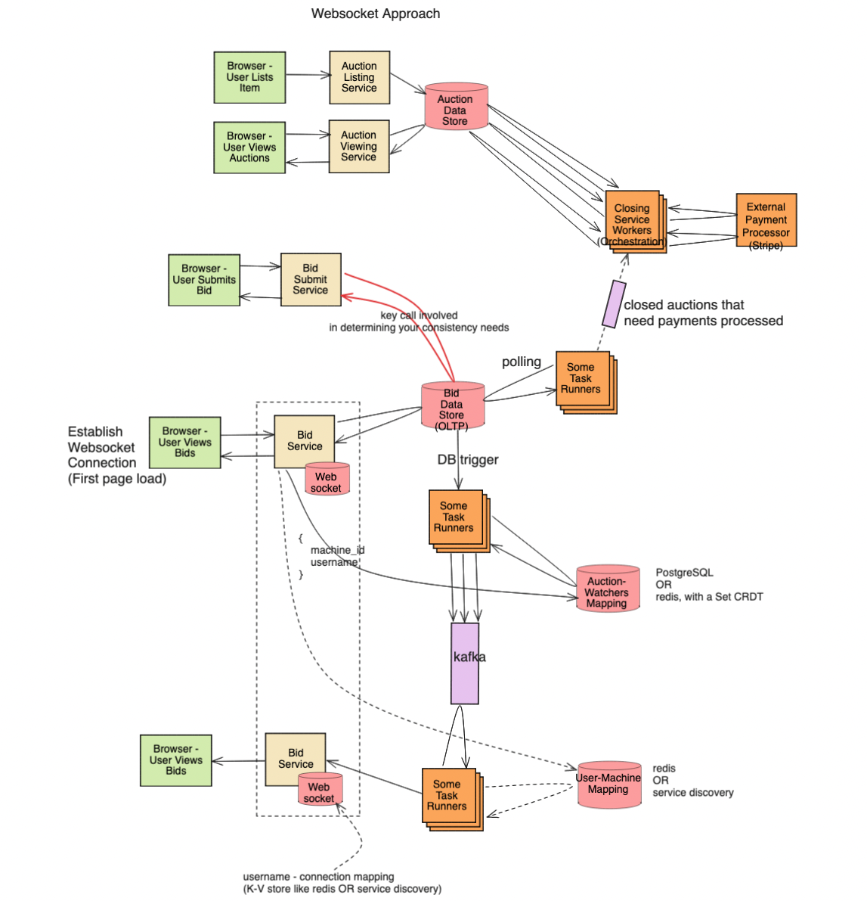
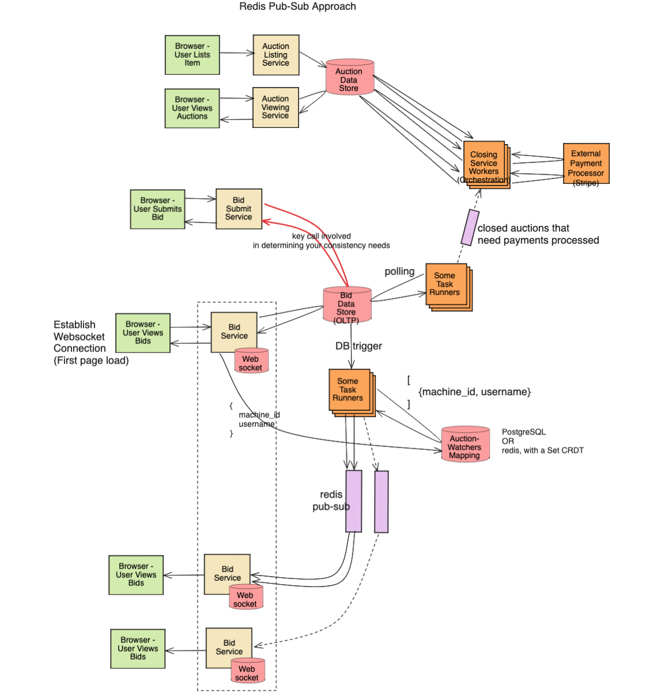

## Problem Statement
Design an auction/bidding system where users can post items for auction and bid on items. The system should handle a large volume of items and bids daily, determine auction winners, and manage payments.

## Clarification Questions to Interviewer 
1. Can users bid on multiple items simultaneously?
2. How is the winning bid determined after the 1-hour period?
3. What happens if a user fails to pay within the 10-minute window after winning?
4. Are there any penalties for not paying after winning an auction?
5. Can users retract their bids?
6. Should the system notify users about their bid status (e.g., outbid, won)?
7. How should the system handle fraudulent activities or invalid bids?
8. Are there any restrictions on the types of items that can be posted for auction?

## Requirements
### Functional Requirements
1. **Post Auction Item**: Users can post items for auction at any time.
2. **Bid on Item**: Users can bid on any existing item any number of times.
3. **Determine Winner**: A user wins an item if there are no higher bids in the next 1 hour.
4. **Payment Process**: The winning user must pay for the item within 10 minutes of winning.
5. **Bid Restrictions**: Users can only bid for 1 count of an item at a time.
6. **Notification System**: Users should be notified about their bid status (e.g., outbid, won).

### Non-Functional Requirements
1. **Scalability**: The system should handle 10M new auction items and 100M new bids daily.
2. **Availability**: The system should be highly available to allow users to bid and post items at any time.
3. **Latency**: The system should provide low-latency responses to user actions (posting, bidding).
4. **Consistency**: The system should ensure data consistency, particularly for bid amounts and winner determination.
5. **Durability**: Ensure data persistence for all bids and auction items.

## Back of Envelope Estimations/Capacity Estimation & Constraints
- **New auction items per day**: 10M
- **New bids per day**: 100M
- **Peak auctions/bids per second**:
  - Auctions: 10M / 86400 ≈ 116 items/second
  - Bids: 100M / 86400 ≈ 1157 bids/second
- **Storage**:
  - Average auction item size: 1KB
  - Average bid size: 200B
  - Daily storage for items: 10M * 1KB ≈ 10GB
  - Daily storage for bids: 100M * 200B ≈ 20GB
  - Total daily storage: 30GB

## High-level API Design
1. **Post Auction Item**
   ```http
   POST /auction
   Body: { "item_id": "string", "seller_id": "string", "item_details": "object", "starting_bid": "number", "auction_end_time": "timestamp" }
   ```
2. **Bid on Item**
   ```http
   POST /bid
   Body: { "bid_id": "string", "item_id": "string", "bidder_id": "string", "bid_amount": "number", "timestamp": "timestamp" }
   ```
3. **Get Auction Details**
   ```http
   GET /auction/{item_id}
   Response: { "item_id": "string", "seller_id": "string", "current_highest_bid": "number", "auction_end_time": "timestamp", "bids": ["object"] }
   ```
4. **Get User Bids**
   ```http
   GET /user/{user_id}/bids
   Response: { "user_id": "string", "bids": ["object"] }
   ```

## Data Model
### Auction Items Table
| Column            | Type        | Constraints                      |
|-------------------|-------------|----------------------------------|
| `item_id`         | `SERIAL`    | `PRIMARY KEY`                    |
| `seller_id`       | `INT`       | `NOT NULL`, `FOREIGN KEY (users.user_id)` |
| `item_details`    | `JSON`      | `NOT NULL`                       |
| `starting_bid`    | `NUMERIC`   | `NOT NULL`                       |
| `auction_end_time`| `TIMESTAMP` | `NOT NULL`                       |
| `created_at`      | `TIMESTAMP` | `DEFAULT CURRENT_TIMESTAMP`      |

### Bids Table
| Column            | Type        | Constraints                      |
|-------------------|-------------|----------------------------------|
| `bid_id`          | `SERIAL`    | `PRIMARY KEY`                    |
| `item_id`         | `INT`       | `NOT NULL`, `FOREIGN KEY (auction_items.item_id)` |
| `bidder_id`       | `INT`       | `NOT NULL`, `FOREIGN KEY (users.user_id)` |
| `bid_amount`      | `NUMERIC`   | `NOT NULL`                       |
| `timestamp`       | `TIMESTAMP` | `DEFAULT CURRENT_TIMESTAMP`      |

### Users Table
| Column            | Type        | Constraints                      |
|-------------------|-------------|----------------------------------|
| `user_id`         | `SERIAL`    | `PRIMARY KEY`                    |
| `username`        | `VARCHAR`   | `UNIQUE`, `NOT NULL`             |
| `email`           | `VARCHAR`   | `UNIQUE`, `NOT NULL`             |
| `password_hash`   | `VARCHAR`   | `NOT NULL`                       |
| `created_at`      | `TIMESTAMP` | `DEFAULT CURRENT_TIMESTAMP`      |
| `updated_at`      | `TIMESTAMP` | `DEFAULT CURRENT_TIMESTAMP`      |

## High-Level System Design
### Architecture Components
1. **API Gateway**: Handles all incoming requests from users.
2. **Auction Listing Service**: Manages auction items and bidding logic.
3. **Auction Viewing Service**: Retrieves auction item details for users to view.
4. **Bid Submit Service**: Processes bids and updates auction status.
5. **Payment Processor**: Handles payment processing for winning bids.
6. **Notification Service**: Sends notifications to users about bid status and winning notifications.
7. **Database**: Stores users, auction items, and bids.
8. **Cache**: Caches frequently accessed data such as current highest bids to reduce database load.





### Workflow
#### Posting an Auction Item
1. User submits a new auction item through the API Gateway.
2. Auction Listing Service validates and stores the item in the Auction Data Store.

#### Viewing Auction Items
1. User requests to view auction items through the API Gateway.
2. Auction Viewing Service retrieves auction item details from the Auction Data Store.

#### Bidding on an Item
1. User submits a bid through the API Gateway.
2. Bid Submit Service processes the bid, updates the current highest bid if applicable, and stores the bid in the Bid Data Store (OLTP).
3. Real-time bid updates are managed through Redis Pub-Sub and WebSocket connections.
4. If the highest bid is updated, the previous highest bidder is notified via WebSocket.

#### Real-Time Bid Updates
1. Browser establishes a WebSocket connection on the first page load.
2. Bid Service handles bid submissions and updates, triggering real-time notifications through Redis Pub-Sub.
3. Task Runners update the Auction-Watchers Mapping and notify all connected clients via WebSocket.

#### Determining the Winner and Payment Process
1. Scheduled task runners poll the Auction Data Store to identify closed auctions.
2. Closing Service Workers handle closed auctions, determining winners and initiating payment processing through the External Payment Processor (e.g., Stripe).
3. If the payment is not made within the 10-minute window, the item is offered to the next highest bidder.

### Scaling and Fault Tolerance
- **Scalability**:
  - Use sharding and partitioning in the database to handle the large volume of auction items and bids.
  - Employ horizontal scaling for the API Gateway, Auction Services, and Bid Services.
- **Fault Tolerance**:
  - Implement retries and dead-letter queues for processing failures in bid submission and payment processing.
  - Use replication and backups for the database to ensure data durability.

## Detailed Workflow Using Redis Pub-Sub for Real-Time Updates
### Posting an Auction Item
1. **User Action**: User lists an item for auction.
2. **Auction Listing Service**: Validates the item and stores it in the Auction Data Store.

### Viewing Auction Items
1. **User Action**: User views auction items.
2. **Auction Viewing Service**: Retrieves and displays auction items from the Auction Data Store.

### Bidding on an Item
1. **User Action**: User submits a bid.
2. **Bid Submit Service**: Processes the bid and updates the highest bid if applicable.
3. **Redis Pub-Sub and WebSocket**:
   - Bid Service triggers updates via Redis Pub-Sub.
   - WebSocket connections notify all users viewing the bid in real-time.

### Real-Time Bid Updates
1. **WebSocket Connection**: Established on the first page load.
2. **Bid Service**: Handles bid submissions and updates.
3. **Redis Pub-Sub**: Notifies all connected clients of bid updates.
4. **Task Runners**: Update the Auction-Watchers Mapping and trigger notifications.

### Determining the Winner and Payment Processing
1. **Task Runners**: Poll the Auction Data Store to identify closed auctions.
2. **Closing Service Workers**: Determine winners and initiate payment processing.
3. **External Payment Processor**: Manages payment transactions.
4. **Fallback**: If payment fails, the next highest bidder is notified.

## References
* [System Design: Instagram Auctions](https://medium.com/@pellinore.x/system-design-solution-intagram-auctions-4592395b7e1a)
* https://www.youtube.com/watch?v=m626ixog2d8

