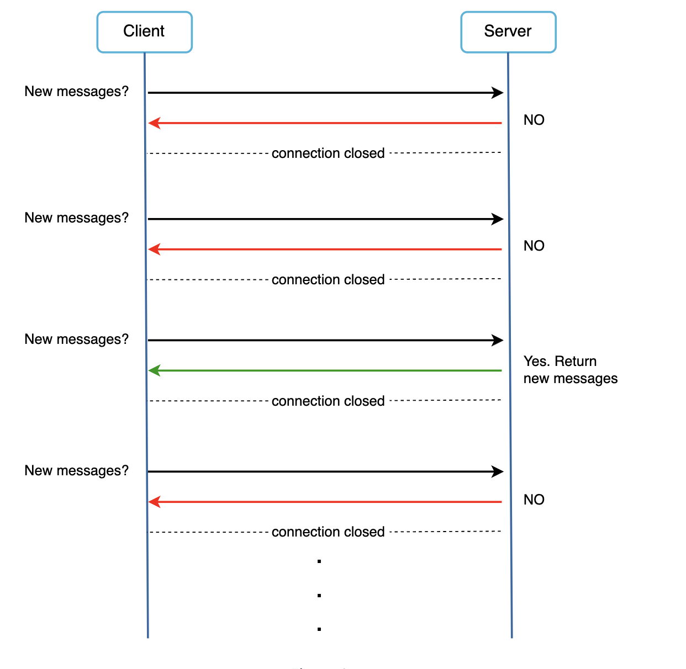
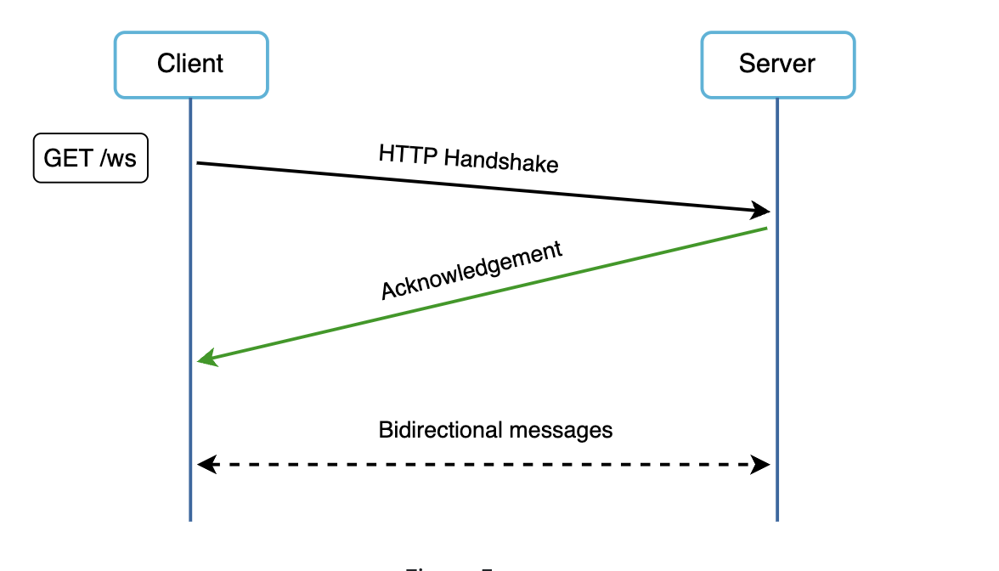
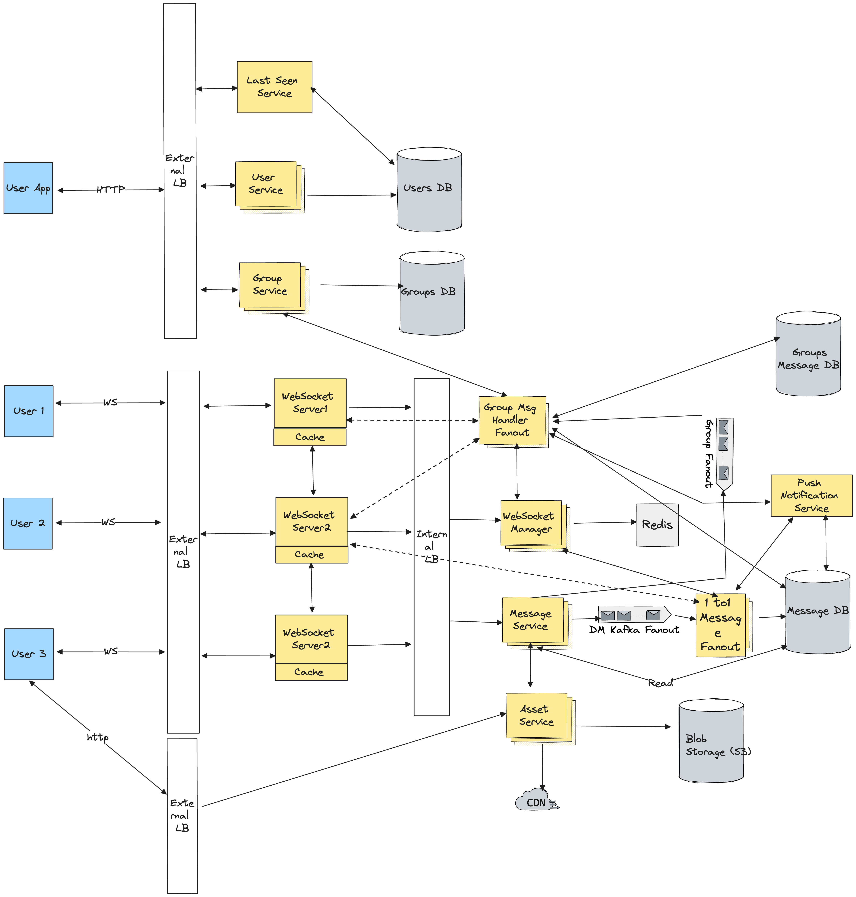

## Problem Statement
Design a whatsapp, facebook messenger etc.

## Requirements
### Functional Requirements
* One-on-one chat
* Group chat
* Read receipt: system should support message delivery acknowledgment, such as sent, delivered, and read.
* Online status
* Push notifications: system should be able to notify offline users of new messages once their status becomes online.
* Share multimedia: system should support sharing of media files, such as images, videos, and audio.
* Chat storage: system must support the persistent storage of chat messages when a user is offline until the successful delivery of messages.
* Multi device support

### Non-Functional Requirements
* **Low latency**: Users should be able to receive messages with low latency.
* **Consistency**: Messages should be delivered in the order they were sent. Also, users must see the same chat history on all of their devices.
* **Availability**: The system should be highly available. However, consistency is more important than availability.
* **Security**: The system must be secure via end-to-end encryption. We need to ensure that only the communicating parties can see the content of messages. Nobody in between, not even we as service owners, should have access.
* **Scalability**: The system should be highly scalable to support an increasing number of users and messages per day.

## Back of Envelope Estimations/Capacity Estimation & Constraints

## High-level API design 
* Send Message
```
sendMessage(message_ID, sender_ID, reciever_ID, type, text=none, media_object=none, document=none)
```
* Get message
```
getMessages(user_Id, limit, next_token)
```
* Upload media or document file
```
uploadFile(file_type, file)
```
* Download a document or media file
```
downloadFile(user_id, file_id)
```
## Database Design

### Users Table

| Column          | Type           | Constraints                 |
| --------------- | -------------- | --------------------------- |
| `user_id`       | `SERIAL`       | `PRIMARY KEY`               |
| `username`      | `VARCHAR(50)`  | `UNIQUE`, `NOT NULL`        |
| `email`         | `VARCHAR(100)` | `UNIQUE`, `NOT NULL`        |
| `password_hash` | `VARCHAR(255)` | `NOT NULL`                  |
| `firstname`     | `VARCHAR(50)`  | `NOT NULL`                  |
| `lastname`      | `VARCHAR(50)`  | `NOT NULL`                  |
| `phonenumber`   | `VARCHAR(15)`  | `UNIQUE`, `NOT NULL`        |
| `created_at`    | `TIMESTAMP`    | `DEFAULT CURRENT_TIMESTAMP` |
| `updated_at`    | `TIMESTAMP`    | `DEFAULT CURRENT_TIMESTAMP` |

### Messages Table

| Column        | Type        | Constraints                               |
| ------------- | ----------- | ----------------------------------------- |
| `message_id`  | `SERIAL`    | `PRIMARY KEY`                             |
| `sender_id`   | `INT`       | `NOT NULL`, `FOREIGN KEY (users.user_id)` |
| `receiver_id` | `INT`       | `NOT NULL`, `FOREIGN KEY (users.user_id)` |
| `content`     | `TEXT`      | `NOT NULL`                                |
| `created_at`  | `TIMESTAMP` | `DEFAULT CURRENT_TIMESTAMP`               |
| `updated_at`  | `TIMESTAMP` | `DEFAULT CURRENT_TIMESTAMP`               |
| `is_read`     | `BOOLEAN`   | `DEFAULT FALSE`                           |

### Groups Table

| Column       | Type           | Constraints                 |
| ------------ | -------------- | --------------------------- |
| `group_id`   | `SERIAL`       | `PRIMARY KEY`               |
| `group_name` | `VARCHAR(100)` | `NOT NULL`                  |
| `created_at` | `TIMESTAMP`    | `DEFAULT CURRENT_TIMESTAMP` |

### Group Members Table

| Column        | Type  | Constraints                                 |
| ------------- | ----- | ------------------------------------------- |
| `group_id`    | `INT` | `NOT NULL`, `FOREIGN KEY (groups.group_id)` |
| `user_id`     | `INT` | `NOT NULL`, `FOREIGN KEY (users.user_id)`   |
| `PRIMARY KEY` |       | `(group_id, user_id)`                       |

### Group Messages Table

| Column        | Type  | Constraints                                     |
| ------------- | ----- | ----------------------------------------------- |
| `group_id`    | `INT` | `NOT NULL`, `FOREIGN KEY (groups.group_id)`     |
| `message_id`  | `INT` | `NOT NULL`, `FOREIGN KEY (messages.message_id)` |
| `PRIMARY KEY` |       | `(group_id, message_id)`                        |

## High Level System Design and Algorithm

### Communication Protcols to Use
#### HTTP Polling
Client periodically asks the server if there are messages available
* **Pros**
    * Simple to implement
* **Cons**
    * Depending on polling frequency, polling could be costly.
    * Consume precious server resources and network bandwidth.


#### HTTP Long Polling
In long polling, a client holds the connection open until there are actually new messages available or a timeout threshold has been reached. Once the client receives new messages, it immediately sends another request to the server, restarting the process.
* **Pros**
  * Less frequency of TCP handshakes
* **Cons**
  * A server has no good way to tell if a client is disconnected
  * User does not chat much but still long polling makes periodic connections


#### [Recommended] WebSocket
It is a persistent abd bidirectional communication protocol that enables real-time communication between the client and server over a single, long-lived connection, providing the lowest latency. It is the most common solution for sending async updates from server to client. It starts its life as a HTTP connection and could be “upgraded” via some well-defined handshake to a WebSocket connection


### HLD


#### Three major Categories of components
* Stateless Services: These are traditional public-facing request/response HTTP Based services, used to manage the login, signup, user profile, groups information, asset delivery etc. They sit behind a load balancer whose job is to route requests to the correct services based on the request paths.
* Stateful Service: Chat service service is stateful because each client maintains a persistent network connection to a chat server. In this service, a client normally does not switch to another chat server as long as the server is still available
* Third-Party Integration: Used for push notifications to inform users when new messages arrived, even when the app is not running.

#### Send or Receive Direct Message 
1. **User A Initiates Message**:
   - User A communicates with its WebSocket server.
   - The server identifies the WebSocket of User B via the WebSocket manager.

2. **WebSocket Server Actions**:
   - If User B is online, WebSocket server communicates with User B's server through the manager.
   - Message is stored in Mnesia database for processing in FIFO order.

3. **Delivery to Receiver**:
   - Message is sent to User B's WebSocket server.
   - Upon delivery, messages are deleted from the database.

4. **Communication Establishment**:
   - WebSocket server establishes communication between User A and User B.

5. **Offline Message Handling**:
   - If User B is offline, messages are stored in Mnesia database.
   - Messages are delivered upon User B's online status or deleted after 30 days.

6. **WebSocket Manager Optimization**:
   - WebSocket servers cache recent conversation data.
   - Minimizes latency by avoiding excessive calls to WebSocket manager.
   - If users are on the same server, WebSocket manager calls are bypassed.

#### Support for Group Messages
1. **Sending a Message to a Group**:
   - User U1 wants to send a message to Group G1.
   - WebSocket Handler (WSH1) communicates with Message Service to store the message (M3) in Cassandra.
   - Message Service interacts with Kafka to save M3 with instructions for G1.

2. **Message Handling Process**:
   - Kafka interacts with Group Message Handler.
   - Group Message Handler listens to Kafka for group messages.
   - Group Message Handler communicates with Group Service to retrieve group members of G1.
   - Message is delivered to all group members individually through WebSocket Handlers.


####  Send or receive media files(Asset Delivery)
1. **Sending Process**:
   - User U3 uploads content (image, file, video) to a server and receives a unique content ID.
   - U3 sends the content ID to User U2.

2. **Compression and Encryption**:
   - Content is compressed and encrypted on the device before uploading.
   - Ensures secure transmission and reduces data size.

3. **Asset Service**:
   - Handles incoming content through a Load Balancer.
   - Stores content on S3 storage.
   - Depending on traffic, content may be loaded onto a CDN.

4. **Optimizations**:
   - Hashing: U3 sends a hash of the content to check for duplicates.
   - Multiple Hashes: Multiple hashing algorithms are used to reduce collision risk.
   - Content Upload: If the hash already exists, content is not re-uploaded; existing ID is sent to U2.

#### Message synchronization across multiple devices
- When User A logs in to the chat app with her phone, it establishes a WebSocket connection with `Chat server 1`. 
- Similarly, there is a connection between the laptop and `Chat server 1`.
- Each device maintains a variable called `cur_max_message_id`, which keeps track of the latest message ID on the device. 
- Messages that satisfy the following two conditions are considered as news messages:
    - The recipient ID is equal to the currently logged-in user ID.
    - Message ID in the key-value store is larger than cur_max_message_id.


### Strategies for Designing Unique and Sortable Message IDs

1. **Timestamp + Sequence Number**:
   - Combine a timestamp with a sequence number.
   - Generate a sequence number for each message within the same timestamp.
   - Example Format: `YYYYMMDDHHMMSS-SEQ`

2. **Millisecond Precision Timestamp**:
   - Use millisecond precision timestamp to reduce the likelihood of collisions.
   - Append a unique identifier to ensure uniqueness.
   - Example Format: `YYYYMMDDHHMMSSmmm-UUID`

3. **UUID with Timestamp Prefix**:
   - Prepend a timestamp prefix to a universally unique identifier (UUID).
   - Ensure uniqueness while maintaining sortability.
   - Example Format: `YYYYMMDDHHMMSS-UUID`

4. **Distributed Sequence Generator**:
   - Implement a distributed sequence generator to assign unique sequence numbers.
   - Combine with a timestamp for ordering.
   - Example Format: `SEQ-TIMESTAMP`

5. **Lexicographically Sortable IDs**:
   - Use lexicographically sortable IDs like Twitter Snowflake or Instagram ID.
   - Ensure both uniqueness and sortability.
   - Example Format: `SNOWFLAKE_ID`


## Open Questions
* Practice one : https://app.excalidraw.com/import?excalidraw=0hgldWbhbSBs,pqmR9hnrv2oeyJeoxH9Uqg
## References
* Alex Wu - Vol1 - [Chapter 12](https://bytebytego.com/courses/system-design-interview/design-a-chat-system)
* https://medium.com/@m.romaniiuk/system-design-chat-application-1d6fbf21b372
* https://leetcode.com/discuss/study-guide/2066150/chat-system-design-complete-guide
* https://www.geeksforgeeks.org/designing-whatsapp-messenger-system-design/
* https://www.educative.io/courses/grokking-modern-system-design-interview-for-engineers-managers/system-design-whatsapp
* https://www.youtube.com/watch?v=RjQjbJ2UJDg&t=1489s
* https://github.com/codekarle/system-design/blob/master/system-design-prep-material/architecture-diagrams/Whatsapp%20System%20design.png
* https://www.codekarle.com/system-design/Whatsapp-system-design.html