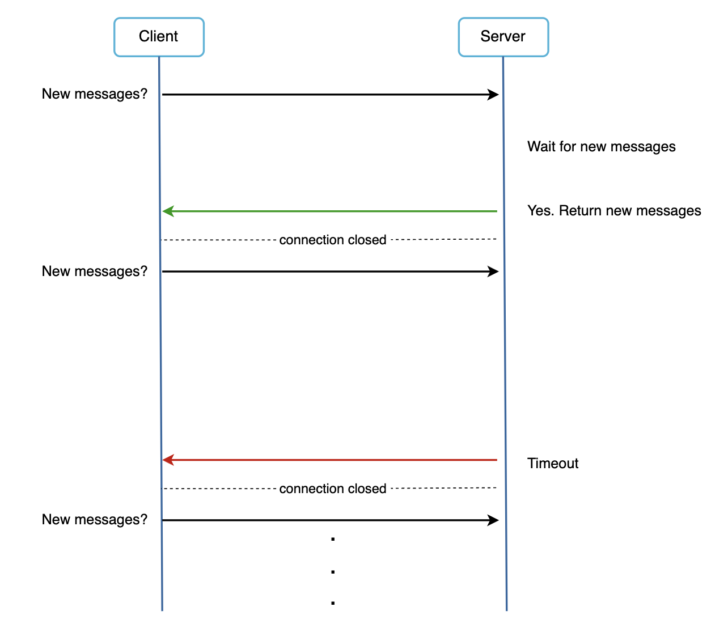
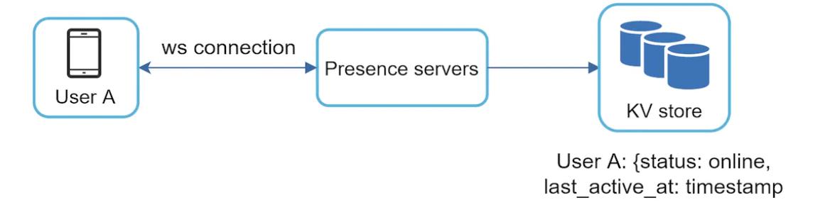
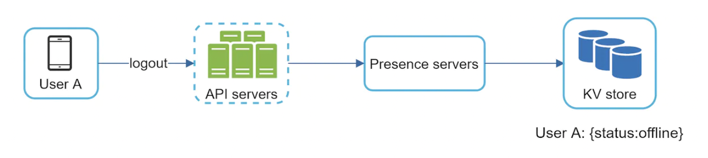
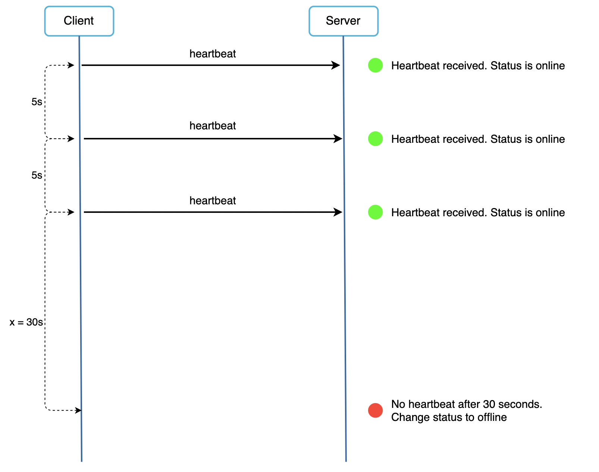

## Problem Statement
Design a messaging system like WhatsApp or Facebook Messenger.

## Clarification Questions to Interviewer
1. What are the primary use cases for the messaging system?
2. Are there any specific user limits or message volume requirements?
3. Should the system support message deletion or editing?
4. How long should message history be retained?
5. Are there any specific compliance or regulatory requirements to consider?

## Requirements
### Functional Requirements
* **One-on-one chat**: Enable direct messaging between two users.
* **Group chat**: Support messaging among multiple users in a group.
* **Read receipt**: Provide message delivery acknowledgment (sent, delivered, and read).
* **Online status**: Show users' online or offline status.
* **Push notifications**: Notify offline users of new messages once they come online.
* **Share multimedia**: Allow sharing of media files (images, videos, audio).
* **Chat storage**: Persist chat messages when a user is offline until the messages are successfully delivered.
* **Multi-device support**: Ensure users can access their messages on multiple devices.

#### Below the line (out of scope)
* Audio/Video calling
* Interactions with businesses
* Registration and profile management

### Non-Functional Requirements
* **Low latency**: Ensure users receive messages with minimal delay.
* **Consistency**: Guarantee that messages are delivered in the order they were sent and users see the same chat history on all devices.
* **Availability**: Maintain high availability of the system.
* **Security**: Implement end-to-end encryption to ensure that only communicating parties can see the content of messages.
* **Scalability**: Scale to support increasing numbers of users and messages per day.

#### Below the line (out of scope)
* Exhaustive treatment of security concerns
* Spam and scraping prevention systems

## Back of Envelope Estimations/Capacity Estimation & Constraints
* Assume 1 billion users.
* Each user sends and receives 50 messages per day.
* Daily message volume: 50 billion messages.
* Average message size: 1 KB.
* Daily data transfer: 50 TB.
* Peak load: 1 million messages per second.

## High-level API design 
### Send Message
This endpoint allows a user to send a message to another user or a group.

```http
POST /sendMessage
{
    "message_id": "string",
    "sender_id": "string",
    "receiver_id": "string",  // This can be a user ID for one-on-one chat or a group ID for group chat
    "type": "text" | "media" | "document",
    "content": {
        "text": "string",         // For text messages
        "media_url": "string",    // URL to the media file for media messages
        "document_url": "string"  // URL to the document for document messages
    }
}
```

### Get Messages
This endpoint allows a user to retrieve messages from a chat. It supports pagination for efficiently loading message history.

```http
GET /getMessages
{
    "user_id": "string",
    "chat_id": "string", // This can be a user ID for one-on-one chat or a group ID for group chat
    "limit": "int",      // Number of messages to retrieve
    "next_token": "string" // Token for pagination to retrieve the next set of messages
}
```

### Upload Media or Document File
This endpoint allows a user to upload media or document files to the server.

```http
POST /uploadFile
{
    "file_type": "image" | "video" | "audio" | "document",
    "file": "binary"  // The actual file to be uploaded
}
```

### Download Media or Document File
This endpoint allows a user to download media or document files from the server.

```http
GET /downloadFile
{
    "user_id": "string",
    "file_id": "string"  // The unique identifier for the file
}
```
## Data Model

### Users Table (Relational Database - PostgreSQL)
| Column          | Type           | Constraints                 |
| --------------- | -------------- | --------------------------- |
| `user_id`       | `SERIAL`       | `PRIMARY KEY`               |
| `username`      | `VARCHAR(50)`  | `UNIQUE`, `NOT NULL`        |
| `email`         | `VARCHAR(100)` | `UNIQUE`, `NOT NULL`        |
| `password_hash` | `VARCHAR(255)` | `NOT NULL`                  |
| `firstname`     | `VARCHAR(50)`  | `NOT NULL`                  |
| `lastname`      | `VARCHAR(50)`  | `NOT NULL`                  |
| `phonenumber`   | `VARCHAR(15)`  | `UNIQUE`, `NOT NULL`        |
| `created_at`    | `TIMESTAMP`    | `DEFAULT CURRENT_TIMESTAMP` |
| `updated_at`    | `TIMESTAMP`    | `DEFAULT CURRENT_TIMESTAMP` |

### Messages Table (NoSQL - Cassandra)
| Column        | Type        | Constraints                               |
| ------------- | ----------- | ----------------------------------------- |
| `message_id`  | `UUID`      | `PRIMARY KEY`                             |
| `sender_id`   | `INT`       | `NOT NULL`                                |
| `receiver_id` | `INT`       | `NOT NULL`                                |
| `content`     | `TEXT`      | `NOT NULL`                                |
| `created_at`  | `TIMESTAMP` | `DEFAULT CURRENT_TIMESTAMP`               |
| `updated_at`  | `TIMESTAMP` | `DEFAULT CURRENT_TIMESTAMP`               |
| `is_read`     | `BOOLEAN`   | `DEFAULT FALSE`                           |

### Groups Table (Relational Database - PostgreSQL)
| Column       | Type           | Constraints                 |
| ------------ | -------------- | --------------------------- |
| `group_id`   | `SERIAL`       | `PRIMARY KEY`               |
| `group_name` | `VARCHAR(100)` | `NOT NULL`                  |
| `created_at` | `TIMESTAMP`    | `DEFAULT CURRENT_TIMESTAMP` |

### Group Members Table (Relational Database - PostgreSQL)
| Column        | Type  | Constraints                                 |
| ------------- | ----- | ------------------------------------------- |
| `group_id`    | `INT` | `NOT NULL`, `FOREIGN KEY (groups.group_id)` |
| `user_id`     | `INT` | `NOT NULL`, `FOREIGN KEY (users.user_id)`   |
| `PRIMARY KEY` |       | `(group_id, user_id)`                       |

### Group Messages Table (NoSQL - Cassandra)
| Column        | Type  | Constraints                                     |
| ------------- | ----- | ----------------------------------------------- |
| `group_id`    | `UUID` | `NOT NULL`                                      |
| `message_id`  | `UUID` | `NOT NULL`                                      |
| `PRIMARY KEY` |       | `(group_id, message_id)`                        |

## S3 Stores for Assets
S3 will be used to store all media files and documents shared within the messaging system. 

### S3 Storage
| Attribute      | Description                                    |
| -------------- | ---------------------------------------------- |
| `file_id`      | Unique identifier for the file                 |
| `file_type`    | Type of the file (image, video, audio, document)|
| `file_path`    | S3 path to the stored file                     |
| `uploaded_at`  | Timestamp of when the file was uploaded        |

## Redis Store for Mapping
Redis will be used to manage the mapping of users to their respective WebSocket servers for real-time messaging.

### Redis Data Structures
#### User to Server Mapping
| Key                     | Value               | Description                                |
| ----------------------- | ------------------- | ------------------------------------------ |
| `user_id:<user_id>`     | `server_id`         | Maps a user to the WebSocket server they're connected to |

#### Online Status
| Key                     | Value               | Description                                |
| ----------------------- | ------------------- | ------------------------------------------ |
| `user_status:<user_id>` | `online/offline`    | Indicates the online status of a user      |

These Redis structures help efficiently manage user connections and their online status, ensuring that messages are routed to the correct server and users are notified of new messages as soon as they come online.

## High Level System Design and Algorithm


### Three Types of High Level Components
* Stateless Services: These are traditional public-facing request/response HTTP Based services, used to manage the login, signup, user profile, groups information, asset delivery etc. They sit behind a load balancer whose job is to route requests to the correct services based on the request paths.
* Stateful Service: Chat service service is stateful because each client maintains a persistent network connection to a chat server. In this service, a client normally does not switch to another chat server as long as the server is still available
* Third-Party Integration: Used for push notifications to inform users when new messages arrived, even when the app is not running.

## Deep Dive 
### Communication Protcols to Use
#### HTTP Polling
Client periodically asks the server if there are messages available
* **Pros**
    * Simple to implement
* **Cons**
    * Depending on polling frequency, polling could be costly.
    * Consume precious server resources and network bandwidth.


#### HTTP Long Polling
In long polling, a client holds the connection open until there are actually new messages available or a timeout threshold has been reached. Once the client receives new messages, it immediately sends another request to the server, restarting the process.
* **Pros**
  * Less frequency of TCP handshakes
* **Cons**
  * A server has no good way to tell if a client is disconnected
  * User does not chat much but still long polling makes periodic connections


#### [Recommended] WebSocket
It is a persistent abd bidirectional communication protocol that enables real-time communication between the client and server over a single, long-lived connection, providing the lowest latency. It is the most common solution for sending async updates from server to client. It starts its life as a HTTP connection and could be “upgraded” via some well-defined handshake to a WebSocket connection


### Send or Receive Direct Message(DM) 
1. **User A Sends a Message to User B**:
   - User A sends a message to User B through WebSocket Server 1.
   - The WebSocket Server 1 generates a unique message ID using the Twitter Snowflake approach to ensure unique and sortable IDs.

2. **Message Delivery for Online Users**:
   - **Check Online Status**: WebSocket Server 1 checks its cache to determine if User B is online.
   - **Query Zookeeper**: If necessary, WebSocket Server 1 queries Zookeeper to identify which WebSocket server User B is connected to.
   - **Direct Delivery**: If User B is online, the message is sent directly to User B via WebSocket Server 2.

3. **Message Delivery for Offline Users**:
   - **Store Message**: If User B is offline, the message is persisted in the Message DB.
   - **Trigger Push Notification**: The system triggers push notifications to inform User B of new messages.

4. **Broadcast to Kafka**:
   - **Publish Message**: The WebSocket Server 1 publishes the message to the Chat Kafka topic partitioned by `user_id`.
   - **Ensure Ordering**: This ensures message ordering and durability.

5. **Message Sync Service**:
   - **Consume Messages**: The Message Sync Service consumes messages from Kafka and processes them.
   - **Store Messages**: It stores messages in the Message DB.
   - **Handle Read Receipts**: Once User B receives the message, WebSocket Server 2 updates the read receipt status in the Message DB.
   - **Update Last Seen**: The Last Seen Service updates the online status in the Users DB.


### Handling Offline Users

1. **Message Storage**:
   - **Short-term Storage in Kafka**: Messages are stored in the user's Kafka topic for up to 24 hours.
   - **Long-term Storage in Database**: After 24 hours, the Message Sync Service moves messages to the Message DB.

2. **Push Notifications**:
   - The Message Sync Service triggers push notifications to inform offline users of new messages.

3. **Subscribing to Kafka Topics**:
   - **Subscribe to User ID Topic**: Each user subscribes to their user ID topic on Kafka to retrieve messages upon coming online. Persist older messages on a particular partition id for the user id if not broadcasted.
   - **Message Retrieval**: The Message Sync Service processes these messages and delivers them to the users.

### Support for Group Messages

1. **User U1 Sends a Message to Group G1**:
   - User U1 sends a message to Group G1 through WebSocket Server 1.
   - The WebSocket Server 1 generates a unique message ID using the Twitter Snowflake approach.

2. **Retrieve Group Members**:
   - **Query Group Service**: WebSocket Server 1 queries the Group Service to get the list of user IDs in Group G1.
   
3. **Message Delivery for Group Members**:
   - **Check Online Status**: WebSocket Server 1 checks if each group member is online.


   - **Direct Delivery**: For online members, WebSocket Server 1 sends the message directly to their respective WebSocket servers.
   - **Offline Members**: For offline members, the message is stored in Kafka for those user IDs and will be broadcast later.

4. **Broadcast to Kafka**:
   - **Publish Message**: The message is published to the Chat Kafka topic partitioned by `user_id` for all group members.
   
5. **Message Sync Service**:
   - **Consume Messages**: The Message Sync Service consumes messages from Kafka.
   - **Store Messages**: It stores messages in the Message DB.
   - **Broadcast to Group Members**: It retrieves group membership information and broadcasts messages to all group members through their respective WebSocket servers.


###  Send or receive media files(Asset Delivery)
1. **Sending Process**:
   - User U3 uploads content (image, file, video) to a server and receives a unique content ID.
   - U3 sends the content ID to User U2.

2. **Compression and Encryption**:
   - Content is compressed and encrypted on the device before uploading.
   - Ensures secure transmission and reduces data size.

3. **Asset Service**:
   - Handles incoming content through a Load Balancer.
   - Stores content on S3 storage.
   - Depending on traffic, content may be loaded onto a CDN.

4. **Optimizations**:
   - Hashing: U3 sends a hash of the content to check for duplicates.
   - Multiple Hashes: Multiple hashing algorithms are used to reduce collision risk.
   - Content Upload: If the hash already exists, content is not re-uploaded; existing ID is sent to U2.

### Message synchronization across multiple devices
- When User A logs in to the chat app with her phone, it establishes a WebSocket connection with `Chat server 1`. 
- Similarly, there is a connection between the laptop and `Chat server 1`.
- Each device maintains a variable called `cur_max_message_id`, which keeps track of the latest message ID on the device. 
- Messages that satisfy the following two conditions are considered as news messages:
    - The recipient ID is equal to the currently logged-in user ID.
    - Message ID in the key-value store is larger than cur_max_message_id.


### Strategies for Designing Unique and Sortable Message IDs

1. **Timestamp + Sequence Number**:
   - Combine a timestamp with a sequence number.
   - Generate a sequence number for each message within the same timestamp.
   - Example Format: `YYYYMMDDHHMMSS-SEQ`

2. **Millisecond Precision Timestamp**:
   - Use millisecond precision timestamp to reduce the likelihood of collisions.
   - Append a unique identifier to ensure uniqueness.
   - Example Format: `YYYYMMDDHHMMSSmmm-UUID`

3. **UUID with Timestamp Prefix**:
   - Prepend a timestamp prefix to a universally unique identifier (UUID).
   - Ensure uniqueness while maintaining sortability.
   - Example Format: `YYYYMMDDHHMMSS-UUID`

4. **Distributed Sequence Generator**:
   - Implement a distributed sequence generator to assign unique sequence numbers.
   - Combine with a timestamp for ordering.
   - Example Format: `SEQ-TIMESTAMP`

5. **Lexicographically Sortable IDs**:
   - Use lexicographically sortable IDs like Twitter Snowflake or Instagram ID.
   - Ensure both uniqueness and sortability.
   - Example Format: `SNOWFLAKE_ID`


### Online Presence
Presence servers manage the online/offline indication in chat applications.

Whenever the user logs in, their status is changed to "online":

Once the user send a logout message to the presence servers (and subsequently disconnects), their status is changed to "offline":
One caveat is handling user disconnection. A naive approach to handle that is to mark a user as "offline" when they disconnect from the presence server. This makes for a poor user experience as a user could frequently disconnect and reconnect to presence servers due to poor internet.

To mitigate this, we'll introduce a heartbeat mechanism - clients periodically send a heartbeat to the presence servers to indicate online status. If a heartbeat is not received within a given time frame, user is marked offline:

This is effective for small group chats. WeChat uses a similar approach and its user group is capped to 500 users.

If we need to support larger groups, a possible mitigation is to fetch presence status only when a user enters a group or refreshes the members list.

## Open Questions
* Practice one : https://app.excalidraw.com/import?excalidraw=0hgldWbhbSBs,pqmR9hnrv2oeyJeoxH9Uqg
## References
* Alex Wu - Vol1 - [Chapter 12](https://github.com/preslavmihaylov/booknotes/tree/master/system-design/system-design-interview/chapter13)
* https://medium.com/@ishwarya1011.hidkimath/system-design-design-a-chat-system-e0056fb093d1
* https://medium.com/@m.romaniiuk/system-design-chat-application-1d6fbf21b372
* https://www.educative.io/courses/grokking-modern-system-design-interview-for-engineers-managers/system-design-whatsapp
* https://www.youtube.com/watch?v=RjQjbJ2UJDg&t=1489s
* https://github.com/codekarle/system-design/blob/master/system-design-prep-material/architecture-diagrams/Whatsapp%20System%20design.png
* https://www.codekarle.com/system-design/Whatsapp-system-design.html