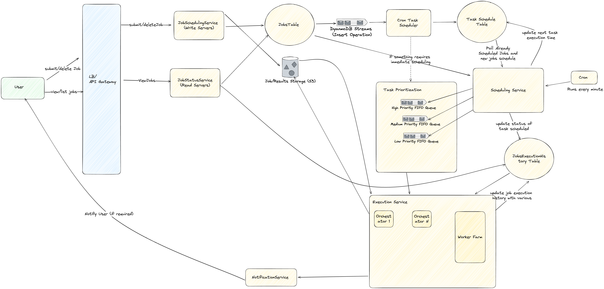

## Problem Statement
Design a job/task scheduler that runs jobs/task at a scheduled interval

## Clarification Questions to Interviewer 

## Requirements
### Functional Requirements
* **Submit tasks**: Allow users to submit tasks for execution.
* **Allocate resources**: Allocate required resources to each task.
* **Remove tasks**: Allow users to cancel submitted tasks.
* **Monitor task execution**: Monitor task execution and reschedule if tasks fail.
* **Release resources**: Release resources after task execution.
* **Show task status**: Display current task status to users.
* **Task priority**: Execute higher priority tasks before lower priority ones.

#### Below the line (out of scope)

### Non-Functional Requirements
* **Availability**:  Always available for users to add/view tasks.
* **Scalability**: Thousands or even millions of tasks can be scheduled and run per day
* **Durability**: Persist tasks to avoid loss.
* **Reliability**: Ensure tasks are executed on time and not dropped.
* **Idempotency** Jobs must not be executed multiple times (or such occurences should be kept to a minimum)
* **Bounded waiting time**: Avoid infinite waiting times for task execution.

#### Below the line (out of scope)

## Back of Envelope Estimations/Capacity Estimation & Constraints
* Assumptions
    * Total submitted jobs daily = 100 M 
* Traffic Estimates
## High-level API design 
* Write Operations
    * submitJob(api_key, job_schedule_time, job_type, priority, result_location)
    * deleteJob(job_id)
* Read Operations
    * viewJob(api_key, job_id)
    * listJobs(api_key, pagination_token)

## Data Model Design
### Job Table
| Attribute        | Type   |
|------------------|--------|
| job_id           | uuid   |
| user_id          | uuid   |
| job_name         | string |
| job_description  | string |
| creation_time    | date   |
| updated_time     | date   |
| is_recurring     | boolean|
| job_interval     | int    |
| job_priority     | string |
| uploads_s3_path  | string |

**Global Secondary Index (GSI):**
- **Index Name:** UserJobIndex
- **Partition Key:** user_id

### Task Schedule Table
| Attribute            | Type   |
|----------------------|--------|
| next_execution_time  | date   |
| job_id               | uuid   |
| task_id              | uuid   |
| schedule_status      | string |
| result_location      | string |
| max_retries          | int    |
| creation_time        | date   |
| updated_time         | date   |
| task_priority        | string |
| uploads_s3_path      | string |

**Possible Values for `schedule_status`:**
- `scheduled`
- `pending`
- `running`
- `completed`
- `errored`

**Global Secondary Index (GSI):**
- **Index Name:** JobIdIndex
- **Partition Key:** job_id

### Task Execution History Table
| Attribute        | Type   |
|------------------|--------|
| job_id           | uuid   |
| schedule_time    | date   |
| task_id          | uuid   |
| task_status      | string |
| result_location  | string |
| execution_status | string |
| max_retries      | int    |
| retry_count      | int    |
| results_s3_path  | string |
| creation_time    | date   |
| updated_time     | date   |

- **task_status:** Represents the overall status of the task in the system. This could include states such as "pending," "scheduled," "in_progress," "completed," "errored", or "cancelled." It indicates the current lifecycle stage of the task.
  
- **execution_status:** Represents the status of the task during its execution phase. This could include states such as "not_started," "claimed", "running," "success," "failure," or "retrying." It specifically tracks the progress and outcome of the task while it is being executed.

**Global Secondary Index (GSI):**
- **Index Name:** TaskIdIndex
- **Partition Key:** task_id

## High Level System Design

### Workflow Steps
1. **User Interaction:**
   - **Submit Job / Delete Job:** Users can submit or delete tasks using the `submitJob` and `deleteJob` endpoints through the API Gateway.
   - **View/List Jobs:** Users can view or list the status of their tasks using the `viewJob` and `listJobs` endpoints.

2. **API Gateway:**
   - The API Gateway serves as the entry point for all API requests. It forwards these requests to the appropriate service:
     - `submit/deleteJob` requests are forwarded to the **JobSchedulingService**.
     - `view/listJobs` requests are forwarded to the **JobStatusService**.

3. **JobSchedulingService (Write Servers):**
   - **Submit Job:** Handles job submissions. When a job is submitted, it writes job details to the **JobsTable**.
   - **Delete Job:** Handles job deletions by removing the specified job from the **JobsTable**.

4. **JobsTable (DynamoDB):**
   - Stores all job details, including job metadata, execution times, statuses, and priorities.
   - Triggers **DynamoDB Streams** upon job insertion to notify the **Cron Task Scheduler**.

5. **DynamoDB Streams:**
   - Captures data modification insert events in the **JobsTable** and forwards them to the **Cron Task Scheduler**.

6. **Cron Task Scheduler:**
   - Processes new job entries from the DynamoDB Streams.
   - Schedules jobs by updating the **Task Schedule Table** with the job details and execution times.
   - If immediate scheduling is required, it can directly add the task to the **Task Prioritization** queues.

7. **Task Schedule Table:**
   - Maintains the schedule of tasks to be executed.
   - The **Scheduling Service** polls this table to get the list of tasks to be executed.

8. **Scheduling Service:**
   - Polls the **Task Schedule Table** for scheduled jobs and updates the next task execution time.
   - Allocates tasks to the appropriate priority queue (High, Medium, Low) based on their priority.
   - Updates the **JobsExecutionHistory Table** with task execution status as scheduled 
   - Runs every minute to check for and schedule new tasks.

9. **Task Prioritization:**
   - Queues tasks based on their priority using FIFO (First-In-First-Out) queues for High, Medium, and Low priorities.
   - Ensures that higher-priority tasks are executed before lower-priority tasks.

10. **Execution Service:**
    - **Orchestrators:** Manage the execution of tasks. Each orchestrator pulls tasks from the priority queues and executes them using the **Worker Farm**.
    - **Worker Farm:** Executes the actual tasks and updates the job execution history.

11. **JobsExecutionHistory Table:**
    - Stores the execution history of all tasks, including statuses, retries, and completion times.

12. **Job/Results Storage (S3):**
    - Stores job results and any intermediate data required by the jobs.

13. **JobStatusService (Read Servers):**
    - Handles requests to view job statuses. It queries the **JobsTable** and **Job/Results Storage** to provide the current status and results of the jobs.

14. **NotificationService:**
    - Notifies users upon task completion or failure if required.

## Deep Dive
### Scheduling Service 
The Scheduling Service is crucial for managing the execution of tasks and ensuring they run at the scheduled intervals. Here’s a detailed look at its components and processes:

#### How Scheduling Works for Recurring Jobs
1. **Recurring Job Identification:** Jobs marked as recurring are identified based on the `is_recurring` attribute in the Job Table.
2. **Next Execution Time Calculation:** The next execution time is calculated based on the `job_interval` attribute.
3. **Task Scheduling:** The recurring job's next execution is scheduled in the **Task Schedule Table** with the new `next_execution_time`.
4. **Polling:** The Scheduling Service polls the **Task Schedule Table** periodically (e.g., every minute) to check for tasks that need to be executed.
5. **Re-scheduling:** Once a recurring job is executed, the Scheduling Service calculates the next execution time and updates the **Task Schedule Table**.

#### Ensuring Unique Scheduling
1. **Task De-duplication:** Before scheduling a task, the service checks if the task is already scheduled by querying the **Task Schedule Table** for existing entries with the same `job_id` and `task_id`.
2. **Atomic Operations:** Use atomic operations to insert tasks into the **Task Schedule Table**. If a task is already present, the insert operation will fail, ensuring no duplicate scheduling.
3. **Idempotency Tokens:** Each task submission includes an idempotency token, ensuring that repeated submissions of the same task do not result in multiple schedules.

#### Scalability
1. **Horizontal Scaling:** The Scheduling Service scales horizontally by adding more instances to handle increased load. Each instance can handle a portion of the task scheduling workload.
1. **Shard Keying:** To handle burst traffic efficiently, tasks can be partitioned based on a shard key (e.g., job_id or user_id), allowing different scheduling service instances to process tasks independently. Scheduling sevrice can follow leader/follower strategry where leader divides the list of tasks to mutiple followers work on the basis of shard key it could be user_id or batch it randomly
1. **Rate Limiting:** Implementing rate limiting helps manage burst traffic by controlling the rate at which tasks are scheduled, preventing system overload.

#### Handling Overlapping Tasks
1. **Task Dependencies:** When a new task for the same job arrives before the previous task is completed, the system can handle dependencies by chaining tasks or delaying the new task until the previous one completes.
2. **Task Status Check:** Before scheduling a new task, the service checks the status of the previous task. If it is still in progress, the new task is queued but not scheduled until the previous task is complete.

### Job Prioritization
1. **Priority Queues:** Tasks are assigned to one of three priority queues based on their `task_priority`:
   - **High Priority Queue**
   - **Medium Priority Queue**
   - **Low Priority Queue**
2. **Queue Management:** The queues are managed using FIFO (First-In-First-Out) order within each priority level.
3. **Execution Order:** The Execution Service always selects tasks from the highest priority queue first. If the high priority queue is empty, it moves to the medium priority queue, and then to the low priority queue.
4. **Weighted Round Robin:** To balance between different priorities, a weighted round-robin approach can be used. Each priority level is assigned a weight (e.g., High: 5, Medium: 3, Low: 1). The Execution Service selects tasks in proportion to these weights, ensuring that higher priority tasks get more execution slots, but lower priority tasks are not completely starved.
5. **Handling Priority Inversion:** The system ensures that low-priority tasks do not block high-priority tasks by implementing timeout mechanisms or aging policies, ensuring higher priority tasks get executed first.

#### Priority Inversion Example
1. **Scenario:** A low-priority task (Task A) is running, and a high-priority task (Task B) arrives.
2. **Inversion Handling:** The system preempts Task A, pausing its execution, and starts executing Task B immediately.
3. **Timeout Mechanisms:** If Task B is delayed or takes longer than expected, Task A is resumed after a timeout period, ensuring it is not starved indefinitely.
4. **Aging Policies:** Low-priority tasks that wait too long in the queue can be promoted in priority to ensure they eventually get executed.

#### Weighted Round Robin Example
1. **Scenario:** The system uses weights to determine the order of task execution from different priority queues.
2. **Weights Assignment:** Assign weights (e.g., High: 5, Medium: 3, Low: 1).
3. **Selection Process:** The Execution Service cycles through the queues based on their weights. For example, it might pick 5 tasks from the High Priority Queue, 3 from the Medium Priority Queue, and 1 from the Low Priority Queue in each round.
4. **Balancing Load:** This method ensures that while higher priority tasks are favored, lower priority tasks still get execution opportunities, preventing starvation.

### Job Execution Service 
The Job Execution Service handles the actual execution of tasks, ensuring isolation and reliability.
#### Running Job Once
1. **Unique Execution:** Each job should be executed exactly once at the scheduled time.
2. **Idempotency:** To ensure tasks are not executed multiple times, the Execution Service should be idempotent, meaning repeated execution attempts should not alter the result.
3. **Execution Locks:** When a task is picked for execution, a lock or flag can be set to indicate that the task is in progress, preventing other orchestrators from picking the same task.
4. **Execution Confirmation:** Once the task is executed, the execution status is updated to `success` or `failure` in the **Task Execution History Table**.

#### Idempotency Maintenance
1. **Idempotency Keys:** Use idempotency keys to track and ensure that repeated execution requests for the same task do not result in multiple executions.
2. **State Checks:** Before executing a task, the service checks the current state in the **Task Execution History Table**. If the task is already marked as completed, the execution is skipped.
3. **Atomic State Updates:** State updates (e.g., marking a task as running or completed) are performed using atomic operations to ensure consistency.

#### Isolation in Execution Service
1. **Task Isolation:** Execute each task in isolation.
2. **Resource Allocation:** Allocate necessary resources per task.
3. **Fault Isolation:** Failed tasks do not impact others.
4. **Concurrency Control:** Prevent simultaneous execution of multiple instances of the same task.
5. **Execution Logs:** Maintain detailed logs for tracking progress and debugging.

#### Retrying Failed Tasks
1. **Failure Detection:** Update `execution_status` to `failure` in the **Task Execution History Table**.
2. **Retry Logic:** Check `current_retries` against `max_retries`.
3. **Re-queue Task:** Increment `current_retries` and re-add the task to the priority queue if retries are remaining.
4. **Final Failure:** Update task status to `errored` if `max_retries` is reached and notify the user if necessary.

## References
* https://medium.com/@mayilb77/design-a-distributed-job-scheduler-for-millions-of-tasks-in-daily-operations-4132dc6d645f
* https://www.educative.io/courses/grokking-modern-system-design-interview-for-engineers-managers/design-of-a-distributed-task-scheduler
* https://www.linkedin.com/pulse/system-design-distributed-job-scheduler-keep-simple-stupid-ismail/
* https://towardsdatascience.com/ace-the-system-design-interview-job-scheduling-system-b25693817950