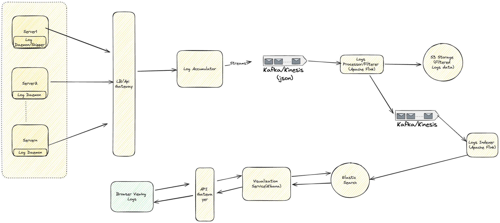

Certainly! Below is a structured system design for a distributed logging service using the provided template.

## Problem Statement

Design a distributed logging service that can handle a high volume of log data from multiple services, ensure low-latency access to logs, support various levels of log granularity (e.g., DEBUG, INFO, ERROR), and provide features like log querying, filtering, and alerting.

## Clarification Questions to Interviewer

1. **Log Volume**: What is the expected log ingestion rate (e.g., logs per second)?
2. **Log Retention**: How long should logs be retained in the system?
3. **Log Querying**: What types of queries do we need to support (e.g., full-text search, time-based queries, filtering by log levels)?
4. **Alerting**: What types of alerting mechanisms are needed? Are real-time alerts required?
5. **Security**: Are there any specific security or compliance requirements for log data storage and access?
6. **Scalability**: What is the expected growth rate of log data, and should the system scale automatically?
7. **Integrations**: Should the system support integrations with other monitoring tools or third-party services?
8. **Redundancy and Failover**: What level of redundancy and fault tolerance is expected?

## Requirements

### Functional Requirements
1. **Writing Logs**: Services within the distributed system must be able to write logs into the logging system seamlessly.
2. **Searchable Logs**: The system should support efficient and fast search capabilities, enabling users to find specific logs and trace application flows end-to-end.
3. **Storing Logs**: Logs should be stored in a distributed, fault-tolerant storage system for easy access and durability.
4. **Centralized Logging Visualizer**: The system should provide a unified view of logs from globally distributed services, enabling easy visualization and analysis.
5. **Alerting**: Implement alerting based on specific log patterns or thresholds.

#### Below the line (out of scope)
1. **Third-Party Integrations**: Any specific third-party tools or services integrations.
2. **Complex Analytics**: Advanced analytics like machine learning on logs.

### Non-Functional Requirements
1. **Low Latency**: The system must ensure low-latency log ingestion and retrieval, as logging is I/O-intensive and should not be on the application's critical path.
2. **Scalability**: The logging system should scale horizontally to handle increasing log volumes and a growing number of concurrent users.
3. **Availability**: The logging system should be highly available to ensure that logs are reliably captured and accessible even in the event of server failures.
4. **Durability**: Ensure logs are not lost, with data replication across multiple nodes to safeguard against failures.
5. **Security**: Implement access controls and encryption to protect log data from unauthorized access.
6. **Compliance**: Adhere to relevant data protection and compliance standards (e.g., GDPR, HIPAA).

#### Below the line (out of scope)
1. **User Interface**: A detailed UI/UX design for log visualization.
2. **Mobile Access**: Optimizing the service for mobile access or app development.

## Back of Envelope Estimations/Capacity Estimation & Constraints
1. **Log Ingestion Rate**: Assuming an ingestion rate of 1 million logs per second.
2. **Log Size**: Assuming the average log size is 1 KB.
3. **Storage Requirements**: 
   - Daily: \(1,000,000 \times 1 \times 60 \times 60 \times 24 = 86.4 \text{ GB per day}\).
   - Monthly: \(86.4 \times 30 = 2.6 \text{ TB per month}\).
4. **Retention Period**: If logs are retained for 6 months, total storage required would be \(2.6 \times 6 = 15.6 \text{ TB}\).
5. **Query Latency**: Targeting query latency under 100ms for common queries.
6. **Replication Factor**: Assuming a replication factor of 3 for fault tolerance, total storage needed would be \(15.6 \times 3 = 46.8 \text{ TB}\).

## High-level API Design

1. **Log Ingestion API**
   - **POST /logs**
   - Payload: `{ "timestamp": "ISO8601", "level": "INFO|DEBUG|ERROR", "service": "string", "message": "string", "metadata": {...} }`
   - Response: `{ "status": "success", "log_id": "uuid" }`

2. **Log Query API**
   - **GET /logs**
   - Query Parameters: `level`, `service`, `start_time`, `end_time`, `keywords`
   - Response: `[{ "timestamp": "ISO8601", "level": "INFO", "service": "string", "message": "string", "metadata": {...} }]`

3. **Log Aggregation API**
   - **GET /logs/aggregate**
   - Query Parameters: `service`, `start_time`, `end_time`, `group_by`
   - Response: `{ "service": "string", "count": "integer", "level": { "INFO": "integer", "ERROR": "integer" } }`

## Data Model

1. **Logs Table**
   - `log_id` (UUID, Primary Key)
   - `timestamp` (Datetime)
   - `level` (Enum: INFO, DEBUG, ERROR)
   - `service` (String)
   - `message` (Text)
   - `metadata` (JSONB)

2. **Alerts Table**
   - `alert_id` (UUID, Primary Key)
   - `service` (String)
   - `condition` (String)
   - `threshold` (Integer)
   - `action` (Enum: Email, SMS)

## High-Level System Design

### Components:
1. **Log Daemon/Shipper**: Resides on each server and is responsible for collecting log data and sending it to the central logging infrastructure. This component can either push logs to the central system or be configured to have logs pulled from it.
2. **Load Balancer/API Gateway**: Receives incoming logs from the Log Daemon/Shipper and distributes them across multiple instances of the Log Accumulator.
3. **Log Accumulator**: Buffers incoming logs and sends them to the message broker (Kafka/Kinesis) for further processing.
4. **Message Broker (Kafka/Kinesis)**: Acts as a buffer and ensures that log data is not lost during transit. It also helps in partitioning log data for scalability.
5. **Logs Processor/Filterer**: Processes logs, applying filters and transformations, and sends processed logs to both long-term storage (e.g., S3) and the indexing service.
6. **Logs Indexer**: Uses Apache Flink for real-time processing and indexing of logs for efficient search and retrieval.
7. **ElasticSearch**: Stores indexed logs and provides a powerful search capability.
8. **Visualization Service**: Provides a centralized interface for visualizing logs across all services. It interacts with ElasticSearch to retrieve and display logs.
9. **Browser Viewing Logs**: End-users or administrators can view and analyze logs via the visualization service.

### Architecture Overview:
- **Servers**: Each server has a **Log Daemon/Shipper** that collects logs and sends them to the **Load Balancer/API Gateway**.
- **Load Balancer/API Gateway**: Distributes incoming log data to the **Log Accumulator**.
- **Log Accumulator**: Buffers logs and streams them into a **Message Broker** such as Kafka or Kinesis.
- **Message Broker**: Provides durability and scalability by buffering logs and distributing them to multiple consumers.
- **Logs Processor/Filterer**: Applies any necessary transformations or filtering to the logs before storing them or indexing them.
- **S3 Storage**: Stores filtered log data for long-term archival.
- **Logs Indexer**: Uses Apache Flink to process and index logs in real-time, enabling fast search and retrieval in **ElasticSearch**.
- **ElasticSearch**: Stores and allows efficient searching of logs.
- **Visualization Service**: Provides a UI for viewing logs stored in ElasticSearch.
- **Browser**: Used by administrators or users to access the **Visualization Service**.

## Deep Dive

### Push vs. Pull Approach for Log Daemon

**Push Approach**:
- **Pros**: Low latency, simpler implementation, immediate error handling.
- **Cons**: Increased network load, potential for overload during peak times, higher resource consumption.

**Pull Approach**:
- **Pros**: Controlled network usage, less immediate resource demand, more resilient to spikes.
- **Cons**: Increased latency, scheduling complexity, delayed issue detection.

**Conclusion**: Push is generally preferred for real-time systems due to lower latency, while pull is useful for controlling network usage and resource consumption.

### Log Collection/Shipper Methods

- **Agent-Based Collection**: Agents like Fluentd, Logstash, or custom daemons run on servers to collect logs and forward them to the logging system.
- **Sidecar Containers**: In containerized environments, sidecars capture logs from the main application container and send them to the logging service.
- **Centralized Logging via Syslog**: Logs are sent to a central syslog server, which then forwards them to the logging infrastructure.

### Why Message Broker is Used

- **Durability**: Kafka/Kinesis buffers logs, ensuring no data is lost during transit.
- **Scalability**: Allows parallel processing by distributing logs across multiple partitions and consumers.
- **Decoupling**: Separates log ingestion from processing, enabling independent scaling and fault tolerance.

### Partitioning Strategy in Kafka

- **Partitioning by Key**: Commonly done by service name or log level to maintain order within a service and balance load.
- **Benefits**: Ensures parallel processing, load balancing, and scalability by distributing logs across multiple brokers and consumers.

### Logs Processor/Filterer

**Technology Used**: Apache Flink or Apache Storm

**Functions**:
- **Filtering**: Removes unnecessary logs, focusing on critical logs based on pre-defined rules (e.g., log level or service).
- **Transformation**: Standardizes logs into a consistent format, adding metadata if needed.
- **Routing**: Directs different logs to appropriate storage or processing pipelines.

**Benefits**: Reduces storage and processing costs, improves data quality, and ensures relevant logs are indexed.

### Apache Flink for Log Indexing and Aggregation

- **Real-Time Processing**: Flink processes logs as they arrive, enabling immediate indexing and insights.
- **Aggregation**: Performs windowed and keyed aggregations (e.g., error rates or request counts). Supports Complex Event Processing (CEP) for detecting patterns in logs.
- **Integration**: Works seamlessly with Kafka for log streams and Elasticsearch for indexing.

### Logs Visualizer

**Role**:
- **Centralized View**: Provides a unified interface for visualizing and analyzing logs from multiple services and regions.
- **Search and Filter**: Users can search and filter logs based on time range, log level, service, and other criteria.
- **Dashboards**: Supports customizable dashboards to monitor system health, error rates, and other key metrics in real-time.

**Technology**:
- **Kibana**: Often used alongside Elasticsearch to provide a powerful and flexible UI for log visualization.
- **Grafana**: Can be used for building dashboards that combine log data with metrics from other monitoring tools.

## References
* https://www.educative.io/courses/grokking-modern-system-design-interview-for-engineers-managers/design-of-a-distributed-logging-service
* https://www.youtube.com/watch?v=QV4O9u1N_XU
* https://www.youtube.com/watch?v=p_q-n09B8KA
* https://levelup.gitconnected.com/designing-a-distributed-logging-system-16521922546a
* https://www.learnsteps.com/logging-infrastructure-system-design/