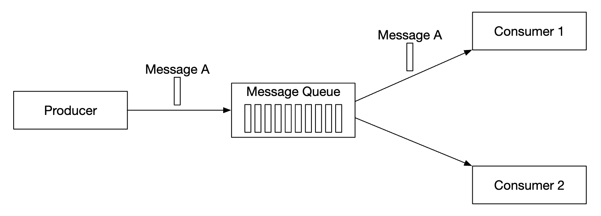
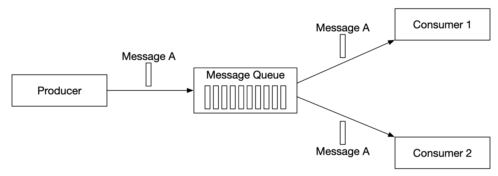
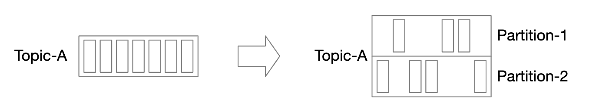
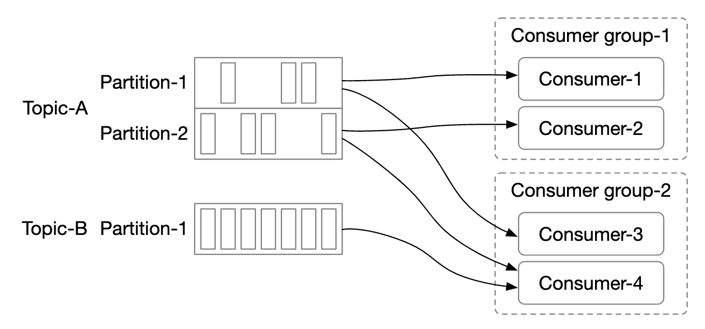

## Problem Statement
Design a distributed messaging system that allows users to send, receive, and store messages reliably and efficiently across multiple nodes in a distributed environment, implementing our own mechanism similar to Kafka or RabbitMQ.
Some popular message queue implementations - Kafka, RabbitMQ, RocketMQ, Apache Pulsar, ActiveMQ, ZeroMQ.

## Requirements
### Functional Requirements
 * Producers send messages to a message queue
 * Consumers consume messages from the queue
 * Messages can be consumed once or repeatedly
 * Historical data can be truncated
 * Message size is in the KB range
 * Order of messages needs to be preserved
 * Data delivery semantics is configurable - at-most-once/at-least-once/exactly-once.
### Non-Functional Requirements
 * High throughput or low latency. Configurable based on use-case
 * Scalable - system should be distributed and support a sudden surge in message volume
 * Persistent and durable - data should be persisted on disk and replicated among nodes

## Back of Envelope Estimations/Capacity Estimation & Constraints
1. **User Base**: Assume 10 million active users.
2. **Message Rate**: Assume each user sends 100 messages per day.
3. **Total Messages**: 10 million users * 100 messages = 1 billion messages per day.
4. **Throughput**: 1 billion messages/day ≈ 11,574 messages/second.
5. **Message Size**: Assume average message size is 1 KB.
6. **Storage Requirement**: 1 billion messages/day * 1 KB = 1 TB/day.
7. **Latency Requirement**: Target end-to-end latency < 100 ms.

## High-level API design 
```plaintext
POST /send
Request:
{
  "from_user": "user_id",
  "to_user": "user_id",
  "message": "text"
}
Response:
{
  "status": "success",
  "message_id": "unique_message_id"
}

GET /receive
Request:
{
  "user_id": "user_id",
  "last_message_id": "unique_message_id" (optional)
}
Response:
{
  "messages": [
    {
      "message_id": "unique_message_id",
      "from_user": "user_id",
      "to_user": "user_id",
      "message": "text",
      "timestamp": "ISO8601"
    },
    ...
  ]
}
```

## Database Design

## High Level System Design

### Types of Messaging models
1. **Point-to-Point (P2P)**
    * A message is sent to a queue and it's consumed by exactly one consumer.
    * There can be multiple consumers, but a message is consumed only once.
    * Once message is acknowledged as consumed, it is removed from the queue.
    * There is no data retention in the point-to-point model, but there is such in our design.
    * Typically implemented using queues.
    
2. **Publish-Subscribe (Pub/Sub)**
    * In this model, messages are associated to a topic.
    * Consumers are subscribed to a topic and they receive all messages sent to this topic.
    * Each message can be consumed by multiple consumers/subscribers
    * Typically implemented using topics.
     

### Key Termonolgies
1. **Topics**
    * Categories or feeds to which messages are sent by producers.
    * Each topic operates like a queue using FIFO for message processing. 
    * Message order is preserved within a partition.
1. **Partitions**: 
    * A topic is divided into partitions, which allow for parallel processing.
    * Each message produced is sent to a specific partition. A partition key specifies which partition a message should land in. Eg a ``user_id`` can be used as a partition key to guarantee order of messages for the same user.
    
1. **Offset**
    * A unique identifier for each message within a partition, representing the position of the message in the log.
1. **Brokers**:
    * Servers that store data and host partitions and serve clients.

1. **Consumers**:
    * Clients that read messages from topics.
    * Each consumer subscribes to one or more partitions. When there are multiple consumers for the same messages, they form a consumer group.
1. **Consumer Groups**
    * A group of consumers that divide the work of reading and processing messages.
    * Messages are replicated per consumer group (not per consumer).
    * Each consumer group maintains its own offset.
    * Reading messages in parallel by a consumer group improves throughput but hampers the ordering guarantee.
    * This can be mitigated by only allowing one consumer from a group to be subscribed to a partition. 
    * This means that we can't have more consumers in a group than there are partitions.
    

### High-level architecture
 
1. **Producers and Consumers**: Clients are producer and consumer. Producer pushes messages to a designated topic. Consumer group subscribes to messages from a topic.
1. **Brokers**: Manage partitions, store messages, and handle requests from producers and consumers. Brokers replicate data to ensure durability and fault tolerance.
1. **Data Storage**: Messages are stored in partitions on disk. Replication is used to ensure data durability and availability.
1. **State Storage**: Stores consumer offsets/states, using a system like ZooKeeper or a distributed key-value store.
1. **Metadata Storage**: Holds information about topics, partitions, consumer groups, and configuration settings.
1. **Coordination Service**: Uses ZooKeeper or similar systems to manage leader election, partition reassignment, and other distributed coordination tasks. Responsible for service discovery (which brokers are alive) and leader election (which broker is leader, responsible for assigning partitions).
## Deep Dive
### Data storage
- Messages are stored in partitions within topics.
- **Write-Ahead Log (WAL)**: All incoming messages are first written to a WAL to ensure durability.
- **Segments**: Each partition is divided into segments. A segment is a smaller, manageable file where messages are appended sequentially.

### Batching
* Producers can batch messages to reduce the number of requests to the brokers.
* Batching improves throughput and reduces latency.

### Producer flow
1. **Routing Layer**: 
   - Producers send messages to a routing layer.
   - The routing layer determines the appropriate partition for each message.
   - Options to embed routing logic include client-side routing (embedded in producer) or server-side routing (handled by brokers).
2. **Message Delivery**:
   - Messages are sent to the appropriate broker based on partition assignment.
   - The broker writes the message to the WAL and then to the partition segment.
   - The message is replicated to other brokers for durability.
   
### Consumer flow
1. **Pull-Based Approach**:
   - Consumers pull messages from the broker at their own pace.
   - Pros: Consumers control the rate of message processing. Better for load management.
   - Cons: May introduce latency if consumers pull infrequently.
2. **Push-Based Approach**:
   - Brokers push messages to consumers as they become available.
   - Pros: Lower latency as messages are delivered immediately.
   - Cons: Can overwhelm consumers if the message rate is too high.

### Consumer rebalancing
* When a new consumer joins or leaves a group, the broker rebalances the partitions among the consumers.
* Zookeeper helps in coordinating the rebalancing process.

### State Storage
* Consumer offsets are stored to track the progress of message consumption.
* Offsets can be stored in a dedicated offset storage or in Zookeeper.

### Metadata storage
### Zookeeper

### Replication
- Each partition has a leader and multiple replicas.
- The leader handles all read and write requests for the partition.
- Replicas ensure data durability and high availability.

### Data delivery semantics
- **At-most-once**: Messages are delivered at most once and may be lost.
- **At-least-once**: Messages are delivered at least once but may be duplicated.
- **Exactly-once**: Messages are delivered exactly once without duplication.

### Message filtering
- Consumers can subscribe to specific message types or patterns within a topic.
- Brokers filter messages based on consumer subscriptions.

### Delayed messages & scheduled messages
- Messages can be delayed or scheduled to be delivered at a specific time.
- Brokers manage the timing and delivery of delayed messages.
### Differences Between Kafka and RabbitMQ 
| Feature               | Kafka                                               | RabbitMQ                                          |
|-----------------------|-----------------------------------------------------|--------------------------------------------------|
| **Message Model**     | Log-based, messages remain until expiry or compaction | Queue-based, messages are removed after consumption |
| **Ordering**          | Maintained within partitions                        | Maintained within queues                          |
| **Throughput**        | High, suited for high throughput scenarios          | Moderate to high, good for varied workloads       |
| **Latency**           | Low, optimized for streaming data                   | Low, optimized for real-time messaging            |
| **Persistence**       | Long-term storage, configurable retention policies  | Short to medium term, designed for message passing|
| **Replication**       | Built-in with configurable replication factor       | Mirrored queues for high availability             |
| **Consumer Model**    | Pull-based                                          | Push-based                                        |
| **Use Cases**         | Event streaming, log aggregation                    | Task queues, real-time communication              |

## References
* https://github.com/preslavmihaylov/booknotes/tree/master/system-design/system-design-interview/chapter20
* https://naina0405.substack.com/p/complete-system-design-101-distributed
* https://levelup.gitconnected.com/what-are-message-queues-and-why-they-are-widely-used-in-distributed-systems-cf9735e9afd7
* https://www.youtube.com/watch?v=oVZtzZVe9Dg
* https://www.educative.io/courses/grokking-modern-system-design-interview-for-engineers-managers/design-of-a-pub-sub-system
