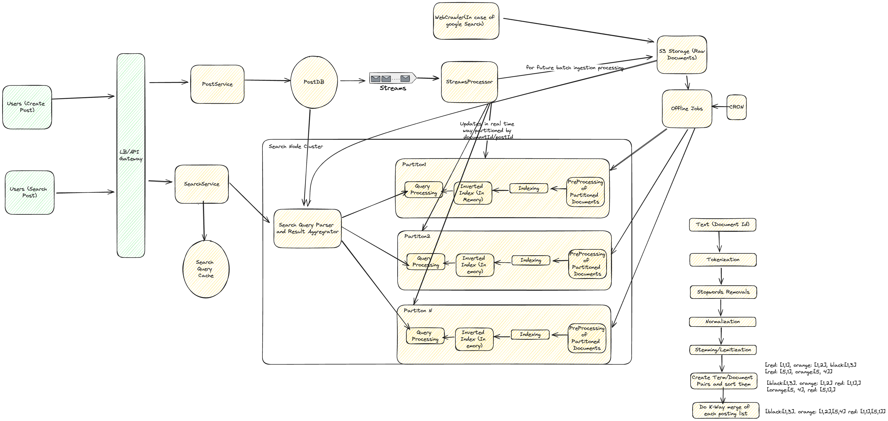
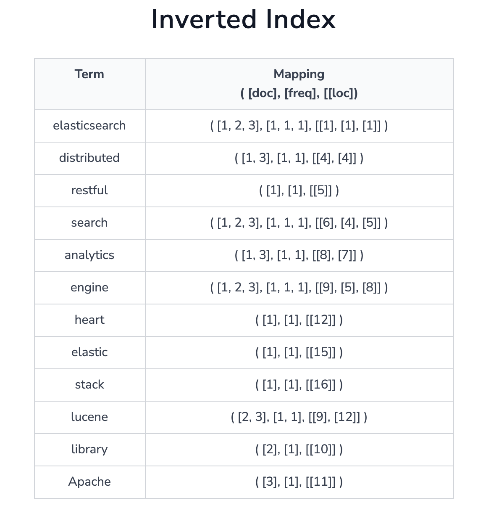
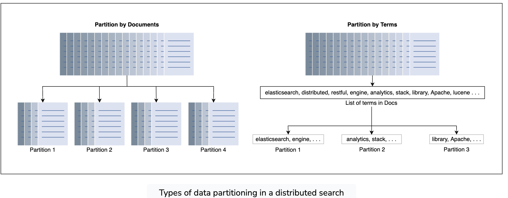
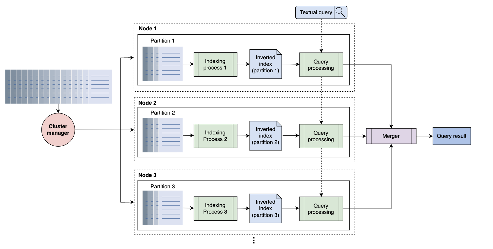

## Problem Statement
Design a distributed search system that provides users with relevant content based on their search queries, along with the ability to filter and sort the results.

## Clarification Questions to Interviewer 
1. What kind of data will be indexed and searched (e.g., text documents, web pages, structured data)?
2. How frequently is the data updated, and what is the expected rate of new data ingestion?
3. Are there any specific filtering and sorting criteria that need to be supported?
4. What are the expected performance requirements (e.g., maximum latency, query throughput)?
5. Is there a need for user-specific search results or personalization?
6. Are there any security or privacy concerns to consider (e.g., user data protection)?

## Requirements
### Functional Requirements
* **Search**: Users should get relevant content based on their search queries
* **Filters and Sorting**: Ability to filter and sort search results based on various criteria
#### Below the line (out of scope)
* Support fuzzy matching on terms (e.g. search for “bird” matches “ostrich”).
* Personalization in search results (i.e. the results depend on details of the user searching).
* Sophisticated relevance algorithms for ranking.
* Images and media.
* Realtime updates to the search page as new tweets come in.

### Non-Functional Requirements
1. **Performance**: Median queries should return in < 500ms.
2. **Scalability**: The system must support a high volume of requests.
3. **Ingestion Latency**: New content must be searchable in < 30s.
4. **Discoverability**: All content, including old or unpopular items, must be discoverable.
5. **Availability**: The system should be highly available.
#### Below the line (out of scope)
- Fuzzy matching, personalization, sophisticated relevance algorithms, images/media, real-time updates, privacy rules, storing tweets.
## Back of Envelope Estimations/Capacity Estimation & Constraints
### Assumptions
- **Users**: 1 million active users.
- **Queries**: Each user makes 5 queries per day.
- **Data Size**: 10 TB of indexed data.
- **Query Latency**: Less than 500 ms.

### Calculations
- **Total Queries per Day**: 1 million users * 5 queries/user = 5 million queries/day.
- **Queries per Second (QPS)**: 5 million queries/day / 86,400 seconds/day ≈ 58 QPS.
- **Storage**: Assuming 10 TB of indexed data.
## High-level API design 
### Search API
```http
GET /search
```
#### Parameters
- `query`: The search query string.
- `filters`: Key-value pairs for filtering the results (e.g., date range, category).
- `sort_by`: The field to sort the results by (e.g., relevance, date, likes counts).
- `page`: The page number for pagination.
- `size`: The number of results per page.

#### Response
```json
{
    "results": [
        {
            "id": "123",
            "title": "Example Title",
            "snippet": "A short snippet of the content...",
            "url": "https://example.com/article/123",
            "date": "2024-01-01T12:00:00Z"
        },
        ...
    ],
    "total_results": 10000,
    "page": 1,
    "size": 10
}
```
## Data Model
### Document Table
- **id**: Unique identifier for the document.
- **title**: Title of the document.
- **content**: Full content of the document.
- **url**: URL of the document.
- **date**: Publication date of the document.
- **metadata**: Additional metadata (e.g., author, category).

### Inverted Index Table
- **term**: The search term.
- **document_id**: Reference to the document containing the term.
- **position**: Position of the term in the document.

## High Level System Design


#### Real-Time Ingestion

1. **Users (Create Post)**:
   - Users create posts using a front-end application.
   
2. **Load Balancer/API Gateway**:
   - Distributes incoming create post requests to the PostService.

3. **PostService**:
   - Handles the creation of posts.
   - Generates a unique document ID (e.g., UUID).
   - Stores the post in PostDB with the generated document ID.

4. **PostDB**:
   - Stores the post content using the document ID as the primary key.

5. **StreamsProcessor**:
   - Listens for new posts or updates in PostDB.
   - Processes the new data stream and sends it to the Search Node Cluster for real-time indexing.
   - Optionally stores the raw document in S3 for backup or batch processing.

6. **Search Node Cluster**:
   - Updates the in-memory inverted index with the new document in real-time.
   - Each partition handles its subset of data and updates the relevant posting lists.

7. **SearchService**:
   - Handles search queries from users.
   - Uses the inverted index to find relevant document IDs.
   - Fetches post details from PostDB or S3 using these document IDs.
   - Aggregates and returns search results to the user.

#### Real-Time Deletion

1. **Users (Delete Post)**:
   - Users request to delete a post.

2. **Load Balancer/API Gateway**:
   - Distributes incoming delete requests to the PostService.

3. **PostService**:
   - Marks the document as deleted in PostDB by updating a `deleted` flag.

4. **StreamsProcessor**:
   - Listens for delete events from PostDB.
   - Updates the Search Node Cluster to exclude the deleted document from the inverted index.

5. **Search Node Cluster**:
   - Marks the document as deleted in the in-memory inverted index.
   - Periodic background jobs clean up these marked entries to maintain index efficiency.

#### Batch Ingestion

1. **WebCrawler**:
   - In the case of web search, a web crawler collects documents from various sources and stores them in S3.

2. **S3 Storage (Raw Documents)**:
   - Stores raw documents collected by the web crawler or from other sources like PostDB.

3. **Offline Jobs**:
   - Periodically processes raw documents stored in S3.
   - Preprocesses documents (tokenization, stopwords removal, normalization, stemming/lemmatization).
   - Creates term/document pairs and sorts them.
   - Updates the Search Node Cluster with the new or modified documents.

4. **Search Node Cluster**:
   - Receives batch updates from offline jobs.
   - Reindexes documents and updates the in-memory inverted index accordingly.

#### Batch Deletion

1. **Offline Jobs**:
   - Periodically checks for documents marked as deleted in PostDB or S3.
   - Processes deletions by updating the Search Node Cluster to remove these documents from the inverted index.

2. **Search Node Cluster**:
   - Excludes the deleted documents from the in-memory inverted index.
   - Ensures the index is up-to-date with periodic clean-up jobs to remove stale entries.

## Deep Dive Topics
### Build inverted index/reverse index
An inverted index is a HashMap-like data structure that employs a document-term matrix. Instead of storing the complete document as it is, it splits the documents into individual words.


#### Example
Given sentences:
- "The quick brown fox jumps over the lazy dog."
- "The dog barked at the fox."

**Inverted Index:**
```
{
  "the": [ (1, 0), (1, 7), (2, 0) ],
  "quick": [ (1, 1) ],
  "brown": [ (1, 2) ],
  "fox": [ (1, 3), (2, 5) ],
  "jumps": [ (1, 4) ],
  "over": [ (1, 5) ],
  "lazy": [ (1, 6) ],
  "dog": [ (1, 7), (2, 1) ],
  "barked": [ (2, 2) ],
  "at": [ (2, 3) ]
}
```
Here, the format is `(document_id, position_in_document)`.

#### Initial Stages of Text Processing to create inverted index
1. **Fetch Documents**: Retrieve the documents to be indexed.
2. **Tokenization**: Split the text into individual terms or tokens.
3. **Stopwords Removal**: Filter out common stopwords (e.g., "the", "is").
4. **Normalization**: Convert terms to a standard form (e.g., lowercase).
5. **Stemming/Lemmatization**: Reduce terms to their base or root form (e.g., "running" to "run").

#### Indexer Steps
1. **Token Sequencing - Create Term-Document Pairs**: For each term, create pairs with the document ID and term position.
2. **Sorting**: Sort terms alphabetically or by frequency.
3. **Creating Dictionary**: Create a dictionary (lexicon) of terms.
4. **Posting Lists**: Create posting lists that store document IDs and term positions for each term in the dictionary. We can created sorting list of documents id in posting list. It's Dynamic Array

#### Advantages of Inverted Index
1. **Full-Text Searches**: Facilitates fast full-text searches.
2. **Reduced Search Time**: Precomputed mappings allow quick term occurrence counting.

#### Disadvantages of Inverted Index
1. **Storage Overhead**: Requires additional storage for the index.
2. **Maintenance Costs**: Updates to the index require processing to add, update, or delete terms.


#### Storage in Reverse Index
1. **Document Storage**: Store documents on disk, each with a unique document ID.
2. **Index to Document Mapping**: Maintain a mapping of document IDs to file locations on disk.
3. **Random Access**: Use the document ID to look up the file location in the mapping and retrieve the document from disk.


#### Handling Document Deletion
1. **Soft Delete**: Mark the document as deleted without immediately removing it from the index
2. **Background Job**: Periodically run a background job to remove documents marked for deletion and update the inverted index accordingly.

### Data Partioning 
#### Document Partitioning
- **Definition**: Partition documents into subsets, each indexed by a different node.
- **Advantages**: Reduces inter-node communication, easier to manage.
- **Disadvantages**: Every query must access all nodes to retrieve results.

#### Term Partitioning
- **Definition**: Partition the dictionary of terms into subsets, each handled by a different node.
- **Advantages**: Can handle high concurrency as different nodes handle different terms.
- **Disadvantages**: Requires extensive inter-node communication for multi-term queries.




#### Why Document Partitioning is Better than Term Partitioning in Distributed Search
- **Reduced Inter-Node Communication**: Document partitioning minimizes the need for nodes to communicate during query processing, leading to lower latency.
- **Scalability**: Easier to scale by adding more nodes, each handling a subset of documents.
- **Simplicity**: Simplifies the management of indexes as each node independently handles a subset of the documents.


Following document partitioning, let’s look into a distributed design for index construction and querying, which is shown in the illustration below. We use a cluster that consists of a number of low-cost nodes and a cluster manager. The cluster manager uses a MapReduce programming model to parallelize the index’s computation on each partition. MapReduce can work on significantly larger datasets that are difficult to be handled by a single large server.


### Data Replication
We make replicas of the indexing nodes that produce inverted indices for the assigned partitions. We can answer a query from several sets of nodes with replicas. The overall concept is simple. We continue to use the same architecture as before, but instead of having only one group of nodes, we have `R`
groups of nodes to answer user queries. `R` is the number of replicas. The number of replicas can expand or shrink based on the number of requests, and each group of nodes has all the partitions required to answer each query. Each group of nodes is hosted on different availability zones for better performance and availability of the system in case a data center fails.
#### Replication factor and replica distribution
Generally, a replication factor of three is enough. A replication factor of three means three nodes host the same partition and produce the index. One of the three nodes becomes the primary node, while the other two are replicas. Each of these nodes produces indexes in the same order to converge on the same state.


### Search Query Processing with Inverted Index
#### Using Merge Algorithm
1. **Merge Algorithm**: To handle multi-term queries, merge the posting lists of each query term.
2. **Steps**:
    - Retrieve posting lists for each query term.
    - Use a two-pointer technique to find common document IDs.
    - Merge posting lists to get the intersection of documents.

#### Merge Algorithm for Posting Lists
```python
def merge_posting_lists(list1, list2):
    i, j = 0, 0
    merged_list = []
    
    while i < len(list1) and j < len(list2):
        if list1[i] == list2[j]:
            merged_list.append(list1[i])
            i += 1
            j += 1
        elif list1[i] < list2[j]:
            i += 1
        else:
            j += 1
    
    return merged_list

# Example usage
list1 = [1, 2, 4, 5]
list2 = [2, 3, 4, 6]
print(merge_posting_lists(list1, list2))  # Output: [2, 4]
```

#### Boolean Retrieval Model
1. **Conjunctive Search (AND Queries)**: Find documents containing all query terms by merging posting lists.
2. **Disjunctive Search(OR Queries)**: Find documents containing any of the query terms by taking the union of posting lists.
3. **NOT Queries**: Exclude documents containing specific terms by subtracting posting lists.

#### Phrase Queries and Positional Indexes
1. **Phrase Queries**: Retrieve documents where terms appear in a specific sequence.
2. **Positional Indexes**: Store positions of terms within documents to support phrase queries.
3. **Example**:
    - Query: "quick brown fox"
    - Positional Index: {"quick": [(1, 1)], "brown": [(1, 2)], "fox": [(1, 3)]}
    - Verify that terms appear in consecutive positions in the same document.

### Ranked Retrieval Strategies
Ranked retrieval is a fundamental approach in information retrieval systems, addressing the limitations of Boolean search by ranking documents based on their relevance to a query. This approach helps mitigate the "feast or famine" problem, where Boolean searches often return either too many or too few results. Ranked retrieval models score and rank documents to provide a more nuanced result set.

#### Key Concepts in Ranked Retrieval
1. **Feast or Famine Problem**: In Boolean search, queries either return too many results (feast) or too few (famine). Ranked retrieval addresses this by scoring documents based on their relevance.
2. **Scoring**: The process of assigning a relevance score to each document in response to a query. The score reflects how well the document matches the query.
3. **Ranking**: Sorting documents based on their scores to present the most relevant documents first.

#### Common Scoring Methods
1. **Jaccard Coefficient**:
   - Measures the similarity between the query and a document based on the intersection of terms.
   - **Formula**: \( J(A, B) = \frac{|A \cap B|}{|A \cup B|} \)

2. **Term Frequency-Inverse Document Frequency (TF-IDF)**:
   - Combines term frequency (TF) and inverse document frequency (IDF) to weigh terms.
   - **TF Formula**: \( \text{TF}(t, d) = \frac{\text{Number of times term } t \text{ appears in document } d}{\text{Total number of terms in document } d} \)
   - **IDF Formula**: \( \text{IDF}(t) = \log \left( \frac{\text{Total number of documents}}{\text{Number of documents containing term } t} \right) \)

3. **Cosine Similarity**:
   - Measures the cosine of the angle between two vectors (query and document) in a multi-dimensional space.
   - **Formula**: \( \text{Cosine Similarity}(d, q) = \frac{\sum_{i=1}^{n} w_{di} \times w_{qi}}{\sqrt{\sum_{i=1}^{n} w_{di}^2} \times \sqrt{\sum_{i=1}^{n} w_{qi}^2}} \)

4. **Okapi BM25**:
   - A probabilistic retrieval model that ranks documents based on the likelihood of relevance.
   - **Formula**: \( \text{BM25}(d, q) = \sum_{i=1}^{n} \text{IDF}(t_i) \times \frac{f(t_i, d) \times (k_1 + 1)}{f(t_i, d) + k_1 \times (1 - b + b \times \frac{|d|}{\text{avgdl}})} \times \frac{f(t_i, q) \times (k_2 + 1)}{f(t_i, q) + k_2} \)

5. **Language Models**:
   - Based on the probability of generating a query from a document.
   - **Formula**: \( P(q | d) = \prod_{i=1}^{n} P(t_i | d) \)

#### Implementation Steps
1. **Preprocessing**:
   - Tokenize text into terms.
   - Remove stop words and apply stemming/lemmatization.
   - Build an inverted index with term frequencies.

2. **Query Processing**:
   - Parse and preprocess the query.
   - Retrieve posting lists for query terms from the inverted index.

3. **Scoring**:
   - Compute relevance scores for documents using chosen scoring method (e.g., TF-IDF, BM25).
   - Combine scores for multi-term queries, considering term weights and document properties.

4. **Ranking**:
   - Sort documents based on scores.
   - Present the top-ranked documents to the user.


### ElasticSearch
Lucene is used internally by Elasticsearch. Elasticsearch converts Lucene into a distributed system/search engine for scaling horizontally and provides additional features like thread-pool, queues, node/cluster monitoring API, data monitoring API, cluster management, etc. Elasticsearch extends Lucene and provides additional features beyond it.

#### Why Elasticsearch?
- **Speed and Scalability**: Distributed in nature, making it easy to scale out by adding more nodes.
- **Simple REST Interface**: Allows easy interaction through simple HTTP clients.


#### Partitioning and Replication Strategy in Elasticsearch
1. **Document Partitioning**: Elasticsearch uses document partitioning, known as "sharding," where each shard is a fully functional search engine.
2. **Replication**: Each shard has replicas for fault tolerance and high availability. The replication factor is typically three, meaning each shard has two replicas.
3. **Replica Distribution**: Replicas are distributed across different nodes and availability zones to ensure high availability and fault tolerance.


### Mechanism of data ingestion on elastic search mode 
#### Batch Ingestion
- **Advantages**: Efficient for large-scale data ingestion, reduces load on Elasticsearch.
- **Method**: Use bulk API to index data in batches.
- **Use Case**: Suitable for backfill operations or periodic data loads.

#### Real-Time Ingestion
- **Advantages**: Ensures data is available for search immediately after it's ingested.
- **Method**: Index data as it arrives using individual indexing requests.
- **Use Case**: Suitable for scenarios requiring immediate searchability, such as live updates.

#### Workflow Steps
1. **Proxy**: Use a proxy to handle data ingestion, providing throttling and monitoring.
2. **Kafka**: Employ Kafka for asynchronous data ingestion to handle surges in traffic.
3. **Batch Processing**: Batch writes to Elasticsearch to reduce load.

### Search Query Optimization
1. **Query Parsing**: Break down the query into tokens and identify special syntax.
2. **Query Expansion**: Include synonyms or related terms.
3. **Rewriting**: Correct spelling mistakes and use common terms.
4. **Ranking Adjustments**: Adjust ranking based on real-time factors.
5. **Cache Frequent Queries**: Cache results of frequent queries.


## References
* Videos
  [](https://www.youtube.com/watch?v=CeGtqouT8eA)
  [](https://www.youtube.com/watch?v=Wf6HbY2PQDw)
  
* https://www.educative.io/courses/grokking-modern-system-design-interview-for-engineers-managers/system-design-the-distributed-search
* https://www.hellointerview.com/learn/system-design/answer-keys/tweet-search
* https://systemdesign.one/system-design-interview-cheatsheet/#twitter-search
* https://blog.devgenius.io/search-system-design-that-scales-2fdf407a2d34
* https://medium.com/double-pointer/system-design-interview-search-engine-edb66b64fd5e