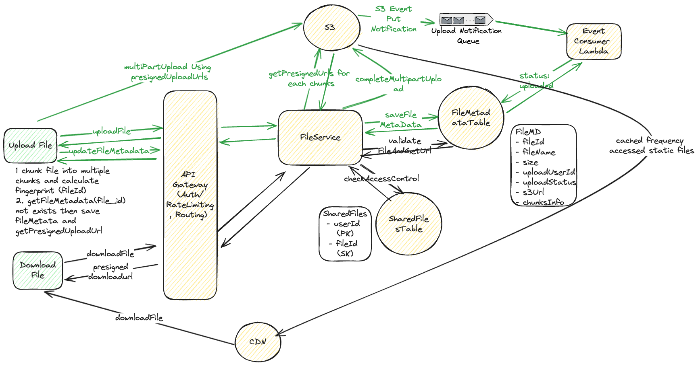

## Problem Statement
Design a scalable and efficient file storage and sharing system similar to Dropbox or Google Drive. The system should allow users to upload, download, and share files, and handle high traffic and large amounts of data.

## Clarification Questions to Interviewer 
1. What types of files will the system need to support?
2. What are the expected read and write patterns (e.g., more uploads or downloads)?
3. What should be the maximum file size supported?
4. Should the system support versioning of files?
5. Are there any specific security or compliance requirements?
6. Should the system support collaborative features (e.g., real-time editing)?
7. What is the expected number of users and their activity levels?


## Requirements
### Functional Requirements
1. **File Upload**: Users can upload files of various types and sizes.
1. **File Download**: Users can download files they have access to.
1. **File Sharing**: Users can share files with others, including setting permissions.
1. **File Deletion**: Users can delete files.
1. **File Metadata**: Users can view metadata for files (e.g., name, size, type, upload date).
1. **User Authentication and Authorization**: Users must be authenticated to access their files.

#### Below the line (out of scope)
* **File Versioning**: The system should support file versioning
* Real-time collaborative editing.
* Integration with third-party applications.

### Non-Functional Requirements
1. **Availability**: The system should be highly available. (prioritizing availability over consistency).
1. **Consistency**: Ensure strong consistency for file operations.
1. **Performance**: File uploads and downloads should be fast.
1. **Scalability**: The system should handle a large number of users and files. Should support files as large as 50GB.
1. **Durability**: Files should be stored reliably and not lost.
1. **Security**: Files should be securely stored and transmitted.


#### Below the line (out of scope)
* The system should scan files for viruses and malware
* Real-time performance metrics.
* Advanced analytics on file usage.

## Back of Envelope Estimations/Capacity Estimation & Constraints
1. **User Base**: 100 million users.
2. **Active Users**: 10 million daily active users (DAU).
3. **Average File Size**: 1 MB.
4. **Average Files per User**: 100 files.
5. **Storage**:
   - Total files: 100 million users * 100 files/user = 10 billion files.
   - Total storage: 10 billion files * 1 MB/file = 10 PB.
6. **Traffic**:
   - Read Requests per Second (RPS): 10 million DAU * 10 reads/day / 86400 seconds/day ~ 1157 RPS.
   - Write Requests per Second (RPS): 10 million DAU * 2 writes/day / 86400 seconds/day ~ 231 RPS.

## High-level API design 
### File APIs
- **Upload File**
    ```json
    POST /files/upload
    Request {
        "auth_token": "string",
        "metadata": {
            "name": "string",
            "size": "int",
            "type": "string"
        }
    }
    Response {
        "file_id": "string",
        "upload_urls": ["string"]  // List of presigned URLs for chunk upload
    }
    ```

- **Download File**
    ```json
    GET /files/download/{file_id}
    Request {
        "auth_token": "string",
        "file_id": "string"
    }
    Response {
        "download_url": "string",  // Presigned URL for file download
        "metadata": {
            "name": "string",
            "size": "int",
            "type": "string",
            "version_id": "string"
        }
    }
    ```

- **Share File**
    ```json
    POST /files/share
    Request {
        "auth_token": "string",
        "file_id": "string",
        "shared_with": "string",
        "permissions": "string"
    }
    Response {
        "status": "string"
    }
    ```

- **Delete File**
    ```json
    DELETE /files/{file_id}
    Request {
        "auth_token": "string",
        "file_id": "string"
    }
    Response {
        "status": "string"
    }
    ```

- **Get File Metadata**
    ```json
    GET /files/metadata/{file_id}
    Request {
        "auth_token": "string",
        "file_id": "string"
    }
    Response {
        "metadata": {
            "name": "string",
            "size": "int",
            "type": "string",
            "upload_date": "string",
            "version_id": "string"
        }
    }
    ```
## Data Model
### UserDB (PostgreSQL)
- **Users Table**
    | Field       | Type      | Description              |
    |-------------|-----------|--------------------------|
    | user_id     | VARCHAR   | Primary Key              |
    | name        | VARCHAR   |                          |
    | email       | VARCHAR   | Unique                   |
    | created_at  | TIMESTAMP | Default: CURRENT_TIMESTAMP |
    | updated_at  | TIMESTAMP | Default: CURRENT_TIMESTAMP |


### FileDB (DynamoDB)
- **Files Table**
    | Field       | Type      | Description              |
    |-------------|-----------|--------------------------|
    | file_id     | VARCHAR   | Primary Key              |
    | name        | VARCHAR   |                          |
    | size        | INT       |                          |
    | mimeType    | VARCHAR   |                          |
    | uploadedBy  | VARCHAR   | User ID                  |
    | status      | VARCHAR   | Upload status            |
    | chunks      | List<Map> | List of chunks with status |
    | created_at  | TIMESTAMP | Default: CURRENT_TIMESTAMP |

### ChunkMetadata Table (DynamoDB)
- **ChunkMetadata Table**
    | Field         | Type      | Description                   |
    |---------------|-----------|-------------------------------|
    | chunk_id      | VARCHAR   | Primary Key (SHA-256 hash)    |
    | file_id       | VARCHAR   | Foreign Key                   |
    | chunk_index   | INT       | Index of the chunk            |
    | size          | INT       | Size of the chunk             |
    | upload_date   | TIMESTAMP | Default: CURRENT_TIMESTAMP    |
    | storage_url   | VARCHAR   | URL to the stored chunk       |


### SharingDB (DynamoDB)
- **Shares Table**
    | Field         | Type      | Description              |
    |---------------|-----------|--------------------------|
    | share_id      | VARCHAR   | Parition Key             |
    | file_id       | VARCHAR   | GSI                      |        
    | shared_with   | VARCHAR   | User ID of the recipient |
    | permissions   | VARCHAR   | Permissions              |
    | created_at    | TIMESTAMP | Default: CURRENT_TIMESTAMP |
#### Example of a File Metadata Entry
```json
{
  "file_id": "123",
  "name": "file.txt",
  "size": 1000,
  "mimeType": "text/plain",
  "uploadedBy": "user1",
  "status": "uploading",
  "chunks": [
    {
      "id": "chunk1",
      "status": "uploaded"
    },
    {
      "id": "chunk2",
      "status": "uploading"
    },
    {
      "id": "

chunk3",
      "status": "not-uploaded"
    }
  ],
  "created_at": "2023-07-13T10:00:00Z"
}
```

## High Level System Design


### Upload flow
#### Upload File to a Single Server
**Pros**:
- Simple to implement.
- Centralized control.
**Cons**:
- Can become a bottleneck.
- Not scalable for large files or high traffic.

#### Store File in Blob Storage
**Pros**:
- Reliable and durable storage.
- Scalable.
**Cons**:
- Requires additional steps for upload.
- Potential latency in storage operations.

#### [Recommended] Upload File Directly to Blob Storage
**Pros**:
- Scalable and efficient.
- Reduces load on application servers.
**Cons**:
- More complex to implement.
- Requires generation and management of pre-signed URLs.


#### Upload Workflow
1. **Step 1: Request Upload URLs**
   - Client requests upload URLs from the application server with file metadata.
   - Application server generates pre-signed URLs for each chunk.
   - Application server responds with the file ID and upload URLs.

2. **Step 2: Upload Chunks**
   - Client uploads file chunks directly to blob storage using the provided pre-signed URLs.
   - Client tracks the status of each chunk upload.
   
3. **Step 3: Confirm Upload Completion**
   - Once all chunks are uploaded, client notifies the application server.
   - Application server verifies all chunks are uploaded and marks the file status as complete.


### Download Flow
#### Download through File Server
**Pros**:
- Centralized control over downloads.
- Can apply additional processing or logging.

**Cons**:
- Can become a bottleneck.
- Higher latency compared to direct downloads.

#### Download from Blob Storage
**Pros**:
- Direct access to storage.
- Reduces load on application servers.

**Cons**:
- Requires generation and management of pre-signed URLs.
- Limited control over downloads.

#### [Recommended] Download from CDN
**Pros**:
- Reduces latency for end-users.
- Offloads traffic from main servers.

**Cons**:
- Complexity in caching and invalidation.
- Additional costs for CDN usage.


#### Download Workflow
1. **Step 1: Request Download URL**
   - Client requests a download URL from the application server.
   - Application server generates a pre-signed URL for the file.
   - If the file is frequently accessed, ensure it is cached in the CDN.

2. **Step 2: Download File**
   - Client downloads the file directly from the CDN using the provided pre-signed URL.
   - If the file is not in the CDN cache, it will be fetched from blob storage and then cached.


### Share Files 
1. User shares a file by specifying the file ID, recipient's user ID, and permissions.
2. The application server updates the SharingDB with the shared file details.
3. The recipient can access the shared file based on the permissions.

## Deep Dive
### Support Uploading Large Files
#### S3 Multipart Upload
1. S3 supports multipart uploads, which allow a file to be uploaded in parts independently.
2. Each part is uploaded separately and can be between 5MB to 5GB in size.
3. S3 tracks all parts, and when all parts are uploaded, they are combined into the final file.
4. S3 provides a "PUT" event notification for each part uploaded, allowing tracking and verification.

#### Chunking Strategy
1. Split large files into smaller chunks (e.g., 5MB each).
2. Each chunk is assigned a unique chunk ID (e.g., SHA-256 hash).
3. Chunks are uploaded independently.

#### Progress Indicator
1. Track the upload progress of each chunk.
2. Provide feedback to the user on the overall upload progress.

#### Resumable Uploads
1. If an upload fails, the client can resume from the last successfully uploaded chunk.
2. Store metadata for each chunk, including its ID, size, and storage URL, to facilitate resumable uploads.

#### Workflow
1. The client will split the file into chunks of 5–10 MB each.
1. It will calculate the fingerprint of each chunk and the entire file. The fingerprint of the entire file will become the fileId.
1. The client will retrieve metadata from the database to check whether the fileId exists.
1. If the file does not exist, the client will send a request to obtain a presigned URL.
1. The backend will retrieve and return the presigned URL to the user.
1. It will also save the FileMetadata table with the status ‘uploading’.
1. The user will upload the file chunks using the presigned URL.
1. After each chunk is uploaded, the Blob storage will send a notification to the backend.
1. The backend will then update the chunks field in the metadata.

Once all chunks in our array are marked as ‘uploaded’, the backend will update the FileMetadata table to mark the file as ‘uploaded’.

### Make Uploads and Download Faster
#### Compression Techniques
1. Compress files before upload to reduce the size and speed up the upload process.
2. Decompress files after download to restore them to their original size.

### Workflow for Compression Techniques
1. **Compression Before Upload**:
   - Client compresses the file using a standard compression algorithm (e.g., gzip).
   - Compressed file is then split into chunks and uploaded.
   - Metadata includes information about the compression algorithm used.

2. **Decompression After Download**:
   - Client downloads the compressed chunks.
   - After all chunks are downloaded, the client decompresses the file to restore it to its original size.


### Ensure file security
#### Encryption in Transit
1. Use HTTPS to encrypt data during transmission between the client and server.

#### Encryption at Rest
1. Encrypt files stored in blob storage to protect against unauthorized access.

#### Access Control
1. Implement strict authentication and authorization checks to control file access.


### S3 Multipart Upload using Presigned URLs - Workflow

To handle large file uploads efficiently, S3 multipart upload using presigned URLs is a suitable approach. This process allows files to be split into smaller parts and uploaded independently, improving reliability and upload speed.

#### Overview
1. **Initiate Multipart Upload**: Start the multipart upload process and obtain an `UploadId`.
2. **Generate Presigned URLs**: Create presigned URLs for each part of the file.
3. **Upload Parts**: Use `requests.put` to upload each part using the presigned URLs.
4. **Complete Multipart Upload**: Notify S3 to combine the uploaded parts into a single file.

### Workflow

#### Step 1: Initiate Multipart Upload

The client sends a request to the application server to initiate a multipart upload. The server then communicates with S3 to start the process and retrieve an `UploadId`.

```python
import boto3

s3_client = boto3.client('s3')
response = s3_client.create_multipart_upload(Bucket='my-bucket', Key='my-large-file')
upload_id = response['UploadId']
```

#### Step 2: Generate Presigned URLs

For each part of the file, the application server generates a presigned URL using the `UploadId`. These URLs allow the client to upload parts directly to S3.

```python
import boto3

s3_client = boto3.client('s3')
bucket_name = 'my-bucket'
key = 'my-large-file'
upload_id = 'example-upload-id'

part_numbers = range(1, 6)  # Assuming 5 parts
presigned_urls = []

for part_number in part_numbers:
    presigned_url = s3_client.generate_presigned_url(
        'upload_part',
        Params={
            'Bucket': bucket_name,
            'Key': key,
            'UploadId': upload_id,
            'PartNumber': part_number
        },
        ExpiresIn=3600  # URL expiration time
    )
    presigned_urls.append(presigned_url)
```

#### Step 3: Upload Parts

The client uploads each part to S3 using the provided presigned URLs. This can be done in parallel to speed up the upload process.

```python
import requests

file_path = 'path/to/large/file'
chunk_size = 5 * 1024 * 1024  # 5 MB

def read_in_chunks(file_object, chunk_size=1024):
    while True:
        data = file_object.read(chunk_size)
        if not data:
            break
        yield data

etags = []

with open(file_path, 'rb') as f:
    for i, chunk in enumerate(read_in_chunks(f, chunk_size)):
        url = presigned_urls[i]
        response = requests.put(url, data=chunk)
        if response.status_code == 200:
            etag = response.headers['ETag']
            etags.append({'ETag': etag, 'PartNumber': i + 1})
        else:
            print(f"Failed to upload part {i + 1}")
```

#### Step 4: Complete Multipart Upload

After all parts are uploaded, the client notifies the application server. The server then requests S3 to complete the multipart upload, providing the `UploadId` and the list of part ETags.

```python
response = s3_client.complete_multipart_upload(
    Bucket=bucket_name,
    Key=key,
    UploadId=upload_id,
    MultipartUpload={'Parts': etags}
)
```

#### Benefits of Multipart Upload
1. **Parallel Uploads**: Multiple parts can be uploaded in parallel, improving upload speed.
2. **Resumability**: If an upload fails, only the failed part needs to be retried.
3. **Efficiency**: Handles large files more efficiently by breaking them into smaller, manageable parts.

#### Handling Notifications and Tracking

- **S3 Notifications**: Configure S3 to send notifications for each part upload and when the multipart upload is completed using SNS, SQS, or Lambda.
- **Update Metadata**: Update the file metadata status based on these notifications to track upload progress and completion.

## References
* https://www.hellointerview.com/learn/system-design/answer-keys/dropbox
* https://medium.com/@tahir.rauf/system-design-dropbox-35cc80ff3e79
* https://github.com/preslavmihaylov/booknotes/tree/master/system-design/system-design-interview/chapter16