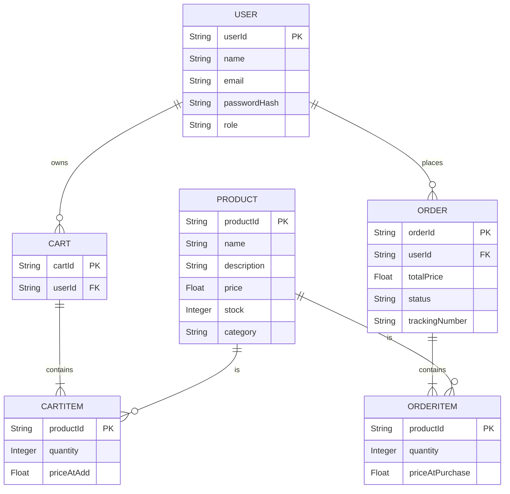
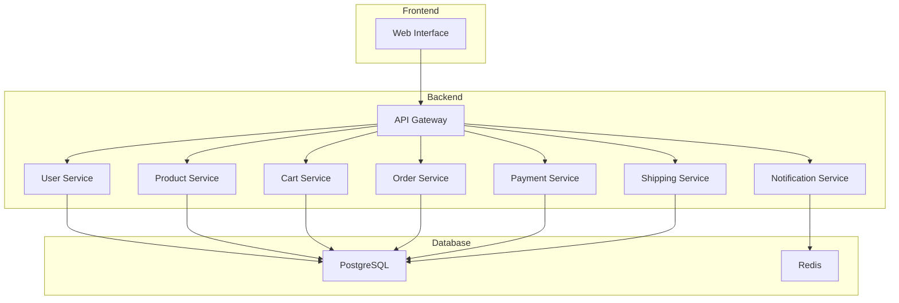

## Problem Statement

Design an e-commerce system similar to Amazon, which allows users to browse products, add items to a shopping cart, place orders, and manage inventory.

## Clarification Questions to Interviewer

1. Should the system support multiple roles (e.g., customers, admins, sellers)?
2. Are there any specific payment methods that need to be supported?
3. Should the system support multi-currency and multi-language?
4. Are there any specific integrations required (e.g., shipping, CRM, ERP)?
5. What are the expected peak loads and transaction volumes?
6. Should the system support real-time order tracking?
7. Are there any specific security and compliance requirements?

## Requirements

### Functional Requirements

1. Users should be able to browse and search for products.
2. Users should be able to view product details, including descriptions, prices, and reviews.
3. Users should be able to add products to a shopping cart and view the cart.
4. Users should be able to place orders and make payments.
5. The system should manage inventory levels and notify users of low stock.
6. Admins should be able to add, update, and delete products.
7. Sellers should be able to manage their products and inventory.
8. Users should be able to track their orders.
9. The system should send notifications for order confirmations and shipping updates.
10. The system should support user authentication and authorization.

#### Below the line (out of scope)
- Detailed integration with external logistics and shipping providers.
- Advanced recommendation algorithms.
- Social features such as sharing products on social media.
- Detailed financial reporting and analytics.

### Non-Functional Requirements

1. The system should be highly available.
2. The system should be scalable to handle high traffic volumes.
3. The system should ensure data consistency.
4. The system should be secure, protecting user data and transactions.
5. The system should have low latency for user interactions.
6. The system should be resilient to failures.

#### Below the line (out of scope)
- Advanced performance optimization.
- Multi-region deployment.

## Back of Envelope Estimations/Capacity Estimation & Constraints

- Assume an average of 10 million users per month.
- Peak usage might be around 100,000 concurrent users.
- Each product entry could take about 1 KB of storage.
- Estimate of 1 TB storage for product data considering metadata and images.
- Daily transactions could be around 1 million.

## High-level API design

### User APIs

**POST /v1/users/register**
- Register a new user.
- Request Body: `{ "name": "John Doe", "email": "john@example.com", "password": "password123" }`
- Response: `{"success": true, "userId": "abcd1234"}`

**POST /v1/users/login**
- User login.
- Request Body: `{ "email": "john@example.com", "password": "password123" }`
- Response: `{"success": true, "token": "jwt-token"}`

### Product APIs

**GET /v1/products**
- Retrieve a list of products.
- Response: `{"products": [ ... ]}`

**GET /v1/products/{productId}**
- Retrieve product details.
- Response: `{"productId": "abcd1234", "name": "Product Name", "description": "Product Description", "price": 10.99 }`

**POST /v1/products**
- Add a new product (admin only).
- Request Body: `{ "name": "Product Name", "description": "Product Description", "price": 10.99, "stock": 100 }`
- Response: `{"success": true, "productId": "abcd1234"}`

**PUT /v1/products/{productId}**
- Update product information (admin only).
- Request Body: `{ "name": "Updated Name", "description": "Updated Description", "price": 12.99 }`
- Response: `{"success": true, "product": { ... }}`

**DELETE /v1/products/{productId}**
- Delete a product (admin only).
- Response: `{"success": true, "productId": "abcd1234"}`

### Cart APIs

**POST /v1/cart**
- Add an item to the cart.
- Request Body: `{ "userId": "1234", "productId": "5678", "quantity": 1 }`
- Response: `{"success": true, "cart": { ... }}`

**GET /v1/cart/{userId}**
- View the cart.
- Response: `{"userId": "1234", "cart": { ... }}`

**PUT /v1/cart/{userId}**
- Update the cart (add/remove items).
- Request Body: `{ "productId": "5678", "quantity": 2 }`
- Response: `{"success": true, "cart": { ... }}`

**DELETE /v1/cart/{userId}/items/{productId}**
- Remove an item from the cart.
- Response: `{"success": true, "cart": { ... }}`

### Order APIs

**POST /v1/orders**
- Place an order.
- Request Body: `{ "userId": "1234", "cartId": "abcd5678", "paymentMethod": "credit_card", "shippingAddress": "123 Main St" }`
- Response: `{"success": true, "orderId": "xyz1234"}`

**GET /v1/orders/{orderId}**
- Retrieve order details.
- Response: `{"orderId": "xyz1234", "status": "shipped", "trackingNumber": "1Z9999"}`

**GET /v1/orders/user/{userId}**
- Retrieve a user's order history.
- Response: `{"userId": "1234", "orders": [ ... ]}`

## Data Model

### Entities and Attributes

#### User
- `userId`: String, primary key
- `name`: String
- `email`: String
- `passwordHash`: String
- `role`: String (e.g., admin, customer, seller)

#### Product
- `productId`: String, primary key
- `name`: String
- `description`: String
- `price`: Float
- `stock`: Integer
- `category`: String

#### Cart
- `cartId`: String, primary key
- `userId`: String, foreign key
- `items`: List of CartItem

#### CartItem
- `productId`: String, primary key
- `quantity`: Integer
- `priceAtAdd`: Float

#### Order
- `orderId`: String, primary key
- `userId`: String, foreign key
- `items`: List of OrderItem
- `totalPrice`: Float
- `status`: String (e.g., Pending, Shipped, Delivered)
- `trackingNumber`: String

#### OrderItem
- `productId`: String, primary key
- `quantity`: Integer
- `priceAtPurchase`: Float

### Data Model Diagram

## High Level System Design

### Components

1. **User Service**: Handles user authentication and management.
2. **Product Service**: Manages product information and inventory.
3. **Cart Service**: Manages the shopping cart operations.
4. **Order Service**: Handles the checkout process and order management.
5. **Notification Service**: Sends notifications for order confirmations and shipping updates.
6. **Payment Service**: Integrates with external payment providers.
7. **Shipping Service**: Manages shipping and tracking of orders.

### Architecture

- **Frontend**: The web interface that users interact with.
- **API Gateway**: Routes requests to appropriate backend services.
- **User Service**: Manages user authentication

 and profiles.
- **Product Service**: Manages product information and inventory.
- **Cart Service**: Manages shopping cart operations.
- **Order Service**: Handles the checkout process and order management.
- **Notification Service**: Sends notifications for order confirmations and shipping updates.
- **Payment Service**: Integrates with external payment providers.
- **Shipping Service**: Manages shipping and tracking of orders.
- **PostgreSQL**: Relational database for persistent storage.
- **Redis**: In-memory data store for caching and session management.

## Deep Dive

### Real-time Inventory Tracking

- **Track Stock Levels**: Continuously monitor stock levels across all warehouses.
- **Update Inventory Counts**: As transactions occur (e.g., sales, returns), update the inventory counts in real-time.
- **Order Management**: Process purchase orders and sales orders, integrating with order fulfillment systems to ensure accurate inventory tracking.

### Inventory Snapshots and Auditing

- **Periodic Snapshots**: Take periodic snapshots of inventory levels for reporting and reconciliation purposes.
- **Audit Trail**: Maintain a detailed audit trail of all inventory changes to ensure traceability and support compliance requirements.

### Distributed Transactions

- **Two-Phase Commit (2PC)**: To ensure consistency across services in distributed transactions, implement a two-phase commit protocol.
    - **Phase 1: Prepare**: All participating services prepare to commit the transaction and report back if they are ready.
    - **Phase 2: Commit**: If all services are ready, the coordinator commits the transaction; otherwise, it aborts.

- **Three-Phase Commit (3PC)**: For added reliability in a distributed environment, especially to handle network partitions, use a three-phase commit protocol.
    - **Phase 1: Prepare**: Similar to 2PC, services prepare to commit.
    - **Phase 2: Pre-commit**: An additional step where the coordinator ensures all services are still ready to commit.
    - **Phase 3: Commit**: Finally, commit the transaction if all services confirm their readiness.

- **Optimistic Locking**: Handle concurrent updates to inventory records by implementing optimistic locking. This involves:
    - **Version Numbers**: Each inventory record has a version number.
    - **Check and Update**: When updating a record, the service checks the current version and updates the record only if the version matches. If the version does not match, the update is rejected, and the service can retry.

### Transactions in the System

- **Adding Inventory**: When adding inventory, a transaction includes creating a new inventory record or updating an existing one, and logging the change.
- **Updating Inventory**: For updating inventory levels (e.g., stock adjustments), the transaction includes modifying the inventory count and recording the update in the audit trail.
- **Transferring Stock**: A stock transfer transaction involves updating the inventory counts in both the source and destination warehouses and recording the transfer details.
- **Order Processing**: Processing an order involves multiple steps, including reserving stock, updating inventory counts, and potentially integrating with external order fulfillment systems.

### Notification Service

- **Send Alerts**: Trigger alerts for low stock levels, sending notifications to relevant users. This can involve setting thresholds for each product and warehouse, and monitoring inventory levels to ensure timely alerts.

### Reporting Service

- **Generate Reports**: Provide various inventory reports and analytics, such as stock levels, product performance, and warehouse efficiency. Reports can be generated periodically or on-demand.
## References
* https://www.youtube.com/watch?v=EpASu_1dUdE
    * https://www.codekarle.com/system-design/Amazon-system-design.html
* https://medium.com/double-pointer/system-design-interview-amazon-flipkart-ebay-or-similar-e-commerce-applications-35a0bc764421