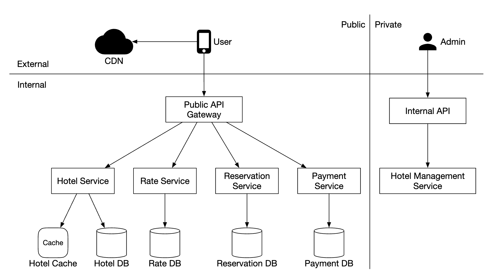

## Problem Statement

Design a hotel reservation system that allows users to search for hotels, view room availability, make reservations, and manage bookings, similar to systems used by major hotel chains like Marriott International.

## Clarification Questions to Interviewer

1. What is the scale of the system?
   - Building a website for a hotel chain with 5000 hotels and 1 million rooms.
2. Do customers pay when they make a reservation or when they arrive at the hotel?
   - They pay in full when making reservations.
3. Do customers book hotel rooms through the website only? Do we have to support other reservation options such as phone calls?
   - They make bookings through the website or app only.
4. Can customers cancel reservations?
   - Yes.
5. Other considerations?
   - Yes, we allow overbooking by 10%. Hotel will sell more rooms than there actually are in anticipation that clients will cancel bookings.
6. Focus areas?
   - Show hotel-related page, hotel-room details page, reserve a room, admin panel, support overbooking.
7. How often do hotel prices change?
   - Assume a hotel room's price changes every day.

## Requirements

### Functional Requirements

1. **Search Hotels**: Users should be able to search for hotels based on location, dates, and other filters.
2. **View Details**: Users should be able to view hotel and room details, including prices and availability.
3. **Make Reservations**: Users should be able to make reservations and pay for bookings.
4. **Manage Reservations**: Users should be able to view and manage their reservations.
5. **Manage Inventory**: Hotel staff should be able to manage room inventory and availability.
6. **Admin Management**: Admins should be able to add, update, and delete hotel and room information.
7. **Support Overbooking**: The system should support overbooking by up to 10%.
8. **Send Notifications**: The system should send notifications for reservation confirmations, cancellations, and reminders.

#### Below the line (out of scope)

- Integration with external travel agencies and booking platforms.
- Advanced recommendation algorithms.
- Social features such as sharing bookings on social media.
- Detailed financial reporting and analytics.

### Non-Functional Requirements

1. **High Concurrency**: The system should support high concurrency, handling a lot of customers trying to book the same hotel during peak season.
2. **Moderate Latency**: The system should have moderate latency. It’s acceptable if the system takes a few seconds to process reservations.
3. **High Availability**: The system should be highly available.
4. **Scalability**: The system should be scalable to handle high traffic volumes.
5. **Data Consistency**: The system should ensure data consistency.
6. **Security**: The system should be secure, protecting user data and transactions.
7. **Resilience**: The system should be resilient to failures.

#### Below the line (out of scope)

- Advanced performance optimization.
- Multi-region deployment.

## Back of Envelope Estimations/Capacity Estimation & Constraints

- **5000 hotels** and **1 million rooms** in total.
- Assume **70%** of rooms are occupied, and the average stay duration is **3 days**.
- Estimated daily reservations: **1 million * 0.7 / 3 = ~240,000 reservations per day**.
- Reservations per second: **240,000 / 86,400 seconds in a day = ~3**. Average reservation TPS is low.

**QPS Estimation for Hotel Viewing/Room Details**:
- Assume users go through three steps to reach the reservation page, with a 10% conversion rate per page.
- If there are 240,000 reservations per day:
  - Views of the reservation page: **240,000 * 10 = 2,400,000 views/day** = ~28 views/second.
  - Views of the hotel room detail page: **2,400,000 * 10 = 24,000,000 views/day** = ~278 views/second.

**WPS for Order Booking Page**:
- If there are **240,000 reservations per day**: **240,000 / 86,400 = ~2.8 reservations/second**.

## High-level API Design

### Hotel-related API

- **GET /v1/hotels/{id}** - get detailed info about a hotel.
- **POST /v1/hotels** - add a new hotel. Only available to admins.
- **PUT /v1/hotels/{id}** - update hotel info. Only available to admins.
- **DELETE /v1/hotels/{id}** - delete a hotel. Only available to admins.

### Room-related API

- **GET /v1/hotels/{id}/rooms/{id}** - get detailed information about a room.
- **POST /v1/hotels/{id}/rooms** - add a room. Only available to admins.
- **PUT /v1/hotels/{id}/rooms/{id}** - update room info. Only available to admins.
- **DELETE /v1/hotels/{id}/rooms/{id}** - delete a room. Only available to admins.

### Reservation-related API

- **GET /v1/reservations** - get reservation history of the current user.
- **GET /v1/reservations/{id}** - get detailed info about a reservation.
- **POST /v1/reservations** - make a new reservation.
- **DELETE /v1/reservations/{id}** - cancel a reservation.

Example request to make a reservation:

```json
{
  "startDate": "2021-04-28",
  "endDate": "2021-04-30",
  "hotelID": "245",
  "roomTypeID": "U12354673389",
  "reservationID": "13422445"
}
```

## Data Model

### Entities and Attributes


#### User
- `userId`: String, primary key
- `name`: String
- `email`: String
- `passwordHash`: String
- `role`: String (e.g., customer, staff, admin)

#### Hotel
- `hotelId`: String, primary key
- `name`: String
- `location`: String
- `description`: String

#### Room
- `roomId`: String, primary key
- `hotelId`: String, foreign key
- `type`: String
- `price`: Float
- `availability`: List of available dates

#### RoomTypeInventory
- `hotelId`: String, primary key
- `roomTypeId`: String, primary key
- `date`: Date, primary key
- `totalInventory`: Integer
- `totalReserved`: Integer

#### RoomTypeRate
- `hotelId`: String, primary key
- `roomTypeId`: String, primary key
- `date`: Date, primary key
- `price`: Float

#### Reservation
- `reservationId`: String, primary key
- `userId`: String, foreign key
- `roomTypeId`: String, foreign key
- `checkInDate`: Date
- `checkOutDate`: Date
- `status`: String (e.g., confirmed, cancelled)
- `totalPrice`: Float
- `paymentMethod`: String


## High Level System Design

### Components

1. **User Service**: Handles user authentication and management.
2. **Hotel Service**: Manages hotel information and talks with `hotel` and `room` tables.
3. **Room Service**: Manages room information and availability.
4. **Reservation Service**: Handles the reservation process and reservation management. Interacts with `room_type_inventory` and `reservation` tables.
5. **Notification Service**: Sends notifications for reservation confirmations, cancellations, and reminders.
6. **Payment Service**: Integrates with external payment providers.

### Architecture



- **Frontend**: The web interface that users interact with.
- **API Gateway**: Routes requests to appropriate backend services.
- **User Service**: Manages user authentication and profiles.
- **Hotel Service**: Manages hotel information and talks with `hotel` and `room` tables.
- **Room Service**: Manages room information and availability.
- **Reservation Service**: Handles the reservation process and reservation management. Interacts with `room_type_inventory` and `reservation` tables.
- **Notification Service**: Sends notifications for reservation confirmations, cancellations, and reminders.
- **Payment Service**: Integrates with external payment providers.
- **PostgreSQL**: Relational database for persistent storage.
- **Redis**: In-memory data store for caching and session management. Also used to prevent multiple users from double booking.

## Deep Dive

### Improved Data Model

For the reservation API, we reserve a `roomTypeID` instead of a specific `roomID`:

```json
POST /v1/reservations
{
  "startDate": "2021-04-28",
  "endDate": "2021-04-30",
  "hotelID": "245",
  "roomTypeID": "12354673389",
  "roomCount": "3",
  "reservationID": "13422445"
}
```

Updated schema:

| hotel_id | room_type_id | date       | total_inventory | total_reserved |
|----------|--------------|------------|-----------------|----------------|
| 211      | 1001         | 2021-06-01 | 100             | 80             |
| 211      | 1001         | 2021-06-02 | 100             | 82             |
| 211      | 1001         | 2021-06-03 | 100             | 86             |
| 211      | 1001         | ...        | ...             |                |
| 211      | 1001         | 2023-05-31 | 100             | 0              |
| 211      | 1002         | 2021-06-01 | 200             | 16             |
| 2210     | 101          | 2021-06-01 | 30              | 23             |
| 2210     | 101          | 2021-06-02 | 30              | 25             |

Sample SQL query to check availability:

```sql
SELECT date, total_inventory, total_reserved
FROM room_type_inventory
WHERE room_type_id = ${roomTypeId} AND hotel_id = ${hotelId}
AND date between ${startDate} and ${endDate}
```

Check availability for a specified number of rooms (including overbooking):

```sql
if (total_reserved + ${numberOfRoomsToReserve}) <= 110% * total_inventory
```

### Concurrency Issues

To prevent double booking:

#### Single User Double Booking

- **Client-side handling**: Front-end can disable the "book" button once clicked.
- **Idempotent API**: Use an idempotency key to avoid double booking.

Example flow:

1. A reservation order is generated with a unique identifier.
2. Submit reservation using the generated `reservation_id`.
3. If "complete booking" is clicked again, the same `reservation_id` is sent.
4. Backend detects the duplicate reservation and prevents it.


#### Multiple Users Double Booking

Use locking mechanisms and Redis to handle this:

- **Pessimistic Locking**: Prevents simultaneous updates by locking the record while updating. Not recommended due to scalability issues.
- [Recommended] **Optimistic Locking**: Allows multiple users to attempt to update a record, using version numbers to prevent conflicts.
- [Recommended] **Database Constraints**: Use database constraints to ensure data integrity.
- [Recommended] **Redis Locking**: Use Redis for distributed locking to prevent multiple users from booking the same room.

Example SQL for booking:

```sql
# step 1: check room inventory
SELECT date, total_inventory, total_reserved
FROM room_type_inventory
WHERE room_type_id = ${roomTypeId} AND hotel_id = ${hotelId}
AND date between ${startDate} and ${endDate}

# For every entry returned from step 1
if((total_reserved + ${numberOfRoomsToReserve}) > 110% * total_inventory) {
  Rollback
}

# step 2: reserve rooms
UPDATE room_type_inventory
SET total_reserved = total_reserved + ${numberOfRoomsToReserve}
WHERE room_type_id = ${roomTypeId}
AND date between ${startDate} and ${endDate}

Commit
```

**Redis Locking**: To prevent multiple users from booking the same room, we can use Redis for distributed locking.

- **Acquire Lock**: Before making a reservation, acquire a lock in Redis using the `hotelId`, `roomTypeId`, and date as the key.
- **Check Availability and Reserve**: Check availability and update the `room_type_inventory` table if the room is available.
- **Release Lock**: Release the lock in Redis once the reservation is confirmed.

Example Redis Locking Flow:

1. **Acquire Lock**: Use a unique key like `lock:hotelId:roomTypeId:date` with a short TTL (e.g., 5 seconds).

```redis
SETNX lock:hotelId:roomTypeId:date <reservationId>
EXPIRE lock:hotelId:roomTypeId:date 5
```

2. **Check Availability and Reserve**: If the lock is acquired, proceed to check availability and reserve the room.

3. **Release Lock**: Release the lock once the reservation is completed.

```redis
DEL lock:hotelId:roomTypeId:date
```

### Scalability

Scale the system to handle larger traffic:

- **Database Sharding**: Shard data based on `hotel_id` to distribute load across multiple databases.
- **Caching**: Use Redis for caching room inventory and reservations. Set TTL for expiry.

### Data Consistency Among Services

Ensure data consistency in a microservices architecture:

- **Two-Phase Commit (2PC)**: Ensure atomic transactions across multiple services. It involves a coordinator that first asks all participants if they can commit, and then, if all agree, it commits the transaction.
  - **Phase 1: Prepare**: All participating services prepare to commit the transaction and report back if they are ready.
  - **Phase 2: Commit**: If all services are ready, the coordinator commits the transaction; otherwise, it aborts.

- **Three-Phase Commit (3PC)**: Adds an extra step to 2PC to handle network partitions more gracefully. It involves:
  - **Phase 1: Prepare**: Similar to 2PC, services prepare to commit.
  - **Phase 2: Pre-commit**: An additional step where the coordinator ensures all services are still ready to commit.
  - **Phase 3: Commit**: Finally, commit the transaction if all services confirm their readiness.

- **Saga Pattern**: Use a sequence of local transactions with compensating transactions for failure handling. Each service commits its transaction and publishes an event. If any step fails, compensating transactions are executed to undo the changes.

Example of using the Saga Pattern:

1. **Start Reservation**: Create a reservation record in the `reservation` table.
2. **Reserve Rooms**: Update the `room_type_inventory` table to reserve the required number of rooms.
3. **Process Payment**: Call the Payment Service to process the payment.
4. **Complete Reservation**: Mark the reservation as confirmed.

If any step fails, execute compensating transactions:

- **Compensate Reservation**: Mark the reservation as cancelled.
- **Release Rooms**: Update the `room_type_inventory` table to release the reserved rooms.
- **Refund Payment**: Call the Payment Service to refund the payment.

### Storing Hotel Metadata

- **S3 Storage**: Store hotel metadata (e.g., images, descriptions) in Amazon S3.
- **CDN**: Use a Content Delivery Network (CDN) to retrieve and cache this information for faster access.

## Why Relational Database is a Good Choice

- **ACID Properties**: Relational databases provide ACID (Atomicity, Consistency, Isolation, Durability) properties, ensuring data integrity and consistency, which is crucial for reservation systems.
- **Structured Data**: The hotel reservation system has structured data with clear relationships, making it well-suited for relational databases.
- **Complex Queries**: Supports complex queries and transactions, which are common in reservation systems (e.g., joining tables to check room availability).
- **Data Integrity**: Ensures data integrity through foreign keys and constraints, preventing invalid data.
- **Scalability**: Can be scaled horizontally through sharding and read replicas.

## References
* https://github.com/preslavmihaylov/booknotes/tree/master/system-design/system-design-interview/chapter23