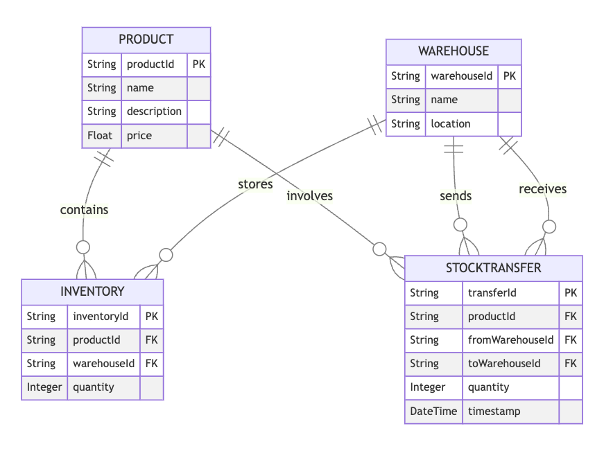
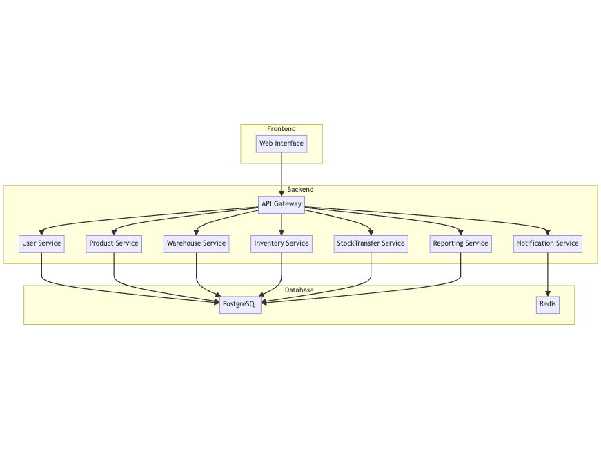

## Problem Statement

Design an inventory management system for an online store that allows users to manage inventory, track stock levels, update product information, and receive alerts for low stock levels.

## Clarification Questions to Interviewer

1. Should the system support user authentication and roles (e.g., admin, warehouse manager)?
2. Are there any specific integrations required with other systems (e.g., ERP, CRM)?
3. Should the system support multi-warehouse inventory management?
4. What are the expected frequencies of inventory updates (e.g., real-time, batch)?
5. Are there specific reporting requirements for inventory data?
6. Should the system support barcode scanning or RFID integration?
7. What are the expected peak loads and transaction volumes?
8. Are there any specific security requirements or compliance standards to follow?

## Requirements

### Functional Requirements

1. Users should be able to add, update, view, and delete products.
2. Users should be able to add, update, view, and delete warehouses.
3. Users should be able to manage inventory, including adding and removing stock.
4. Users should be able to view overall stock levels for a particular product across all warehouses.
5. The system should send alerts for low stock levels.
6. Users should be able to view inventory reports and analytics.
7. The system should support multi-warehouse inventory management.
8. Users should be able to transfer stock between warehouses.
9. The system should log all inventory changes for auditing purposes.

#### Below the line (out of scope)
- Detailed integration with third-party logistics providers.
- Advanced demand forecasting and replenishment algorithms.
- Support for multiple currencies and languages.

### Non-Functional Requirements

1. The system should be highly available.
2. The system should be scalable to handle a large number of users and transactions.
3. The system should ensure data consistency and accuracy.
4. The system should be secure, protecting user data and transactions.
5. The system should have a low response time for inventory operations.

#### Below the line (out of scope)
- Detailed logging and monitoring system.
- Advanced performance optimization.

## Back of Envelope Estimations/Capacity Estimation & Constraints

- Assume an average of 100,000 products in the inventory.
- Peak usage might be around 1,000 concurrent users.
- Each product entry in the inventory could take about 1 KB of storage.
- Estimate of 100 MB storage for product data.
- Daily inventory updates could be around 10,000 transactions.

## High-level API design

### Product APIs

**POST /v1/products**
- Add a new product to the inventory.
- Request Body: `{ "name": "Product Name", "description": "Product Description", "price": 10.99 }`
- Response: `{"success": true, "productId": "abcd1234"}`

**PUT /v1/products/{productId}**
- Update product information.
- Request Body: `{ "name": "Updated Name", "description": "Updated Description", "price": 12.99 }`
- Response: `{"success": true, "product": { ... }}`

**GET /v1/products/{productId}**
- Retrieve a product's details.
- Response: `{"productId": "abcd1234", "name": "Product Name", "description": "Product Description", "price": 10.99 }`

**DELETE /v1/products/{productId}**
- Delete a product from the inventory.
- Response: `{"success": true, "productId": "abcd1234"}`

### Warehouse APIs

**POST /v1/warehouses**
- Add a new warehouse.
- Request Body: `{ "name": "Warehouse Name", "location": "Warehouse Location" }`
- Response: `{"success": true, "warehouseId": "wxyz5678"}`

**PUT /v1/warehouses/{warehouseId}**
- Update warehouse information.
- Request Body: `{ "name": "Updated Name", "location": "Updated Location" }`
- Response: `{"success": true, "warehouse": { ... }}`

**GET /v1/warehouses/{warehouseId}**
- Retrieve a warehouse's details.
- Response: `{"warehouseId": "wxyz5678", "name": "Warehouse Name", "location": "Warehouse Location" }`

**DELETE /v1/warehouses/{warehouseId}**
- Delete a warehouse.
- Response: `{"success": true, "warehouseId": "wxyz5678"}`

### Inventory APIs

**POST /v1/inventory**
- Add inventory to a warehouse.
- Request Body: `{ "productId": "abcd1234", "warehouseId": "wxyz5678", "quantity": 100 }`
- Response: `{"success": true, "inventoryId": "inv7890"}`

**PUT /v1/inventory/{inventoryId}**
- Update inventory information.
- Request Body: `{ "quantity": 150 }`
- Response: `{"success": true, "inventory": { ... }}`

**GET /v1/inventory/{inventoryId}**
- Retrieve inventory details.
- Response: `{"inventoryId": "inv7890", "productId": "abcd1234", "warehouseId": "wxyz5678", "quantity": 100 }`

**DELETE /v1/inventory/{inventoryId}**
- Delete inventory from a warehouse.
- Response: `{"success": true, "inventoryId": "inv7890"}`

**GET /v1/inventory/overall/{productId}**
- Retrieve overall stock levels for a product across all warehouses.
- Response: `{"productId": "abcd1234", "totalQuantity": 500 }`

### Transferring Stock Between Warehouses

**POST /v1/warehouses/transfer**
- Transfer stock between warehouses.
- Request Body: `{ "productId": "abcd1234", "fromWarehouseId": "1234", "toWarehouseId": "5678", "quantity": 20 }`
- Response: `{"success": true, "transferId": "xyz1234"}`

## Data Model

### Entities and Attributes

#### Product
- `productId`: String, primary key
- `name`: String
- `description`: String
- `price`: Float

#### Warehouse
- `warehouseId`: String, primary key
- `name`: String
- `location`: String

#### Inventory
- `inventoryId`: String, primary key
- `productId`: String, foreign key
- `warehouseId`: String, foreign key
- `quantity`: Integer

#### StockTransfer
- `transferId`: String, primary key
- `productId`: String, foreign key
- `fromWarehouseId`: String, foreign key
- `toWarehouseId`: String, foreign key
- `quantity`: Integer
- `timestamp`: DateTime

## High Level System Design

### Components

1. **User Service**: Handles user authentication and management.
2. **Product Service**: Manages product information.
3. **Warehouse Service**: Manages warehouses.
4. **Inventory Service**: Manages inventory levels and adjustments.
5. **StockTransfer Service**: Handles stock transfers between warehouses.
6. **Notification Service**: Sends alerts for low stock levels.
7. **Reporting Service**: Provides inventory reports and analytics.

### Architecture

- **Frontend**: The web interface that users interact with.
- **API Gateway**: Routes requests to appropriate backend services.
- **User Service**: Manages user authentication and profiles.
- **Product Service**: Manages product information.
- **Warehouse Service**: Manages warehouses.
- **Inventory Service**: Manages inventory levels and adjustments.
- **StockTransfer Service**: Handles stock transfers between warehouses.
- **Notification Service**: Sends alerts for low stock levels.
- **Reporting Service**: Provides inventory reports and analytics.
- **PostgreSQL**: Relational database for persistent storage.
- **Redis**: In-memory data store for caching and session management.

## Deep Dive

### Real-time Inventory Tracking

- **Track Stock Levels**: Continuously monitor stock levels across all warehouses.
- **Update Inventory Counts**: As transactions occur (e.g., sales, returns), update the inventory counts in real-time.
- **Order Management**: Process purchase orders and sales orders, integrating with order fulfillment systems to ensure accurate inventory tracking.

### Inventory Snapshots and Auditing

- **Periodic Snapshots**: Take periodic snapshots of inventory levels for reporting and reconciliation purposes.
- **Audit Trail**: Maintain a detailed audit trail of all inventory changes to ensure traceability and support compliance requirements.

### Distributed Transactions

- **Two-Phase Commit (2PC)**: To ensure consistency across services in distributed transactions, implement a two-phase commit protocol.
    - **Phase 1: Prepare**: All participating services prepare to commit the transaction and report back if they are ready.
    - **Phase 2: Commit**: If all services are ready, the coordinator commits the transaction; otherwise, it aborts.

- **Three-Phase Commit (3PC)**: For added reliability in a distributed environment, especially to handle network partitions, use a three-phase commit protocol.
    - **Phase 1: Prepare**: Similar to 2PC, services prepare to commit.
    - **Phase 2: Pre-commit**: An additional step where the coordinator ensures all services are still ready to commit.
    - **Phase 3: Commit**: Finally, commit the transaction if all services confirm their readiness.

- **Optimistic Locking**: Handle concurrent updates to inventory records by implementing optimistic locking. This involves:
    - **Version Numbers**: Each inventory record has a version number.
    - **Check and Update**: When updating a record, the service checks the current version and updates the record only if the version matches. If the version does not match, the update is rejected, and the service can retry.

### Transactions in the System

- **Adding Inventory**: When adding inventory, a transaction includes creating a new inventory record or updating an existing one, and logging the change.
- **Updating Inventory**: For updating inventory levels (e.g., stock adjustments), the transaction includes modifying the inventory count and recording the update in the audit trail.
- **Transferring Stock**: A stock transfer transaction involves updating the inventory counts in both the source and destination warehouses and recording the transfer details.
- **Order Processing**: Processing an order involves multiple steps, including reserving stock, updating inventory counts, and potentially integrating with external order fulfillment systems.

### Notification Service

- **Send Alerts**: Trigger alerts for low stock levels, sending notifications to relevant users. This can involve setting thresholds for each product and warehouse, and monitoring inventory levels to ensure timely alerts.

### Reporting Service

- **Generate Reports**: Provide various inventory reports and analytics, such as stock levels, product performance, and warehouse efficiency. Reports can be generated periodically or on-demand.

## References
* https://systemdesignfightclub.com/inventory/