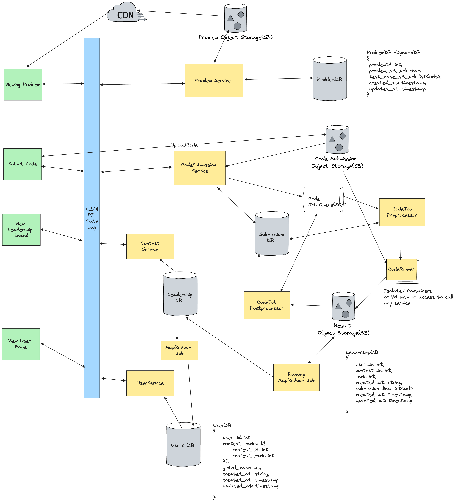

## Problem Statement
Design an online coding contest platform that allows users to participate in coding challenges, submit solutions, and view their scores on a leaderboard. The system should support multiple concurrent contests, provide real-time feedback on submissions, and ensure the integrity of the competition.

## Requirements
### Functional Requirements
* View Problem: Users should be able to view a list of coding problems.
* Submission of Code: Usera should be able to submit code in multiple languages
* User should be able get instant feedback after evaluating the submission to successful or failed.
* Leaderboard: Rank the contentants

#### out of scope
* auth & profiles
* payment
* analytics

### Non-Functional Requirements
* Availability:  Should prioritize availability over consistency. Aim for AP System 
* Consistency - Eventually consistent in all scenarios. Cap Theoreom - AP
* Security - Isolation during code execution and not pose any threat to service. Encyrpt in rest, Encrpt in transist
* Low Latency - Low latency for view problem,and leaderboard
* Read Heavy - Leaderboard. View Problem, Already submitted problems
* Write Heavy - Code Submission

#### out of scope
* GDPR
* CI/CD pipelines
* Regular backups
* Secure transactions over the purcahse

### Assumptions
* Contest is 90 minute long
* 20,000 contestants
* 6 submussion each on avg
* submission should take 5 seconds on processing tims
* submission are 2KB size on average 

## Back of Envelope Estimations/Capacity Estimation & Constraints
### Traffic Estimations
* 20*6 -> 120k submissions
* 90*60=5400 seconds -->120k/6k --> 30 submissions per second (TPS)
### Storage Estimations
* Average size of code submissions: 2KB
* Storage needed for submissions: 120000*2KB=2.4GB(approx)
### Bandwidth Estimations
* 30*2KB = 60KB per second

## High-level API design 
- **View Problems:**
  - `GET /problems/{problemId} --> Problem`: Retrieve problem details.
  - `GET /problems/?page=1&limit=100 ---> List<Problem>`: List paginated problems
- **Submit Code:**
  - `POST /submissions`: Submit code for a problem.
- **Contest Service API:**
  - `GET /leaderboard`: Retrieve the current leaderboard.
- **User Service API:**
  - `GET /users/{userId}`: Retrieve user details and rankings.

## Database Design
- **ProblemDB (DynamoDB):**
  - `problemId (int)`: Unique identifier for the problem.
  - `problem_text_s3 (string)`: S3 URL for problem statement text.
  - `test_cases (list)`: List of test cases s3 urls
  - `created_at (timestamp)`: Creation timestamp.
  - `updated_at (timestamp)`: Last update timestamp.

- **SubmissionsDB:**
  - `submissionId (int)`: Unique identifier for the submission.
  - `userId (int)`: ID of the user who submitted the code.
  - `problemId (int)`: ID of the problem being solved.
  - `code_s3 (string)`: S3 URL for submitted code.
  - `result_s3 (string)`: S3 URL for result of code execution.
  - `submission_status (string)`: Status of the submission (`pending/skipped/failed/errored/passed/running`).
  - `created_at (timestamp)`: Submission timestamp.
  - `updated_at (timestamp)`: Last update timestamp.

- **LeadershipDB:**
  - `userId (int)`: Unique identifier for the user.
  - `contestId (int)`: ID of the contest.
  - `rank (int)`: User’s rank in the contest.
  - `submissionIds (list)`: List of submission IDs.
  - `created_at (timestamp)`: Rank creation timestamp.
  - `updated_at (timestamp)`: Last update timestamp.

- **UserDB:**
  - `userId (int)`: Unique identifier for the user.
  - `contest_ranks (list)`: List of contest rankings.
  - `global_rank (int)`: User’s global rank.
  - `created_at (timestamp)`: User creation timestamp.
  - `updated_at (timestamp)`: Last update timestamp.

## High Level System Design and Algorithm

#### Problem Service and CDN
* **Problem Object Stroage (S3)**: The core of the coding contest platform is its repository of coding problems, which are stored as static text files in an problem object store like S3. Each problem file contains the problem statement, example inputs and outputs, constraints, and any other relevant information that the user needs to understand the problem.
* **CDN Integration**: Use a CDN to deliver problem statements quickly and reliably to users globally, reducing latency and improving user experience.
* **Problem Service**: Allows User to view and list specific problems. There would be internal LB service for admin to manage problems.
* Viewing Problem Flow
  * Users request to view a problem.
  * The request goes through the load balancer/API gateway.
  * The Problem Service retrieves the problem details from the ProblemDB and serves the problem text stored in S3 via CDN for faster access.

### Code Execution Engine

#### Code Submission Service
* Handles user code submissions and manages the upload process to S3.
* It's also created unique submission id for each code submission with submission status as pending.
* Put the submission status as Pending

#### Code Queue
* Manages queued submission requests for orderly and efficient processing.

#### CodeJobPreProcessor
* Validates and prepares code submissions for execution.
* It also decide on the basis of test cases how many code runners to allocate/start for each code execution.
* Put the submission status as running.

#### [Alternative] **Use AWS Step Functions:**
   - **Preprocessing:**
     - The state machine triggers the `CodeJob Preprocessor`.
     - If the code is valid, it moves to the `Job Queue` (SQS) and the state is updated.
     - If the code is invalid, it updates the `SubmissionsDB` with an error status.

   - **Execution:**
     - The `CodeRunner` picks up jobs from the queue and executes the code in an isolated environment.
     - On success, the results are stored in `S3`.
     - On failure or system error, the state machine updates the `SubmissionsDB` accordingly.

   - **Postprocessing:**
     - The `CodeJob Postprocessor` handles the results.
     - It updates `LeadershipDB` and `UserDB` with the relevant information.
#### Benefits of Using Step Functions

- **Orchestration:** Manages the workflow steps, ensuring each stage completes before moving to the next.
- **Error Handling:** Provides mechanisms to handle errors and retries in a controlled manner.
- **Visibility:** Offers detailed logs and tracing for debugging and monitoring the execution flow.
- **Scalability:** Easily scales to handle numerous submissions by leveraging AWS services like SQS and Lambda.

#### Code Runners
* Executes the submitted code in isolated environments (containers or VMs), ensuring security and resource management.

#### Enhanced Security Measures for Container Setup
* **Read-Only Filesystem**: Mount code directory as read-only; output to a temporary directory deleted after execution.
* **CPU and Memory Limits**: Set limits to prevent resource exhaustion; kill containers exceeding these limits.
* **Explicit Timeout**: Wrap code execution in a timeout mechanism to terminate long-running processes.
* **Limit Network Access**: Disable network access within containers; use VPC Security Groups and NACLs in AWS.
*** No System Calls (Seccomp):** Restrict system calls to enhance security and protect the host system.

#### Code Post Processor
Post-execution, the Code Runners compile the results - correctness, performance metrics, and other relevant data - and store them in a metadata DB and object storage. These data will be used to render user’s progress in the profile and during the contest in the leaderboard.

#### Containers, Virtual Machines, and Serverless: Detailed Comparison

| Aspect                  | Containers                                                                              | Virtual Machines (VMs)                                                      | Serverless                                                                                    |
| ----------------------- | --------------------------------------------------------------------------------------- | --------------------------------------------------------------------------- | --------------------------------------------------------------------------------------------- |
| **Definition**          | Lightweight, standalone, and executable packages with everything needed to run software | Fully virtualized environments with their own OS, separated by a hypervisor | Code execution without managing servers; infrastructure managed by the cloud provider         |
| **Isolation**           | Process-level isolation, sharing host OS kernel                                         | Strong isolation with each VM running its own OS instance                   | High isolation with stateless, short-lived function execution                                 |
| **Performance**         | Efficient, with fast startup times                                                      | Heavier, slower to start due to full OS overhead                            | Highly scalable and cost-effective, with pay-per-use model                                    |
| **Resource Usage**      | Lightweight, sharing host OS resources efficiently                                      | Resource-intensive due to full OS and hardware-level isolation              | Minimal resource usage, auto-scaling based on demand                                          |
| **Security**            | Good isolation with proper configuration (e.g., seccomp, network restrictions)          | Robust security with hardware-level isolation                               | High security managed by the provider, but application security is developer’s responsibility |
| **Scalability**         | Easily scalable to handle high loads                                                    | Scalable but with more resource and management overhead                     | Highly scalable, automatically managed by the provider                                        |
| **Management Overhead** | Moderate; requires management of container orchestration (e.g., Kubernetes)             | High; requires management of OS and hypervisor                              | Low; no server management required, handled by the provider                                   |
| **Use Cases**           | Microservices, application deployment, isolated code execution                          | Legacy applications, environments requiring full OS isolation               | Event-driven applications, microservices, short-lived tasks                                   |

#### Recommended Approach for Code Execution in Isolation
For running code submissions in isolation, **containers** are generally recommended due to their balance of efficiency, scalability, and sufficient isolation:

- **Efficiency:** Containers provide fast startup times and are lightweight, which is crucial for handling numerous submissions quickly.
- **Scalability:** They can easily scale to handle high loads, important during peak contest times.
- **Isolation:** Adequate isolation for most scenarios, especially when configured with additional security measures (e.g., seccomp, network restrictions).

For environments with extremely high-security requirements, **VMs** might be preferred due to their stronger isolation. **Serverless** is an option for specific use cases where scalability and cost are more critical, though they may not offer the same level of control and consistency needed for running complex code submissions.

### Contest Leaderboard

#### Data Extraction
The process begins with data extraction from the Submission Object Store. This store contains all user submissions, including code, execution results (like pass/fail status, execution time, and memory usage), and user identifiers. For leaderboard computation, key information such as submission time, problem ID, user ID, and execution success is crucial.

#### Data Extraction
Data extraction begins with retrieving user submissions from the Submission Object Store, which contains details such as code, execution results (pass/fail, execution time, memory usage), and user identifiers. Key information needed includes submission time, problem ID, user ID, and execution success.

#### Data Processing
After extraction, data is processed to compute rankings using both batch and streaming processes.

- **MapReduce for Batch Processing**: 
  - **Map Phase**: Submissions are categorized and organized by mapping each submission to its corresponding problem and user.
  - **Reduce Phase**: Aggregated submissions are used to compute metrics such as total problems solved, average execution time, and success rate for each user.

- **Streaming for Real-Time Updates**: 
  - These processes continuously monitor the submission object store for new data.
  - New submissions are instantly processed to update metrics like recent problem solves or execution time improvements in real-time.

## Open Questions
## References
* https://www.hellointerview.com/learn/system-design/answer-keys/leetcode
* https://systemdesignfightclub.com/coding-contest/
* https://blog.crushingtecheducation.com/p/design-a-coding-contest-platform