## Problem Statement
Facebook Live Comments is a feature that enables viewers to post comments on a live video feed. Viewers can see a continuous stream of comments in near-real-tim

## Clarification Questions to Interviewer 
1. What are the primary use cases of the system?
2. Do live commenting service support only text?
3. Are the clients distributed across the globe?
4. What is the amount of Daily Active Users (DAU)?
5. What is the system’s total number of daily live videos?
6. What is the average amount of live comments on a live video?
7. What is the anticipated read: write ratio of live comments?
8. What is the peak amount of concurrent users watching the same live video?
9. Should the comments on streamed videos be archived to save storage?
## Requirements
### Functional Requirements
1. Viewers can post comments on a Live video feed.
2. Viewers can see all comments in near real-time as they are posted.
3. Viewers can see comments made before they joined the live feed.
#### Below the line (out of scope)
1. Viewers can reply to comments.
2. Viewers can react to comments.


### Non-Functional Requirements
1. The system should scale to support millions of concurrent viewers and thousands of comments per second.
2. The system should prioritize availability over consistency, eventual consistency is fine.
3. The system should have low latency, broadcasting comments to viewers in near-real time.

#### Below the line (out of scope)
1. The system should be secure, ensuring that only authorized users can post comments.
2. The system should enforce integrity constraints, ensuring that comments are appropriate (i.e., not spam, hate speech, etc.).

## Back of Envelope Estimations/Capacity Estimation & Constraints
## Core Entities
* Comments
* Live Video 
* User
## High-level API design 
* POST endpoint to create a comment.
```
POST /comment/create
Header: JWT | SessionToken
{
    "liveVideoId": "123",
    "message": "Cool video!"
} 
```
*  GET endpoint fetch past comments for a given live video.
```
GET /comments/:liveVideoId
```
## Data Model
* Comments Table
* Video Table
* Users Table
## High Level System Design

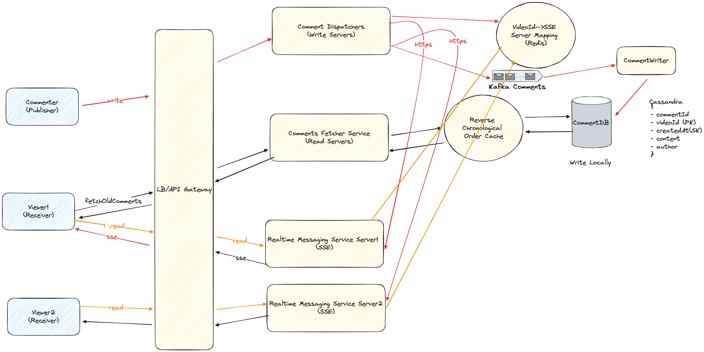

## Deep Dive
### Viewers/Receivers can see all comments in near real-time as they are posted
#### Polling
##### Pros
1. Simplicity in implementation.
2. Works well for low-frequency updates.

##### Cons
1. Inefficient and resource-intensive.
2. Higher latency in receiving comments.
3. Increased load on servers due to repeated requests.

#### Websockets
##### Pros
1. Full-duplex communication, allowing real-time data exchange.
2. Efficient and low-latency updates.
3. Reduced server load compared to polling.

##### Cons
1. More complex to implement and manage.
2. Not all client environments support WebSockets.
3. Requires maintaining long-lived connections.

#### [Recommended] Server-Sent Events (SSE)
##### Pros
1. Simple to implement on both server and client sides.
2. Efficient for one-way communication from server to client.
3. Works over standard HTTP, hence widely supported.

##### Cons
1. Only supports one-way communication.
2. Not suitable for two-way interaction without additional mechanisms.
3. Limited browser support compared to WebSockets.

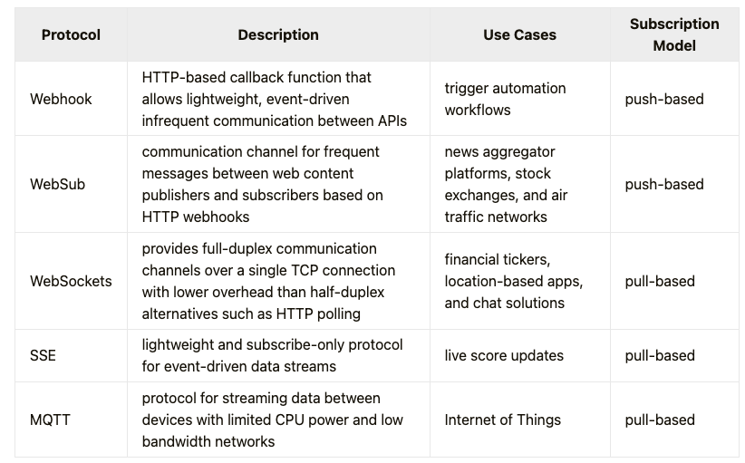


### How does the viewer/receiver subscribe to a specific live video?
The client must subscribe to a live video for viewing the live comments. The client executes an HTTP PUT request for subscribing to a live video. The PUT requests are idempotent. The PUT method is used instead of the GET method because the in-memory subscription store will be modified when a client subscribes to a live video.
```
/videos/:video-id/subscriptions
method: PUT
accept: text/event-stream
authorization: Bearer <JWT>
content-length: 20
content-type: application/json
content-encoding: gzip
{
  user_id: <int>
}
```
The accept: text/event-stream HTTP request header indicates that the client is waiting for an open connection to the event stream from the server to fetch live comments 9. The server responds with status code 200 OK on success.
```
status code: 200 OK
content-type: text/event-stream
```
The content-type: text/event-stream HTTP response header indicates that the server established an open connection to the event stream to dispatch events to the client. The response event stream contains the live comments.


### How does the viewer/receiver unsubscribe from a live video?
The client should unsubscribe from a live video to stop receiving live comments. The client executes an HTTP DELETE request for unsubscribing from a live video 9. The DELETE requests are idempotent.
```
/videos/:video-id/subscriptions/:subscription-id
method: DELETE
authorization: Bearer <JWT>
```
The server responds with status code 200 OK on success.
```
status code: 200 OK
```
The server responds with status code 204 No Content when the client successfully unsubscribes from a live video. The HTTP response body will be empty.
```
status code: 204 No Content
```
### Viewers/Receivers can see comments made before they joined the live feed
#### Bad Solution - Offset Pagination

##### How it Works
- In offset pagination, the client specifies the number of items to skip and the number of items to fetch.
- The API call might look like: `GET /comments/:liveVideoId?offset=20&limit=10`

##### Pros
1. **Simplicity**: Easy to implement and understand.
2. **Uniform**: Works well for static datasets.
3. **Database Support**: Supported by most databases with straightforward SQL queries (`LIMIT` and `OFFSET`).

##### Cons
1. **Inefficiency with Large Data**: Becomes inefficient for large datasets as the offset increases, leading to slower queries.
2. **Inconsistent Results**: When data changes frequently, it may cause missing or duplicate records if new comments are added or existing ones are deleted during pagination.
3. **Performance Issues**: Can cause performance degradation with deep pagination as the database needs to count and skip records.

#### Good Solution - Cursor Pagination

##### How it Works
- In cursor pagination, the client uses a cursor (a unique identifier of the last fetched item) to fetch the next set of items.
- The API call might look like: `GET /comments/:liveVideoId?cursor=lastCommentId&limit=10`

##### Pros
1. **Efficiency**: More efficient than offset pagination for large datasets because it doesn't require skipping records.
2. **Performance**: Provides better performance with large datasets and high-frequency updates.
3. **Consistency**: Handles frequent data changes more gracefully, reducing the chances of missing or duplicate records.

##### Cons
1. **Complexity**: More complex to implement and understand.
2. **Stateful**: Requires maintaining state (cursor) on the client side.
3. **Indexing Requirement**: Requires proper indexing to be efficient, which might add overhead in terms of database maintenance.

#### [Recommended] Cursor Pagination with Prefetching and Caching

##### How it Works
- This method is an enhancement of cursor pagination where additional data is prefetched and cached on the client side to minimize latency and database queries.
- The API call might still look like cursor pagination: `GET /comments/:liveVideoId?cursor=lastCommentId&limit=10`
- However, the client fetches more comments in advance and stores them in a cache.

##### Pros
1. **Reduced Latency**: Prefetching reduces latency as data is readily available in the cache.
2. **Better User Experience**: Provides a smoother user experience by minimizing load times for subsequent requests.
3. **Reduced Server Load**: Reduces the number of requests to the server by fetching larger batches and storing them locally.

##### Cons
1. **Increased Complexity**: Adds complexity to both the server and client implementations.
2. **Stale Data**: Prefetched data might become stale if there are frequent updates, requiring a mechanism to refresh the cache.
3. **Resource Consumption**: Requires more memory on the client side to store prefetched data.

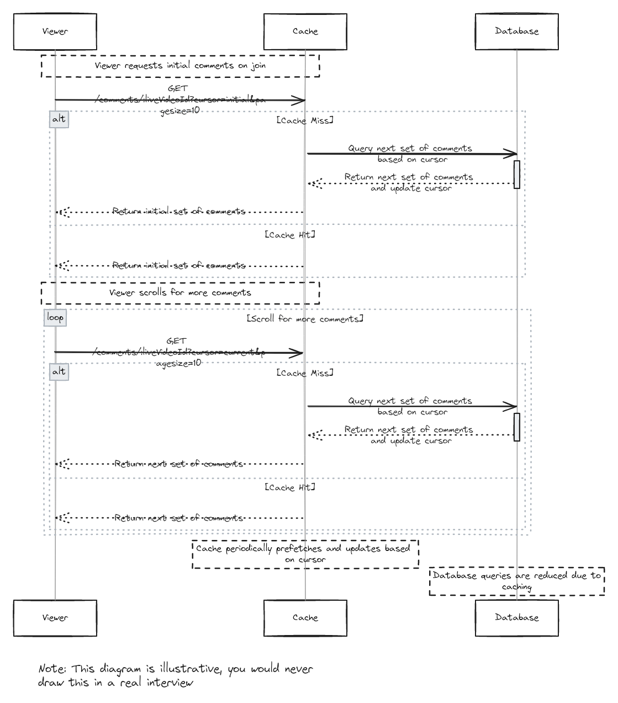

### Global Comments Handling on Live Video
#### Bad Solution - Write Globally and Read Locally
##### How it Works
- Data is asynchronously replicated across global database servers.
- Reads are always performed on the local database server.

##### Pros
1. Local read operations are fast and efficient.
2. Simplifies read operations by using local data centers.

##### Cons
1. **High Bandwidth Usage**: Significant bandwidth required for global data replication.
2. **Latency Issues**: Asynchronous replication leads to delays, causing comments to appear non-real-time.
3. **Poor Overall Latency**: Combined write and replication delays can degrade user experience.
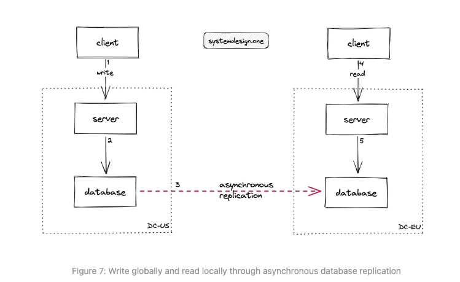


#### Bad Solution -  Pull Based Write Locally and Read Globally
##### How it Works
- Data is written to the local database server.
- Reads query all data centers globally to consolidate comments.

##### Pros
1. Reduces bandwidth usage as data is not replicated globally.
2. Local writes are fast and efficient.

##### Cons
1. **Degraded Latency**: Reading from multiple data centers increases read latency.
2. **Complex Read Operations**: Consolidating data from multiple locations adds complexity.

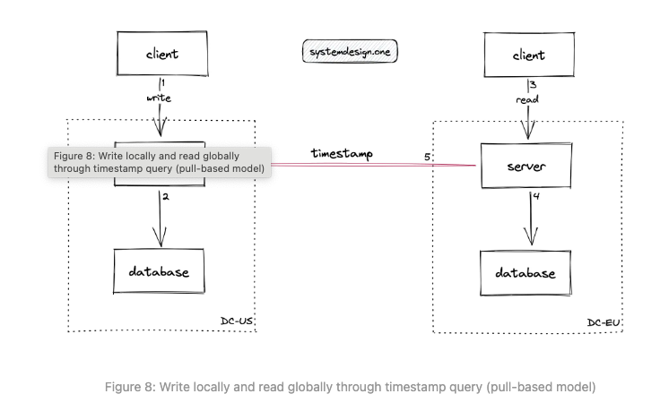


#### [Recommended] Push Based Write Locally and Read Globally
##### How it Works
- Data is written to the local database server.
- Writes are broadcast to multiple data centers globally.
- Clients read from local data centers.

##### Pros
1. **Reduced Bandwidth Usage**: Only relevant data is pushed globally, minimizing bandwidth consumption.
2. **Improved Latency**: Real-time comments are achievable due to immediate broadcasting.

##### Cons
1. **Implementation Complexity**: Requires robust infrastructure to handle global broadcasting efficiently.
2. **Slight Write Overhead**: Additional processing to broadcast writes globally.

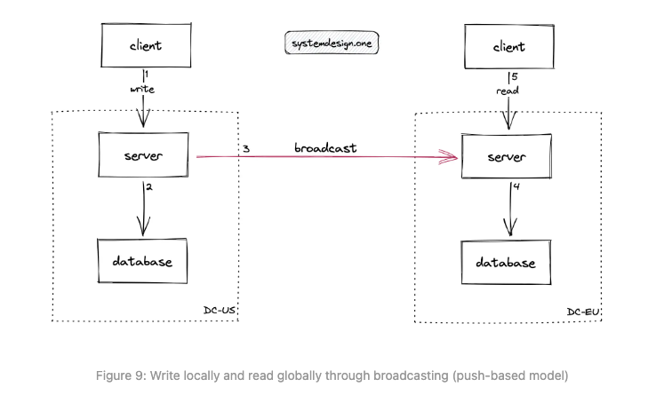

### Distribution of Live Comments

#### Live Commenting With  Pub-Sub Server Partitioned into Topics per Live Video
Publish-Subscribe (pub-sub) pattern allows services running on distinct technologies to communicate with each other 11. The pub-sub technique using the message bus enables a producer to send live comments (messages) to multiple consumers. The services can communicate with each other instantly without having preset intervals for polling data from relevant data sources in a reactive architecture

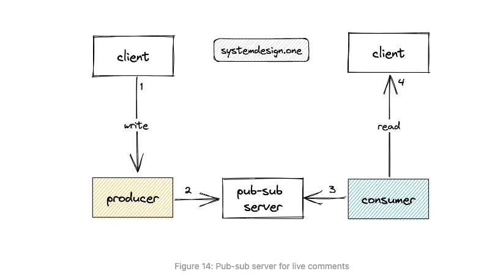
#### Bad Solution - Using Apache Kafka as the Pub-Sub Server
###### How it Works
- Kafka decouples producers and consumers.
- Consumers pull messages from Kafka topics.

##### Pros
1. **Scalable**: Can handle large volumes of messages.
2. **Ordering Guarantees**: Maintains order of messages.

##### Cons
1. **Latency**: Consumers use a pull-based model leading to delays.
2. **Scalability Issues**: High overhead with many consumers.
3. **Operational Complexity**: Managing Kafka is challenging.

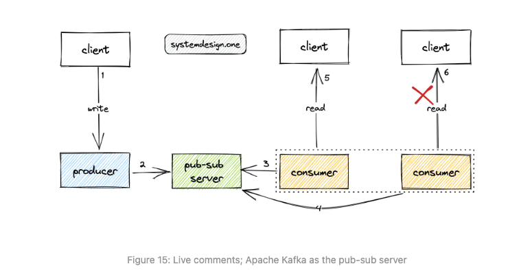

#### Good Solution - Using Redis as the Pub-Sub Server
##### How it Works
- Uses Redis to transmit comments between nodes.
- Consistent hashing for load balancing.

##### Pros
1. **Simple Implementation**: Easier to set up than Kafka.
2. **Low Latency**: Faster message delivery.

##### Cons
1. **No Message Persistence**: Messages can be lost.
2. **No Delivery Guarantees**: Relies on TCP connection stability.
3. With the load balancer using round robin, there's a risk that a server could end up with viewers subscribed to many different streams,
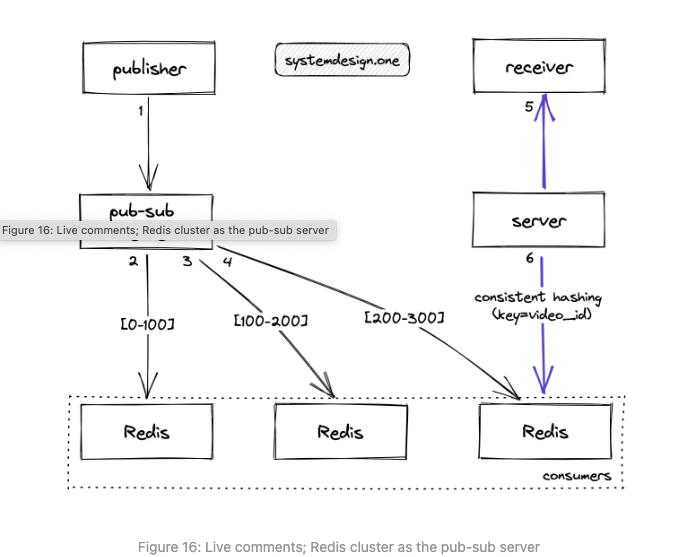

#### [Recommended] Scalable Dispatcher
##### How it Works
- Uses an in-memory subscription store (Redis) and a disk-based endpoint store.
- Maps live videos to client connections and gateway servers.

##### Steps
1. Receiver subscribes to a live video.
2. Gateway server updates subscription and endpoint stores.
3. Publisher writes a comment.
4. Dispatcher queries endpoint store for subscribed gateways.
5. Dispatcher forwards comment to gateways.
6. Gateway servers send comments to clients.

##### Pros
1. **Scalable**: Efficiently handles large volumes of comments.
2. **Real-Time**: Provides near real-time comment delivery.
3. **Reliable**: Uses heartbeat signals and TTL keys to manage subscriptions.

##### Cons
1. **Complex Implementation**: Requires managing multiple stores and synchronization.
2. **Resource Intensive**: Needs robust infrastructure for in-memory and disk-based storage.

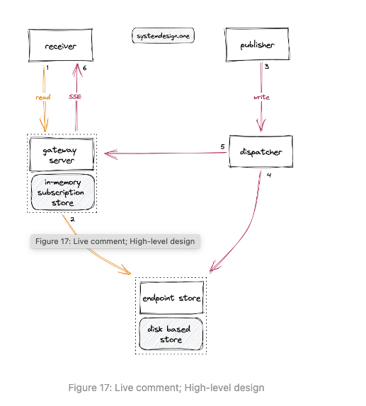

### How to Deploy the Live Comment Service Across Multiple Data Centers?
1. GeoDNS routes the live comment to a dispatcher in the nearest data center.
2. Dispatcher broadcasts the live comment to dispatchers in peer data centers over HTTP.
3. Dispatcher queries the local endpoint store to check for subscribed gateway servers.
4. Subscribed gateway servers query the local in-memory subscription store for clients.
5. Gateway servers fan out the live comment to subscribed clients over SSE.

#### Alternatives
1. Cross-data center subscription: Poor performance and latency due to frequent updates.
2. Global endpoint store: Potential inconsistency and poor latency due to eventual consistency.

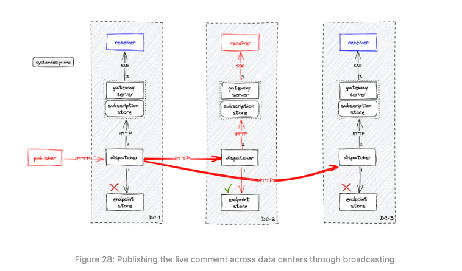


## References
* https://www.hellointerview.com/learn/system-design/answer-keys/fb-live-comments
* https://systemdesign.one/live-comment-system-design/