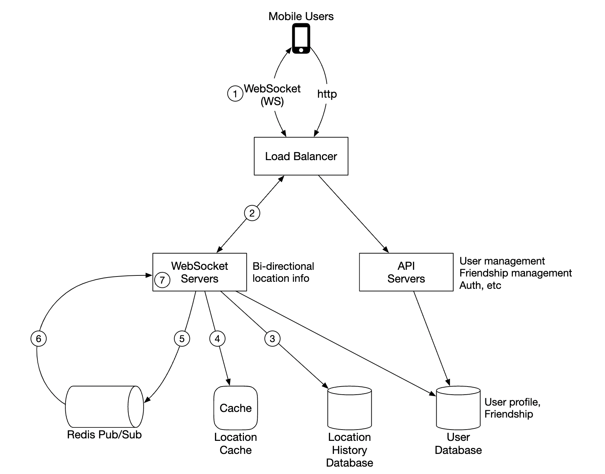
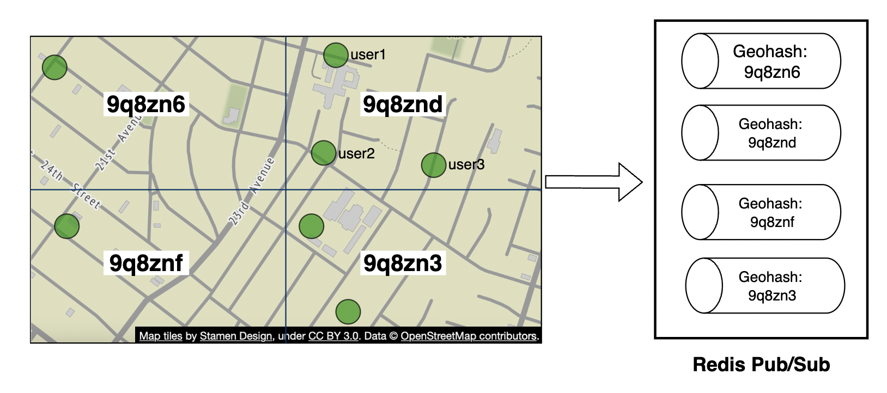
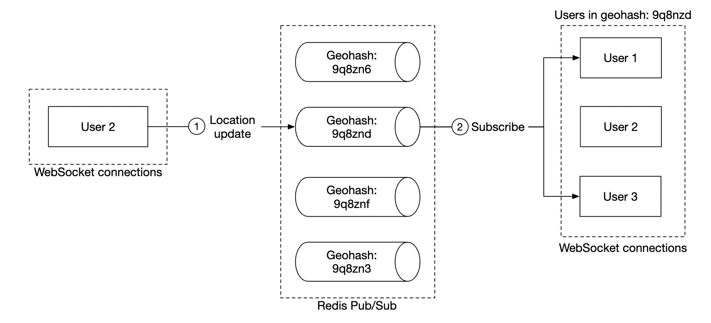

## Problem Statement
Design a scalable backend for an application that enables users to share their location and discover friends who are nearby. 
The system must handle real-time location updates and support a large user base.

## Clarification Questions to Interviewer 
1. What is considered "nearby" for friends?
   - **5 miles, configurable.**
2. Is distance calculated as straight-line distance?
   - **Yes.**
3. How many users does the app have?
   - **1 billion users, with 10% using the nearby friends feature.**
4. Do we need to store location history?
   - **Yes, for machine learning and other purposes.**
5. Do inactive friends disappear from the feature after a certain time?
   - **Yes, after 10 minutes.**
6. Are there any GDPR or privacy concerns to address?
   - **No, simplified for this scope.**

## Requirements
### Functional Requirements
1. **Nearby Friends List**: Display nearby friends with distance and timestamp.
2. **Real-time Updates**: Update the nearby friends list every few seconds.
3. **Configurable Radius**: Allow users to set the radius for 'nearby' friends.
4. **Entry/Exit Notifications**: Notify users when friends enter or leave the radius.
#### Below the line (out of scope)
- Integration with social media platforms.
- Detailed analytics on user movements.
- In-depth user profile management.
### Non-Functional Requirements
1. **Low Latency**: Ensure minimal delay for location updates.
2. **Availability**: Provide high availability with minimal downtime. Aiming for AP system
3. **Eventual Consistency**: Acceptable slight delays in location data replication.
4. **Scalability**: Efficiently handle millions of users and high throughput.
#### Below the line (out of scope)
- Offline mode support.
- GDPR and privacy regulation compliance (simplified).
- Advanced security features beyond standard practices.

## Back of Envelope Estimations/Capacity Estimation & Constraints
### Assumptions
- **Nearby friends radius**: 5 miles
- **Location refresh interval**: 30 seconds
- **Daily active users**: 100 million
- **Concurrent users**: 10 million (10% of daily active users)
- **Average friends per user**: 400
- **Displayed nearby friends per page**: 20

### Traffic Estimates
- **Location updates per second (LUPS)**:
  - Total location updates per day: ``100 million * 48 updates/day =  4.8 billions updates/day``
  - Average updates per second: ``4.8 billion/86400 ~ 55,555 updates/second``
- **Read requests per second (RPS)**:
  - Assuming each user checks for nearby friends once per minute: ``10 million * 60 = 600 million read requests/day``
  - Average read requests per second: ``600 million/86400 seconds ~ 6944 reads/second``
- **Write requests per second (WPS)**:
  - Considering location updates: ``55,555 updates/second``

### Storage Estimates
- **Location data**:
  - Assuming each location update is 100 bytes: ``4.8 billion updates/day * 100 bytes = 480 GB/day``
  - Monthly storage for location data: ``480GB/day *30 = 14.4 TB/month``
- **User data and friendships**:
  - Assuming each user record is 1 KB: ``1 billion users * 1 KB = 1 TB``
  - Assuming each friendship record is 0.1 KB: ``400 billion friendships  * 0.1 KB = 40 TB``

## High-level API design 
### WebSocket Routines
1. **WebSocket Client Initialization**: Client sends user location, server sends back nearby friends' location data.
   - Client to Server: `{ "type": "initialize", "userId": "string", "latitude": "float", "longitude": "float" }`
   - Server Response: `{ "type": "initial_nearby_friends", "friends": [ { "userId": "string", "latitude": "float", "longitude": "float", "timestamp": "ISO 8601" } ] }`
1. **Periodic Location Update**: User sends location data to WebSocket server.
   - Client to Server: `{ "type": "location_update", "userId": "string", "latitude": "float", "longitude": "float", "timestamp": "ISO 8601" }`
   - Server Response: `{ "status": "success" }`

1. **Client Receives Location Update**: Server sends friend's location data and timestamp.
   - Server to Client: `{ "type": "friend_location_update", "friendId": "string", "latitude": "float", "longitude": "float", "timestamp": "ISO 8601" }`

1. **Subscribe to a New Friend**: WebSocket server sends a friend ID mobile client is supposed to track (e.g., when a friend appears online for the first time).
   - Server to Client: `{ "type": "subscribe_friend", "friendId": "string" }`

1. **Unsubscribe a Friend**: WebSocket server sends a friend ID, mobile client is supposed to unsubscribe from (e.g., when a friend goes offline).
   - Server to Client: `{ "type": "unsubscribe_friend", "friendId": "string" }`

All communication between the client and server happens through WebSocket messages, ensuring efficient real-time updates.

## Data Model Design
1. **Users**
   - `userId`: String (Primary Key)
   - `name`: String
   - `email`: String
   - `password`: String (hashed)
   - `visibility`: Boolean
   - **Database Choice**: PostgreSQL or MySQL for their relational capabilities and ACID compliance.
2. **Location Cache**
   - `userId`: String (Primary Key, Foreign Key to Users)
   - `latitude`: Float
   - `longitude`: Float
   - `timestamp`: DateTime
   - **Cache Choice**: Redis for its in-memory storage, high performance, and support for TTL (Time-to-Live) to automatically remove inactive users' data.

3. **Location History**
   - `historyId`: String (Primary Key)
   - `userId`: String (Foreign Key to Users)
   - `latitude`: Float
   - `longitude`: Float
   - `timestamp`: DateTime
   - **Database Choice**: Cassandra for its distributed architecture, write optimization, and high availability, making it suitable for storing large volumes of historical location data.

## High Level System Design

* Mobile client sends a location update to the load balancer
* Load balancer forwards location update to the websocket server's persistent connection for that client
* Websocket server saves location data to location history database
* Location data is updated in location cache. Websocket server also saves location data in-memory for subsequent distance calculations for that user
* Websocket server publishes location data in user's channel via redis pub sub
* Redis pubsub broadcasts location update to all subscribers for that user channel, ie servers responsible for the friends of that user
* Subscribed web socket servers receive location update, calculate which users the update should be sent to and sends it
* More detailed version of the same flow:

## Deep Dive
### Scaling Components
#### API Servers
- Easily scaled via autoscaling groups and server replication.
#### WebSocket Servers
- Scalable by adding more servers.
- Graceful shutdowns for maintenance by marking servers as "draining." we can mark a server as "draining" in the load balancer and stop sending connections to it, prior to being finally removed from the server pool
#### Client Initialization
- When a client connects, it fetches friends, subscribes to their channels on Redis Pub/Sub, and fetches locations from cache and finally forwards to client
#### User Database
- Sharded based on `user_id`.
- Expose user/friends data via dedicated service and API.
#### Location Cache
- Sharded Redis nodes with TTL for memory management.
- Handles large write loads.
#### Redis Pub/Sub Server
- No memory consumption for inactive channels.
- Pre-allocate channels for users of the nearby friends feature.

### Scaling Redis Pub/Sub
- **Distributed Redis Cluster**: Use a distributed Redis cluster to handle the high throughput of location updates.
- **Service Discovery**: Utilize service discovery tools like Zookeeper or etcd to manage Redis servers and track which servers are alive.
- **Memory Management**: Maintain around 200GB of memory for channels using two 100GB Redis servers.
- **Handling High Throughput**: Support up to 14 million location updates per second by using approximately 140 Redis servers.
- **Consistent Hashing**: Use consistent hashing to minimize the movement of channels when scaling the cluster up or down. This helps in reducing the resubscription load on WebSocket servers and ensures minimal disruption during scaling operations.
### Adding/Removing Friends
- WebSocket server subscribes/unsubscribes from friend channels.
- Mobile client sends messages to WebSocket server for appropriate actions.
### Users with Many Friends
- Cap on the number of friends (e.g., 5000 max).
- Handle higher load for users with many friends by distributing across WebSocket servers.
### Nearby Random Person Feature
- Define a pool of pub/sub channels based on geohash.

- Subscribe to appropriate channels for random user updates within geohash boundaries.

- User could also subscribe to several geohashes to handle cases where someone is close but in a bordering geohash:
### Redis Pub/Sub vs Kafka
- **Redis Pub/Sub**:
  - Low latency and lightweight, making it suitable for real-time updates with high throughput.
  - In-memory storage optimal for transient data like location updates.
  - Simple implementation for real-time messaging.

- **Kafka**:
  - Designed for high throughput and persistent storage, more suitable for durable message storage and long-term data processing.
  - Higher latency compared to Redis.
  - Overhead of managing persistence, which is unnecessary for transient location updates.

### How WebSocket Connection Subscribes to Redis Pub/Sub Channel
- **Subscription Process**:
  - When a client connects, the WebSocket server subscribes to Redis Pub/Sub channels for that user's friends.
  - Redis channels are pre-allocated for each user to avoid delays when subscribing.
  - The WebSocket server listens for messages on these channels and forwards location updates to the connected client.
  - Upon receiving a location update from a client, the WebSocket server publishes the update to the appropriate Redis Pub/Sub channel.
  - Other WebSocket servers subscribed to that channel receive the update and send it to their respective clients.

## References
* https://github.com/preslavmihaylov/booknotes/tree/master/system-design/system-design-interview/chapter18
*