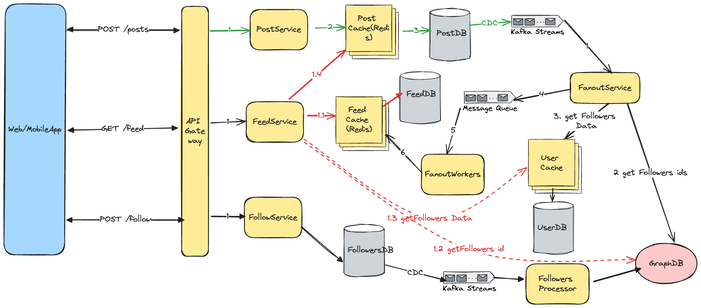

## Problem Statement
Design a scalable and efficient news feed system  similar to those used in social media platforms(like Twitter, Facebook, and Instagram). The system should allow users to see a feed of recent updates from their friends or followed accounts, display posts, and handle high traffic and large amounts of data.

## Clarification Questions to Interviewer 

## Requirements
### Functional Requirements
1. **Post Publishing**: Users can create/update posts (text, images, videos).
2. **Following/Friending**: Users can follow or friend others.
3. **Newsfeed Building**: Users can view a feed of posts from followed users, ordered by relevance and recency.
4. **Paging**: Users can page through their feed.

#### Below the line (out of scope):
* **Personalization**: Feed is personalized and ordered by relevance and recency.
* Users should be able to like and comment on posts.
* Posts can be private or have restricted visibility.

### Non-Functional Requirements
* **Availability(AP):** The system should be highly available (prioritizing availability over consistency). 
* **Consistency**: Ensure eventual consistency within 2 minutes.
* **Performance**: Posting and viewing the feed should be fast, returning in < 500ms.
* **Scalability**: Handle up to 2 billion users, with high traffic.
* **Fault Tolerance**: The system should gracefully handle server failures.
* **Security**: Protect user data and ensure privacy settings are respected.

## Back of Envelope Estimations/Capacity Estimation & Constraints
* User Base: 2 billion  users
* Active Users: 20M DAU
* Reads per User per Day: 50 (feed loads)
* Average Posts per User per Day: 2
* R:W Ratio = 25:1

### Traffic Estimates
* Read Requests per Second (RPS): 20 million daily active users * 50 reads/day ~ 240 * 50 ~ 1200 
* Write Requests per Second (RPS): 20 million daily active users * 2 posts/day / 86400 seconds/day ~ 480
### Storage Estimates
* Each post (including metadata) ~ 1 KB
* Total posts per day = 20 million users * 2 posts = 40 million posts
* Storage per day = 40 million * 1 KB = 40 GB/day

## High-level API design 
### Post APIs
- **Create Post**
    ```json
    POST /posts
    Request {
        "auth_token": "string",
        "content": {
            "text": "string",
            "media_url": "string"
        }
    }
    Response {
        "postId": "string"
    }
    ```


- **Get Post Details**
    ```json
    GET /posts/{id}
    Request {
        "auth_token": "string",
        "id": "string"
    }
    Response {
        "postId": "string",
        "userId": "string",
        "content": {
            "text": "string",
            "media_url": "string"
        },
        "createdAt": "timestamp",
        "updatedAt": "timestamp"
    }
    ```

### Feed APIs
- **Get User Feed**
    ```json
    GET /feed
    Request {
        "auth_token": "string",
        "max_items": "int",
        "next_token": "string"
    }
    Response {
        "items": [{
            "postId": "string",
            "userId": "string",
            "content": {
                "text": "string",
                "media_url": "string"
            },
            "createdAt": "timestamp"
        }],
        "next_token": "string"
    }
    ```

## Data Model

#### UserDB (PostgreSQL)
- **Users Table**
    | Field       | Type      | Description              |
    |-------------|-----------|--------------------------|
    | user_id     | VARCHAR   | Primary Key              |
    | name        | VARCHAR   |                          |
    | email       | VARCHAR   | Unique                   |
    | created_at  | TIMESTAMP | Default: CURRENT_TIMESTAMP |
    | updated_at  | TIMESTAMP | Default: CURRENT_TIMESTAMP |
    | is_celebrity| BOOLEAN   | Indicates if the user is a celebrity |

#### PostDB (DynamoDB)
- **Posts Table**
    | Attribute        | Type   | Description                           |
    |------------------|--------|---------------------------------------|
    | post_id          | String | Partition Key                         |
    | user_id          | String | GSI Partition Key                     |
    | timestamp        | String | Sort Key (ISO 8601 timestamp format)  |
    | content          | String | Content of the post                   |
    | media_url        | String | URL of the media associated with post |
    | created_at       | String | ISO 8601 timestamp format             |
    | updated_at       | String | ISO 8601 timestamp format             |
    | privacy_settings | String | Privacy settings for the post         |

#### Global Secondary Index (GSI)
- **Index Name**: `UserPostsIndex`
- **Partition Key**: `user_id` (String)
- **Sort Key**: `timestamp` (String)
- **Attributes Projected**: `post_id`, `content`, `media_url`, `created_at`, `updated_at`, `privacy_settings`

#### FollowersDB (Neo4j)
- **User Node**
    | Property   | Type    | Description |
    |------------|---------|-------------|
    | user_id    | STRING  | Primary Key |
    | name       | STRING  |             |
    | email      | STRING  |             |
    | created_at | INTEGER | Timestamp   |

- **FOLLOWS Relationship**
    | Property   | Type    | Description |
    |------------|---------|-------------|
    | since      | INTEGER | Timestamp   |

#### FeedDB (Cassandra)
- **Feeds Table**
    | Column     | Type       | Description                              |
    |------------|------------|------------------------------------------|
    | user_id    | TEXT       | Primary Key                              |
    | feed_items | LIST<FROZEN<TUPLE<TEXT, TEXT, TEXT>>> | List of (friend_id, post_id, timestamp) |
    | updated_at | TIMESTAMP  | Last updated timestamp                   |


### Cache Design
- **User Cache**: Cache frequently accessed user data to reduce load on UserDB (Write-through cache).
- **Feeds Cache**: Cache user feeds to provide quick access and reduce load on FeedDB (Read-through/Write-through cache).
- **Post Cache**: Cache recent posts to quickly serve feed requests and reduce load on PostDB (Cache-aside).

### Feed Cache Structure
- **Data Store**: Redis
- **Key Pattern**: `feed:{user_id}`
- **Value Structure**: 
  - **Sorted Set** for ordering by timestamp.
    ```redis
    ZADD feed:user123 1627552222 "post456"
    ZADD feed:user123 1627553333 "post789"
    ```
  - **Hash** for author association.
    ```redis
    HSET feed:user123:posts "post456" "authorA"
    HSET feed:user123:posts "post789" "authorB"
    ```

### Efficient Operations
1. **Add Post to Feed**:
   - Sorted Set: 
     ```redis
     ZADD feed:{user_id} {timestamp} {post_id}
     ```
   - Hash:
     ```redis
     HSET feed:{user_id}:posts {post_id} {author_id}
     ```

2. **Retrieve Feed Ordered by Timestamp**:
   ```redis
   ZRANGE feed:{user_id} 0 -1 WITHSCORES
   ```

3. **Remove Posts from Unfollowed User**:
   - Identify posts from the unfollowed user:
     ```redis
     HGETALL feed:{user_id}:posts
     ```
   - Remove posts from Sorted Set and Hash:
     ```redis
     ZREM feed:{user_id} {post_id1} {post_id2}
     HDEL feed:{user_id}:posts {post_id1} {post_id2}
     ```

### Summary
- **UserDB (PostgreSQL)**: Manages user data with strong ACID properties and complex queries.
- **PostDB (DynamoDB)**: Stores posts with `user_id` as the partition key and `timestamp` as the sort key for efficient querying by user and time.
- **FollowersDB (Neo4j)**: Handles follow relationships efficiently using graph-based data modeling.
- **FeedDB (Cassandra)**: Manages user feeds with high availability, fault tolerance, and efficient read/write operations, including friend_id along with post_id in feed_items.

## High Level System Design 



### [Feed Generation/Publishing] Creating a Post
* When a user creates a post, it is written to a database table for Posts.
* A change data capture (CDC) system like Kafka captures this insert and pushes the new post to a stream processing system.

### [Feed Generation/Publishing] Consuming the Post Stream - Fanout Service 
* The stream processor consumes the post stream from Kafka.
* For each new post, it looks up the author's followers from the Follow GraphsDB.
* It fanouts the new post to each follower's feed in a distributed feed cache like Redis.

### [Feed Retrieval] Retrieving the User's Feed
* When a user requests their feed, the application server queries the Redis feed cache for that user's feed data.
* If a user is following any celebrities whose posts can be synced in the feed, those latest posts are queried from PostDB.
* The feed posts are rendered on the client with infinite scrolling.
* As the user scrolls, more posts are fetched from Redis via lazy loading.

### Feed Ranking
* The posts in the feed can be ranked based on factors like:
    * Closeness of relationship between user and post author
    * Post recency and time decay
    * Post engagement (likes, comments, etc.)
    * Machine learning models for personalized ranking
* Other critical components are a robust caching layer, content delivery networks for serving media, sharding and replication of databases and caches to scale.
* The key principles are separating read/write paths, using caching extensively, pre-computing/ranking feeds for optimized performance, and designing for horizontal scalability from the ground up.

### [Follow Service] Managing Follow and Unfollow Operations

#### Follow Service Workflow
1. **Follow Request**:
   - The user sends a follow request to the application server.
   - The server processes the request and updates the Follow GraphsDB asynchronously.

2. **Unfollow Request**:
   - The user sends an unfollow request to the application server.
   - The server processes the request and updates the Follow GraphsDB asynchronously.

#### Updating the GraphDB
- **Neo4j Database**: Manages follow relationships.
  - **User Node**:
    ```cypher
    CREATE (u:User {user_id: $user_id, name: $name, email: $email, created_at: timestamp()})
    ```
  - **Follow Operation**:
    ```cypher
    MATCH (u:User {user_id: $user_id})
    MATCH (f:User {user_id: $followee_id})
    MERGE (u)-[:FOLLOWS {since: timestamp()}]->(f)
    ```
  - **Unfollow Operation**:
    ```cypher
    MATCH (u:User {user_id: $user_id})-[r:FOLLOWS]->(f:User {user_id: $followee_id})
    DELETE r
    ```

#### Asynchronous Feed Updates upon Follow/Unfollow
- **Follow**:
  - Adds the followee’s recent posts to the follower’s feed in FeedDB asynchronously.
  - Retrieves followee's recent posts from PostDB and updates the follower's feed cache in Redis asynchronously.

- **Unfollow**:
  - Removes the followee’s posts from the follower’s feed in FeedDB asynchronously.
  - Identifies and removes the posts from the unfollowed user in the follower's feed cache in Redis asynchronously.


## Deep Dive

### Handle users who are following a large number of users vs Handle users with a large number of followers?
* Handle users who are following a large number of users - Fanout on Write (Push Model)
* Handle users with a large number of followers - Fanout on Read (Pull Model)
* Go with Hyrbid Approach

#### Fanout on Write (Push Model)
- **Workflow**: Pre-compute and deliver news feed during write time.
- **Pros**: Real-time updates, fast fetching.
- **Cons**: Hotkey problem, wasted resources for inactive users.

#### Fanout on Read (Pull Model)
- **Workflow**: Generate news feed during read time, pulling recent posts when a user loads their home page.
- **Pros**: Efficient for inactive users, no hotkey problem.
- **Cons**: Slower fetching.

#### Hybrid Approach
- **Strategy**: Combine both models for optimal performance.
- **Implementation**:
  1. **Async Workers** handle post creates via a shared queue for precomputed feeds.
    2. **Selective Pre-computation** for most users, with flags in the Follow table to manage high-follow accounts.
    3. **On-demand Merging** of precomputed feeds with recent posts.
- **Pros**:
  - Optimized performance with precomputed feeds for most users.
  - Efficient handling of high-follow accounts, avoiding overload.
  - Balanced system load.
- **Cons**:
  - Slightly more complex design and implementation.
  - Requires careful management of flags and merging logic.

#### Celebrity Following
- **Handling Celebrity Posts**: If a user is following a celebrity, the latest posts from the celebrity should be fetched directly from PostDB when retrieving the user’s feed to ensure up-to-date information.

#### Tedious Hybrid Approach 
* In this approach once a user publishes a post; we can limit the fanout to only their online friends.
* Also, to get benefits of both the approaches, a combination of push to notify and pull for serving end users is a great way to go.
* Purely push or pull model is less versatile.
This hybrid approach leverages the strengths of both fanout on write and fanout on read, addressing their challenges for a scalable and responsive news feed system.


### Workflow for Infinite Scrolling with Hybrid Approach
1. **Initial Load**: When a user logs in, fetch the initial set of posts from the feed cache.
2. **Scrolling**: As the user scrolls, fetch more posts in chunks from the feed cache or PostDB.
3. **Merging**: If the user is following celebrities, merge the latest posts from PostDB with the cached feed items.
4. **Updating Cache**: Update the feed cache with newly fetched posts to keep it fresh.

### Kafka Partitioning
- **Post Stream**: Partition by `post_id` to evenly distribute posts across partitions.
- **Fanout Service**: Partition by `user_id` to ensure all messages for a user are processed by the same consumer, maintaining order and consistency.


### Privacy Control
- **Privacy Settings**: Each post can have privacy settings (e.g., public, friends only, specific groups).
- **Implementation**:
    1. Store privacy settings in PostDB.
    2. During fanout, check privacy settings and only add posts to feeds of users who have access.
    3. Use access control lists (ACLs) to enforce privacy settings during feed retrieval.


### Attachment Upload Mechanism
- **Pre-signed URLs**: Use pre-signed URLs for uploading attachments.
  - **Process**:
    1. The client requests a pre-signed URL from the server.
    2. The server generates the pre-signed URL and returns it to the client.
    3. The client uploads the attachment directly to the storage using the pre-signed URL.
    4. The server stores the URL of the uploaded attachment in the PostDB.
  - **Sharing**: During feed retrieval, the media URL is included in the post details.

## References
* Alex Wu - Vol1 - Chapter 11
* https://vipulpachauri12.medium.com/news-feed-high-level-system-design-small-and-crisp-3caea8ab3b32
* https://www.hellointerview.com/learn/system-design/answer-keys/fb-news-feed
* https://medium.com/@ishwarya1011.hidkimath/system-design-feedback-system-88a67b81a8b3
* https://medium.com/@tahir.rauf/system-design-news-feed-9dcbc36b9580
* https://www.educative.io/courses/grokking-modern-system-design-interview-for-engineers-managers/design-of-a-newsfeed-system
* https://astikanand.github.io/techblogs/high-level-system-design/design-facebook-newsfeed
* https://excalidraw.com/#json=cwPL5aZRK8_9LtYKA9fJH,KHLGvd2KgD4h_h99JaBUAw