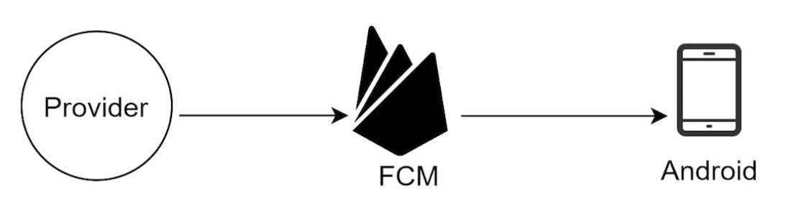
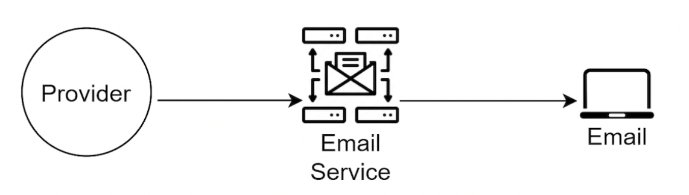

## Problem Statement
Design a notification system that can send real-time and batch notifications to users based on their preferences. The system should support multiple types of notifications (e.g., push notifications, SMS) and be highly reliable, scalable, and extensible.

## Clarification Questions to Interviewer 
* What types of notifications does the system support?
* Is it a real-time system?
* What are the supported devices?
* What triggers notifications?
* Will users be able to opt-out?
* How many notifications per day?

## Requirements
### Functional Requirements
* Send notifications.
* Prioritize notifications.
* Send notifications based on customer’s saved preferences.
* Support single/simple and bulk notification messages.
* Provide analytics use cases for various notifications.
* Provide reporting of notification messages.
#### Below the line (out of scope)
* Advanced analytics and user behavior analysis.

### Non-Functional Requirements
* High performance.
* Highly available (HA).
* Low latency.
* Extendable/Pluggable design to add more clients, adapters, and vendors.
* Support Android/iOS mobile and desktop/laptop web browsers.
* API integration with all notification modules and external integrations with clients and service providers/vendors.
#### Below the line (out of scope)
* Detailed security and compliance measures.

## Back of Envelope Estimations/Capacity Estimation & Constraints
1. **Number of notifications per day:** 100 million.
2. **Peak notifications per second:** Assume peak load is 10x average load.
   - Average: ~1,157 notifications/second.
   - Peak: ~11,570 notifications/second.
3. **Storage Requirements:**
   - Assume each notification is 1 KB.
   - Daily storage: 100 million * 1 KB = 100 GB.
   - Monthly storage: 3 TB.


## High-level API design 
### Send Notification
```http
POST /send
{
  "user_id": "123",
  "message": "Hello, World!",
  "type": "push", // "sms", "email", etc.
  "priority": "high",
  "timestamp": "2024-06-13T12:34:56Z"
}
```
### Get User Preferences
```http
GET /users/{user_id}/preferences
```
### Update User Preferences
```http
PUT /users/{user_id}/preferences
{
  "preferences": {
    "push": true,
    "sms": false,
    "email": true
  }
}
```
## Data Model
### Notification Table
**Database Type:** NoSQL (e.g., MongoDB) for scalability and flexibility
| Field           | Type          | Description                                |
|-----------------|---------------|--------------------------------------------|
| notification_id | String (PK)   | Unique identifier for the notification     |
| user_id         | String        | User ID                                    |
| message         | String        | The content of the notification            |
| type            | String        | Type of notification (push, SMS, etc.)     |
| status          | String        | Status of the notification (sent, failed)  |
| priority        | String        | Priority of the notification               |
| timestamp       | DateTime      | Time when the notification was created     |

### User Table
**Database Type:** Relational (e.g., PostgreSQL) for structured user data and relationships
| Field         | Type          | Description                                |
|---------------|---------------|--------------------------------------------|
| user_id       | String (PK)   | Unique identifier for the user             |
| name          | String        | Name of the user                           |
| email         | String        | Email address of the user                  |
| phone_number  | String        | Phone number of the user                   |

### User Notification Preference Table
**Database Type:** Relational (e.g., PostgreSQL) for structured preference data and relationships
| Field    | Type    | Description                                 |
|----------|---------|---------------------------------------------|
| user_id  | BigInt  | Unique identifier for the user (FK to User Table) |
| channel  | Varchar | Notification channel (push, email, SMS)     |
| opt_in   | Boolean | User's preference to opt-in to receive notifications |

### Device Table
**Database Type:** Relational (e.g., PostgreSQL) or NoSQL (e.g., MongoDB) for storing device tokens

| Field           | Type          | Description                                 |
|-----------------|---------------|---------------------------------------------|
| user_id         | BigInt (FK)   | Unique identifier for the user              |
| device_id       | String (PK)   | Unique identifier for the device            |
| device_token    | String        | Device token for push notifications         |
| platform        | String        | Platform type (iOS, Android)                |
| last_logged_in     | DateTime      | Last time the device was active             |


## Different types of notifications
### iOS Push Notification
- Use APNs (Apple Push Notification Service) to send notifications to iOS devices.
#### Details:
- **Service**: Apple Push Notification Service (APNs)
- **Payload**: JSON payload containing the notification message and any custom data
- **Authentication**: Uses a JWT (JSON Web Token) or certificate-based authentication
- **iOS Push Notification**:
  - Include alert, sound, badge, and custom data in the payload.
  - Example:
    ```json
    {
      "aps": {
        "alert": {
          "title": "Title",
          "body": "Message body"
        },
        "sound": "default",
        "badge": 1
      },
      "custom_key": "custom_value"
    }
    ```
.png)
### Android Push Notification
- Use FCM (Firebase Cloud Messaging) to send notifications to Android devices.
#### Details:
- **Service**: Firebase Cloud Messaging (FCM)
- **Payload**: JSON payload containing the notification message and any custom data
- **Authentication**: Uses a server key provided by Firebase
- **Android Push Notification**:
  - Include title, body, and custom data in the payload.
  - Example:
    ```json
    {
      "notification": {
        "title": "Title",
        "body": "Message body"
      },
      "data": {
        "custom_key": "custom_value"
      }
    }
    ```

### SMS Message
- Integrate with an SMS gateway provider (e.g., Twilio) to send SMS notifications.
#### Details:
- **Service**: Twilio (or other SMS gateway provider)
- **Payload**: Plain text message
- **Authentication**: Uses account SID and auth token provided by the SMS gateway provider
- **SMS Message**:
  - Plain text message with optional custom data.
  - Example:
    ```text
    Hello, SMS User!
    ```

### Email Notification
- Use third-party services like Mailchimp to send email notifications.
#### Details:
- **Service**: Mailchimp (or other email service providers)
- **Payload**: HTML or plain text email content
- **Authentication**: Uses API keys provided by the email service provider
- **Email Message**:
  - Example:
    ```html
    <html>
      <body>
        <h1>Hello, Email User!</h1>
        <p>This is a sample email notification.</p>
      </body>
    </html>
    ```

### Authentication
- **iOS Push Notification**: Use JWT or certificate-based authentication.
- **Android Push Notification**: Use server key provided by Firebase.
- **SMS Message**: Use account SID and auth token provided by the SMS gateway provider.
- **Email Notification**: Use API keys provided by the email service provider.


## High Level System Design


### Workflow Explanation

1. **Notification Clients**: 
   - These are various clients (e.g., web services, applications) that send notification requests to the system.
   - Clients interact with the system via an API Gateway.

2. **LB/API Gateway**:
   - Load balancer and API gateway handle incoming notification requests, distribute them to appropriate services, and manage traffic.

3. **Notification Service**:
   - **Validation**: Validates incoming notification requests (e.g., checks user existence, message format).
   - **Prioritization**: Determines the priority of notifications based on user preferences and business rules.
   - **Scheduling**: Schedules notifications for immediate or delayed delivery based on priority and system load.

4. **Notification Queue**:
   - Notifications are placed into prioritized queues (High, Medium, Low) based on their priority.
   - Ensures that high-priority notifications are processed first.

5. **Outbound Notifications Router**:
   - Routes notifications from the prioritized queues to specific handler queues (iOS, Android, SMS, Email).
   - Ensures that notifications are directed to the correct delivery channels.

6. **Handlers**:
   - Workers for different notification types (e.g., iOS Push Notification Workers, Android Push Notification Workers).
   - Each worker fetches notifications from its queue, processes them, and sends them to the appropriate external service (APNs, FCM, SMS Gateway, Email Service).

7. **External Services**:
   - **APNs**: Apple Push Notification Service for iOS notifications.
   - **FCM**: Firebase Cloud Messaging for Android notifications.
   - **SMS Service**: SMS gateway provider for SMS notifications.
   - **Email Service**: Email service provider for email notifications.

8. **Analytics Service**:
   - Collects data on notification delivery, opens, and interactions.
   - Sends data to the analytics system for reporting and insights.

9. **Cache and Database**:
   - **Cache**: Stores frequently accessed data (e.g., user preferences) for quick retrieval.
   - **Database**: Persistent storage for notifications, user data, and preferences.
   - Tables include NotificationTable, UserTable, and UserPreferenceTable.

10. **Notification Template and Log**:
    - **Notification Template**: Manages templates for different notification types and formats.
    - **Notification Log**: Records all notifications sent, their statuses, and any errors encountered.

## Deep Dive

### Device Registration Process
To send push notifications, the system needs to know the device ID (or device token) and the authentication token for each user. These pieces of information are typically obtained and stored when the user registers their device with your notification service. Here’s how this process typically works:
1. **User Install and Launch the App**: When a user installs and launches your mobile application for the first time, the app will request permission to send push notifications.
2. **Request Device Token**:
   - For iOS: The app requests a device token from Apple Push Notification Service (APNs).
   - For Android: The app requests a device token from Firebase Cloud Messaging (FCM).
3. **Send Device Token to Backend**: Once the app receives the device token, it sends this token to your backend server along with the user ID.
4. **Store Device Token and Authentication Information**: The backend server stores the device token and associates it with the user ID in the database.

### Reliability
#### Prevent Event Loss
- **Durable Queues**: Use SQS, Kafka or RabbitMQ to ensure that notifications are queued reliably.
- **Database Persistence**: Store each notification in a database before sending to ensure it is logged and can be retried if sending fails.

#### Prevent Duplicate Notifications

##### Generating Idempotency Keys
An idempotency key is a unique identifier for each notification request, ensuring that the same notification is not processed multiple times. Here's how you can generate and use idempotency keys in your design:

1. **Combining Unique Attributes**:
   - Use a combination of unique attributes to generate the idempotency key. For example, a combination of `user_id`, `message`, and `timestamp` can be used.
   - This ensures that even if the same user receives the same message at different times, the keys will be unique.

2. **Hashing for Consistency**:
   - Use a hashing algorithm to create a fixed-length unique identifier from the combined attributes.
   - Example: SHA-256 or MD5 can be used to hash the concatenated string of attributes.

3. **Store and Check Idempotency Keys**:
   - Store the generated idempotency key in a database when a notification is first processed.
   - Check the key before processing new requests to ensure duplicates are ignored.
```python
import hashlib

def generate_idempotency_key(user_id, message, timestamp):
    # Concatenate unique attributes
    unique_string = f"{user_id}:{message}:{timestamp}"
    # Generate a SHA-256 hash of the concatenated string
    idempotency_key = hashlib.sha256(unique_string.encode('utf-8')).hexdigest()
    return idempotency_key

# Example usage
user_id = "123"
message = "Hello, World!"
timestamp = "2024-06-13T12:34:56Z"

idempotency_key = generate_idempotency_key(user_id, message, timestamp)
print(idempotency_key)  # Outputs a unique hash for this notification
```

### Retry mechanism
* Implement retry logic with exponential backoff for failed notification deliveries.
* Use a dead-letter queue for notifications that fail after multiple retries.

### Notification setting
Before sending any notification, check if the user has opted in for the given communication channel via the User Notification Preference Table. This involves querying the table to ensure the user has opted in for the specific channel (push, email, SMS).

### Rate Limiting
Implement rate limiting to avoid overwhelming external services and to comply with their usage policies.
- **Global Rate Limiting**: Limit the total number of notifications sent per second across all channels.
- **Channel-specific Rate Limiting**: Limit the number of notifications sent per second for each specific channel (e.g., APNs, FCM, SMS Gateway).
- **Implementation**: Use a token bucket or leaky bucket algorithm to enforce rate limits. Track the number of tokens available and refill tokens at a defined rate.

### Notification templates
* Manage templates for different notification types and formats.
* Templates help in maintaining consistent and branded messages.


### Security in push notifications
- Encrypt notification payloads to protect sensitive data.
- Use secure tokens for authenticating with push notification services.
- Ensure only authorized services can send notifications.
    - We do this by requiring an appKey and appSecret, inspired by Android/Apple notification servers.

### Monitor queued notifications
- Collect metrics on queue length, processing time, and failure rates.
- Use monitoring tools (e.g., cloudwatch) to visualize queue metrics.
- Set up alerts for abnormal queue behavior (e.g., long queue lengths, high failure rates).

### Events tracking
Tracking events such as open rates and click rates is crucial for measuring the effectiveness of notifications. This typically involves integrating with an Analytics service.

#### How Event Tracking Works
1. **Tracking Open Rates**:
   - For emails, embed a tracking pixel (a small, invisible image) that loads when the email is opened.
   - For push notifications, track when the user opens the app in response to the notification.

2. **Tracking Click Rates**:
   - For emails and SMS, include unique, trackable links in the message. When the link is clicked, it redirects through a tracking service before reaching the final destination.
   - For push notifications, track when specific actions within the notification are clicked.

3. **Integration with Analytics Service**:
   - Use an analytics platform (e.g., Google Analytics, Mixpanel) to log events.
   - Send event data (e.g., notification opened, link clicked) to the analytics service via their API.


## References
* https://github.com/preslavmihaylov/booknotes/tree/master/system-design/system-design-interview/chapter11
* https://www.linkedin.com/pulse/notification-system-design-rajiv-srivastava/
* https://www.codekarle.com/system-design/Notification-system-design.html
* https://medium.com/double-pointer/system-design-interview-notification-service-86cb5c266218
* https://www.linkedin.com/posts/alexxubyte_systemdesign-coding-interviewtips-activity-7150527952118575105-Y5Bu/