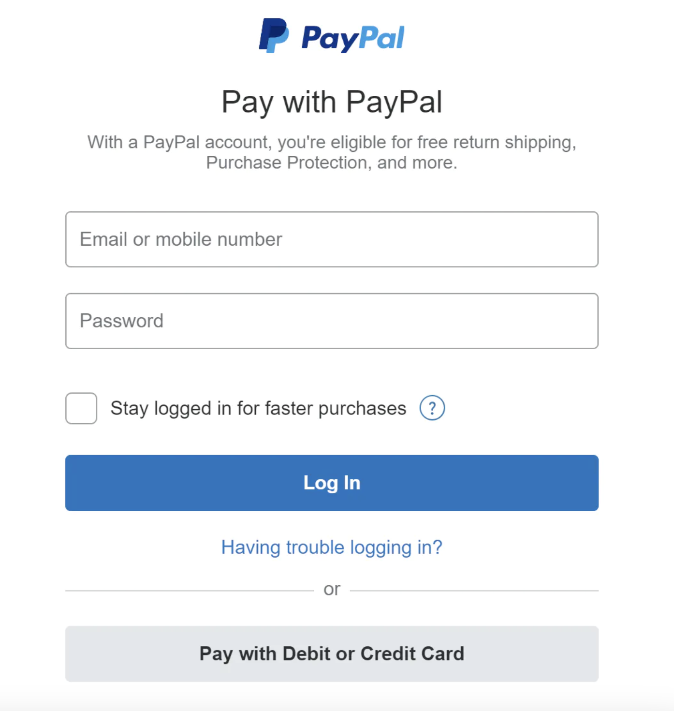
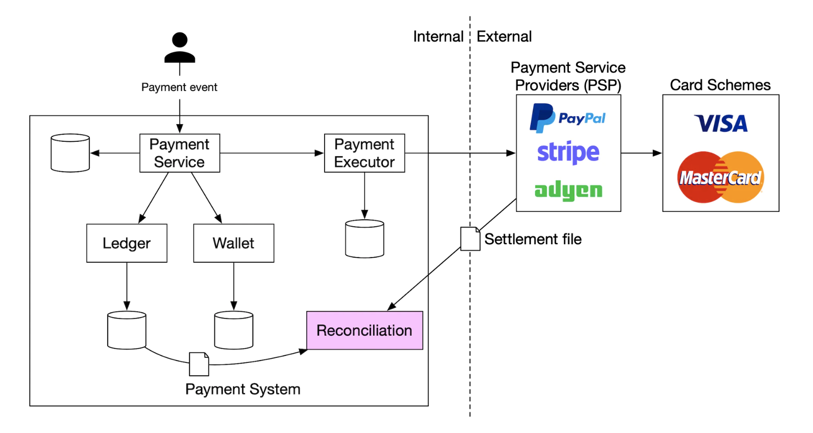
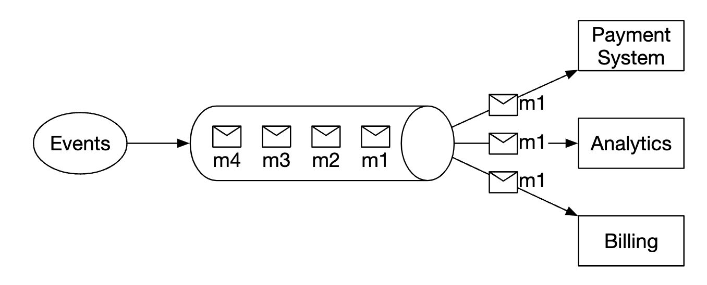

## Problem Statement

Design a scalable, secure, and highly available payment gateway system that allows merchants to process online payments from customers. The system should support various payment methods (credit/debit cards, digital wallets, bank transfers) and handle transactions efficiently, ensuring data security and compliance with financial regulations.


## Requirements

### Functional Requirements
* **Pay-in flow**- payment system receives money from customers on behalf of merchants
* **Pay-out flow**- payment system sends money to sellers around the world
#### Below the line (out of scope)
* **Recurring Payments**: Support for setting up and managing recurring payments.
* **Currency Conversion**: Handling currency conversion for international transactions.
* **Fraud Detection**: Including advanced fraud detection and prevention mechanisms.

### Non-Functional Requirements
* **Security**: Ensure the security of payment data, complying with standards like PCI DSS.
* **High Availability**: Maintain high availability with minimal downtime to process payments 24/7.
* **Scalability**: Handle peak transaction loads efficiently.
* **Low Latency**: Process transactions with minimal latency.
* **Data Integrity**: Ensure the integrity and consistency of transaction data.
* **Compliance**: Comply with financial regulations and standards.
* **Monitoring and Logging**: Robust monitoring and logging to track transaction status and system health.
* **Reconciliation**: The payment gateway should be able to reconcile the payments made by customers with the payments received by merchants.
#### Below the line (out of scope)
* **Multi-Region Support**: Support deployment in multiple regions for disaster recovery and latency reduction.
* **Analytics and Reporting**: Provide detailed analytics and reporting for transactions.
* **CI/CD**: Facilitate easy updates and maintenance without significant downtime.

## Back of Envelope Estimations/Capacity Estimation & Constraints
## High-level API design 
### Pay-in Flow API
```
POST /v1/payments
{
  "buyer_info": {...},
  "checkout_id": "some_id",
  "credit_card_info": {...},
  "payment_orders": [{...}, {...}, {...}]
}
```

### Example Payment Order
```
{
  "seller_account": "SELLER_IBAN",
  "amount": "3.15",
  "currency": "USD",
  "payment_order_id": "globally_unique_payment_id"
}
```

### Query Payment Status
```
GET /v1/payments/{:id}
```
## Database Design
### Payment Events Table
- `checkout_id` (string)(Primary Key)
- `buyer_info` (string)
- `credit_card_info` (string)
- `is_payment_done` (boolean)

### Payment Orders Table
- `payment_order_id` (Primary Key)
- `buyer_account` (string)
- `amount` (string)
- `currency` (string)
- `checkout_id` (Foreign Key)
- `payment_order_status` (enum: NOT_STARTED, EXECUTING, SUCCESS, FAILED)
- `ledger_updated` (boolean)
- `wallet_updated` (boolean)
## High Level System Design

At a high-level, we have three actors, participating in money movement:

### Pay-in flow


**Components Explanation**
* **User Initiates Payment**: The user initiates a payment by providing the necessary information and clicking "checkout."
* **Payment Service**: The Payment Service accepts payment events and publishes it to the Payment Requests Kafka Topic. It typically also does a risk check using a third-party provider for AML violations or criminal activity.
* **Payment Executor**: The Payment Executor consumes the payment order from the Kafka topic, registers the payment with the PSP, and initiates the PSP hosted payment page. It executes a single payment order via the Payment Service Provider (PSP). Payment events may contain several payment orders.
* **PSP Hosted Payment Page**: The PSP hosts the payment page and the user completes the payment on this page. The PSP then processes the payment. moves money from one account to another, eg from buyer's credit card account to e-commerce site's bank account.
* **Card schemes**: organizations that process credit card operations, eg Visa MasterCard, etc.
* **Payment Status Callback (E8 to C4)**: The PSP sends a payment status callback to the Payment Results Kafka Topic (C4).
* **Ledger and Wallet Updates**: The Ledger and Wallet services consume the payment results from the Kafka topic to update the respective records.
* **Reconciliation**: The Reconciliation service consumes the payment results for daily reconciliation, comparing internal records with external records from the PSP. Any discrepancies are handled by the finance team.
* **Retry Logic**: If the PSP does not respond or is down, the Payment Executor will notify the user for a retry via WebSocket or Server-Sent Events (SSE). The user will be redirected to the PSP's hosted payment page for retry.

**Workflow Explanation**
* User initiates the payment process by clicking the "checkout" button in the browser.
* Client calls the payment service with the payment event information.
    - The client application sends the payment event details, which include multiple payment orders associated with different sellers, to the payment service via an API call.
    - API Endpoint Example: `POST /v1/payments`
    - Request Payload:
    ```json
    {
        "buyer_info": {...},
        "checkout_id": "some_id",
        "credit_card_info": {...},
        "payment_orders": [
            {
                "seller_account": "SELLER1_IBAN",
                "amount": "3.15",
                "currency": "USD",
                "payment_order_id": "order1_id"
            },
            {
                "seller_account": "SELLER2_IBAN",
                "amount": "5.50",
                "currency": "USD",
                "payment_order_id": "order2_id"
            }
        ]
    }
    ```
* Payment service stores payment event information and publishes a payment request event to the Kafka topic
    - The payment service stores the initial payment event information in its database.
    - It then publishes a `payment_request` orders to the `payment_requests` Kafka topic.
* Payment Executor consumes the payment request event from the Kafka topic
    - The Payment Executor listens to the `payment_requests` topic and consumes the event.
    - The executor processes the payment event details and handles each payment order.
* Payment Executor sends a payment registration request to the PSP for each payment order
* The PSP receives payment info such as currency, amount, expiration, etc., as well as a UUID for idempotency purposes
    - The PSP processes each payment registration request and assigns a unique token for each transaction.
    - The UUID ensures that each payment registration can be tracked and managed idempotently.
* The PSP returns a token back which uniquely identifies each payment registration
   - The PSP responds with a token for each payment order that uniquely identifies the payment session.
    - These tokens are used to initialize the PSP-hosted payment page.
* The Payment Executor stores the tokens in the payment order database
    - The Payment Executor stores each token and associates it with the corresponding payment order details in the database.
    - It then updates the payment order status to indicate that the payment page is ready.
* Payment Executor notifies the user with the PSP-hosted payment page
    - The Payment Executor sends a notification (via WebSocket or SSE) to the client with the URL of the PSP-hosted payment page for each payment order.
    - The client redirects the user to the PSP-hosted payment page.
* User fills in payment details on the PSP page, PSP processes payment, and returns the payment status
    - The user enters payment details on the PSP page.
    - The PSP processes the payment and updates the payment status.
* User is now redirected back to the redirect URL
    - Upon completing the payment, the user is redirected back to the specified redirect URL with the payment token and result.
    - Example Redirect URL: `https://your-company.com/?tokenID=JIOUIQ123NSF&payResult=X324FSa`
* Asynchronously, the PSP calls our payment service via a webhook to inform our backend of the payment result
    - The PSP sends a webhook notification to the payment service with the payment result for each payment order.
    - The webhook includes details such as payment status, transaction ID, and any relevant metadata.
* Payment service records the payment result based on the webhook received
    - The payment service processes the webhook notification and updates the payment order status in the database.
    - This ensures that the system has the latest payment status information for reconciliation and reporting.
* Ledger and Wallet Services update the transaction records
    - The Ledger and Wallet services listen to the `payment_results` Kafka topic.
    - They update the respective transaction records and balances based on the payment result.
* Reconciliation is performed daily
    - A reconciliation process runs daily to ensure all transactions are accurately recorded and settled.

### Double-entry ledger system
The double-entry accounting mechanism is key to any payment system. It is a mechanism of tracking money movements by always applying money operations to two accounts, where one's account balance increases (credit) and the other decreases (debit):
| Account | Debit | Credit |
|---------|-------|--------|
| buyer   | $1    |        |
| seller  |       | $1     |

Sum of all transaction entries is always zero. This mechanism provides end-to-end traceability of all money movements within the system.

### Hosted payment page
To avoid storing credit card information and having to comply with various heavy regulations, most companies prefer utilizing a widget, provided by PSPs, which store and handle credit card payments for you:


## Deep Dive
### PSP Integration
Integrating with a PSP can be done through APIs or hosted payment pages. For simplicity and compliance, we use hosted payment pages:

1. **User clicks "checkout" button in the browser**
2. **Client calls the payment service with the payment event information** containing multiple payment orders for different sellers.
3. **Payment service stores event and publishes a payment request event to Kafka**.
4. **Payment Executor consumes the event and processes each payment order** by sending a registration request to the PSP.
5. **PSP assigns a unique token to each payment order** and returns it.
6. **Payment Executor stores tokens and notifies the client** with URLs of the PSP-hosted payment pages via WebSocket/SSE.
7. **User fills in payment details on the PSP page** and the PSP processes the payment.
8. **User is redirected back with the payment status**.
9. **PSP sends a webhook to our payment service with the payment result**.
10. **Payment service updates the payment status in the database**.

### Reconciliation
- **Daily settlement files from PSP**: Every night, the PSP sends a settlement file which our system uses to compare the external system's state against our internal system's state.
- **Detect inconsistencies**: Between ledger and wallet services, and handle them manually if necessary.
- **Classify mismatches**: Known mismatches adjusted automatically or manually, unclassifiable ones investigated.
 

### Handling payment processing delays
There are cases, where a payment can take hours to complete, although it typically takes seconds.
This can happen due to:
 * a payment being flagged as high-risk and someone has to manually review it
 * credit card requires extra protection, eg 3D Secure Authentication, which requires extra details from card holder to complete

These situations are handled by:
 * waiting for the PSP to send us a webhook when a payment is complete or polling its API if the PSP doesn't provide webhooks
 * showing a "pending" status to the user and giving them a page, where they can check-in for payment updates. We could also send them an email once their payment is complete

### Communication among internal services
* communication patterns services use to communicate with one another - synchronous and asynchronous.
* Synchronous communication (ie HTTP)
    * low performance - request-response cycle is long as more services get involved in the call chain
    * poor failure isolation - if PSPs or any other service fails, user will not receive a response
    * tight coupling - sender needs to know the receiver
    * hard to scale - not easy to support sudden increase in traffic due to not having a buffer
* Asynchronous communication can be divided into two categories.
    * Single receiver - multiple receivers subscribe to the same topic and messages are processed only once:
    
    * Multiple receivers - multiple receivers subscribe to the same topic, but messages are forwarded to all of them:
    
* Latter model works well for our payment system as a payment can trigger multiple side effects, handled by different services.

### Handling Failed Payments
Mechanisms to handle failed payments:
- **Tracking payment state**: Decide to retry or refund based on the state.
- **Retry queue**: Retry payments are published to a queue.
- **Dead-letter queue**: Terminally failed payments are sent here for debugging.

### Exactly-once delivery
Ensuring exactly-once delivery to avoid double-charging:

- **Retry mechanisms**: Exponential back-off strategy is recommended.
- **Idempotency keys**: Ensure operations are processed only once, using unique constraints in the database.
### Payment Security
Ensuring the security of payment data:
- **HTTPS**: Secure all communication.
- **Encryption and integrity monitoring**: Protect data from tampering.
- **SSL with certificate pinning**: Prevent man-in-the-middle attacks.
- **Data replication and snapshots**: Prevent data loss.
- **Rate limiting and firewall**: Mitigate DDoS attacks.
- **Tokenization**: Avoid storing real card information.
- **PCI compliance**: Adhere to security standards for handling credit card data.
- **Fraud prevention**: Use address verification, CVV, and user behavior analysis.
## References
* https://github.com/preslavmihaylov/booknotes/blob/master/system-design/system-design-interview/chapter27/README.md
* https://github.com/kanmaytacker/system-design/blob/master/notes/design-a-payment-gateway.md
* https://www.youtube.com/watch?v=NxjGFIgFCbg
* https://systemdesignfightclub.com/payment-gateway/
* [How Webhook works](https://www.youtube.com/watch?v=oQaJn6RdA3g)