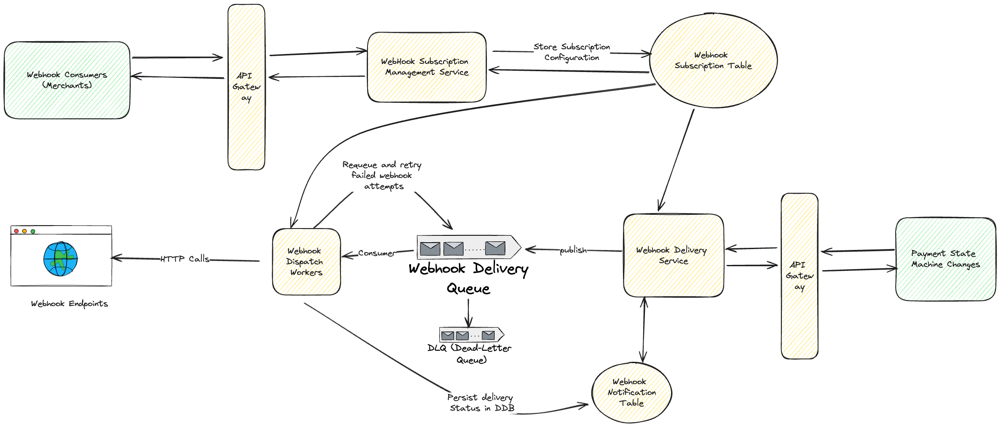

## Problem Statement
Design a payment webhook system that allows merchants to subscribe to specific webhook events, manage their subscriptions, and reliably receive notifications from various payment providers

## Clarification Questions to Interviewer 
1. **Supported Event Types**: What types of events can merchants subscribe to (e.g., payment success, payment failure, refund)?
2. **Merchant Management**: How are merchants authenticated and authorized to manage their subscriptions?
3. **Webhook Delivery**: What are the delivery guarantees (e.g., at-least-once, exactly-once)?
4. **Subscription Options**: Can merchants customize the webhook endpoints or the format of the notifications?
5. **Rate Limits**: Are there rate limits for webhook notifications to prevent merchants from being overwhelmed?
6. **Security Requirements**: How should the system secure webhook deliveries to merchants (e.g., HMAC signatures, IP whitelisting)?
7. **Retry Mechanism**: What is the strategy for retrying failed webhook deliveries?
8. **Subscription Analytics**: Should the system provide analytics or logs for merchants to monitor their webhook deliveries?

## Requirements
### Functional Requirements
1. **Subscription Management**: Allow merchants to create, update, and delete webhook subscriptions for specific events.
2. **Event Processing**: Process payment events from providers and route them to the appropriate subscribed merchants.
3. **Webhook Delivery**: Deliver events to merchants’ endpoints, ensuring reliability and security.
4. **Retry Mechanism**: Implement retries for failed webhook deliveries with appropriate backoff strategies.
5. **Event Logging**: Log all events and delivery attempts for auditing and troubleshooting.
6. **Merchant Notification**: Notify merchants of their subscription status, delivery failures, and other relevant updates.
7. **Security**: Securely handle merchant data, including webhook endpoints and authentication credentials.

#### Below the line (out of scope)
1. **Complex Event Filtering**: Advanced filtering options for merchants based on custom conditions.
2. **Detailed Delivery Analytics**: Comprehensive analytics dashboard for merchants.

### Non-Functional Requirements
1. **Scalability**: The system should scale to handle an increasing number of merchants and events.
2. **Reliability**: Ensure high availability and minimal downtime, particularly for critical event processing.
3. **Security**: Secure the system against unauthorized access and ensure data integrity.
4. **Performance**: Deliver webhook events to merchants with low latency.
5. **Durability**: Ensure that event data is not lost, even in the event of system failures.
6. **Compliance**: Adhere to relevant regulatory requirements, such as GDPR.

#### Below the line (out of scope)
1. **Global Distribution**: Managing subscriptions and deliveries across globally distributed data centers.

## Back of Envelope Estimations/Capacity Estimation & Constraints
1. **Merchant Volume**: Assuming 10,000 merchants, with an average of 5 webhook subscriptions each.
2. **Event Volume**: Assuming 1,000,000 payment events per day.
3. **Storage Requirements**: 
   - Subscription Data: \(10,000 \times 5 \times 0.5 \text{ KB} = 25 \text{ MB}\).
   - Event Logs: Assuming 1 KB per event, \(1,000,000 \times 1 = 1 \text{ GB per day}\).
4. **Latency**: Target delivery latency to merchants should be under 500ms.
5. **Retry Mechanism**: Implement a retry strategy with exponential backoff, up to 3 attempts within 24 hours.

## High-level API design 
1. **Subscription Management API**
   - **POST /merchants/{merchant_id}/subscriptions**
   - Payload: `{ "event_type": "payment_success|payment_failure|refund", "endpoint_url": "string", "secret": "string" }`
   - Response: `{ "status": "success", "subscription_id": "uuid" }`
   
   - **GET /merchants/{merchant_id}/subscriptions**
   - Response: `[{ "subscription_id": "uuid", "event_type": "string", "endpoint_url": "string" }]`
   
   - **DELETE /merchants/{merchant_id}/subscriptions/{subscription_id}**
   - Response: `{ "status": "success" }`

2. **Webhook Event Delivery API**
   - **POST /events/delivery**
   - Payload: `{ "subscription_id": "uuid", "event_type": "payment_success|payment_failure|refund", "data": {...}, "signature": "string" }`
   - Response: `{ "status": "delivered", "delivered_at": "ISO8601" }`
   
3. **Event Logging API**
   - **GET /merchants/{merchant_id}/events**
   - Response: `[{ "event_id": "uuid", "subscription_id": "uuid", "status": "delivered|failed", "timestamp": "ISO8601" }]`

## Data Model
All tables are stored in DynamoDB (DDB).
### 1. **Merchants Table**
   - **Primary Key**: `merchant_id` (Partition Key)
   - **Attributes**:
     - `name` (String): The name of the merchant.
     - `email` (String): The contact email of the merchant.
     - `created_at` (Datetime): The timestamp when the merchant was created.
   - **Description**: This table stores information about each merchant using the webhook system. It is primarily used to manage and identify merchants in the system.

### 2. **Subscription Table**
   - **Primary Key**: 
     - `merchant_id` (Partition Key)
     - `subscription_id` (Sort Key)
   - **Attributes**:
     - `event_type` (String): The type of event the merchant is subscribed to (e.g., payment_success, payment_failure).
     - `endpoint_url` (String): The webhook URL where events should be delivered.
     - `secret` (String): The secret key used for HMAC verification when delivering the event.
     - `created_at` (Datetime): The timestamp when the subscription was created.
   - **Global Secondary Indexes (GSI)**:
     - **GSI1**: 
       - Partition Key: `event_type`
       - Sort Key: `merchant_id`
   - **Description**: This table tracks all the webhook subscriptions for merchants. Each record specifies which event types the merchant is interested in and where the webhook notifications should be sent.

### 3. **Event Delivery Table**
   - **Primary Key**: 
     - `subscription_id` (Partition Key)
     - `event_id` (Sort Key)
   - **Attributes**:
     - `event_type` (String): The type of event being delivered.
     - `event_data` (String): The data associated with the event, typically stored as a JSON string.
     - `status` (Enum: Delivered, Failed): The status of the delivery attempt (whether it was successful or failed).
     - `attempts` (Integer): The number of delivery attempts made for this event.
     - `created_at` (Datetime): The timestamp when the delivery record was created.
   - **Global Secondary Indexes (GSI)**:
     - **GSI1**: 
       - Partition Key: `event_id`
       - Sort Key: `subscription_id`
   - **Description**: This table logs the delivery of events to merchant subscriptions. Each entry represents an attempt to deliver a specific event (`event_id`) to a specific subscription (`subscription_id`). The status of each delivery and the number of attempts are tracked to ensure reliability and for auditing purposes.

### Access Patterns
- **Fetching Subscriptions for a Merchant**: Query the `Subscription Table` using `merchant_id` as the partition key to retrieve all subscriptions belonging to a particular merchant.
- **Fetching Subscriptions by Event Type**: Use the `event_type` GSI on the `Subscription Table` to retrieve all subscriptions interested in a particular event type.
- **Logging Event Deliveries**: Write to the `Event Delivery Table` with the `event_id` as the sort key and `subscription_id` as the partition key, ensuring that each event delivery attempt is uniquely identifiable.
- **Fetching Delivery Logs for a Subscription**: Query the `Event Delivery Table` using `subscription_id` as the partition key to retrieve all delivery attempts related to a particular subscription.
- **Fetching Delivery Attempts by Event ID**: Use the `event_id` GSI on the `Event Delivery Table` to retrieve all delivery attempts associated with a specific event, across all subscriptions.

## High Level System Design

### Components:
1. **API Gateway**: Handles incoming requests for subscription management and event delivery.
2. **Webhook Subscription Management Service**: Manages merchant subscriptions, including creating, updating, and deleting subscriptions. Stores subscription configurations in the DDB `Webhook Subscription Table`.
3. **Webhook Delivery Service**: Publishes webhook events to the `Webhook Delivery Queue` for dispatch. Manages the `Webhook Notification Table` to persist delivery status.
4. **Webhook Dispatch Workers**: Consumes messages from the `Webhook Delivery Queue`, makes HTTP calls to the merchant’s webhook endpoints, and handles retries through the `Dead-Letter Queue` (DLQ) for failed attempts.
5. **Event Storage**: All events and logs are persisted in DynamoDB tables (DDB).

### Architecture Overview:
- **Webhook Consumers (Merchants)** interact with the **API Gateway** to manage their subscriptions and receive webhook events.
- The **Webhook Subscription Management Service** stores and retrieves subscription details from the **Webhook Subscription Table**.
- The **Payment State Machine** triggers events, which are then picked up directly by the **Webhook Delivery Service**.
- The **Webhook Delivery Service** publishes events to the **Webhook Delivery Queue** and updates the **Webhook Notification Table**.
- **Webhook Dispatch Workers** handle actual HTTP delivery to merchant endpoints and manage retries using the DLQ and the **Webhook Notification Table**.

## Deep Dive
### Idempotency
- **Idempotency Keys**: The system should use the `event_id` as an idempotency key to ensure that the same event is not processed or delivered multiple times. This key should be checked before processing any event to prevent duplicate deliveries.
- **Idempotency in DDB**: DynamoDB should store these idempotency keys along with their associated event data. Implement a Time To Live (TTL) mechanism on these keys to automatically expire them after a certain period (e.g., 24 hours), ensuring that the system remains efficient and that storage does not grow unnecessarily over time.

### Retries
- **Retry Logic**: The **Webhook Dispatch Workers** should implement an exponential backoff strategy for retrying failed deliveries. This strategy should start with a small delay and increase exponentially with each retry attempt. The maximum number of retries and the backoff intervals should be configurable based on the criticality of the event and the system's tolerance for delayed delivery.
- **Dead-Letter Queue (DLQ)**: Events that fail after the maximum number of retry attempts should be placed in a Dead-Letter Queue (DLQ). The DLQ serves as a holding area for undelivered events, allowing for manual intervention or automated error handling processes. These failed events should also be logged in the **Webhook Notification Table** for auditing purposes and to maintain a complete record of all delivery attempts.

### Error Handling
- **Error Logging**: Every error that occurs during webhook processing and delivery should be logged with detailed information. This includes:
  - The `event_id` and `subscription_id` associated with the failed delivery.
  - The nature of the error (e.g., network failure, HTTP 5xx response).
  - The number of retry attempts that were made.
  - Timestamps of when the errors occurred.
- **Alerting**: The system should have an alerting mechanism in place to notify the engineering team if certain thresholds are met. For instance, if a particular event fails delivery after all retry attempts, or if there is a sudden spike in failed deliveries, alerts should be triggered to prompt immediate investigation.

### Authentication During Webhook Calls
- **HMAC Verification**: 
  - **What is HMAC?**: HMAC stands for **Hash-based Message Authentication Code**. It is a mechanism used to verify the integrity and authenticity of a message. HMAC combines a secret key with the message and hashes them together using a cryptographic hash function (e.g., SHA-256).
  - **How it Works**: When the system sends a webhook to a merchant’s endpoint, it generates an HMAC signature using the payload (the body of the webhook message) and a shared secret key that is stored in the **Webhook Subscription Table**. This signature is then included in the `X-Signature` header of the HTTP request. 
  - **Verification Process**: Upon receiving the webhook, the merchant’s server recalculates the HMAC using the same secret key and the received payload. If the calculated HMAC matches the `X-Signature` header, it confirms that the message is authentic and has not been tampered with during transmission.
- **Endpoint Verification**: Merchants receiving the webhook should be instructed to verify the HMAC signature by recalculating it on their end using the same shared secret. This verification process ensures that the payload has not been tampered with and that the request is indeed from the trusted source.
- **IP Whitelisting**: In addition to HMAC verification, the system can support IP whitelisting as an additional security measure. Merchants can specify a list of trusted IP addresses from which they expect to receive webhook notifications. Requests originating from outside this list can be rejected or flagged for further inspection.

### Scalability
- **Horizontal Scaling**: The system should be designed to scale horizontally to handle increasing loads as the number of merchants and events grows. Key components like the **API Gateway**, **Webhook Delivery Service**, and **Webhook Dispatch Workers** can be scaled out by adding more instances to handle higher volumes of requests and event deliveries.
- **Auto-Scaling**: Implement auto-scaling for the **Webhook Dispatch Workers** based on metrics like CPU usage, memory usage, and the length of the **Webhook Delivery Queue**. This ensures that the system can automatically adjust its capacity to meet real-time demand.
- **Partitioning in DynamoDB**: DynamoDB tables should be designed with appropriate partition keys to distribute data evenly across partitions. For example, using `subscription_id` as the partition key in the **Event Delivery Table** helps distribute the load evenly, avoiding hotspots and ensuring consistent performance.
- **Eventual Consistency**: Given the distributed nature of the system, some components may operate in an eventually consistent manner. For instance, the results of a subscription update might not propagate immediately to all nodes, but the system will ensure consistency over time. This trade-off is typically acceptable in exchange for better scalability.

### Security
- **Encryption**: Ensure that all communication between services, including webhook notifications sent to merchants, is encrypted using TLS (Transport Layer Security). This prevents man-in-the-middle attacks and ensures the confidentiality of the data being transmitted.
- **Access Control**: Implement strict access controls within the system to ensure that only authorized services and users can interact with sensitive components such as the **Webhook Subscription Table** and the **Event Delivery Table**. This could involve role-based access control (RBAC) or fine-grained IAM policies.

### Monitoring and Observability
- **Metrics Collection**: Implement monitoring to track key metrics such as the number of successful deliveries, the number of failed deliveries, retry rates, and system performance. These metrics can be collected and visualized using tools like Prometheus and Grafana.
- **Distributed Tracing**: To aid in diagnosing issues in a distributed system, implement distributed tracing (e.g., using AWS X-Ray) to track the flow of individual events through the system. This helps identify bottlenecks, errors, and latency in processing.
- **Logging**: Ensure that all significant events and errors are logged in a centralized logging system (e.g., AWS CloudWatch Logs). This allows for easier troubleshooting and provides an audit trail for system activities.

## References
* https://tianpan.co/notes/166-designing-payment-webhook
* https://www.svix.com/blog/webhook-architecture-design/
* https://docs.stripe.com/webhooks