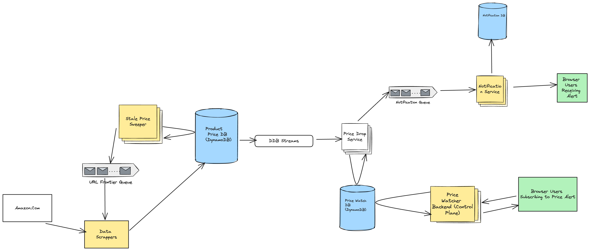

## Problem Statement
Design a price drop tracker system that monitors the prices of products from amazon and notifies users when the price of a product they are interested in drops below a certain threshold. Very similar to camelcamelcamel.com

## Requirements
### Functional Requirements
* User Management
* Product Catalog
* Price Monitoring

### Non-Functional Requirements

## Back of Envelope Estimations/Capacity Estimation & Constraints
## High-level API design 
## Database Design
## High Level System Design and Algorithm

## References
* https://systemdesignfightclub.com/price-drop-tracker/
* https://blog.crushingtecheducation.com/p/design-a-price-drop-tracker-like