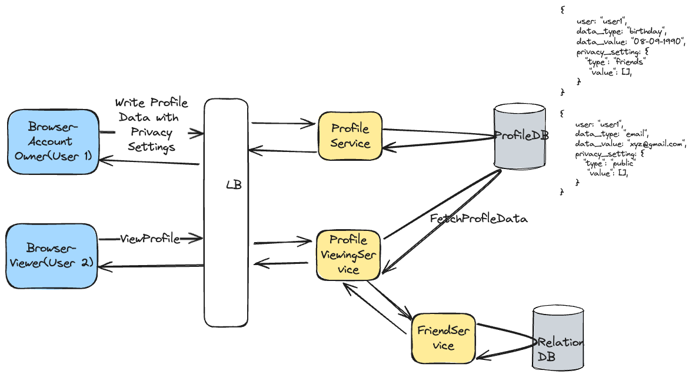
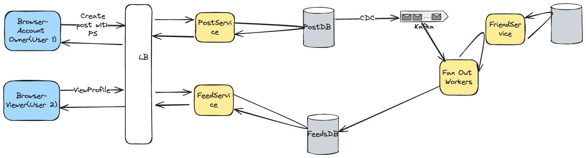

## Problem Statement
Design a system for Facebook that allows users to manage their privacy settings. This system should enable users to control who can see their posts, 
profile information, and other activities on the platform.

## Clarification Questions to Interviewer 
1. What types of privacy settings should be included (e.g., posts, profile information, friend list)?
2. How granular should the privacy settings be (e.g., specific friends, friend groups, public)?
3. Should the system support privacy settings for future content by default?
4. Are there any specific security requirements to prevent unauthorized access to privacy settings?
5. Should users be able to create custom privacy groups?
6. How should privacy settings be handled for shared content or tagged posts?

## Requirements
### Functional Requirements
1. **Privacy Control for Posts**: Users can choose who can see their posts
    - **Setting Values**:
        - **Public**: Visible to anyone, including people not on Facebook.
        - **Friends**: Visible only to friends.
        - **Friends Except**: Visible to friends except specific people.
        - **Specific Friends**: Visible only to specific friends.
        - **Only Me**: Visible only to the user.
        - **Custom**: Visible to custom groups or lists defined by the user.
2. **Profile Information Privacy**: Users can control who can see their specific profile information
    - **Setting Types**:
        - **Contact Information**: Control who can see your email, phone number, etc.
        - **Work and Education**: Control who can see your work and education history.
        - **Places Lived**: Control who can see your current city and hometown.
        - **Basic Info**: Control who can see your birthday, gender, and other basic information.
        - **Family and Relationships**: Control who can see your relationship status and family members.
        - **Details About You**: Control who can see your interests, favorite quotes, etc.
    - **Setting Values**:
        - Public
        - Friends
        - Friends Except
        - Specific Friends
        - Only Me
        - Custom
3. **Default Privacy Settings**:
   - Users can set default privacy settings for future posts and stories:
     - Future Posts
     - Story Settings
4. **Custom Privacy Groups**:
   - Users can create and manage custom groups for privacy settings.
5. **Tagged Content Privacy**:
   - Users can control who can see posts they're tagged in and require tag approvals.
6. **Notifications**:
   - Users receive notifications for privacy setting changes.
7. **Privacy Audits**:
   - Users can review logs of who has accessed their private information.
#### Below the line (out of scope)
1. Integration with third-party apps and services.
1. Detailed analytics on privacy settings usage.
1. Advanced machine learning-based privacy suggestions.
### Non-Functional Requirements
1. **High Availability**: The system should be available 24/7. AP System. 
1. **High Consistency**: Privacy settings should be highly consistent. 
1. **Scalability**: The system should support billions of users and their privacy settings. Read Heavy Service
1. **Low Latency**: Retrieving and updating privacy settings should be fast (e.g., under 100ms).
1. **Security**: Privacy settings and user data should be securely stored and transmitted. Encryption at rest and in transit.
1. **Data Privacy**: Only authorized users should be able to view or change their privacy settings.
1. **Durability**: Privacy settings should be reliably stored and not lost due to system failures.
#### Below the line (out of scope)
1. Compliance with specific international data privacy regulations.

## Back of Envelope Estimations/Capacity Estimation & Constraints
1. **Users**: Assume 2 billion users.
2. **Average Privacy Settings per User**: Assume each user has 10 different privacy settings.
3. **Storage**: If each setting takes approximately 1 KB, the total storage required is 2 billion users * 10 settings * 1 KB = 20 TB.
4. **Read/Write Operations**: Assume 1% of users change their privacy settings daily, resulting in 20 million write operations per day. Assume 10% of users view privacy settings daily, resulting in 200 million read operations per day.

## High-level API design 
### Profile Privacy API
- **GET /profile/{user_id}**
  - Retrieves the profile information based on the requesting user's permissions.
- **POST /profile/{user_id}/privacy**
  - Updates the privacy settings for the user's profile.

### Post Privacy API
- **GET /posts/{post_id}**
  - Retrieves the post based on the requesting user's permissions.
- **POST /posts/{post_id}/privacy**
  - Updates the privacy settings for the post.

### Custom Groups API
- **POST /groups/custom**
  - Creates a custom privacy group.
- **GET /groups/custom**
  - Retrieves the custom privacy groups for a user.

## Database Design
### Tables for Profile Information
- **user_profile**
  - user_id (PK)
  - data_type
  - data_value
  - privacy_setting (can be a JSON column to handle different setting types)

### Tables for Posts (SQL)
- **posts**
  - post_id (PK)
  - user_id (FK)
  - content
  - privacy_setting (can be a JSON column to handle different setting types)

### Tables for Custom Groups (SQL)
- **custom_groups**
  - group_id (PK)
  - user_id (FK)
  - group_name

- **group_members**
  - group_id (FK)
  - member_id (FK)

### Tables for Friend Relationships (NoSQL)
- **friend_relationships**
  - user_id
  - friends: [array of friend_ids]

### Data Types for Privacy Setting
- **privacy_setting** can be a JSON column to handle different setting types and values. Example structure:
```json
{
  "type": "friends_except",
  "value": ["friend_id1", "friend_id2"]
}
```

## High Level System Design

### Profile Information Privacy

* **Explanation:**
    * **User 1**: Sets privacy settings for their profile.
    * **Profile Service**: Handles the profile data, including privacy settings, and writes to Profile DB.
    * **Profile DB**: Stores profile data with privacy settings, replicated for high availability.
    * **User 2**: Attempts to view User 1 profile.
    * **Profile Viewing Service**: Fetches profile data from Profile DB and applies privacy settings.In case of privacy settings set as friends also query friends service and corresponding relation db.
* Querying Profile Data with Privacy Check:

```sql
SELECT data_type, data_value 
FROM user_profile_data 
WHERE user_id = 1
AND (privacy_setting = 'public'
    OR (privacy_setting = 'friends' AND :querying_user_id IN (SELECT friend_id FROM friends WHERE user_id = 1))
    OR (privacy_setting = 'specific_friends' AND :querying_user_id IN (SELECT specific_friend_id FROM specific_friends WHERE user_id = 1))
    OR (privacy_setting = 'friends_except' AND :querying_user_id NOT IN (SELECT excluded_id FROM exclusions WHERE user_id = 1))
    OR (privacy_setting = 'only_me' AND :querying_user_id = 1)
    OR (privacy_setting = 'custom_lists' AND :querying_user_id IN (SELECT list_member_id FROM custom_lists WHERE user_id = 1 AND list_name = :list_name))
);
```

### Privacy Control for Posts


* **Explanation:**
    * **Post User1**: Sets privacy settings for their posts.
    * **Post Service**: Handles post data and privacy settings, writing to Post DB.
    * **Post DB**: Stores posts with privacy settings, replicated for high availability.
    * **Fanout Worker**: On CDC change fanout worker will fetch relation information to check which user id should be shown the post and updated feeds db.
    * **Viewer User**: Attempts to view the feeds from friends.
    * **Feeds Service**: Fetches post data from feeds DB and applies privacy settings.
## Deep Dive
## References
* [SDFC: System Design: Privacy & Visibility Control](https://www.youtube.com/watch?v=gKBV53ujhqs&t=795s)
* https://imgur.com/a/gTqc6nb