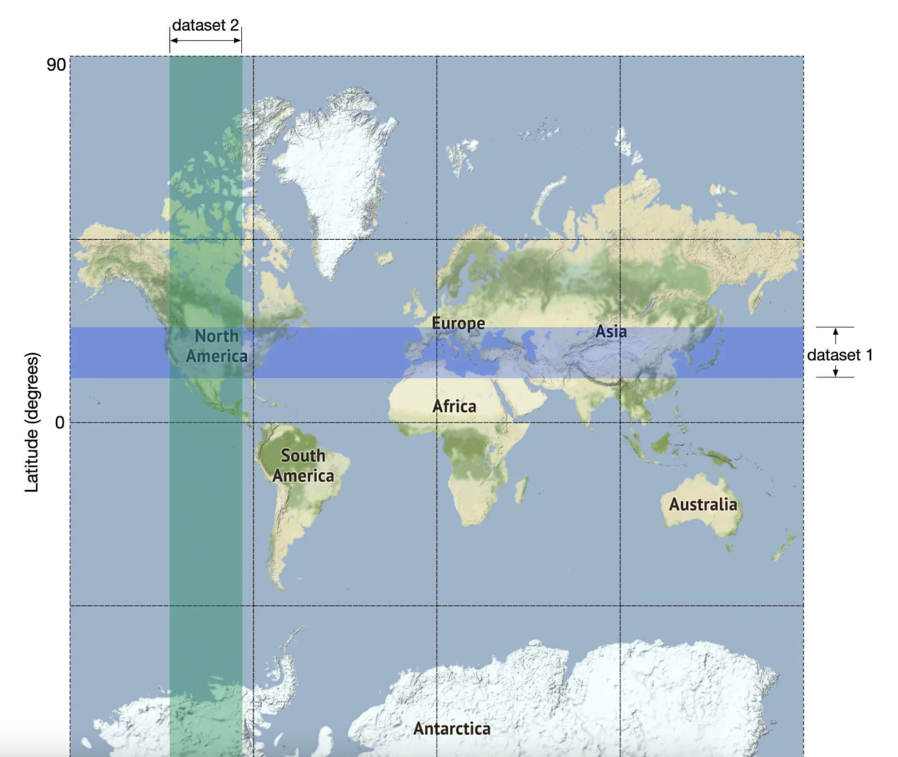
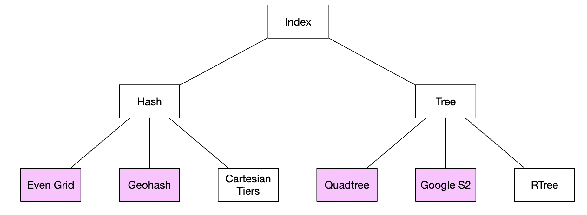
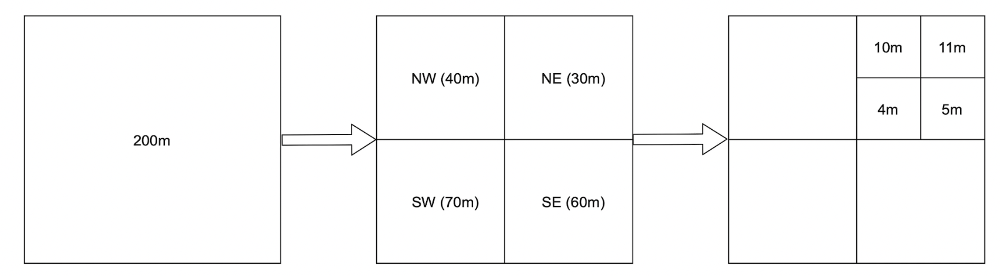
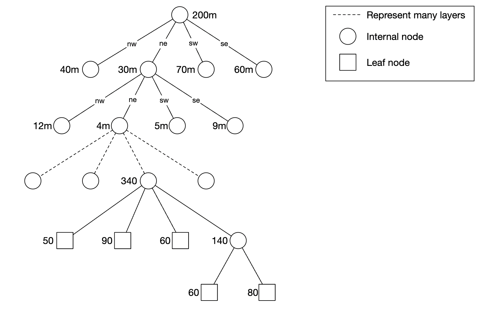

## Problem Statement
Design a proximity service that can notify users when they are near certain points of interest (POIs) or other users. This service should be scalable, efficient, and able to handle a large number of users and POIs.

## Requirements
### Functional Requirements
* Users should be able to search all nearby locations within a specified radius for any particular location (latitude and longitude)
* Business owners can add/delete/update a business. Information is not reflected in real-time.
* Users can view detailed information about a business

### Non-Functional Requirements
- **High Availability**: System should be highly available with minimal downtime.
- **Scalability**: System should be able to handle a large number of concurrent users and POIs without performance degradation.
- **Low Latency/Performance**: System should provide fast response times (e.g., under 100ms) for proximity searches.
- **Security**: User data, including location, must be securely stored and transmitted. Encryption at rest and in transit.
- **Data Privacy**: Users should have control over their data, including the ability to delete their location history.


## Back of Envelope Estimations/Capacity Estimation & Constraints
### Assumptions:
* Number of daily active users: 10 million
* Number of POIs: 100 million
* Average number of searches per user per day: 5
* Average size of POI data (name, address, coordinates, metadata): 1 KB
* Read-to-write ratio: 100:1
### Calculations:
* Total number of searches per day: 10 million * 5 = 50 million
* Total storage required for POI data: 100 million * 1 KB = 100 GB
* Network bandwidth required for reads: 50 million * 1 KB = 50 GB
* Network bandwidth required for writes: 50 GB / 100 = 500 MB

## High-level API design 

### User APIs
1. **POST /register**: Register a new user.
2. **POST /login**: Log in a user.
3. **GET /search/nearby**: Search for POIs near a specified location.
4. **GET /business/{id}**: Get detailed information about a business.

### Admin APIs
1. **POST /business**: Add a new business.
2. **PUT /business/{id}**: Update a business.
2. **GET /business/{id}**: Get a business.
3. **DELETE /business/{id}**: Remove a business.

## Database Design

### Users Table
- `user_id` (Primary Key)
- `username`
- `password_hash`
- `email`


### POIs Table
- `poi_id` (Primary Key)
- `name`
- `latitude`
- `longitude`
- `address`
- `city`
- `state`
- `country`
- `metadata`
- `created_by`
- `updated_by`

## High Level System Design
<<TBD>>

## Algorithms to Fetch Nearby POIs
### SQL Approach/Two-Dimensional Search

#### Description
* Using a relational database (like PostgreSQL, MySQL) to store latitude and longitude as columns in a table. Spatial queries are performed using standard SQL with mathematical functions.

* `To find all the nearby places of a given location (user_lat, user_lat) within a radius ‘D’, we can query like below:`

```
SELECT poi_id, latitude, longitude,
FROM poi
WHERE (latitude BETWEEN {:user_lat} - D AND {:user_lat} + D) AND
      (longitude BETWEEN {:user_long} - D AND {:user_long} + D)
```
#### Pros
- **Simplicity**: Easy to implement with existing relational databases.
- **ACID Compliance**: Benefits from the strong transactional support of relational databases.
- **Flexibility**: Can handle complex queries and joins.

#### Cons
- **Performance**: Poor performance for large datasets due to lack of spatial indexing. Also query is not efficient because we need to query the whole table.
- **Scalability**: Does not scale well with increasing number of records.
- **Inefficiency**: Requires computing distances for all points, leading to high computational cost.



We can,however, build 2D indexes and there are different approaches to that:


### Evenly Divided Grid
#### Description
* Divides the geographical area into a uniform grid of cells. Each cell can be indexed and queried independently.

#### Pros
- **Simplicity**: Simple to implement and understand.
- **Performance**: Good performance for uniformly distributed data.
- **Scalability**: Easy to scale horizontally by partitioning the grid.

#### Cons
- **Fixed Size**: Fixed cell size can lead to inefficiencies for varying densities. For eg:  business distribution is uneven as there are a lot of businesses concentrated in new york and close to zero in the sahara desert.
- **Memory**: Can consume a lot of memory for large areas with fine granularity.
- **Boundary Issues**: Handling edge cases at cell boundaries can be tricky.

### GeoHash
* Geohashing divides the world into a grid of cells, each represented by a unique string (geohash). Nearby locations have similar prefixes.
* Each two bits correspond to a single quadrant:

* It supports 12 levels of precision, but we only need up to 6 levels for our use-case:

* **Workflow Steps**:
    * Compute User's complete geohash from lat/long
    * Based on user's location and radius info, we can find the geohash length that matches the search.
    * calculates neighboring geohashes and adds them to the list. list looks likes as follows: ``list_of_geohases=[user_geohash, neig1_geohash, neig2_geohash, neig3_geohash]``
    * Execute following SQL query to query poi with D radius
    
    ```
    SELECT * FROM poi 
    WHERE geohash LIKE '9q8yz%'
    AND (latitude BETWEEN {:user_lat} - D AND {:user_lat} + D) AND
        (longitude BETWEEN {:user_long} - D AND {:user_long} + D);
    ```
* Minimal GeoHash length can be determined based on the desired radius of the search. Below table shows corresponding relationship:
| **Radius(KM)**    | **GeoHash length** |
|-------------------|--------------------|
| 0.5km(0.31 miles) | 6                  |
| 1km(0.62 miles)   | 6                  |
| 2km(1.24 miles)   | 5                  |
| 5km(3.1 miles)    | 4                  |
| 20km(12.42 miles) | 4                  |

* Geohashes enable us to quickly locate neighboring regions based on a substring of the geohash:

* Implementation Example
```python
import geohash2
import math

# Sample data: List of businesses with their latitudes and longitudes
businesses = [
    {"name": "Business A", "latitude": 37.7749, "longitude": -122.4194},
    {"name": "Business B", "latitude": 37.8044, "longitude": -122.2712},
    {"name": "Business C", "latitude": 37.6879, "longitude": -122.4702},
    {"name": "Business D", "latitude": 37.7833, "longitude": -122.4167},
]

# Encode business locations into geohashes
for business in businesses:
    business["geohash"] = geohash2.encode(business["latitude"], business["longitude"], precision=6)

# Function to determine geohash precision based on radius (in kilometers)
def get_geohash_precision(radius_km):
    if radius_km <= 0.61:
        return 6
    elif radius_km <= 2.4:
        return 5
    elif radius_km <= 20:
        return 4
    elif radius_km <= 78:
        return 3
    elif radius_km <= 630:
        return 2
    else:
        return 1

# Function to find nearby businesses
def find_nearby_businesses(user_lat, user_lon, radius_km):
    precision = get_geohash_precision(radius_km)
    user_geohash = geohash2.encode(user_lat, user_lon, precision)
    neighbors = geohash2.neighbors(user_geohash)
    nearby_geohashes = [user_geohash] + neighbors
    
    nearby_businesses = []
    for business in businesses:
        if business["geohash"][:precision] in nearby_geohashes:
            distance = haversine_distance(user_lat, user_lon, business["latitude"], business["longitude"])
            if distance <= radius_km:
                nearby_businesses.append(business)
    
    return nearby_businesses

# Haversine distance function to calculate the distance between two points on the Earth's surface
def haversine_distance(lat1, lon1, lat2, lon2):
    R = 6371  # Radius of the Earth in kilometers
    d_lat = math.radians(lat2 - lat1)
    d_lon = math.radians(lon2 - lon1)
    a = math.sin(d_lat / 2) ** 2 + math.cos(math.radians(lat1)) * math.cos(math.radians(lat2)) * math.sin(d_lon / 2) ** 2
    c = 2 * math.atan2(math.sqrt(a), math.sqrt(1 - a))
    return R * c

# Example usage
user_latitude = 37.7749
user_longitude = -122.4194
search_radius_km = 5

nearby_businesses = find_nearby_businesses(user_latitude, user_longitude, search_radius_km)
for business in nearby_businesses:
    print(f"Found {business['name']} at ({business['latitude']}, {business['longitude']}) with geohash {business['geohash']}")

```
#### Pros
- **Efficiency**: Reduces search space by narrowing down to relevant geohash cells.
- **Indexing**: Can be used with standard database indexes for quick lookups.
- **Proximity Queries**: Easier to implement proximity queries based on string comparison.
- **Increasing Search Area**: We can use them to easily implement the bonus problem of increasing search radius in case insufficient businesses are fetched via query:

#### Cons
- **Precision**: Can lead to false positives/negatives due to the rectangular nature of cells.
- **Complexity**: Requires converting between geohashes and coordinates.
- **Boundary Issues**: Handling edge cases at cell boundaries can be tricky.


### Quad Tree

* Quad trees recursively divide the 2D space into four quadrants or regions, with each node having four children.
* This is an in-memory solution which can't easily be implemented in a database.
* Example pseudocode to build a quadtree:
```
public void buildQuadtree(TreeNode node) {
    if (countNumberOfBusinessesInCurrentGrid(node) > 100) {
        node.subdivide();
        for (TreeNode child : node.getChildren()) {
            buildQuadtree(child);
        }
    }
}
```


* **Leaf Node Structure**

| Field                  | Description                                      |
|------------------------|--------------------------------------------------|
| Top-left Coordinates   | Coordinates identifying the top-left corner of the quadrant |
| Bottom-right Coordinates| Coordinates identifying the bottom-right corner of the quadrant |
| List of Business IDs   | List of business IDs in the grid                 |

* **Internal Node Structure**

| Field                  | Description                                      |
|------------------------|--------------------------------------------------|
| Top-left Coordinates   | Coordinates identifying the top-left corner of the quadrant |
| Bottom-right Coordinates| Coordinates identifying the bottom-right corner of the quadrant |
| Children Pointers      | Pointers to four child nodes   

* A quadtree can be stored in a single server, in-memory, although we can of course replicate it for redundancy and load balancing purposes.


#### Pros
- **Adaptive**: Efficiently adapts to varying spatial densities.
- **Hierarchical**: Naturally supports multi-resolution queries.
- **Efficient**: Reduces search space significantly for large datasets.
#### Cons
- **Complexity**: More complex to implement and maintain.
- **Update Cost**: Inserting and deleting points can be computationally expensive.
- **Imbalance**: Can become imbalanced if points are unevenly distributed.

```
import java.util.ArrayList;
import java.util.List;

class Point {
    double x, y;
    Point(double x, double y) {
        this.x = x;
        this.y = y;
    }
}

class QuadTreeNode {
    double x, y, width, height;
    List<Point> points;
    QuadTreeNode[] children;

    QuadTreeNode(double x, double y, double width, double height) {
        this.x = x;
        this.y = y;
        this.width = width;
        this.height = height;
        this.points = new ArrayList<>();
        this.children = new QuadTreeNode[4];
    }

    boolean insert(Point point) {
        if (!contains(point)) return false;
        
        if (points.size() < 4) {
            points.add(point);
            return true;
        }

        if (children[0] == null) subdivide();
        
        for (QuadTreeNode child : children) {
            if (child.insert(point)) return true;
        }

        return false;
    }

    boolean contains(Point point) {
        return point.x >= x && point.x <= x + width && point.y >= y && point.y <= y + height;
    }

    void subdivide() {
        double hw = width / 2;
        double hh = height / 2;
        children[0] = new QuadTreeNode(x, y, hw, hh);
        children[1] = new QuadTreeNode(x + hw, y, hw, hh);
        children[2] = new QuadTreeNode(x, y + hh, hw, hh);
        children[3] = new QuadTreeNode(x + hw, y + hh, hw, hh);
    }
}

public class QuadTreeExample {
    public static void main(String[] args) {
        QuadTreeNode root = new QuadTreeNode(0, 0, 100, 100);
        root.insert(new Point(25, 25));
        root.insert(new Point(50, 50));
        root.insert(new Point(75, 75));
        root.insert(new Point(80, 80));
    }
}
```

### Google S2
#### Description
* Google S2 is a geometry library, which supports mapping 2D points on a 1D plane using hilbert curves. Objects close to each other on the 2D plane are close on the hilbert curve as well.

* This library is great for geofencing, which supports covering arbitrary areas vs. confining yourself to specific quadrants.

#### Pros
- **Accuracy**: Provides high precision and handles spherical geometry well.
- **Scalability**: Designed to scale to very large datasets.
- **Flexibility**: Supports various spatial operations and queries.
#### Cons
- **Complexity**: More complex to understand and implement.
- **Dependency**: Requires integration with the S2 library.
- **Learning Curve**: Steeper learning curve compared to simpler methods.

### Summary Table
#### Comparison
| **Algorithm**              | **Pros**                                               | **Cons**                                                             | **Use Case Example**                              | **Companies**                  |
|----------------------------|--------------------------------------------------------|----------------------------------------------------------------------|---------------------------------------------------|--------------------------------|
| Simple SQL Storage         | Easy to implement, ACID compliance, flexible           | Poor performance for large datasets, scalability issues, inefficient | Small datasets, non-performance critical apps     |                                |
| Evenly Divided Grid        | Simple, good performance for uniform data, scalable    | Fixed size inefficiencies, high memory usage, boundary issues        | Uniformly distributed spatial data, scalable apps |                                |
| GeoHash                    | Efficient, indexed lookups, supports proximity queries | Precision issues, complex conversion, boundary handling              | Medium-sized datasets, moderate spatial queries   | Bing Map, Redis, MongoDB, Lyft |
| Quad Tree                  | Adapts to spatial densities, supports multi-resolution | Complex to implement, expensive updates, potential imbalance         | Apps with highly variable spatial densities       | Yext                           |
| Both Geohash and Quad Tree |                                                        |                                                                      |                                                   | Elasticsearch                  |
| Google S2                  | High precision, scalable, flexible                     | Complex, dependency on library, steep learning curve                 | Large-scale systems, high spatial accuracy apps   | Google Maps, Tinder            |


#### Recommendation
* Suggest choosing geohashes or quadtree in an interview as those are easier to explain than Google S2.

## Deep Dive
### Replication and Fault Tolerance
* Having replicas of QuadTree/GeoHash servers can provide an alternate to data partitioning.
* To distribute read traffic, we can have replicas of each QuadTree server.
* We can have a master-slave configuration, where replicas (slaves) will only serve read traffic and all write traffic will first go the master and then applied to slaves.
* Slaves might not have some recently inserted places (a few milliseconds delay will be there), but this could be acceptable.

### Data Partitioning
* POI table can be scaled by sharding it in case it doesn't fit in a single server instance.
* We don't need to shard the geohash table as we don't have that much data. We calculated that it takes ~1.7gb to build a quad tree and geohash space usage is similar.
#### Sharding based on regions
Divide the geographical area into logical regions (e.g., by country, state, or city). Each shard handles data for a specific region. This approach works well for evenly distributed data but can lead to hotspots if some regions have much more data than others.
#### Sharding based on location or poi_id
Use a hash function on location coordinates or POI IDs to distribute data evenly across shards. This method ensures a more even distribution of data but can complicate proximity queries.

### Caching
* To deal with hot Places, we can introduce a cache in front of our database.
* We can use an off-the-shelf solution like Memcache, which can store all data about hot places.
* Application servers before hitting backend database can quickly check if the cache has that Place.
* We can use the geohash as cache key.
* example code to cache the data in redis:
```
public List<String> getNearbyBusinessIds(String geohash) {
    String cacheKey = hash(geohash);
    List<string> listOfBusinessIds = Redis.get(cacheKey);
    if (listOfBusinessIDs  == null) {
        listOfBusinessIds = Run the select SQL query above;
        Cache.set(cacheKey, listOfBusinessIds, "1d");
    }
    return listOfBusinessIds;
}
```
* Cache the data on all precisions we support, which are not a lot, ie geohash_4, geohash_5, geohash_6.
* We could also cache business_id -> business_data as users could often query the details of the same popular restaurant.

### Ranking
When multiple POIs match a proximity query, rank them based on relevance factors such as:
* Distance: Closer POIs are ranked higher.
* Popularity: POIs with higher user ratings or more visits are ranked higher.
* Recency: Newly added or updated POIs are ranked higher.


## References
* https://astikanand.github.io/techblogs/high-level-system-design/design-yelp-or-nearby
* Alex Xu -VOl2 - Chapter1: https://github.com/preslavmihaylov/booknotes/blob/master/system-design/system-design-interview/chapter17/README.md
* https://pdfhost.io/v/iOoOgPk.G_Proximity_Services_System_Design
* https://medium.com/double-pointer/system-design-interview-yelp-or-nearby-proximity-service-5258359c421c
