# Table of contents

- [Problem Statement](#problem-statement)
- [Requirements](#requirements)
  - [Functional Requirements](#functional-requirements)
  - [Non-Functional Requirements](#non-functional-requirements)
- [Back of Envelope Estimations/Capacity Estimation & Constraints](#back-of-envelope-estimationscapacity-estimation--constraints)
- [Throttling Types](#throttling-types)
- [Where to put  the rate limiter ?](#where-to-put--the-rate-limiter-)
- [High Level System Design and Algorithms](#high-level-system-design-and-algorithms)
  - [High Level Design](#high-level-design)
    - [HTTP Response Headers](#http-response-headers)
  - [Algorithms for Rate Limiting](#algorithms-for-rate-limiting)
    - [Token Bucket](#token-bucket)
    - [Leaky Bucket](#leaky-bucket)
    - [Fixed Window Counter](#fixed-window-counter)
    - [Sliding(Rolling) Window Log](#slidingrolling-window-log)
    - [Sliding(Rolling) Window Counter](#slidingrolling-window-counter)
    - [Comparision of rate-limiting algorithms](#comparision-of-rate-limiting-algorithms)
  - [Rate Limiting in Distributed Systems](#rate-limiting-in-distributed-systems)
    - [All To All (also known as Broadcasting)](#all-to-all-also-known-as-broadcasting)
    - [Distributed database at each node](#distributed-database-at-each-node)
    - [Centralized database/cache](#centralized-databasecache)
- [References](#references)

## Problem Statement
An API rate limiter will throttle users based on the number of requests they are sending.
Benefits of API Rate limiter
* Prevent Brute Force Attacks
* Prevent resource starvation caused by Denial of Service (DoS) attack
* Reduce cost.
* Prevent servers from being overloaded.


## Requirements

### Functional Requirements
* To limit the number of requests a client can send to an API within a time window.
* To make the limit of requests per window configurable.
* To make sure that the client gets a message (error or notification) whenever the defined threshold is crossed within a single server or combination of servers.

### Non-Functional Requirements
* **Availability**: Essentially, the rate limiter protects our system. Therefore, it should be highly available.
* **Low latency**: Because all API requests pass through the rate limiter, it should work with a minimum latency without affecting the user experience.
* **Scalability**: Our design should be highly scalable. It should be able to rate limit an increasing number of clients’ requests over time

## Back of Envelope Estimations/Capacity Estimation & Constraints

## Throttling Types
* **Hard Throttling** – Number of API requests cannot exceed the throttle limit
* **Soft Throttling** – Set the API request limit to exceed by some percentage. E.g, if the rate-limit = 100 messages/minute, and 10% exceed-limit, our rate limiter will allow up to 110 messages per minute
* **Elastic or Dynamic Throttling** – The number of requests can exceed the limit if the system has some free resources available.

## Where to put  the rate limiter ?
* **On the client side**: Hostile actors can quickly falsify client requests. So the client is an unstable venue to impose rate restrictions. Furthermore, we may not have complete control over client implementation
* **On the server side (standalone service):** The rate limiter is placed on the server-side. In this approach, a server receives a request that is passed through the rate limiter that resides on the server.
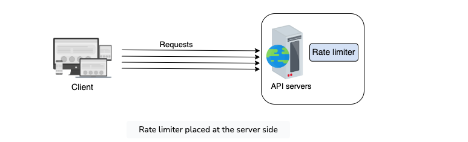
* **As middleware**: In this strategy, the rate limiter acts as middleware, throttling requests to API servers. Eg: API Gateway
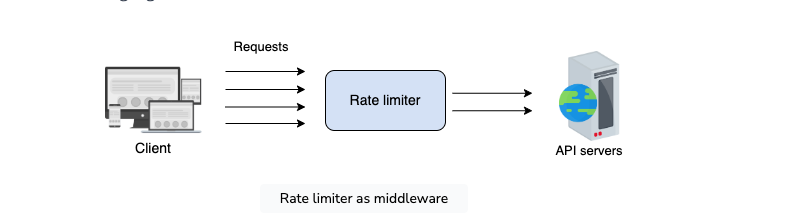


## High Level System Design and Algorithms

### High Level Design
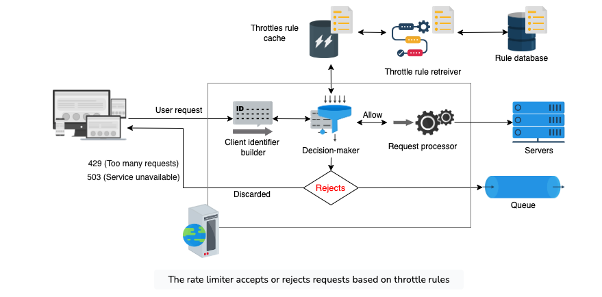
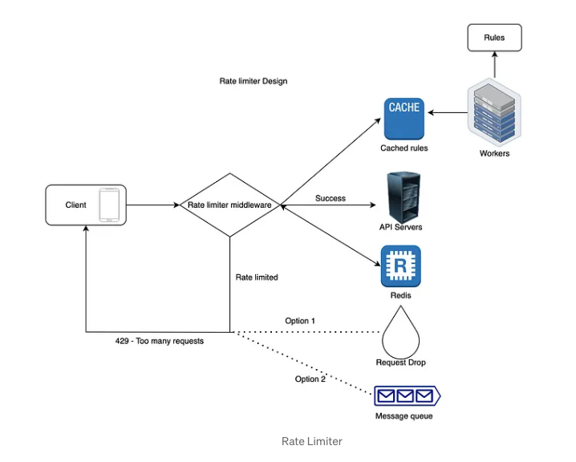
* **Rule database:** This is the database, consisting of rules defined by the service owner. Each rule specifies the number of requests allowed for a particular client per unit of time.
* **Rules retriever**: Background process that periodically checks for any modifications to the rules in the database. The rule cache is updated if there are any modifications made to the existing rules.
* **Throttle rules cache**: The cache consists of rules retrieved from the rule database. T
* **Decision-maker**: Responsible for making decisions against the rules in the cache. Works based on rate limited algorithm

##### **HTTP Response Headers**
Rate limiter returns the following HTTP headers to clients:
```
X-Ratelimit-Remaining: The remaining number of allowed requests within the window.
X-Ratelimit-Limit: It indicates how many calls the client can make per time window.
X-Ratelimit-Retry-After: The number of seconds to wait until you can make a request again without being throttled.
```

### Algorithms for Rate Limiting
#### Token Bucket
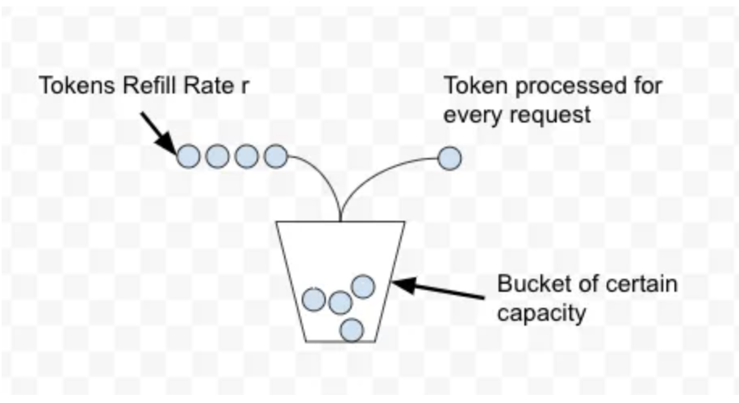
* **Steps**
    * In the Token Bucket algorithm, we process a token from the bucket for every request.
    * New tokens are added to the bucket with rate r. The bucket can hold a maximum of b tokens
    * If a request comes and the bucket is full it is discarded.
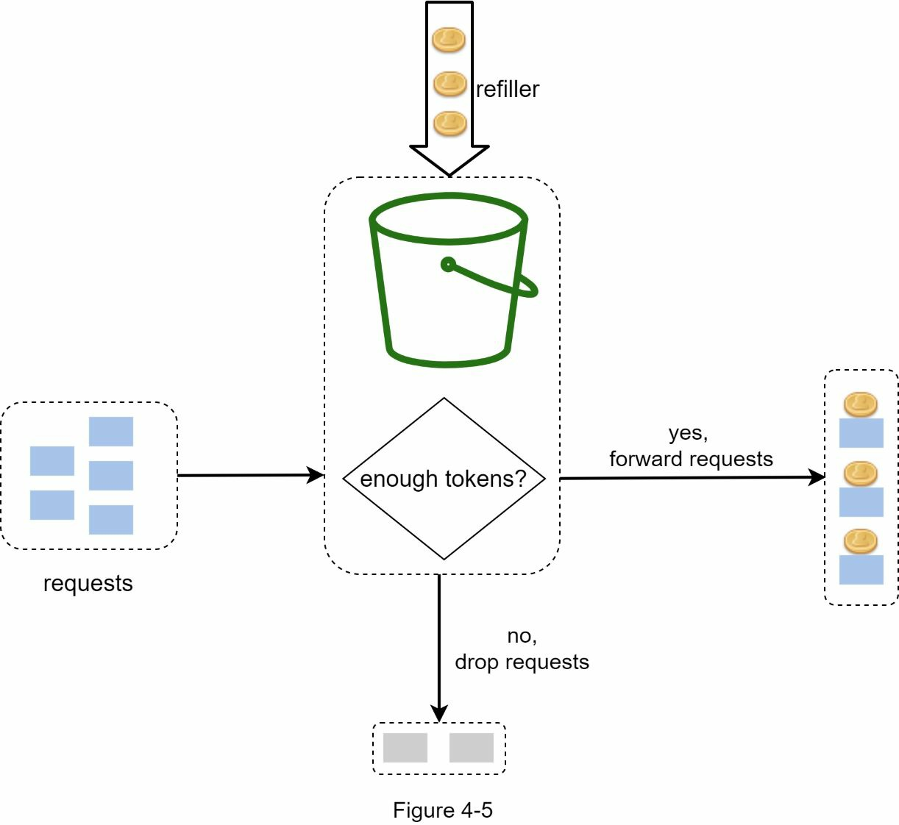
* **Essential Parameters**
    * Bucket capacity(C): The maximum number of tokens that can reside in the bucket.
    * Rate limit (R): The number of requests we want to limit per unit time.
    * Refill rate (1/R) : The duration after which a token is added to the bucket.
    * Requests count(N) : This parameter tracks the number of incoming requests and compares them with the bucket’s capacity.
* **Pros**
    * Simple and straightfoward to use
    * Smooth out the requests and process them at an approximately average rate.
    * Space efficient. The memory needed for the algorithm is nominal due to limited state
* **Cons**
    * Choosing an optimal value for the essential parameters is a difficult task.
* **Implementation**
```java
import redis.clients.jedis.Jedis;

public class RateLimiter {

    private static Jedis redisClient;

    public static boolean RateLimitUsingTokenBucket(
            String userID,
            long intervalInSeconds,
            long maximumRequests) {

        // userID can be apikey, location, ip
        String value = redisClient.get(userID + "_last_reset_time");

        long lastResetTime = Long.parseLong(value != null ? value : "0");

        // check if time window since last counter reset has elapsed
        if (System.currentTimeMillis() / 1000 - lastResetTime >= intervalInSeconds) {
            // if elapsed, reset the counter
            redisClient.set(userID + "_counter", String.valueOf(maximumRequests));
        } else {
            String requestLeftStr = redisClient.get(userID + "_counter");
            long requestLeft = requestLeftStr != null ? Long.parseLong(requestLeftStr) : 0;

            if (requestLeft <= 0) { // request left is 0 or < 0
                // drop request
                return false;
            }
        }

        // decrement request count by 1
        redisClient.decr(userID + "_counter");

        // handle request
        return true;
    }
}

```

#### Leaky Bucket
* The leaking bucket algorithm is a variant of the token bucket algorithm with slight modification where requests are processed at a fixed rate. 
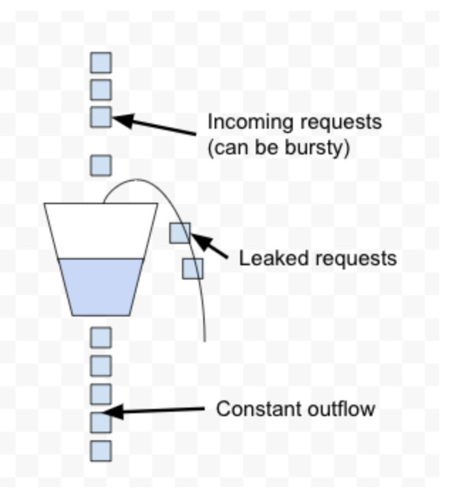
* **Steps**
    * When a request arrives, the system checks if the queue is full. If it is not full, the request is added to the queue.
    * Otherwise, the request is dropped.
    * Requests are pulled from the queue and processed at regular intervals.
    *  The algorithm process these requests at a constant rate in a first-in-first-out (**FIFO**) order.
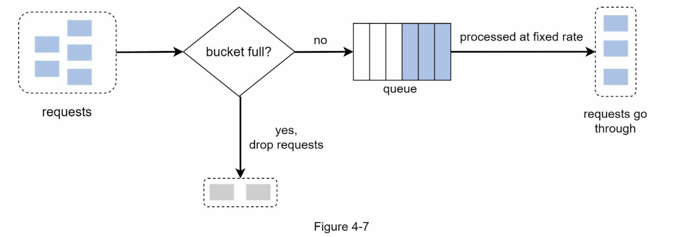
* **Essential Parameters**
    * Bucket capacity(C): It is equal to the queue size. The queue holds the requests to be processed at a fixed rate.
    * Outlfow Rate (Rout):  number of requests processed per unit time
* **Pros**
    *  Memory efficient given the limited queue size.
    * Requests are processed at a fixed rate therefore it is suitable for use cases that a stable outflow rate is needed.
    * smooths out bursts of requests and processes them at an approximately average rate
* **Cons**
    * A burst of traffic fills up the queue with old requests, and if they are not processed in time, recent requests will be rate limited.
    * no guarantee that requests get processed in a fixed amount of time
    * There are two parameters in the algorithm. Determining an optimal bucket size and outflow rate is a challenge.
* **Implementation**
```java
import redis.clients.jedis.Jedis;

public class RateLimiter {

    private static Jedis redisClient;

    public static boolean RateLimitUsingLeakyBucket(
            String userID,
            String uniqueRequestID,
            long intervalInSeconds,
            long maximumRequests) {

        // userID can be apikey, location, ip
        long requestCount = redisClient.llen(userID);

        if (requestCount >= maximumRequests) {
            // drop request
            return false;
        }

        // add request id to the end of request queue
        redisClient.rpush(userID, uniqueRequestID);

        return true;
    }
}

```

#### Fixed Window Counter
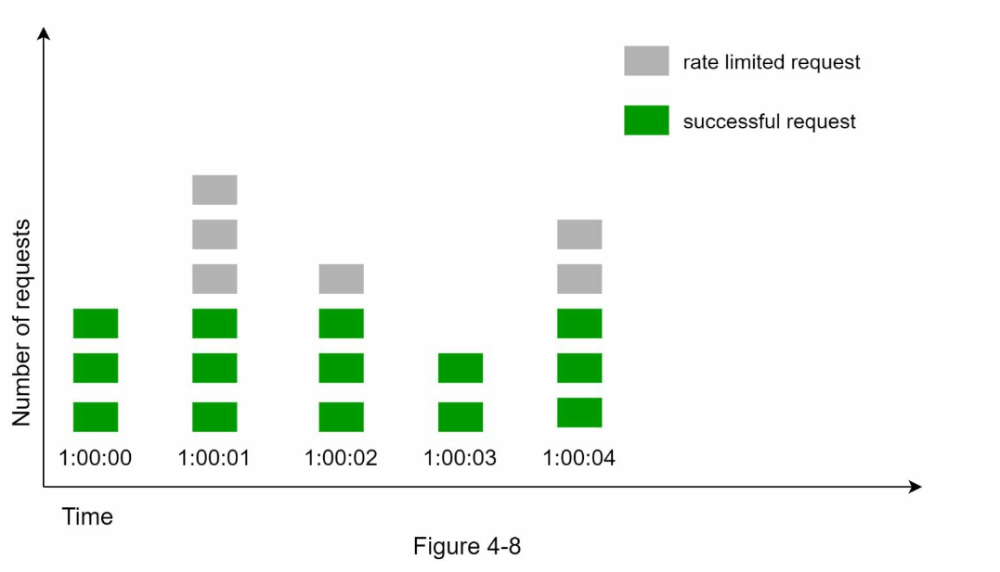
* **Steps**
    * This algorithm divides the time into fixed intervals called **windows** and assigns a counter to each window. 
    * When a specific window receives a request, the counter is incremented by one. 
    * Once the counter reaches its limit, new requests are discarded in that window.
* **Essential Parameters**
    * Window size(W): Represent the size of the time window. 
    * Rate limit(R): number of requests allowed per time window.
    * Requests count(N):number of incoming requests per window.
* **Pros**
    * Memory efficient due to constraints on the rate of requests.
    * Easy to understand.
    * Resetting available quota at the end of a unit time window fits certain use cases.
* **Cons**
    * Spike in traffic at the edges of a window could cause more requests than the allowed quota to go through.
    ``Example 1: if we set a maximum of 10 message per minute, we don’t want a user to be able to receive 10 messages at 0:59 and 10 more messages at 1:01.``


* **Implementation**
```java
import redis.clients.jedis.Jedis;
import java.time.Instant;

public class RateLimiter {

    private static Jedis redisClient;

    public static boolean RateLimitUsingFixedWindow(
            String userID,
            long intervalInSeconds,
            long maximumRequests) {

        // userID can be apikey, location, ip
        long currentWindow = Instant.now().getEpochSecond() / intervalInSeconds;
        String key = userID + ":" + currentWindow; // user userID + current time window
        
        // get current window count
        String value = redisClient.get(key);
        long requestCount = value != null ? Long.parseLong(value) : 0;

        if (requestCount >= maximumRequests) {
            // drop request
            return false;
        }

        // increment request count by 1
        redisClient.incr(key); // if the key is not available, value is initialised to 0 and incremented to 1

        // handle request
        return true;
        // delete all expired keys at regular intervals
    }
}

```
#### Sliding(Rolling) Window Log
Hybrid approach that combines the Fixed Window Counter algorithm and Sliding Window Logs algorithm.
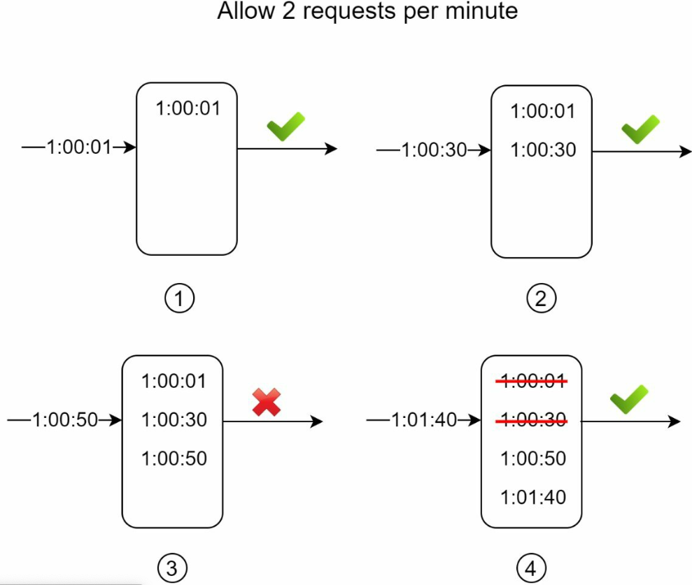
* **Steps**
    *  Track of request timestamps. Timestamp data is usually kept in cache, such as sorted sets of Redis.
    * When a new request comes in, remove all the outdated timestamps. Outdated timestamps are defined as those older than the start of the current time window.
    * Add timestamp of the new request to the log.
    * If the log size is the same or lower than the allowed count, a request is accepted. Otherwise, it is rejected.
* **Essential Parameters**
* **Pros**
    * Doesn’t suffer from the boundary conditions of fixed windows.
* **Cons**
    * Consumes a lot of memory because even if a request is rejected, its timestamp might still be stored in memory.
* **Implementation**
```java
import redis.clients.jedis.Jedis;
import redis.clients.jedis.params.ZAddParams;
import redis.clients.jedis.params.ZParams;

import java.time.Instant;

public class RateLimiter {

    private static Jedis redisClient;

    public static boolean RateLimitUsingSlidingLogs(
            String userID,
            String uniqueRequestID,
            long intervalInSeconds,
            long maximumRequests) {

        // userID can be apikey, location, ip
        long currentTime = Instant.now().getEpochSecond();
        long lastWindowTime = currentTime - intervalInSeconds;

        // get current window count
        long requestCount = redisClient.zcount(userID, lastWindowTime, currentTime);

        if (requestCount >= maximumRequests) {
            // drop request
            return false;
        }

        // add request id to last window
        redisClient.zadd(userID, currentTime, uniqueRequestID, ZAddParams.zAddParams().nx());

        //

```


#### Sliding(Rolling) Window Counter
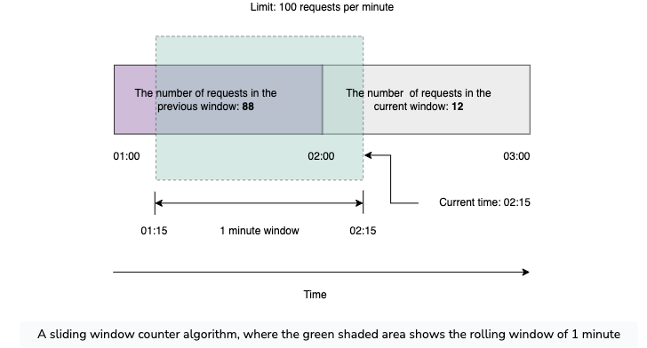
* **Steps**
    * Doesn't limit the requests based on fixed time units
    * Used both the fixed window counter and sliding window log algorithms to make the flow of requests more smooth

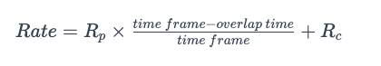

``Rp`` is the number of requests in the previous window, which is 88. ``Rc`` is the number of requests in the current window, which is 12 ``time frame`` is 60 seconds in our case, and ``overlap time`` is 15 seconds.

```

    limit = 100 requests/hour

    rate = ( 88 * ((time interval between 1:15 and 02:00) / rolling window size) ) + 12
    = 88 * ((60 - 15)/60) + 12
    = 88 * 0.75 + 12
    = 78

    rate < 100
    hence, we will accept this request.
```

* Essential Parameters
* **Pros**
    * space efficient due to limited states
    * Sooths out the bursts of requests and processes them with an approximate average rate based on the previous window.
* **Cons**
    * Assumes that the number of requests in the previous window is evenly distributed, which may not always be possible.

#### Comparision of rate-limiting algorithms
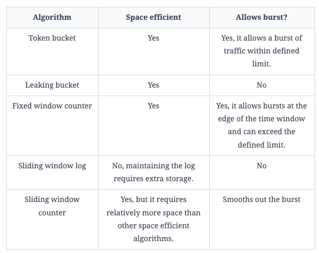


### Rate Limiting in Distributed Systems
We can use various Communication Algorithms to implement throttling in Distributed Systems which are as follows 
#### All To All (also known as Broadcasting)
In the mode of broadcasting, each of the nodes sends messages to every other node. The disadvantage of broadcasting is that it results in redundant messaging and heavy usage of network bandwidth.
* **Pros**
    * Ease of implementation.
* **Cons**
    * Not scalable with the number of hosts

#### Gossip Communication
The gossip protocol is based on the same methodology as epidemics spread. Typically, nodes talk to peer nodes (sister nodes) in the network and the information spreads to all the nodes in the network.
* **Pros**
    * Ease of implementation.
* **Cons**
    * Not scalable with the number of hosts


#### Distributed database at each node
* Enforce the limit is to set up **sticky** sessions in your load balancer so that each consumer gets sent to exactly one node.
* **Pros**
    * Simple
* **Cons**
    *  include a lack of fault tolerance and scaling problems when nodes get overloaded.

#### Centralized database/cache
* Using a distributed database/cache is another mechanism with which we can have nodes communicate. In a distributed cache setting, the nodes talk to a central cache (Memcached, Redis, or DynamoDB) and store the updated state. While this protocol reduces the overhead in communication, it brings in a single point of failure i.e. the central cache.and consumer
* **Pros**
    * More flexible for load-balancing rule
* **Cons**
    * increased latency making requests to the data store,
    * race conditions for get and set operations. We need some locking around the key operations

#### Coordination Service
Another commonly used protocol is using a coordination service. The coordination service is a third-party service that helps elect one of the nodes as the leader. Each of the hosts talks to the leader and syncs information with the host. Typically, Paxos, and Raft are used to implement the Coordination Protocol. Zookeeper is a widely adopted service used to implement a Coordination Service
* **Pros**
   * Scalable design as the hosts can scale independent of the coordination service.
* **Cons**
   * Complexity of implementation.
   * Complexity in case of failure of the leader.

#### Random Leader Selection
Instead of relying on a central coordination service we can go with a random algorithm to pick a leader. An example could be using the MAC or IP address and using the host with the largest address. Ideally, this should lead to a single leader being elected, and all the hosts talk through this leader. Even if there are multiple leaders that are elected, this should not result in any issues since the information will eventually converge to the right state of the cluster.

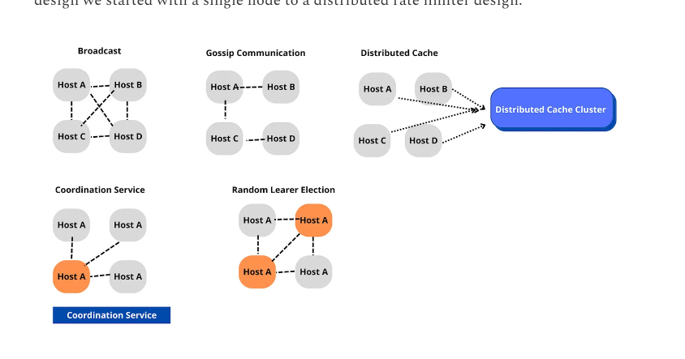

## References
* Alex Xu-Vol1 - https://github.com/Salah856/System-Design/blob/main/Design%20Rate%20Limiter.md
* https://www.educative.io/courses/grokking-modern-system-design-interview-for-engineers-managers/design-of-a-rate-limiter
* https://newsletter.systemdesign.one/p/rate-limiter
* https://systemsdesign.cloud/SystemDesign/RateLimiter
* https://aaronice.gitbook.io/system-design/system-design-problems/designing-an-api-rate-limiter
* https://ravisystemdesign.substack.com/p/interview-preparation-design-a-distributed
