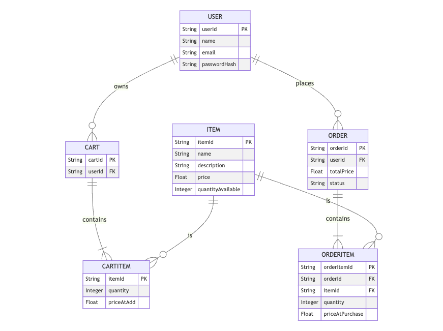
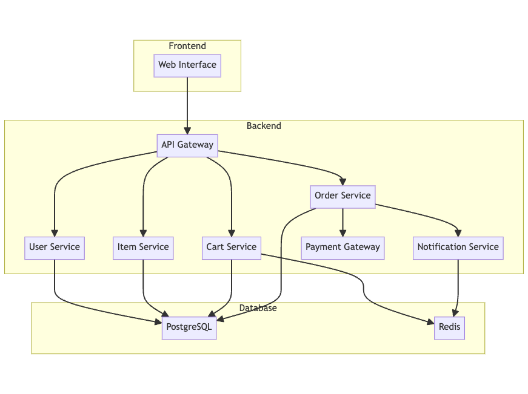

## Problem Statement

Design a simple shopping cart system for an online store that allows users to create a cart, view items, add items to the cart, and proceed to checkout.

## Clarification Questions to Interviewer

1. Should the system support user authentication?
2. Are there any specific payment methods we need to support?
3. How should inventory be managed in the system?
4. Should the system send notifications (e.g., emails) for cart actions or purchases?
5. What kind of reports or analytics, if any, are required from the system?
6. Are there any specific security requirements we should be aware of?
7. Should the system support different currencies and languages?

## Requirements

### Functional Requirements
1. Users should be able to create a cart.
2. Users should be able to view the cart.
3. Users should be able to add items to the cart.
4. Users should be able to view items within the cart.
5. Users should be able to update the quantity of items in the cart.
6. Users should be able to proceed to checkout.
7. The system should display the total price of items in the cart.
8. The system should persist cart state between sessions for authenticated users.

#### Below the line (out of scope)
- Inventory management system.
- Detailed payment gateway integration.
- User reviews and ratings.
- Discount and coupon management.
- Multi-currency and multi-language support.

### Non-Functional Requirements
1. The system should be highly available.
2. The system should be scalable to handle a large number of users.
3. The system should ensure data consistency.
4. The system should be secure, protecting user data and transactions.
5. The system should have a low response time for cart operations.

#### Below the line (out of scope)
- Detailed logging and monitoring system.
- Advanced performance optimization.

## Back of Envelope Estimations/Capacity Estimation & Constraints

- Assume an average of 1 million users per month.
- Peak usage might be around 10,000 users concurrently.
- Each user may add an average of 10 items to the cart per session.
- Each item entry in the cart could take about 1 KB of storage.
- Estimate of 10 GB storage for carts considering user sessions and metadata.

## High-level API design

### Creating a Cart

**POST /v1/carts/mine**

- Create a new cart.
- Request Body: `{ "userId": "1234" }`
- Response: `{"success": true, "cartId": "abcd1234"}`

### Viewing a Cart

**GET /v1/carts/mine**

- Retrieve the current cart.
- Request Params: `userId=1234`
- Response: `{"cart": { "cartId": "abcd1234", "items": [ ... ], "totalPrice": 100.00 }}`

### Adding an Item to a Cart

**POST /v1/carts/mine/items**

- Add an item to the cart.
- Request Body: `{ "userId": "1234", "itemId": "5678", "quantity": 1 }`
- Response: `{"success": true, "cart": { ... }}`

### Viewing Items Within a Cart

**GET /v1/carts/mine/items**

- Retrieve all items in the cart.
- Request Params: `userId=1234`
- Response: `{"items": [ ... ]}`

### Updating Item Quantity in Cart

**PUT /v1/carts/mine/items**

- Update the quantity of an item in the cart.
- Request Body: `{ "userId": "1234", "itemId": "5678", "quantity": 2 }`
- Response: `{"success": true, "cart": { ... }}`

### Proceeding to Checkout

**POST /v1/carts/mine/checkout**

- Proceed to checkout.
- Request Body: `{ "userId": "1234" }`
- Response: `{"success": true, "order": { ... }}`

### Filtering, Sorting, and Pagination

#### Filtering

**GET /v1/carts/mine/items?filter=color:red**

- Filter items in the cart by color.
- Request Params: `filter=color:red`
- Response: `{"items": [ ... ]}`

#### Sorting

**GET /v1/carts/mine/items?sort_by=time**

- Sort items in the cart by the time they were added.
- Request Params: `sort_by=time`
- Response: `{"items": [ ... ]}`

#### Pagination

**Offset Pagination**

**GET /v1/carts/mine/items?page={page}&count={count}**

- Paginate items in the cart.
- Request Params: `page=1&count=10`
- Response: `{"items": [ ... ], "totalPages": 5}`

**Cursor-Based Pagination**

**GET /v1/carts/mine/items?maxPageSize={maxPageSize}&pageToken={pageToken}**

- Paginate items in the cart using a cursor.
- Request Params: `maxPageSize=10&pageToken=abc123`
- Response: `{"items": [ ... ], "nextPageToken": "def456"}`

## Data Model

### Entities and Attributes

#### User
- `userId`: String, primary key
- `name`: String
- `email`: String
- `passwordHash`: String

#### Item
- `itemId`: String, primary key
- `name`: String
- `description`: String
- `price`: Float
- `quantityAvailable`: Integer

#### Cart
- `cartId`: String, primary key
- `userId`: String, foreign key
- `items`: List of CartItem

#### CartItem
- `itemId`: String, primary key
- `quantity`: Integer
- `priceAtAdd`: Float

#### Order
- `orderId`: String, primary key
- `userId`: String, foreign key
- `totalPrice`: Float
- `status`: String (e.g., Pending, Completed)

#### OrderItem
- `orderItemId`: String, primary key
- `orderId`: String, foreign key
- `itemId`: String, foreign key
- `quantity`: Integer
- `priceAtPurchase`: Float

## Choice of Database
For this shopping cart system, a relational database such as PostgreSQL is a suitable choice. PostgreSQL is highly reliable, supports ACID transactions, and provides robust support for relational data and complex queries. It also offers strong indexing capabilities and can handle the anticipated load efficiently.

## High Level System Design

### Components

1. **User Service**: Handles user authentication and management.
2. **Item Service**: Manages items and inventory.
3. **Cart Service**: Manages the shopping cart operations.
4. **Order Service**: Handles the checkout process and order management.
5. **Notification Service**: Sends notifications for cart and order actions (optional).
6. **Payment Gateway**: Integrates with external payment providers (optional).

### Architecture
- **Frontend**: The web interface that users interact with.
- **API Gateway**: Routes requests to appropriate backend services.
- **User Service**: Manages user authentication and profiles.
- **Item Service**: Manages items and inventory.
- **Cart Service**: Manages shopping cart operations.
- **Order Service**: Handles the checkout process and order management.
- **Notification Service**: Sends notifications for cart and order actions.
- **Payment Gateway**: Integrates with external payment providers.
- **PostgreSQL**: Relational database for persistent storage.
- **Redis**: In-memory data store for session management and caching.

## Deep Dive

### Cart Service

- **Add Item to Cart**: Check item availability, add item to cart, update total price.
- **Remove Item from Cart**: Remove item from cart, update total price.
- **View Cart**: Retrieve all items in the user's cart, calculate the total price.
- **Update Item Quantity**: Update the quantity of an item in the cart, check inventory, update total price.
- **Checkout**: Validate cart items, create order, reduce inventory, clear cart, initiate payment process (optional).

### Filtering, Sorting, and Pagination

#### Filtering

**GET /v1/carts/mine/items?filter=color:red**

- Filter items in the cart by color.
- Request Params: `filter=color:red`
- Response: `{"items": [ ... ]}`

#### Sorting

**GET /v1/carts/mine/items?sort_by=time**

- Sort items in the cart by the time they were added.
- Request Params: `sort_by=time`
- Response: `{"items": [ ... ]}`

#### Pagination

**Offset Pagination**

**GET /v1/carts/mine/items?page={page}&count={count}**

- Paginate items in the cart.
- Request Params: `page=1&count=10`
- Response: `{"items": [ ... ], "totalPages": 5}`

**Cursor-Based Pagination**

**GET /v1/carts/mine/items?maxPageSize={maxPageSize}&pageToken={pageToken}**

- Paginate items in the cart using a cursor.
- Request Params: `maxPageSize=10&pageToken=abc123`
- Response: `{"items": [ ... ], "nextPageToken": "def456"}`

### Security

- Implement rate limiting to prevent DDoS attacks.
- Use firewalls to block recurrent requests from a single IP address.
- Implement API gateway rate limiting to limit requests (e.g., 100 per minute).

## References
* https://blog.bytebytego.com/p/api-redesign-shopping-cart-and-stripe
* https://www.geeksforgeeks.org/how-to-design-a-database-for-shopping-cart/
* https://leetcode.com/discuss/interview-question/system-design/1194616/system-design-design-shopping-cart-page-android