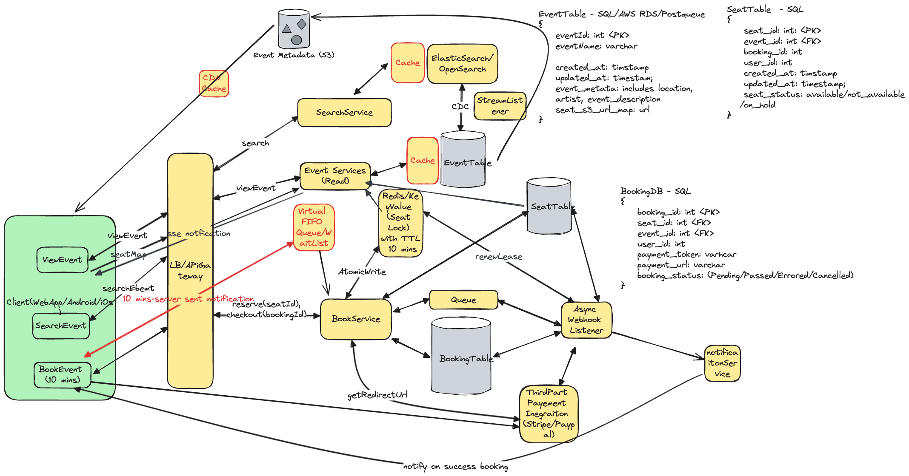

## Problem Statement
Design a distributed system for an online ticket booking platform like Ticketmaster, which can handle a high volume of traffic and provide a seamless user experience for searching, reserving, and purchasing tickets for various events.

## Requirements
### Functional Requirements
* **Book Tickets:** Users should be able to book tickets to events
* **View Events:** Users should be able to view events
* **Search Events:** Users should be able to search for events

#### Out of scope
* Dynamic Pricing
* Admin actions on coordinating events
* View booked events

### Non-Functional Requirements
* **Low latency**: Low latency search.
* **Availability**: System should prioritize availability for searching & viewing events
* **Consistency**: System should prioritize strong consistency for booking events (no double booking) 
* System is read heavy, and thus needs to be able to support high read throughput
* **Scalability**: Scalability to handle surges from popular events
* **Security**: Purchase path should be secure. Encrypt data in transist & data in rest.

#### Out of scope
* GDPR Compilance
* Fault Tolerance
* Backups
* CI/CD

## Back of Envelope Estimations/Capacity Estimation & Constraints
## High-level API design 
View Events (Read)
   ListEvent - GET viewEvent?pageNumber=<<>>,maxResultSize=<<> ---> List<Events>
   GetEvent - GET getEvent?eventId=<<>> --> Event Object

Search Events (Read)
   - GET searchEvent?type=<<>>,location=<<>>, performerName=<<>>, eventName=<<>>

Book Events (Write)
 POST bookEvent?eventId=<<>>,seatNumber=<<>>
## Database Design
### Users Table
| Column      | Type        | Constraints                  |
|-------------|-------------|------------------------------|
| `user_id`   | `SERIAL`    | `PRIMARY KEY`                |
| `username`  | `VARCHAR`   | `UNIQUE`, `NOT NULL`         |
| `password`  | `VARCHAR`   | `NOT NULL`                   |
| `email`     | `VARCHAR`   | `UNIQUE`, `NOT NULL`         |
| `phone`     | `VARCHAR`   | `UNIQUE`, `NOT NULL`         |
| `created_at`| `TIMESTAMP` | `DEFAULT CURRENT_TIMESTAMP`  |
| `updated_at`| `TIMESTAMP` | `DEFAULT CURRENT_TIMESTAMP`  |

### Events Table
| Column       | Type        | Constraints                  |
|--------------|-------------|------------------------------|
| `event_id`   | `SERIAL`    | `PRIMARY KEY`                |
| `name`       | `VARCHAR`   | `NOT NULL`                   |
| `category`   | `VARCHAR`   | `NOT NULL`                   |
| `description`| `TEXT`      | `NOT NULL`                   |
| `date`       | `TIMESTAMP` | `NOT NULL`                   |
| `time`       | `TIMESTAMP` | `NOT NULL`                   |
| `venue`      | `VARCHAR`   | `NOT NULL`                   |
| `created_at` | `TIMESTAMP` | `DEFAULT CURRENT_TIMESTAMP`  |
| `updated_at` | `TIMESTAMP` | `DEFAULT CURRENT_TIMESTAMP`  |

### Seat Table
| Column       | Type        | Constraints                  |
|--------------|-------------|------------------------------|
| `seat_id`    | `SERIAL`    | `PRIMARY KEY`                |
| `event_id`   | `INT`       | `FOREIGN KEY (events.event_id)` |
| `seat_number`| `VARCHAR`   | `NOT NULL`                   |
| `status`     | `VARCHAR`   | `NOT NULL` (available, not_available, in_progress) |
| `created_at` | `TIMESTAMP` | `DEFAULT CURRENT_TIMESTAMP`  |
| `updated_at` | `TIMESTAMP` | `DEFAULT CURRENT_TIMESTAMP`  |

### Bookings Table
| Column       | Type        | Constraints                  |
|--------------|-------------|------------------------------|
| `booking_id` | `SERIAL`    | `PRIMARY KEY`                |
| `user_id`    | `INT`       | `FOREIGN KEY (users.user_id)`|
| `event_id`   | `INT`       | `FOREIGN KEY (events.event_id)`|
| `seat_id`    | `INT`       | `FOREIGN KEY (seat.seat_id)` |
| `total_amount`| `NUMERIC`  | `NOT NULL`                   |
| `booking_date`| `TIMESTAMP`| `DEFAULT CURRENT_TIMESTAMP`  |
| `status`     | `VARCHAR`   | `NOT NULL` (completed, pending, cancelled) |

### Caching Layer - Redis

**Session Management and Seat Locking**
- Key: seat_id
- TTL: 10 minutes for seat lock

### Search Index - Elasticsearch

**Event Index**
- Indexed fields: name, category, description, date, venue

## High Level Design

### Workflow Steps
1. **Client Interaction:**
   - Users interact with the system via a client application (Web, Android, iOS).
   - Users can view, search, and book events through the application.

2. **API Gateway:**
   - Acts as the entry point for all client requests.
   - Routes requests to the appropriate services (View Event, Search Event, Book Event).

3. **View Events:**
   - **ViewEvent:** Users can view a list of events or details of a specific event.
   - Requests are sent to the API Gateway, which forwards them to the Event Services.
   - **Event Services:** Interact with the EventTable to fetch event details.
   - **Cache:** Frequently accessed data is stored in the cache to reduce latency.

4. **Search Events:**
   - **SearchEvent:** Users can search for events based on type, location, performer name, or event name.
   - Requests are routed to the SearchService via the API Gateway.
   - **ElasticSearch/OpenSearch:** Used for indexing and searching event data.
   - **Cache:** Search results are cached for quick retrieval.

5. **Book Events:**
   - **BookEvent:** Users can book seats for an event.
   - Requests are sent to the BookingService through the API Gateway.
   - **Redis/Key-Value Store:** Used for seat locking with a TTL (Time to Live) of 10 minutes to prevent double booking.
   - **Atomic Write:** Ensures that seat booking operations are atomic and consistent.

6. **Event Metadata Storage:**
   - **S3:** Stores event metadata such as images, descriptions, and other related information.

7. **Event and Seat Management:**
   - **EventTable:** Stores event details such as event ID, name, date, time, venue, and metadata.
   - **SeatTable:** Stores seat details such as seat ID, event ID, seat number, and status (available, not_available, in_progress).

8. **Booking Management:**
   - **BookingDB:** Stores booking details such as booking ID, user ID, event ID, seat ID, total amount, booking date, and status (completed, pending, cancelled).
   - **Queue:** Manages booking tasks to ensure they are processed sequentially.
   - **BookTask Processor:** Processes booking tasks and interacts with third-party payment integrations (Stripe/PayPal).

9. **Payment Processing:**
   - **Third-Party Payment Integration:** Handles payment processing and redirects users to payment gateways.
   - **NotificationService:** Notifies users upon successful booking or payment failure.

10. **Real-Time Updates:**
    - **WebSocket:** Establishes a connection for real-time updates.
    - Users receive real-time updates on booking status and seat availability.

## Deep Dive

### View Events
#### Caching on View Events
Frequently accessed event data is cached to reduce load on the EventTable and improve response times. A Content Delivery Network (CDN) can be used to store event-related static metadata, such as images, descriptions, and other details. This approach ensures that data is served quickly from the nearest edge location to the user, enhancing the performance and reducing latency.

#### Show Seat Map on real time
Real-time seat availability is displayed using WebSocket connections for live updates. Additionally, Server-Sent Events (SSE) can be used for real-time updates:
- **WebSocket:** Establishes a persistent connection between the client and server, allowing for real-time bidirectional communication. This is particularly useful for scenarios where frequent updates are necessary, such as showing the current availability of seats.
- **Server-Sent Events (SSE):** SSE is a standard allowing servers to push updates to the client over a single HTTP connection. It is simpler than WebSocket and well-suited for broadcasting real-time updates such as seat map changes. SSE ensures a steady stream of updates to the client, which can be used to dynamically update the seat map.

### Search Events
#### Caching on Search Events
Search results are cached to reduce load on the search index and improve response times. By caching frequently searched queries, the system can serve results faster and reduce the number of requests hitting the search index, thus improving the overall user experience.

### Book Events
#### Concurrency Issues - Multiple Users Trying to Book the Same Seat Concurrently

#### Option 1: Pessimistic Locking
Using database locks to prevent multiple users from booking the same seat simultaneously.
- **Advantages:**
  - Ensures exclusive access to the seat.
  - Simple implementation using `SELECT FOR UPDATE`.
- **Disadvantages:**
  - Can cause delays as other transactions wait for the lock to release.
  - Risk of indefinite locks if not managed properly.

#### Option 2: Status & Expiration Time on Seat Table
Using a status field and expiration time to manage seat booking.
- **Advantages:**
  - More flexible and does not block database transactions.
  - Automatically releases the lock after the expiration time.
- **Disadvantages:**
  - Cron jobs introduce a delay in unlocking seats.
  - On-demand expiration checks can impact performance.

#### Option 3: Optimistic Locking
Allowing multiple users to attempt to book the same seat and resolving conflicts using version numbers.
- **Advantages:**
  - Avoids locking, improving performance.
  - Resolves conflicts by comparing version numbers.
- **Disadvantages:**
  - More complex implementation.
  - Requires handling conflicts and retries.

#### Option 4: Distributed Lock with TTL
Using Redis for distributed locking with a TTL to manage seat booking.
- **Advantages:**
  - Ensures seat availability is accurately reflected in real-time.
  - Automatically releases the lock after the TTL expires.
- **Disadvantages:**
  - Requires additional infrastructure (Redis).
  - Handling lock expiration and retries.

#### Concurrency Issues - Same User Clicking "Book" Twice

##### Client-Side Handling
- Disable the "Book" button once clicked to prevent multiple submissions.

##### Idempotent API
- Use an idempotency key to ensure the booking action is executed only once.
- Use `seatId` as the idempotency key to reject duplicate requests.

#### Payment Processing
Integrated with third-party payment providers (e.g., Stripe, PayPal) to handle secure payments. The payment processing workflow involves redirecting the user to the payment gateway, where they can complete the payment. Upon successful payment, the payment provider notifies the backend service, which then confirms the booking and updates the seat status to "booked."

#### Payment Service is Down or Taking Too Long to Process
When the payment service is down or taking too long to process a particular payment, the following steps can be taken:
1. **Timeout Handling:** Implement a timeout mechanism to handle cases where the payment gateway is unresponsive. If the payment is not confirmed within a certain period, the system can notify the user and allow them to retry the payment.
2. **Seat Lock Expiry:** If the payment takes too long, the seat lock in Redis will expire after the TTL, making the seat available for booking by other users. This ensures that seats are not indefinitely locked due to payment issues.
3. **Notification:** The payment service will notify the backend service about the payment status (success, failure, or timeout) via callbacks or webhooks. The backend service can then update the booking status accordingly and notify the user of the outcome.

#### Using Async Webhook Listener
To handle payment notifications efficiently, we can use an asynchronous webhook listener:
1. **Queue Integration:** When the payment provider sends a notification (webhook) about the payment status, it is received by a webhook listener service.
2. **Queueing Tasks:** The webhook listener service places the task (e.g., payment success, failure, timeout) into a queue for processing.
3. **Booking Service Handling:** The BookingService reads tasks from the queue and performs the final transaction updates:
   - **Updating Booking Status:** The BookingService updates the booking status in the BookingTable and the seat status in the SeatTable based on the payment outcome.
   - **Notification:** The BookingService uses the NotificationService to inform the user about the booking status (e.g., payment successful, booking confirmed, payment failed).

This approach ensures that payment processing and status updates are handled asynchronously, improving the responsiveness and scalability of the system.

#### Booking Service Notify User
The Booking Service uses the NotificationService to inform users about the status of their booking. This includes notifications for successful bookings, payment failures, and other important updates. Notifications can be sent via email, SMS, or in-app messages.

### Using Waitlist to Handle High Concurrent Demand for Booking Seats

When there is high concurrent demand for booking seats, a virtual FIFO (First-In-First-Out) queue can be used to manage the load effectively. Here’s a detailed explanation of how this works with the booking service:

1. **Queue Management:**
   - **User Request:** When a user attempts to book a seat during high demand, their request is placed in a virtual queue.
   - **Queue Entry:** The user's request is added to the queue in the order it is received, ensuring fairness. This can be implemented using a distributed queue system like AWS SQS, RabbitMQ, or Kafka.

2. **Waitlist Notification:**
   - **Position Notification:** As users enter the queue, they are notified of their position in the queue and the estimated waiting time.
   - **Real-Time Updates:** This information can be pushed to the user in real-time using WebSocket or Server-Sent Events (SSE), ensuring they are informed about their status and progress in the queue.

3. **Processing Requests:**
   - **Booking Service Polling:** The BookingService continuously polls the queue for new booking requests.
   - **One-at-a-Time Processing:** The BookingService processes one request at a time, ensuring that the system handles each booking sequentially and avoids race conditions.
   - **Seat Locking:** When the BookingService processes a booking request, it first locks the seat in Redis (or another in-memory datastore) to prevent double booking.

4. **Handling Timeouts:**
   - **Time-Bound Booking:** Each user has a limited time to complete their booking once they are at the front of the queue (e.g., 10 minutes).
   - **Timeout Mechanism:** If a user does not complete the booking within the specified time, their request is removed from the queue.
   - **Next User Notification:** The next user in the queue is notified that it is their turn to book. This process repeats, ensuring the queue moves efficiently.

## References
* https://www.hellointerview.com/learn/system-design/answer-keys/ticketmaster
* https://www.youtube.com/watch?v=fhdPyoO6aXI&t=3013s
* https://systemdesignschool.io/problems/ticketmaster/solution
* https://www.designgurus.io/course-play/grokking-the-system-design-interview/doc/638c0b77ac93e7ae59a1b089