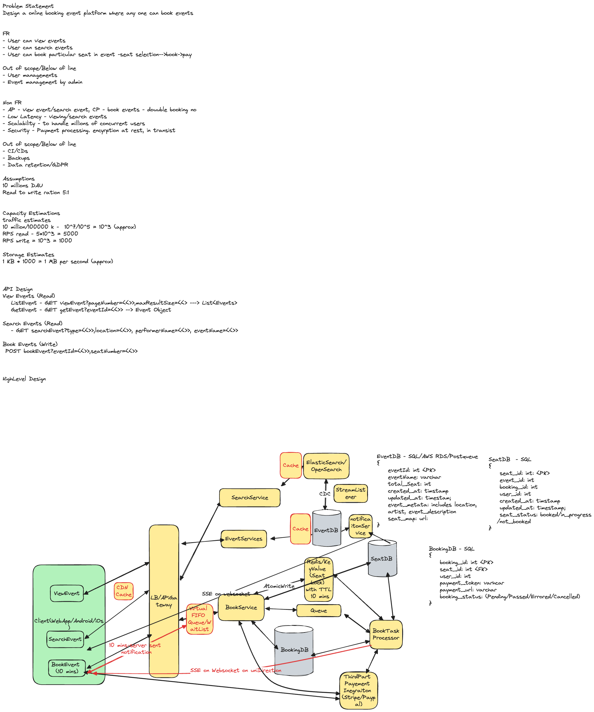

## Problem Statement
Design a distributed system for an online ticket booking platform like Ticketmaster, which can handle a high volume of traffic and provide a seamless user experience for searching, reserving, and purchasing tickets for various events.

## Requirements
### Functional Requirements
* **Book Tickets:** Users should be able to book tickets to events
* **View Events:** Users should be able to view events
* **Search Events:** Users should be able to search for events

#### Out of scope
* Dynamic Pricing
* Admin actions on coordinating events
* View booked events

### Non-Functional Requirements
* **Low latency**: Low latency search.
* **Availability**: System should prioritize availability for searching & viewing events
* **Consistency**: System should prioritize strong consistency for booking events (no double booking) 
* System is read heavy, and thus needs to be able to support high read throughput
* **Scalability**: Scalability to handle surges from popular events
* **Security**: Purchase path should be secure. Encrypt data in transist & data in rest.

#### Out of scope
* GDPR Compilance
* Fault Tolerance
* Backups
* CI/CD

## Back of Envelope Estimations/Capacity Estimation & Constraints
## High-level API design 
## Database Design
### Users Table
- `user_id` (Primary Key)
- `username`
- `password`
- `email`
- `phone`
- `created_at`
- `updated_at`

### Events Table
- `event_id` (Primary Key)
- `name`
- `category`
- `description`
- `date`
- `time`
- `venue`
- `created_at`
- `updated_at`

### Tickets Table
- `ticket_id` (Primary Key)
- `event_id` (Foreign Key)
- `user_id` (Foreign Key)
- `booking_id`
- `seat_number`
- `price`
- `purchase_date`
- `status` (available, purchased, cancelled)

### Bookings Table
- `booking_id` (Primary Key)
- `user_id` (Foreign Key)
- `total_amount`
- `booking_date`
- `status` (completed, pending, cancelled)
## High Level System Design and Algorithm

### View Events
#### Caching on View Events

### Search Events
#### Caching on Search Events

### Book Events
#### Concurrent Seat Booking
#### Payment Processing
#### Booking Service Notify User
#### Using Waitlist to High Concurrent Demand for Booking seat

## References
* https://www.hellointerview.com/learn/system-design/answer-keys/ticketmaster
* https://www.youtube.com/watch?v=fhdPyoO6aXI&t=3013s
* https://systemdesignschool.io/problems/ticketmaster/solution
* https://www.designgurus.io/course-play/grokking-the-system-design-interview/doc/638c0b77ac93e7ae59a1b089