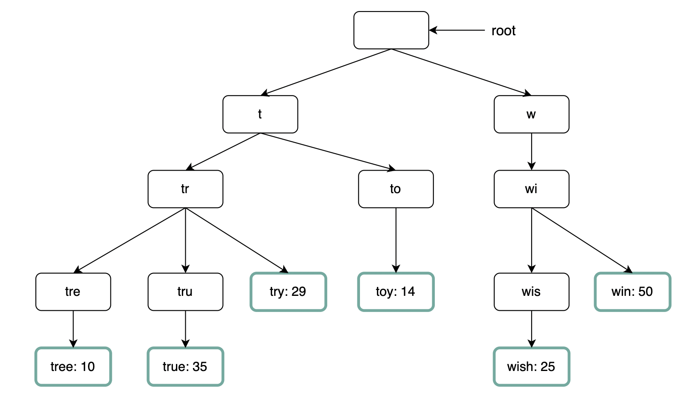
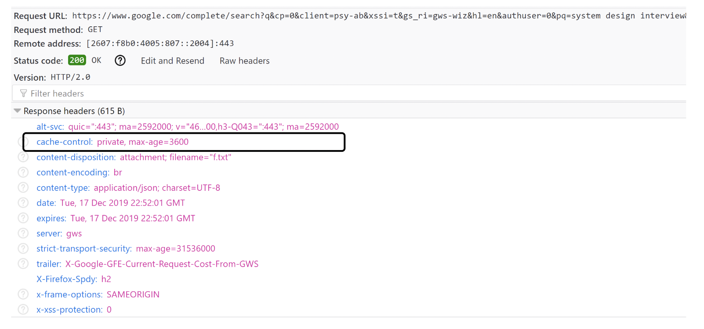

## Problem Statement
Design a system that provides search suggestions as a user types in the search box. The system should return the top 10 most relevant suggestions for each query.
## Clarification Questions to Interviewer 
1. Is the matching only supported at the beginning of a search term or can it match in the middle?
2. How many autocompletion suggestions should the system return?
3. How should the system choose suggestions? Determined by popularity based on historical query frequency?
4. Does the system need to support spell check?
5. Are search queries in English only?
6. Should the system support capitalization and special characters?
## Requirements

### Functional Requirements
* The system should return search suggestions as the user types in the search box.
* The system should return top 10 results for each query.
* The system should prioritize more relevant suggestions (e.g., based on popularity or other relevance metrics).
#### Below the line (out of scope)

### Non-Functional Requirements
* **Low latency:** The system should show all the suggested queries in real time after a user types. The latency shouldn’t exceed 200 ms.
* **Fault tolerance:** The system should be reliable enough to provide suggestions despite the failure of one or more components.
* **Scalability:** The system should support the ever-increasing number of users over time.
#### Below the line (out of scope)

## Back of Envelope Estimations/Capacity Estimation & Constraints
- **Traffic estimation**
   - Number of searches per day = 5 billion (Assumed)
   - Number of searches per second (QPS) = Number of searches per day / 24 hours / 3600 seconds = 60000 times/s
- **Storage estimation**
   - Types
      - Data: Yes
      - File: No
   - Capacity
      - Number of terms need to build an index
         - 5 billion searches per day.
         - Only 20% of these will be unique. (Assumed)
         - We only want to index the top 50% of the search terms. (Assumed)
         - Number of terms we need to build an index per day = 5 billion x 20% x 50% = 5 million
      - Size for storing the index
         - Each search has 3 words.
         - Each words has 5 characters.
         - Each character needs 2 bytes
         - Total size for storing the index per day = 5 million x 3 x 5 x 2 = 15 GB

## High-level API design 
* Get suggestion
```
GET /suggestions?q={search-term}
```
Response should include a list of suggested terms, ordered by relevance:
```
{
    "suggestions": ["suggestion1", "suggestion2", ..., "suggestionn"]
}
```


## Data Model
```python
class TrieNode:
    def __init__(self):
        self.children = {}
        self.is_end_of_word = False
        self.popularity = 0
        self.top_k = []  # Store top K suggestions at this node
```

## High Level System Design
### Query Service(Online Mode) 
#### Bad Solution - Non Cached/Precomputed
Using a min-heap to calculate the top results on-the-fly is inefficient and not recommended.
#### Good Solution - Cached/Precomputed
Use a Trie for quick retrieval. Each node in the Trie will store the frequency and a list of top K suggestions to optimize retrieval time.

#### Workflow Steps
1. **Client Request**
   - The client (mobile/web app) sends a request to the LB/API Gateway as the user types a query in the search box.

2. **Load Balancer/API Gateway**
   - The LB/API Gateway receives the request and forwards it to the appropriate Suggestions Service instance.

3. **Suggestions Service (In-Memory Caching)**
   - The Suggestions Service checks the in-memory cache (e.g., Redis) for the top K suggestions for the given query prefix.
   - If the suggestions are available in the cache, they are returned directly to the client.
   - If not, the service queries the Trie DB (e.g., NoSQL database) to fetch the required suggestions and updates the cache.

4. **Redis (Cache)**
   - Stores frequently accessed suggestions for quick retrieval.
   - Maintains a daily snapshot to ensure data consistency and durability.

5. **Zookeeper Interaction**
   - Zookeeper manages the metadata of Trie partitions and replicas.
   - It helps in redirecting the request to the appropriate partition if needed.

6. **Response to Client**
   - The top K suggestions are sent back to the client through the LB/API Gateway.
### Zookeeper for Partition Management

1. **Metadata Management**
   - Zookeeper stores metadata about the partitions and replicas of the Trie nodes.
   
2. **Leader Election**
   - Zookeeper manages leader election in case of partition splits or server failures.

3. **Configuration Management**
   - Zookeeper maintains configuration information, such as which server holds which partition.

#### Interaction Workflow

1. **Load Balancer Receives Request**
   - The load balancer receives a user query.

2. **Consult Zookeeper**
   - The load balancer consults Zookeeper to find out which server holds the relevant Trie partition.

3. **Forward Request**
   - The load balancer forwards the request to the appropriate server.

4. **Server Processes Request**
   - The server processes the request by looking up the Trie and retrieving the top K suggestions.

5. **Send Response**
   - The server sends the response back to the client.

### Data Aggregration Service 
Collect and preprocess data from logs, and store aggregated results in an  database.
#### Workflow Steps
1. **Data Collection**
   - Raw analytics logs are collected from various sources and stored in a centralized storage system (e.g., S3).

2. **Kafka Partition**
   - The logs are partitioned based on search term ranges and ingested into Kafka for further processing.

3. **Aggregation Workers (Flink)**
   - Flink workers process the Kafka streams to aggregate the data.
   - Aggregation includes computing the frequency of search terms and other relevant metrics.

4. **Storing Aggregated Data**
   - The aggregated data is stored in a database (e.g., Cassandra).

5. **MapReduce Workers (Spark)**
   - MapReduce workers periodically process the aggregated data to calculate the top K search terms.
   - They also create and update the Trie structure with the latest data.

6. **Storing Trie in NoSQL DB**
   - The updated Trie structure is stored in a NoSQL database for efficient query retrieval.

7. **Cron Jobs**
   - Scheduled tasks (Cron jobs) trigger the data aggregation and Trie update processes at regular intervals.

8. **Zookeeper Updates**
   - Zookeeper is updated with the metadata of the Trie partitions and replicas to ensure consistency and availability.
## Deep Dive
### Optimizations - Query service
### Trie data structure
We use tries for fast string prefix retrieval.
* **It is a tree-like data structure:**
  * The root represents the empty string.
  * Each node has 26 children, representing each of the next possible characters. To save space, we don't store empty links.
  * Each node represents a single word or prefix.
  * For this problem, apart from storing the strings, we'll need to store the frequency against each leaf.


### Trie Operations
We use tries for fast string prefix retrieval.
* **Create:** The trie is created by workers using aggregated data collected via analytics logs.
* **Update:** There are two options for handling updates:
  * Not updating the trie but reconstructing it periodically. This is acceptable if we don't need real-time suggestions.
  * Updating individual nodes directly, which is slower due to the need to update all parent nodes.


#### Range Based Partioning on Trie 
WSplit the trie into multiple parts for better performance and load distribution:
* Prefixes "A" to "M" on Server/01 (replica on Server/02). 
* Prefixes "N" to "Z" on Server/03 (replica on Server/04).

#### Dealing with Hot Spots 
Dynamically partition the trie based on query volume:
* Monitor the load on each partition.
* When a partition becomes a hotspot, split it further into smaller partitions.
* Use a consistent hashing mechanism to redirect traffic to the appropriate partition.
* Zookeeper can be used to manage the partition metadata and ensure that queries are redirected to the correct trie node.

### Zookeeper for Partition Management
* **Zookeeper** can be used to manage the metadata of trie partitions.
* **Role of Zookeeper:**
  * Store the metadata of each partition.
  * Keep track of which server holds which partition.
  * Redirect incoming queries to the appropriate server based on the prefix.
  * Handle the dynamic partitioning and rebalancing of trie nodes.
  * Ensure consistency and reliability of the partition information.
#### Replication on Trie
Ensure durability and fault tolerance by maintaining replicas of each partition:
* Each partition has at least one replica.
* Use Zookeeper to keep track of the replicas and ensure consistency.
* In case of a server failure, Zookeeper can quickly redirect the traffic to the replica.

#### Cache top search queries at each Trie node 
* To avoid traversing the whole trie, we can cache the top k most frequently accessed works in each node
* This reduces the time complexity to O(1) as top K search terms are already cached. The trade-off is that it takes much more space than a traditional trie.


#### Limit the max length of prefix
We can leverage the fact that users rarely use a very long search term to limit max prefix to 50 chars.
This reduces the time complexity from ``O(p) + O(c) + O(clogc) -> O(1) + O(c) + O(clogc).``

#### Dictionary Compression
Compress the trie using dictionary encoding to save space and speed up traversal:
* Use a dictionary-based compression algorithm like gzip or Brotli.
* Compress the nodes of the trie to reduce memory footprint.
* Decompress the nodes on-the-fly when needed for traversal.
* This reduces the space required to store the trie and speeds up traversal by reducing the number of nodes to visit.
```python
import zlib
import json

class TrieNode:
    def __init__(self):
        self.children = {}
        self.is_end_of_word = False
        self.popularity = 0
        self.top_k = []  # Store top K suggestions at this node

    def compress(self):
        node_data = json.dumps(self.__dict__).encode('utf-8')
        return zlib.compress(node_data)

    def decompress(self, compressed_data):
        node_data = zlib.decompress(compressed_data)
        self.__dict__ = json.loads(node_data.decode('utf-8'))

# Example usage
node = TrieNode()
node.children['a'] = TrieNode()
node.top_k = ['apple', 'apricot', 'appetizer']
compressed_node = node.compress()
print(compressed_node)

# Decompressing the node
new_node = TrieNode()
new_node.decompress(compressed_node)
print(new_node.top_k)
```
### Client-side optimisation
* **Delay AJAX Requests:** Send requests only after a delay (e.g., 160 ms) to avoid unnecessary requests.
* **Local Cache in Browser Or Device:** Cache recent history of suggestions locally to improve response time.
Example with Google search caching search results on the browser for 1h:

* **Pre-connect:** Establish a connection with the server as soon as the user visits the search page.
* **Edge Caching:** Use CDNs and edge caches to reduce latency for users.

### Optimizations - Data Aggregration Service 
* **Batch Processing:** Process data in batches to reduce load.
* **Streaming:** Use streaming technologies (e.g., Apache Kafka) for real-time data updates.
* **Deduplication:** Remove duplicate queries to save storage and processing time.

#### Problem with Writes
Handling writes efficiently in a distributed system is challenging:
* Use batch processing to periodically update the trie instead of real-time updates.
* Use a write-ahead log to ensure durability and consistency of updates.
* Optimize the data structures to handle concurrent writes efficiently.


### Scale the Systems
* **Sharding:** Split data across multiple databases or nodes.
* **Replication:** Ensure high availability and fault tolerance.
* **Auto-scaling:** Automatically adjust resources based on traffic load.

### Supporting Multiple Languages
Implement language-specific tries and query services. Use language detection to route queries to the appropriate trie.

### Supporting Real-Time Search Queries
Use real-time data processing frameworks (e.g., Apache Flink) for real-time updates.

### Supporting Similar Search Queries in Different Geographies
Use geolocation data to customize and optimize search suggestions based on user location.

## References
* https://github.com/preslavmihaylov/booknotes/tree/master/system-design/system-design-interview/chapter14
* https://www.educative.io/courses/grokking-modern-system-design-interview-for-engineers-managers/detailed-design-of-the-typeahead-suggestion-system
* https://www.youtube.com/watch?v=MCKX3n4-UR4