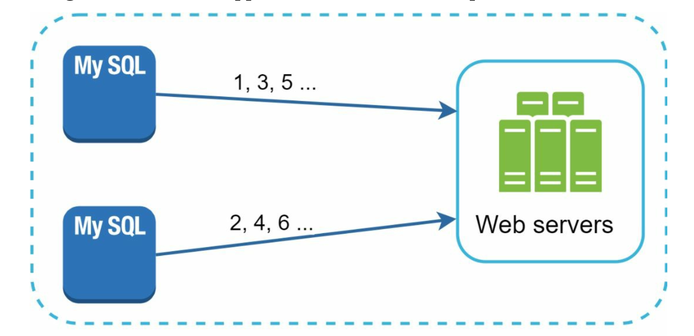
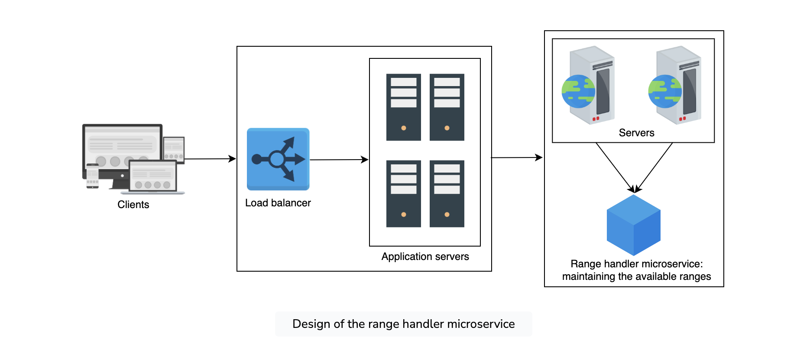
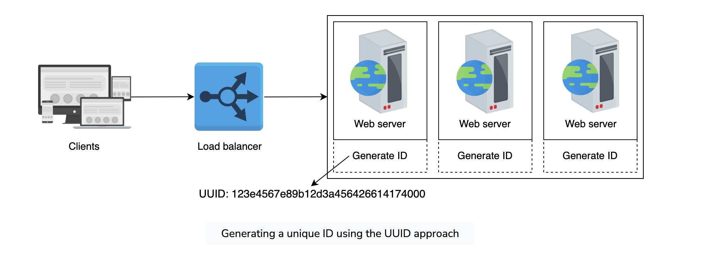
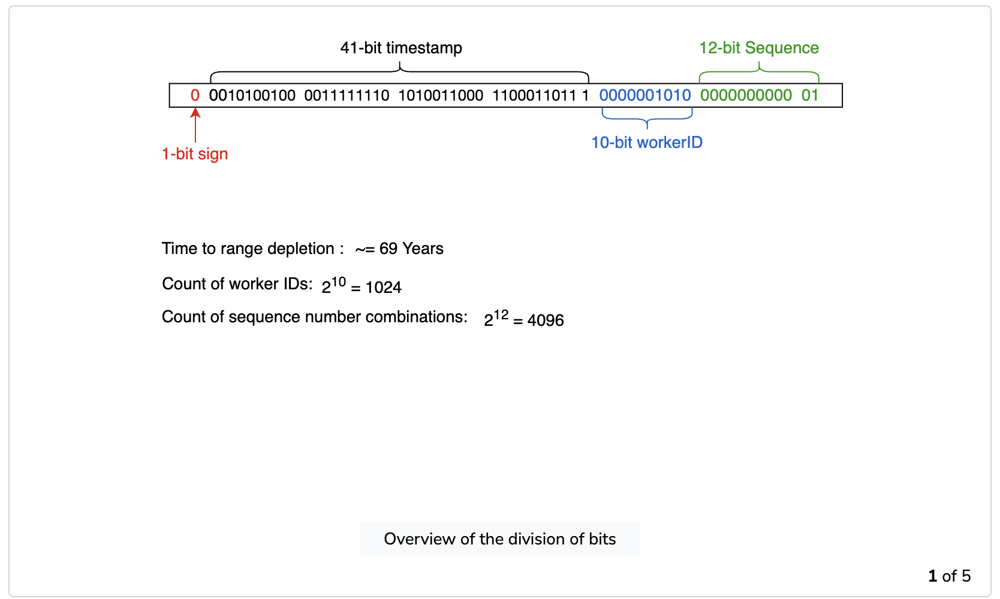

# Unique ID Generator

## Problem Statement
Design a system to generate unique IDs in a distributed environment, ensuring that the IDs are globally unique across all nodes and can be generated at a high throughput rate.

## Requirements

### Functional Requirements
* **Uniqueness**: Each time the ID generator is called, it returns a key that is unique across all node points for the system.
* **Sequencing**: IDs mush be sortable or sequenced. The ID has a timestamp. A timestamp allows the user to order the entries according to the time they were created.
* **Predictability**: IDs can be sequential or random based on the use case.

### Non-Functional Requirements
* **Availability**: Since multiple events happen even at the level of nanoseconds, our system should generate IDs for all the events that occur.
* **Scalability**: Generate at least a billion unique IDs per day.
* **Latency**:  Happens in real-time with minimal latency.
* **Security**: Encryption at rest (in data store), encryption in transist using https
* **Observability**:  Metrics, monitors, alarms, tracing, logging

## Back of Envelope Estimations/Capacity Estimation & Constraints
* **Assumptions**:
  * Each ID is generated with an average length of 64 bits.
  * We need to generate 1 billion IDs per day.
  * Each ID generation call should complete within milliseconds.
* **Capacity Estimation**:
  * 1 billion IDs/day ≈ 11,574 IDs/second.
  * Storage: If we store generated IDs, assuming 64 bits per ID, we need 64 billion bits ≈ 8 GB per day.
* **Constraints**:
  * The system must be horizontally scalable to handle the high throughput.
  * The system must ensure IDs are unique across all nodes.


## API Design
### REST API
```plaintext
POST /generate-id
Response:
{
  "id": "unique-id"
}
```
* **Generate ID**: Endpoint to request a new unique ID.


## High Level Design
### Option1: [Centralized] Ticket Server - Using a Database
* Use a centralized auto-increment feature in a single central database server called the Ticket Server. Instead of increasing the next ID by 1, we increase it by k, where k is the number of database servers in use.
* Pros
    * Sequenced ids
    * IDs could be numeric
* Cons
    * Single point of Failure (SPF). Not scalable and highly available solution.
    * Multiple ticket servers can be set up, but this introduces new challenges such as data synchronization.
    * No guarantee of sorting over time in multiple servers.



### Option2: [Centralized] Using a Range Handler
* A range handler pre-allocates a range of IDs to different nodes.
* **Implementation**:
  * Centralized service called range handle that allocates a range of IDs to each generator node.
  * Nodes generate IDs within their allocated range.
* **Pros**:
  * Uniqueness.
  * Scalability.
  * High availability.
  * Numeric IDs.
* **Cons**:
  * Complexity in managing ranges.
  * Potential delays if range allocation logic fails.



### Option3: [Decentralized] Using UUID
* UUIDs (universally unique IDs) are 128-bit(32 char) number
* UUID consists of 32 hexadecimal (base-16) digits, displayed in five groups separated by hyphens
* Example of UUID: ``09c93e62-50b4-468d-bf8a-c07e1040bfb2``
* UUIDs have a very low probability of collision, making them suitable for generating unique IDs.
* * **Implementation**:
  * Each server runs a UUID generation library.
* **Pros**
    * Generating UUID is simple
    * Globally unique: No coordination between servers is needed so there will not be any synchronization issues
    * Collision-resistant: Very low probability of getting collision.
    * Scalable as each web server can generate own id.
    * Available
* **Cons**
    * **Performance**: IDs are 128 bits long(32 char), so it can be slow to index/inserts and difficult to ,manage. Query performance takes a hit for big index.
    * **Not sequential**: IDs are not sequential or sorted by time
    * **Length**: 36 characters in string form, which can be verbose for some applications.
    * IDs could be non-numeric.


### Option4:  [Decentralized] Using Unix Time Stamps
* **Description**: Use Unix timestamps combined with a sequence number.
* **Implementation**:
  * Each node generates IDs using current timestamp and a sequence number.
  * Ensure sequence number is reset and managed properly.
* **Pros**:
  * Simple implementation.
  * Uniqueness can be ensured within the same second.
  * Numeric IDs.
* **Cons**:
  * **Scalability**: Weak due to potential timestamp collisions.
  * **Causality**: Weak causality as it depends on clock synchronization.

### Option5:  [Decentralized] Using Twitter SnowFlake
* Divide an ID into different sections:
    * Sign (1 bit): Always be 0 (Reserved for future used).
    * Timestamp (41 bits): Milliseconds since the epoch or custom epoch.
    * Machine ID (10 bits): Hold up to 1024 machines.
    * Sequence number (12 bits): The sequence number is incremented by 1 and is reset to 0 every millisecond.
* **Implementation**:
  * Each node is configured with a unique machine ID.
  * Nodes generate IDs using the current timestamp, machine ID, and sequence number.
* **Pros**
    * Uniqueness & Compact: IDs are unique. Numeric and 64-bit
    * Time-ordered: IDs are roughly time-ordered, aiding in debugging and sorting.
    * Highly available
    * Highly Scalale
* **Cons**
    * Complexity: More complex to implement than UUID or auto-increment.
    * Clock sync: Requires synchronized clocks across nodes.
    * Configuration: Requires management of machine and datacenter IDs.



### Option6:  [Decentralized] Using Logical Clocks
* **Description**: Use logical clocks to order events.
* **Implementation**:
  * Each node maintains a logical clock.
  * IDs are generated using logical clock values.
* **Pros**:
  * Maintains causality.
  * Scalable and available.
* **Cons**:
  * Complexity in implementation.
  * Potential for clock skew.

### Option7:  [Decentralized] TrueTime API
* **Description**: Google's TrueTime API uses bounded time intervals to ensure causality.
* **Implementation**:
  * Utilize TrueTime API to get precise timestamps.
  * Generate IDs using these timestamps.
* **Pros**:
  * Guarantees strong causality.
  * High precision and accuracy.
* **Cons**:
  * Limited to environments where TrueTime is available.
  * Complexity in implementation.


## Comparison Table 
| Approach                            | Uniqueness | Scalable | Available | 64-bit Numeric ID | Causality Maintained | Indexable | In-process | SPOF |
|-------------------------------------|------------|----------|-----------|-------------------|----------------------|-----------|------------|------|
| **UUID**                            | No         | Yes      | Yes       | No                | No                   | Hard      | Yes        | No   |
| **Database(Auto-Increment)**        | No         | No       | Yes       | Yes               | No                   | Yes       | No         | Yes  |
| **Range Handler(Database Segment)** | Yes        | Yes      | Yes       | Yes               | No                   | Yes       | Yes        | No   |
| **UNIX Timestamps**                 | No         | Weak     | Yes       | Yes               | Weak                 | Yes       | Yes        | No   |
| **Twitter Snowflake**               | Yes        | Yes      | Yes       | Yes               | Weak                 | Yes       | Yes        | No   |


### Explanation of Criteria
- **Uniqueness**: Ensures that IDs are unique across the system.
- **Scalable**: The system can handle increasing loads by adding more resources.
- **Available**: The system is highly available, minimizing downtime.
- **64-bit Numeric ID**: IDs are 64-bit numeric values, ensuring compactness.
- **Causality Maintained**: IDs reflect the order of events, preserving causality.
- **Indexable**: Indicates if the generated IDs are easily indexable in a database for efficient querying.
- **In-process**: Indicates if the ID generation can be done within the same process without external dependencies.
- **SPOF (Single Point of Failure)**: Indicates if the approach has a single point of failure that could bring down the ID generation system.


## Reference
* https://www.educative.io/courses/grokking-modern-system-design-interview-for-engineers-managers/design-of-a-unique-id-generator
* https://towardsdatascience.com/ace-the-system-design-interview-distributed-id-generator-c65c6b568027
* https://medium.com/double-pointer/system-design-interview-scalable-unique-id-generator-twitter-snowflake-or-a-similar-service-18af22d74343