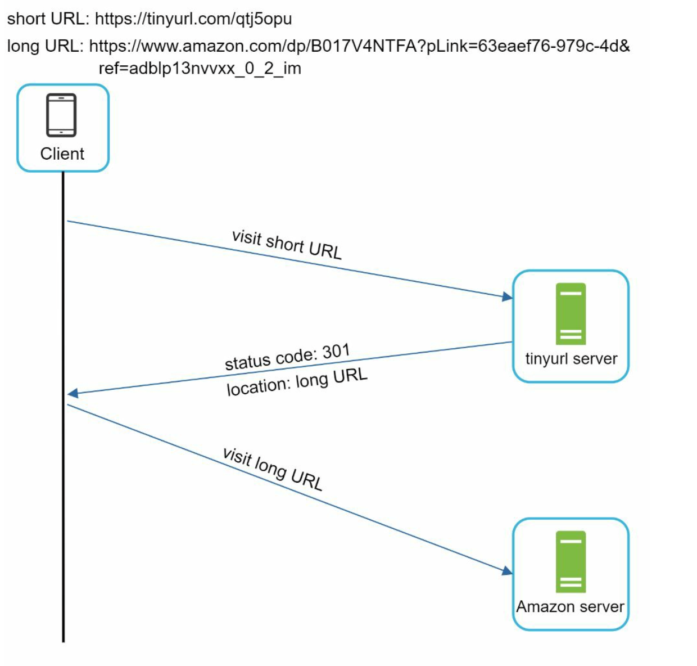
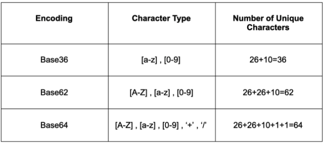
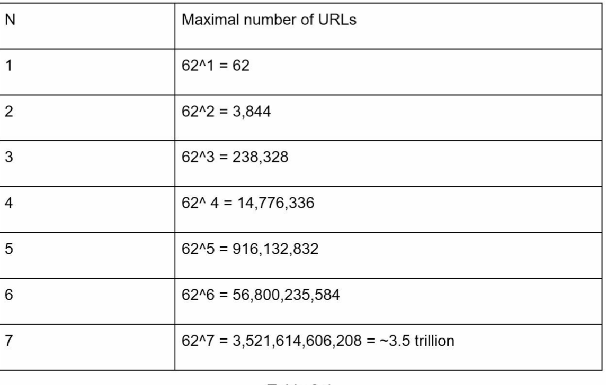
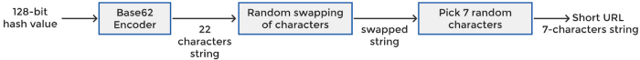
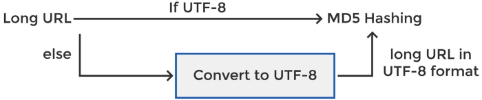
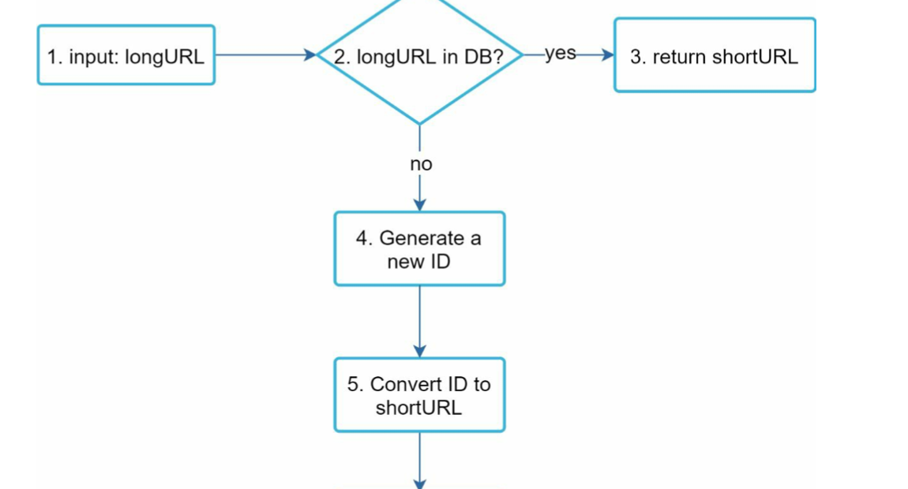

# Table of contents

- [Summary](#summary)
- [Problem Statement](#problem-statement)
- [Requirements](#requirements)
- [Back of Envelope Estimations/Capacity Estimation & Constraints](#back-of-envelope-estimationscapacity-estimation--constraints)
- [High-level design - API Endpoints](#high-level-design---api-endpoints)
    - [Write Request — Shorten URL](#write-request--shorten-url)
    - [Delete Short Url Request](#delete-short-url-request)
    - [Read Request — Redirect Short URL](#read-request--redirect-short-url)
- [Database Design](#database-design)
- [Basic System Design and Algorithm](#basic-system-design-and-algorithm)
    - [URL Redirecting](#url-redirecting)
    - [URL Shortening Length](#url-shortening-length)
    - [URL Shortening Options](#url-shortening-options)
- [Data Partitioning and Replication](#data-partitioning-and-replication)
- [Cache](#cache)
- [Load Balancer (LB)](#load-balancer-lb)
- [DB Sweeping](#db-sweeping)
- [Telemetry](#telemetry)
- [Security and Permissions](#security-and-permissions)
- [Reference](#reference)

## Summary


## Problem Statement
A URL shortener service creates a **short url/aliases/tiny** url 
against a long url. Moreover, when user click on the tiny url, he gets redirected to original url.

## Requirements
### **Functional Requirements**
  * **Short URL generation**: Given a URL, generate a shorter and unique alias (short link).
  * **Redirection to original URL**: When users access a short link, redirect to the original link.
  * **Custom short links**: Users should optionally be able to pick a custom short link for their URL.
  * **Deletion of short url**: Users should be able to delete a short link generated by our system, given the rights.
  * **Updating long url**: Users should be able to update the long URL associated with the short link, given the proper rights.
  * **Expiry time for links**: Links will expire after a standard default timespan. Users should also be able to specify the expiration time.

### **Non-Functional Requirements**
  * **Availability**: The system should be highly available. This is required because, if our service is down, all the URL redirections will start failing.
  * **Scalability**: Our system should be horizontally scalable with increasing demand.
  * **Latency**: URL redirection should happen in real-time with minimal latency.
  * **Security**: Shortened links should not be guessable (not predictable).  Encryption at rest (in data store), encryption in transist using https
  * **Observability**:  Metrics, monitors, alarms, tracing, logging. e.g., how many times a redirection happened?

### **Extended Requirements**
  * Be accessible through REST APIs by other services.


## Back of Envelope Estimations/Capacity Estimation & Constraints
* Assumptions
  * Read-heavy. More redirection requests compared to new URL shortenings.
  * Assume **100:1** ratio between read and write.
  * 500 million URLs are generated per month.
* Traffic Estimates
  * Write operation: 500 million URLs are generated per month.
  * Write operations per second: 500 million /(30 days * 24 hours * 3600 seconds) = **~200 URLs/s**
  * Read operation or URLs redirections per second: 100*200 =  **~20K/s**
* Storage estimates
  * Assume storing every URL shortening request for 5 years, each object takes **500 bytes**
  * Total objects: 500 million * 5 years * 12 months = **30 billion**
  * Total storage: 30 billion * 500 bytes = **15 TB**
* Bandwidth estimates
  * Write: 200 URL/s * 500 bytes/URL = **100 KB/s**
  * Read: 20K URL/s * 500 bytes/URL = **~10 MB/s**
* Cache memory estimates
  * Follow the 80-20 rule, assuming 20% of URLs generate 80% of traffic, cache 20% hot URLs
  * Requests per day: 19K * 3600 seconds * 24 hours = **~1.7 billion/day**
  * Cache 20%: 0.2 * 1.7 billion * 500 bytes = **~170GB**
* Summary
  * Assuming 500 million new URLs per month and 100:1 read:write ratio

 | Category                          | Calculation                                             | Estimate |
|-----------------------------------|---------------------------------------------------------|----------|
 | New URLs/Write Operations         | 500 million / (30 days * 24 hours * 3600 seconds)       | 200 /s   |
 | URL redirections/Read Operations  | 500 million * 100 / (30 days * 24 hours * 3600 seconds) | 20 K/s   |
 | Incoming data                     | 500 bytes/URL * 200 URL/s                               | 100 KB/s |
 | Outgoing data                     | 500 bytes/URL * 20K URL/s                               | 10 MB/s  |
 | Storage for 5 years               | 500 bytes/URL * 500 million * 60 months                 | 15 TB    |
 | Memory for cache                  | 19K URL * 3600 seconds * 24 hours * 500 bytes * 20%     | 170 GB   |


## High-level API design
We can have SOAP or REST APIs to expose the functionality of our service.
* Shortening a URL
* Redirecting a short URL
* Deleting a short URL
###  Write Request — Shorten URL
To create a new short URL, a client sends a POST request

``createURL(api_dev_key, original_url, custom_alias=None, user_name=None, expire_date=None)``

**Request Parameters**
  
| Name           | Type     | Note                                                                                                                                              |
|----------------|----------|---------------------------------------------------------------------------------------------------------------------------------------------------|
 | `api_dev_key`  | `string` | Required. The API developer key of a registered account. This will be used to, among other things, throttle users based on their allocated quota. |
| `original_url` | `string` | Required. Original URL to be shortened.                                                                                                           |
| `custom_alias` | `string` | Optional. custom key for the URL.                                                                                                                 |
| `user_name`    | `string` | Optional. user name to be used in encoding.                                                                                                       |
| `expire_date`  | `string` | Optional. expiration date for the shortened URL.                                                                                                  |

**Return:**`string`
* A successful insertion returns the shortened URL; otherwise, it returns an error code.

###  Delete Short Url Request
To permanently  delete short url from our service

``deleteURL(api_dev_key, url_key)``

**Request Parameters**
  
| Name          | Type     | Note                                                                                                                                          |
|---------------|----------|-----------------------------------------------------------------------------------------------------------------------------------------------|
 | `api_dev_key` | `string` | The API developer key of a registered account. This will be used to, among other <br/>things, throttle users based on their allocated quota.  |
 | `url_key`     | `string` | Short URL.                                                                                                                                    |

**Return**: `string`
* A successful deletion returns ‘URL Removed’.

### Read Request — Redirect Short URL
Return longURL for HTTP redirection

` GET api/v1/shortUrl`

## Database Design
- Observations
    - Need to store billions of records.
    - Each object is small (less than 1K).
    - No relationships between records—other than storing which user created a URL.
    - Read-heavy.
    - A [NoSQL](../basics/sql-vs-nosql.md) choice would also be easier to scale.
    - Comment: SQL with sharding should also work

- Schema
    - **URL**
  
      | Column            | Type              |
      |-------------------| ------------------|
      | `hash`            | varchar(16)       |
      | `original_url`    | varchar(512)      |
      | `creation_date`   | datetime          |
      | `expiration_date` | datetime          |
      | `user_id`         | int               |
  
    - **User**

      | Column          | Type            |
      |-----------------| ----------------|
      | `user_id`(PK)   | int(20)         |
      | `name`          | varchar(20)     |
      | `email`         | varchar(32)     |
      | `creation_date` | datetime        |
      | `last_login`    | datetime        |

## High Level System Design and Algorithm
### URL Redirecting

* **301 redirect**
  * A 301 redirect shows that the requested URL is “permanently” moved to the long URL
  * Since it is permanently redirected, the browser caches the response, and subsequent requests for the same URL 
    will not be sent to the URL shortening service.
  * Pros
    * Reduce server load
  * Cons
    * No analytics metrics for each time usage.
* **302 redirect**.
  * A 302 redirect means that the URL is “temporarily” moved to the long URL, meaning that subsequent requests for 
    the same URL will be sent to the URL shortening service first.Then, they are redirected to the long URL server
  * Pros
    * Analytics: track click rate and source of the click more easily.
  * Cons
    * Higher Server Load.

### URL Shortening Length
We need to pick a reasonable, fixed length for the short URLs that the service will create.



#### Base64 Encoding:
* Encode the long URL using Base64 encoding, which converts binary data into ASCII characters.
* Pros: Simple implementation, compact representation.
* Cons: Not truly "short" compared to other techniques, may require additional processing to make the URL more human-readable.
#### Base62 Encoding:
* Similar to Base64 encoding but excludes characters that are prone to misinterpretation in URLs (e.g., "/", "+", "=").
* Pros: Compact representation, URL-safe.
* Cons: Requires custom implementation to handle the encoding and decoding process.
#### Base58 Encoding:
* Similar to Base62 encoding but excludes characters that are visually similar (e.g., "0", "O", "l", "I").
* Pros: Compact representation, reduces potential for human error in manual entry.
* Cons: Similar custom implementation requirements as Base62 encoding.

``Base 10 are digits [0–9] - 10``
When ``n = 7``, ``10 ^ n = ~10 million`` urls only which is very less.

``base 62 are [0–9][a-z][A-Z] - 62``
When ``n = 7``, ``62 ^ n = ~3.5 trillion``, ``3.5 trillion`` is more than enough to hold 365 billion URLs, so the length 
of hashValue is 7.



### URL Shortening Design Options
For shortening an url there are a couple of options which are as follows:

#### Option1: Using random numbers
* Random choice for each character and check if this tiny url exists in DB or not.
* If it doesn’t exist return the tiny url else continue rolling/retrying
Java code for randomly generating 7 characters long tiny url
```
private static final int NUM_CHARS_SHORT_LINK = 7;
private static final String ALPHABET = "ABCDEFGHIJKLMNOPQRSTUVWXYZabcdefghijklmnopqrstuvwxyz0123456789";
private Random random = new Random();
public String generateRandomShortUrl() {
    char[] result = new char[NUM_CHARS_SHORT_LINK];
while (true) {
   for (int i = 0; i < NUM_CHARS_SHORT_LINK; i++) {
        int randomIndex = random.nextInt(ALPHABET.length() - 1);
        result[i] = ALPHABET.charAt(randomIndex);
    }
     String shortLink = new String(result);
      // make sure the short link isn't already used
      if (!DB.checkShortLinkExists(shortLink)) {
            return shortLink;;
        }
    }
}
```
* Pros:
  * Simple implementation
* Cons:
  * Possibility of duplicate short URLs
  * Requires retrying for unique short URLs
#### Option2: Hashing + Collision Resolution
* Use well-known hash functions like CRC32, MD5, or SHA-1 that hashes a long URL to a 7-character string.
* MD5 message-digest algorithm is a widely used hash function producing a 128-bit hash value(or 32 hexadecimal digits)
* Encode the long URL using the MD5 algorithm and take only the first 7 characters to generate TinyURL.
* The first 7 characters could be the same for different long URLs resulting in hash collisions.
* To resolve hash collisions, we can recursively append a new predefined string until no more collision is discovered.
* Pros:
  * Unique short URLs with hashing
* Cons:
  * Potential for hash collisions
  * Recursive collision resolution may affect performance

#### Option3: Hashing + Base62 Conversion
* Compute a unique hash using MD5 (we can use SHA256) for a given long url to generates 128 bit hash value.
* Then we encode 128 bit hash value base64 encoding.
* Each `base62` character encodes 6 bits and therefore generates 22 characters string.
* we will trim the encoded string and take only the first 7 characters for the shorturl.
``MD5(longURL) → base64encode(128-bit hash value) → short_url → trim (short_url, 7)``
* Pros:
  * Compact representation with Base64 encoding
  * Handles URL-encoded and UTF-8 formatted URLs
* Cons:
  * Possibility of duplicate short URLs
  * Requires addressing duplication and multiple shortening requests issues
##### Problems with Option#3
* **Duplication**
  * Possibility of multiple long URLs map onto the same short URL
  * This isn’t acceptable; we need a unique short URL for every long URL.
  * We can solve this using following way:
  
   
* **Multiple Shortening Requests For The Same URL**
  * If a single user attempts to shorten the same long URL multiple times or multiple users make shortening 
    requests for the same long URL then chances of getting same short url.
  * To avoid this problem we can append some unique predefined string like user’s IP address or user id. For user id 
    user would require login which we need to avoid.
    
   

* **URL-Encoded URL Shortening Request**
  * User enters a URL-encoded URL such as this one:
  ``https%3A%2F%2Fmedium.com%2Fdouble-pointer%2Ftop-5-videos-for-web-crawler-system-design-interview-75b7ac9c04ce``
  * The above URL is the same as
  ``https://medium.com/double-pointer/top-5-videos-for-web-crawler-system-design-interview-75b7ac9c04ce``
  * However, the format of two is different. The first one is URL-encoded format while the second one is UTF-8 format.
  * To solve this issue, we can check url format and make sure all urls are in same format.
    

#### [Recommended] Option4: Counter/Key Generation Service + Base58 Conversion
* In this approach we are not encoding the URl, we will encode an unique id generated number which will in turn 
guarantee that no duplicates or collision will occur.
* A new unique ID (primary key) Is generated by some service.
* Convert the ID to shortURL with base 58 conversion.
* Why Base58 conversion vs base62 or base 64 conversion ?
  * To avoid  characters of the omitted ones: '0', 'O', 'I', 'l' and '/' pr '\'
* Create a new database row with the ID, shortURL, and longURL.
  
``Counter (0–3.5 trillion) → base64encode() → short_url``
##### How the keys will be generated ?
* Standalone Key Generation/Counter Service (KGS)
  * Generate random 6 letter strings beforehand and store them in a database (key DB)
  * When a short URL is needed, take one from the key DB
* **Problems**
  * **Single Server of KGS**: Single server to maintain counter can be a single point of failure. We need to maintain 
    multiple servers.To solve this problem we can use multiple internal counters for multiple servers
    which use different counter ranges. For example server 1 ranges from 1 to 1M, server 2 ranges from 1M to 10M, and
    so on.
  * **Concurrency issue**: If there are multiple servers reading keys concurrently, two or more servers try to read  
    the same key from the database. 
    * Workaround
      * Servers can use KGS to read/mark keys in the database.
      * KGS can use two tables to store keys: one for keys that are not used yet, and one for all the used keys.
      * KGS can always keep some keys in memory so that it can quickly provide them whenever a server needs them.
      * KGS needs to make sure not to give the same key to multiple servers.
      * Comment: keys are sharded. Each KGS server only serves one application server.
## Data Partitioning and Replication
- Range Based Partitioning
    - Store URLs in separate partitions based on the first letter of the URL or the hash key.
    - Combine certain less frequently occurring letters into one database partition.
- Problem with this approach
    - Unbalanced servers.
- Hash-Based Partitioning
    - Take a hash of the short URL we are storing, and calculate which partition to use based upon the hash.
    - Use [consistent hashing](../basics/consistent-hashing.md)
## Cache
- Eviction policy
    - LRU: discard the least recently used URL first
- Cache update
    - Cache miss: hit backend database and pass new entry to all cache replicas
## Load Balancer (LB)
- LB locations
    - Between Clients and Application servers
    - Between Application Servers and database servers
    - Between Application Servers and Cache servers
## DB Sweeping
A separate Cleanup service can run periodically to remove expired links from our storage and cache.
## Telemetry
Statistics about the system: how many times a short URL has been used
## Security and Permissions
- Store permission level (public/private) with each URL in the database
- Send an error (HTTP 401) for unauthorized access

## Reference
* https://www.educative.io/courses/grokking-the-system-design-interview/m2ygV4E81AR#a.-Encoding-actual-URL
* https://github.com/Jeevan-kumar-Raj/Grokking-System-Design/blob/master/designs/short-url.md
* https://medium.com/double-pointer/system-design-interview-url-shortener-c45819b252cd
* https://medium.com/@sandeep4.verma/system-design-scalable-url-shortener-service-like-tinyurl-106f30f23a82
* https://medium.com/@greekykhs/system-design-interview-how-to-implement-tinyurl-5363cb5a3183
* https://www.geeksforgeeks.org/system-design-url-shortening-service/
* https://www.youtube.com/watch?v=JQDHz72OA3c