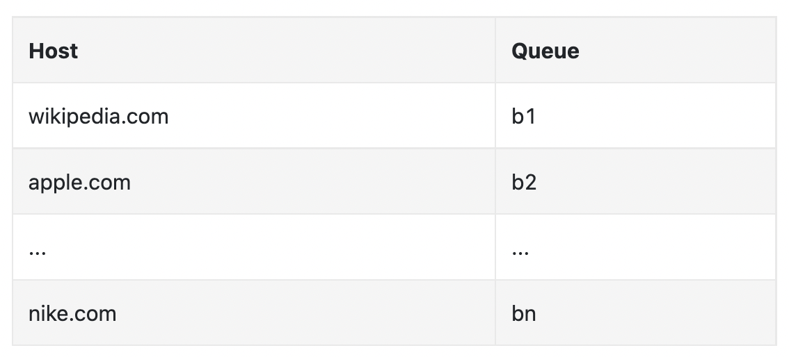

## Problem Statement
Design a Web Crawler

## Clarification Questions to Interviewer 
1. What specific types of web pages are we focusing on (e.g., news sites, blogs, academic papers)?
2. How frequently should the crawler revisit pages to check for updates?
3. Are there any specific data formats or languages that need special handling?
4. Is there a maximum depth the crawler should reach from the seed URLs?
5. What is the preferred storage method for the extracted text data?

## Requirements
### Functional Requirements
* Crawl the entirety of the web starting from a given set of seed URLs.
* Extract text data from each web page and store the text for later processing.
* Prioriting Crawaling/Seed URLs
* Duplication Detection
#### Below the line (out of scope)
* The actual processing of the text data (e.g., training an LLM).
* Handling of non-text data (e.g., images, videos, etc.).
* Handling of dynamic content (e.g., JavaScript-rendered pages).
* Handling of authentication (e.g., login-required pages).
### Non-Functional Requirements
* Fault tolerance to handle failures gracefully and resume crawling without losing progress.
* Robust - handle edge-cases such as bad HTML, infinite loops, server crashes, etc
* Politeness to adhere to robots.txt and not overload website servers inappropriately.
* Efficiency to crawl the web in under 5 days.
* Scalability to handle 10B pages.
* Extensibility - it should be easy to add support for new types of content, eg images in the future
#### Below the line (out of scope)
* Security to protect the system from malicious actors.
* Cost to operate the system within budget constraints.
* Compliance to adhere to legal requirements and privacy regulations.

## Back of Envelope Estimations/Capacity Estimation & Constraints
1. **Number of URLs to crawl:** 10 billion.
2. **Average size of a web page:** 100 KB.
3. **Total data storage required:** 10 billion * 100 KB = 1,000 TB (1 PB).
4. **Network bandwidth required:** If we aim to crawl the web in 5 days, we need to process 2 billion pages/day, which requires a bandwidth of around 2 TB/day.
5. **Computational resources:** Distributed architecture with multiple worker nodes, each capable of handling thousands of pages per second.
## System Interface and Data Flow
1. **Input:** Seed URLs to start crawling from.
2. **Output:**  Text data extracted from web pages.
3. **Flow:** Seed URLs -> URL Frontier -> HTML Downloader -> Content Parser -> URL Extractor -> URL Seen Checker -> URL Frontier.

## Data Model
Stores information about each domain's crawl status and crawl delay.

| Field             | Type          | Description                                          |
|-------------------|---------------|------------------------------------------------------|
| domain            | String (PK)   | The domain name                                      |
| last_crawled_time | DateTime      | The last time the domain was crawled                 |
| crawl_delay_time  | Integer       | The delay in seconds between requests to this domain |
| robots_txt_url    | String        | S3 URL path to the saved robots.txt file             |

### URL Metadata Table (NoSQL)
Stores metadata about each URL, including deduplication hashes.

| Field        | Type          | Description                                |
|--------------|---------------|--------------------------------------------|
| url          | String (PK)   | The URL of the web page                    |
| checksum     | String        | Checksum/hash of the content for deduplication |
| simhash      | String        | SimHash for near-duplicate detection       |
| last_crawled | DateTime      | The last time this URL was crawled         |

## High Level System Design


## Deep Dive
### DFS vs. BFS
- **DFS (Depth-First Search):**
  - Pros: Deep exploration of sites, potentially faster discovery of deeply nested pages.
  - Cons: Can lead to missing wide coverage, risk of getting stuck in deep but less relevant sections.
- **[Recommended]BFS (Breadth-First Search):**
  -  FIFO queue which traverses URLs in order of encountering them.
  - Pros: Broad exploration, better for finding popular pages and ensuring wide coverage.
  - Cons: May not explore deeply nested pages as efficiently.

### URL Frontier
#### Ensure proritization
We prioritize URLs by usefulness, which can be determined based on PageRank, web traffic, update frequency, etc.

1. **Prioritizer:** Manages the priority for each URL.
   - Takes URLs as input and calculates priority.
   - URLs are put into respective queues based on priority.
2. **Queue Selector:** Randomly chooses queues to select from with bias towards high-priority ones.


#### Ensure politeness
A web crawler should avoid sending too many requests to the same host in a short time frame to prevent excessive traffic on the traversed website.

1. **Download Queue per Hostname:** Maintains a download queue per hostname with a delay between element processing.
   - **Queue Router:** Ensures that each queue contains URLs from the same host.
   - **Mapping Table:** Maps each host to a queue.
   - **FIFO Queues:** Maintain URLs belonging to the same host.
   - **Queue Selector:** Worker threads are mapped to FIFO queues and download URLs from those queues, ensuring politeness with a delay between requests.


### HTML Downloader
#### What about if we fail to fetch a URL?
SQS with Exponential Backoff: Retry logic with backoff, moving to a dead-letter queue after several retries.
#### What happens if a downloader goes down?
URLs stay in the queue until confirmed fetched, handled by another crawler if necessary/ SQS's built-in support for retries and exponential backoff and the ease with which visibility timeouts can be configured, we'll use SQS for our system.
#### Ensure politeness
- Implement rate limiting per domain using redis
- Use user-agent strings to identify the crawler.
- We also implement Crawl-delay
 robots.txt
* Example **robots.txt**
```txt
User-agent: *
Disallow: /private/
Crawl-delay: 10

User-agent: Googlebot
Disallow: /no-google/
Disallow: /creatorhub/\*
Disallow: /rss/people/\*/reviews
Disallow: /gp/pdp/rss/\*/reviews
Disallow: /gp/cdp/member-reviews/
Disallow: /gp/aw/cr/
```
Politeness refers to being respectful with the resources of the websites we are crawling. This involves ensuring that our crawling activity does not disrupt the normal function of the site by overloading its servers, respecting the website's bandwidth, and adhering to any specific restrictions or rules set by the site administrators.

robots.txt is a file that websites use to communicate with web crawlers. It tells crawlers which pages they are allowed to crawl and which pages they are not. It also tells crawlers how frequently they can crawl the site. 

To ensure politeness and adhere to robots.txt, we will need to do two things:

1. **Respect robots.txt:** 
   - Check the robots.txt file to see if we are allowed to crawl the page.
   - Respect the Crawl-delay directive and wait the specified number of seconds between requests.
   - Save the robots.txt file for each domain we crawl.
   - Create Domain Table and save last_crawl_time and crawl_delay and robots.txt s3 url path.

2. **Rate limiting:** 
   - It can be done many sites won't have a crawl delay in robots. 
   - Limit the number of requests to any single domain (industry standard: 1 request per second).
   - Implement a global, domain-specific rate limiting mechanism using a centralized data store (like Redis) to track request counts per domain per second.
   - Use a sliding window algorithm to track the number of requests per domain per second.
   - Introduce jitter to prevent synchronized behavior among crawlers.
#### DNS
- **DNS Caching:** Cache DNS lookups to reduce requests.
- **Multiple DNS Providers:** Distribute load across providers.
### Content Parser
#### Content Dedupe check
- **Approaches:**
  1. **Checksum/Hashing:**
     - Generate a checksum or hash of the content and store in URL metadata db/
     - Compare against stored hashes to detect duplicates.
  2. **SimHash:**
     - Generate a SimHash of the content for near-duplicate detection.
     - Use hamming distance to find similar content.
  3. **Fingerprints:**
     - Generate fingerprints for segments of content.
     - Compare fingerprints to detect duplicates.
  4. **Bloom Filters:**
     - Use a Bloom filter to probabilistically track seen content hashes.
     - Low memory usage but allows false positives.

#### How SimHash Works
SimHash is a technique used for near-duplicate detection in documents. The idea is to generate a hash value that is similar for similar documents. Here's how it works:

1. **Feature Extraction:** Extract features from the document (e.g., words, shingles).
2. **Hashing:** Apply a hash function to each feature to get a bit vector.
3. **Weighting:** Assign weights to each bit vector based on the feature's importance.
4. **Summing:** Sum the weighted bit vectors. For each bit position, if the sum is positive, set the bit to 1; otherwise, set it to 
5. **Result:** The resulting bit vector is the SimHash of the document. Documents with similar SimHashes are likely to be near-duplicates.


### URL Seen Checker
- **Approaches:**
  1. **Hash Set:**
     - Store all seen URLs in a hash set.
     - **Pros:** Fast lookups.
     - **Cons:** High memory usage for large datasets.
  2. **Bloom Filter:**
     - Use a Bloom filter to track seen URLs.
     - **Pros:** Memory efficient.
     - **Cons:** Allows false positives.
  3. **Database:**
     - Use a database to store and check seen URLs.
     - **Pros:** Scalable.
     - **Cons:** Higher latency compared to in-memory

 solutions.

#### How Bloom Filter Works for URL Seen
A Bloom filter is a space-efficient probabilistic data structure used to test whether an element is a member of a set. It can produce false positives but not false negatives.

1. **Initialization:** Create a bit array of m bits, all set to 0.
2. **Hash Functions:** Choose k different hash functions.
3. **Insertion:** For each URL, compute k hash values and set the corresponding bits in the bit array to 1.
4. **Check:** To check if a URL has been seen, compute its k hash values and check the corresponding bits in the bit array. If all bits are 1, the URL might be seen; if any bit is 0, the URL has definitely not been seen.

### Robustnesss
- Implement retry logic for failed downloads.
- Use timeouts and exception handling to deal with slow or broken pages.
- Maintain logs and metrics for monitoring and debugging.

### Extensibility
- Modular design for easy integration of new parsers for different content types.
* Example extensions:
    * PNG Downloader is added in order to crawl PNG images.
    * Web monitor is added to monitor for copyright infringements.
### Detect and avoid problematic content

#### Handle Crawler/Spider traps
#### Handler Data noise

### Handle dynamic content
- Use headless browsers (e.g., Puppeteer) to handle JavaScript-rendered pages.
### Handle large files
Use Content-Length header to skip overly large files.
### Scale the systems
- Use distributed crawling with multiple worker nodes.
- Implement distributed storage solutions like HDFS or cloud storage.
- Use message queues (e.g., Kafka) for communication between components.
## High Level System Design and Algorithm
## References
* [Alex Wu - Vol1 - Chapter 9](https://github.com/preslavmihaylov/booknotes/tree/master/system-design/system-design-interview/chapter10)
* https://www.hellointerview.com/learn/system-design/answer-keys/web-crawler
* NK: https://experiencestack.co/distributed-web-crawler-system-design-6c9df8aa7ce4
* Glance View: https://jc1175.medium.com/how-i-would-design-a-web-crawler-9013251fa9f3
