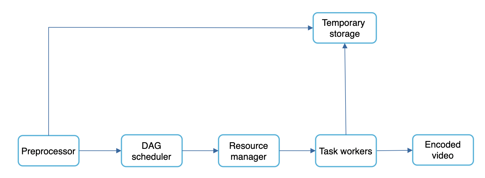
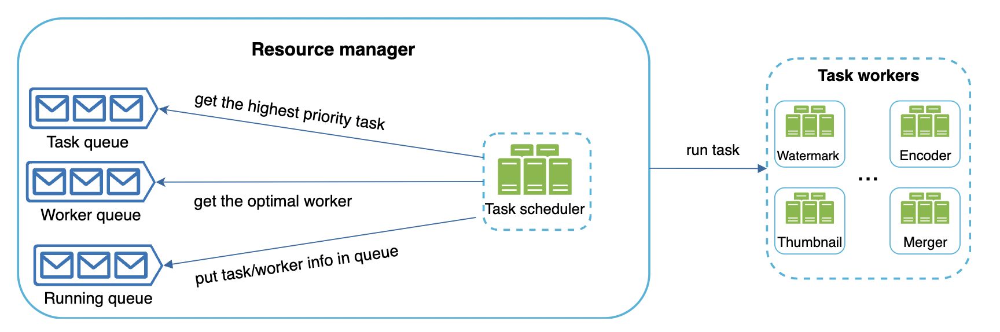

## Problem Statement
Design a scalable system for a video-sharing platform similar to YouTube where users can upload, view, and interact with videos.

## Clarification Questions to Interviewer 
* What features are important?
    * What video resolutions do we need to support?
    * Should the system support video recommendations?
* What clients do we need to support?
* What is the expected number of users and the volume of video uploads per day?
    * Average time per day spend on YouTube?
    * File size requirement for videos?
* Can we leverage existing cloud infra from Google, Amazon, Microsoft?
* Are there any specific security or compliance requirements?
* Is encryption required?
* Do we need to support international users?

## Requirements
### Functional Requirements
1. **Video Upload**: Users should be able to upload videos fast.
1. **Video Playback**: Users should be able to watch stream videos smoothly.
1. **Video Quality**: Users should be able to change video quality
1. **Search**: Users should be able to search for videos.
1. **Supported clients**: web, mobile, smart TV

#### Below the line (out of scope)
1. Like and dislike videos
1. Add comments to videos
1. View thumbnails
1. Provide personalized video recommendations to users.
1. Detailed user interface design.
1. Advanced analytics and insights for users.
1. Comprehensive content moderation system.

### Non-Functional Requirements
1. **Availability**: Ensure high availability of the platform.
1. **Performance**: Low latency for video playback.
1. **Consistency**: Ensure data consistency for user interactions.
1. **Scalability**: The system should handle millions of users and videos.
1. **Reliability**: Content uploaded to the system should not be lost or damaged.
1. **Security**: Protect user data and videos.
#### Below the line (out of scope)
1. Certain content should be geo-blocked.

1. Specific geographic distribution and CDN strategies.
1. Detailed disaster recovery plan.
1. CI/CD and Data Backups
1. Observability

## Back of Envelope Estimations/Capacity Estimation & Constraints
### Assumptions
* 5 million DAU
* 10% of DAU users upload 1 video per day
* Users watch 5 videos per day
* Average video size is 300mb
* R:W ratio 1000:1
### Traffic Estimates
WPS for uploads : 5*10%*12=6 uploads/seconds
RPS for playback: 1000*6=6000 requests/second
### Storage Estimates
* Daily storage cost needed - 5mil * 10% * 300mb = 150TB
* CDN Cost, assuming 0.02$ per GB - 5mil * 5 videos * 0.3GB * 0.02$ = USD 150k per day


## High-level API design 
### 1. Video Upload
- **Endpoint**: `POST /videos/upload`
- **Request**: Video file, metadata (title, description, tags)
- **Response**: Pre-signed URL, video ID, status

### 2. Video Playback
- **Endpoint**: `GET /videos/{videoId}`
- **Request**: Video ID
- **Response**: Video stream URL, metadata

### 3. Change Video Quality
- **Endpoint**: `GET /videos/{videoId}/quality`
- **Request**: Video ID, quality (e.g., 720p, 1080p)
- **Response**: Video stream URL for the specified quality

### 4. Search Videos
- **Endpoint**: `GET /videos/search`
- **Request**: Query parameters (keywords, tags)
- **Response**: List of matching video metadata

## Data Model
## High Level System Design


### Video Upload Workflow
1. User uploads video through the frontend.
1. Load Balancer routes the request to the Asset Service.
1. Asset Service generates a pre-signed URL for the client to upload directly to storage.
1. Client uploads the video using the pre-signed URL.
1. S3 Storage Service triggers an event notification upon successful upload and put an event to Kafka topic
1. Message is consumed from kakfa topic by content processor workflow engine for video transcoding


### Video View Workflow
1. User requests video playback through the frontend.
1. Load Balancer routes the request to the Asset Service.
1. Asset Service retrieves video metadata and generates a signed cdn URL for secure access from storage.
1. Frontend uses the signed URL to stream the video, possibly through a CDN.

## Deep Dive
### Video Transcoding
* **Key Concepts**
    1. **Transcoding**: The process of converting a video file from one format to another. This involves changing the file's resolution, codec, bitrate, and container format.
    2. **Encoding**: The process of compressing video files using specific codecs to reduce file size while maintaining quality.
    3. **Adaptive Bitrate Streaming**: A technique where multiple versions of a video are encoded at different bitrates and resolutions, allowing the player to switch between them based on current network conditions.
    4. **Container** - the basket which contains the video file. Recognized by the file extension, eg .avi, .mov, .mp4
    5. **Codecs** - Compression and decompression algorithms, which reduce video size while preserving quality. Most popular ones - H.264, VP9, HEVC.
**Differences Between Transcoding and Encoding**
    * Transcoding involves converting a video from one format to another, which may include changes in resolution, codec, bitrate, and container format. It often involves both decoding (converting the original * format to an intermediate format) and encoding (compressing the video using a different codec).
    * Encoding specifically refers to compressing video files using codecs to reduce their file size while maintaining quality. It's a subset of the transcoding process focused on the compression aspect.


### Video Transcoding architecture

#### Steps in Video Transcoding Workflow

1. **Upload Video**: User uploads a video file to the platform.
2. **Store Video**: The video is stored in its raw format in an object storage service (e.g., S3).
3. **Trigger Transcoding**: An event notification (e.g., S3 event) is triggered upon successful upload, which puts a message into a Kafka topic.
4. **Preprocessing**: 
   - **Video Splitting**: The video is split into smaller chunks (e.g., Group of Pictures or GOPs) to facilitate parallel processing.
   - **Metadata Extraction**: Metadata such as resolution, format, and duration are extracted from the video.
5. **Generate DAG**: A Directed Acyclic Graph (DAG) is generated based on the processing tasks required, which is defined in a configuration file.

6. **DAG Scheduler**:
   - **Task Scheduling**: The DAG scheduler splits the DAG into stages and tasks, placing them in a task queue managed by the resource manager.
   - **Parallel Processing**: The DAG allows multiple tasks (e.g., video, audio, and metadata processing) to be processed in parallel.
7. **Resource Manager**:
   - **Task Prioritization**: Manages task prioritization based on their urgency.
   - **Optimal Resource Allocation**: Ensures that tasks are assigned to suitable and available workers.
   - **Concurrency Control**: Handles simultaneous task execution while avoiding conflicts.
   - **Fault Tolerance**: Monitors task execution, handles failures, and retries tasks if necessary.
   - **Scalability**: Manages worker nodes, scaling the system as needed.

8. **Task Workers**:
   - **Execute Tasks**: Workers perform specific tasks such as encoding the video at different resolutions, adding watermarks, or generating thumbnails.
   - **Parallel Execution**: Tasks within the same stage can be executed in parallel by multiple workers.

9. **Temporary Storage**:
   - **Intermediate Data Storage**: Intermediate results (e.g., video chunks) are stored in temporary storage (e.g., blob storage) during processing.
   - **Metadata Storage**: Metadata and small data are stored in an in-memory cache.
10. **Post-Processing**:
    - **Transcode Video**: Each chunk is transcoded to the required formats and resolutions.
    - **Merge Chunks**: Transcoded chunks are merged to form the final video files.
11. **Store Transcoded Video**: The final transcoded videos are stored back in the object storage service.
12. **Update Metadata**: The video metadata is updated in the database with the paths to the transcoded videos.
13. **Notify Completion**: The user or system is notified that the video is ready for viewing.

### Video Streaming
Adaptive streaming allows seamless video playback across different network conditions.By providing multiple bitrate streams, the player can switch to the appropriate stream based on the user's bandwidth.

### Adaptive Streaming

Adaptive streaming is a method used to deliver video content over the internet. It allows seamless video playback across different network conditions by providing multiple bitrate streams. The video player can switch between these streams dynamically based on the user's current bandwidth, ensuring a smooth viewing experience with minimal buffering.

#### How Adaptive Streaming Works

1. **Video Segmentation**: The original video file is divided into small segments, typically a few seconds each.
2. **Multi-bitrate Encoding**: Each segment is encoded at multiple bitrates and resolutions. For example, a video might have segments encoded at 240p, 360p, 480p, 720p, and 1080p.
3. **Manifest File Creation**: A manifest file (e.g., M3U8 for HLS, MPD for DASH) is created. This file lists all the available streams and segments, including metadata about their bitrates and resolutions.
4. **Content Delivery**: The segments and manifest file are stored on a Content Delivery Network (CDN) to ensure fast delivery to users.
5. **Client-Side Player**:
    - **Initial Request**: The video player requests the manifest file.
    - **Adaptive Bitrate Algorithm**: The player uses an adaptive bitrate (ABR) algorithm to select the initial stream based on the user's current bandwidth and device capabilities.
    - **Segment Requests**: As the video plays, the player continuously monitors the user's bandwidth and buffer status. It requests the next segment from the appropriate stream, switching to a higher or lower bitrate as needed.

### Example of Adaptive Streaming with HLS (HTTP Live Streaming)

#### Video Segmentation and Encoding

Suppose we have a video that we want to stream adaptively. We would encode this video into multiple bitrates:

- **240p**: Low quality (e.g., 500 kbps)
- **360p**: Medium quality (e.g., 1000 kbps)
- **480p**: Standard quality (e.g., 1500 kbps)
- **720p**: HD quality (e.g., 2500 kbps)
- **1080p**: Full HD quality (e.g., 5000 kbps)

Each bitrate version is segmented into small chunks (e.g., 4 seconds each).

#### Manifest File (M3U8)

An example of a master playlist (manifest file) for HLS:

```plaintext
#EXTM3U
#EXT-X-STREAM-INF:BANDWIDTH=500000,RESOLUTION=426x240
240p.m3u8
#EXT-X-STREAM-INF:BANDWIDTH=1000000,RESOLUTION=640x360
360p.m3u8
#EXT-X-STREAM-INF:BANDWIDTH=1500000,RESOLUTION=854x480
480p.m3u8
#EXT-X-STREAM-INF:BANDWIDTH=2500000,RESOLUTION=1280x720
720p.m3u8
#EXT-X-STREAM-INF:BANDWIDTH=5000000,RESOLUTION=1920x1080
1080p.m3u8
```

Each of these sub-playlists (e.g., `240p.m3u8`) contains the list of video segments for that specific bitrate:

Example of a 240p playlist (`240p.m3u8`):

```plaintext
#EXTM3U
#EXT-X-TARGETDURATION:4
#EXT-X-VERSION:3
#EXT-X-MEDIA-SEQUENCE:0
#EXTINF:4.0,
segment0.ts
#EXTINF:4.0,
segment1.ts
#EXTINF:4.0,
segment2.ts
#EXTINF:4.0,
segment3.ts
...
```

#### Client-Side Player Behavior

1. **Initial Request**: The video player requests the master playlist (`master.m3u8`).
2. **ABR Algorithm**: The player uses the adaptive bitrate algorithm to choose the initial stream based on the available bandwidth.
3. **Segment Downloading**: The player starts downloading and playing segments from the chosen bitrate playlist.
4. **Dynamic Switching**: If the player's detected bandwidth changes (e.g., due to network conditions), it can switch to a higher or lower bitrate by requesting segments from a different playlist.

### Benefits of Adaptive Streaming

- **Improved User Experience**: Ensures smooth playback with minimal buffering, adapting to changing network conditions.
- **Bandwidth Optimization**: Uses the optimal bitrate for the user's current network conditions, avoiding unnecessary data usage.
- **Device Compatibility**: Provides multiple resolutions, ensuring compatibility with various devices and screen sizes.

### Example Scenario

1. **Initial Playback**: A user starts playing a video on a mobile device with a 4G connection. The player detects the available bandwidth and starts streaming at 720p.
2. **Network Fluctuation**: As the user moves, the network signal weakens. The player detects a drop in bandwidth and switches to streaming at 480p to prevent buffering.
3. **Network Improvement**: Later, the user connects to a Wi-Fi network with higher bandwidth. The player detects the improved conditions and switches to streaming at 1080p for better quality.

By employing adaptive streaming, video streaming platforms can provide a consistent and high-quality viewing experience, regardless of the user's network conditions.

### Speed Optimizations - parallelize video uploading
* We can split video uploading into separate units via GOP alignment:
* This enables fast resumable uploads if something goes wrong. Splitting the video file is done by the client.

### Speed optimizations - place upload centers close to users
### Speed optimization - parallelism everywhere
### Safety Optimizations
### Error Handling
## References
* https://github.com/preslavmihaylov/booknotes/tree/master/system-design/system-design-interview/chapter15
* https://systemdesignfightclub.com/youtube/
* https://github.com/codekarle/system-design/blob/master/system-design-prep-material/architecture-diagrams/Video%20Streaming%20Platform.png
* https://www.youtube.com/watch?v=jPKTo1iGQiE&t=1044s
* https://medium.com/@narengowda/netflix-system-design-dbec30fede8d
* https://medium.com/@narengowda/netflix-system-design-dbec30fede8d
* https://medium.com/@karan99/system-design-netflix-6962b4f6222
* https://blog.bytebytego.com/p/netflix-what-happens-when-you-press-288
* https://blog.bytebytego.com/p/a-brief-history-of-scaling-netflix
* https://github.com/ByteByteGoHq/system-design-101#why-did-amazon-prime-video-monitoring-move-from-serverless-to-monolithic-how-can-it-save-90-cost