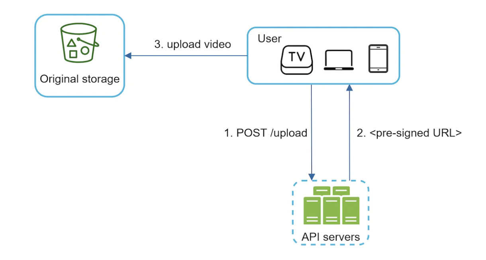

## Problem Statement
Design a scalable system for a video-sharing platform similar to YouTube where users can upload, view, and interact with videos.

## Clarification Questions to Interviewer 
* What features are important?
    * What video resolutions do we need to support?
    * Should the system support video recommendations?
* What clients do we need to support?
* What is the expected number of users and the volume of video uploads per day?
    * Average time per day spend on YouTube?
    * File size requirement for videos?
* Can we leverage existing cloud infra from Google, Amazon, Microsoft?
* Are there any specific security or compliance requirements?
* Is encryption required?
* Do we need to support international users?

## Requirements
### Functional Requirements
1. **Video Upload**: Users should be able to upload videos fast.
1. **Video Playback**: Users should be able to watch stream videos smoothly.
1. **Video Quality**: Users should be able to change video quality
1. **Search**: Users should be able to search for videos.
1. **Supported clients**: web, mobile, smart TV

#### Below the line (out of scope)
1. Like and dislike videos
1. Add comments to videos
1. View thumbnails
1. Provide personalized video recommendations to users.
1. Detailed user interface design.
1. Advanced analytics and insights for users.
1. Comprehensive content moderation system.

### Non-Functional Requirements
1. **Availability**: Ensure high availability of the platform.
1. **Performance**: Low latency for video playback.
1. **Consistency**: Ensure data consistency for user interactions.
1. **Scalability**: The system should handle millions of users and videos.
1. **Reliability**: Content uploaded to the system should not be lost or damaged.
1. **Security**: Protect user data and videos.
#### Below the line (out of scope)
1. Certain content should be geo-blocked.

1. Specific geographic distribution and CDN strategies.
1. Detailed disaster recovery plan.
1. CI/CD and Data Backups
1. Observability

## Back of Envelope Estimations/Capacity Estimation & Constraints
### Assumptions
* 5 million DAU
* 10% of DAU users upload 1 video per day
* Users watch 5 videos per day
* Average video size is 300mb
* R:W ratio 1000:1
### Traffic Estimates
WPS for uploads : 5*10%*12=6 uploads/seconds
RPS for playback: 1000*6=6000 requests/second
### Storage Estimates
* Daily storage cost needed - 5mil * 10% * 300mb = 150TB
* CDN Cost, assuming 0.02$ per GB - 5mil * 5 videos * 0.3GB * 0.02$ = USD 150k per day

## High-level API design 
### 1. Video Upload
- **Endpoint**: `POST /videos/upload`
- **Request**: Video file, metadata (title, description, tags)
- **Response**: Pre-signed URL, video ID, status

### 2. Video Playback
- **Endpoint**: `GET /videos/{videoId}`
- **Request**: Video ID
- **Response**: Video stream URL, metadata

### 3. Change Video Quality
- **Endpoint**: `GET /videos/{videoId}/quality`
- **Request**: Video ID, quality (e.g., 720p, 1080p)
- **Response**: Video stream URL for the specified quality

### 4. Search Videos
- **Endpoint**: `GET /videos/search`
- **Request**: Query parameters (keywords, tags)
- **Response**: List of matching video metadata

## Data Model
## High Level System Design

### Video Upload Workflow
1. User uploads video through the frontend.
1. Load Balancer routes the request to the Asset Service.
1. Asset Service generates a pre-signed URL for the client to upload directly to storage.
1. Client uploads the video using the pre-signed URL.
1. S3 Storage Service triggers an event notification upon successful upload and put an event to Kafka topic
1. Message is consumed from kakfa topic by content processor workflow engine for video transcoding

### Video View Workflow
1. User requests video playback through the frontend.
1. Load Balancer routes the request to the Asset Service.
1. Asset Service retrieves video metadata and generates a signed cdn URL for secure access from storage.
1. Frontend uses the signed URL to stream the video, possibly through a CDN.

## Deep Dive
### Video transcoding/encoding
#### Key Concepts

1. **Transcoding**: The process of converting a video file from one format to another. This involves changing the file's resolution, codec, bitrate, and container format.
2. **Encoding**: The process of compressing video files using specific codecs to reduce file size while maintaining quality.
3. **Adaptive Bitrate Streaming**: A technique where multiple versions of a video are encoded at different bitrates and resolutions, allowing the player to switch between them based on current network conditions.
### Video Streaming
Adaptive streaming
### Speed Optimizations - parallelize video uploading
* We can split video uploading into separate units via GOP alignment:
* This enables fast resumable uploads if something goes wrong. Splitting the video file is done by the client.
### Safety Optimizations
### Error Handling
## References
* https://github.com/preslavmihaylov/booknotes/tree/master/system-design/system-design-interview/chapter15
* https://systemdesignfightclub.com/youtube/
* https://github.com/codekarle/system-design/blob/master/system-design-prep-material/architecture-diagrams/Video%20Streaming%20Platform.png
* https://www.youtube.com/watch?v=jPKTo1iGQiE&t=1044s
* https://medium.com/@narengowda/netflix-system-design-dbec30fede8d
* https://medium.com/@narengowda/netflix-system-design-dbec30fede8d
* https://medium.com/@karan99/system-design-netflix-6962b4f6222
* https://blog.bytebytego.com/p/netflix-what-happens-when-you-press-288
* https://blog.bytebytego.com/p/a-brief-history-of-scaling-netflix
* https://github.com/ByteByteGoHq/system-design-101#why-did-amazon-prime-video-monitoring-move-from-serverless-to-monolithic-how-can-it-save-90-cost